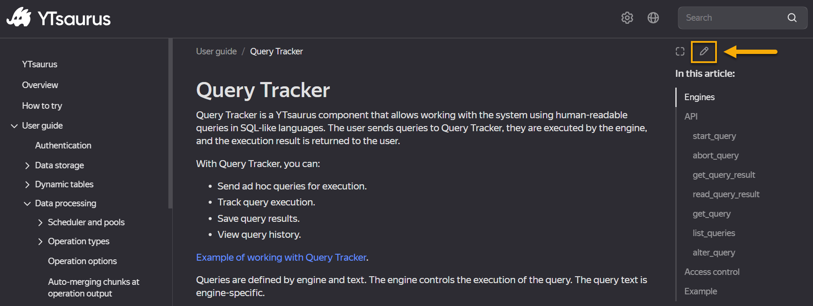
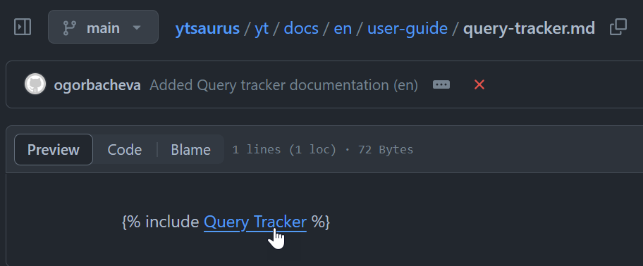
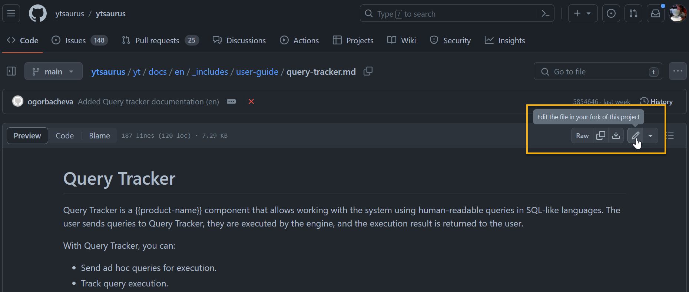
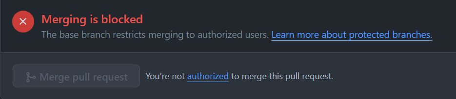

# About YTsaurus Documentation

YTsaurus follows the "Documentation as a Code" paradigm. The documentation content is stored in an open-source repository along with the YTsaurus codebase and located in the `ytsaurus/yt/docs/` directory. Being bilingual, the documentation is hosted in the official YTsaurus website:
- In Russian: https://ytsaurus.tech/docs/ru
- In English: https://ytsaurus.tech/docs/en

The documentation is built and published using the [Diplodoc](https://diplodoc.com/en/) open-source platform. Content is written using the Yandex Flavored Markdown (YFM). It is a Markdown dialect supplemented with unique elements from other markup languages and template engines, such as notes, tabs, reusable content, etc. For more information, see the [YFM Syntax Quick Reference](#yfm-syntax-quick-reference) section.

The documentation is released asynchronously from the main branch. The release cycle is once a week.

You are welcome to contribute to the YTsaurus documentation: correct typos, provide new content, and share your feedback and ideas. For more information, see the [Contribution](#contribution) section.


## Documentation Structure

```
|-- ytsaurus/yt/docs/       # Documentation project root. 
    |-- ru/                 # Here, content of the Russian documentation is stored.
        |-- toc.yaml        # This file describes table of contents of the Russian documentation.
        |-- user-guide/     # Sources of the user guide section.
        |-- admin-guide/  
        |-- ...                                        
        |-- _includes/      # Here, content that is reused in different parts of the Russian documentation.
            |-- user-guide/ # For example, here are stored common articles that are reused in the user guide section.
            |-- admin-guide/
    |-- en/                 # Content in English.
        |-- toc.yaml        # Table of contents of the English documentation.
        |-- user-guide/           
        |-- _includes/      # Content that is reused in different parts of the English documentation.
            |-- user-guide/
            |-- ...
    |-- images/             # Folder with images.
    |-- ytsaurus/           # Documentation deployment settings. 
```

For each language, YTsaurus documentation has a specific structure that consists of the following sections:

- **User guide.** Contains information on how to use YTsaurus.
- **Admin guide.** This section is advanced-level, intended for administrators who will set up cluster, work with logging, etc. 
- **API and reference guide.** This section provides detailed information on the APIs and features of YTsaurus.

In addition to these main sections, the documentation also includes other resources such as release notes, How to's, FAQs, and links to video materials.

### Table of Contents 

The document structure is described in the `ru/toc.yaml` file for the Russian documentation and in the `en/toc.yaml` for the English one. This file defines how the table of contents is generated and documentation is built. The structure of the `toc.yaml` file looks like the following:

```      
title: "{{product-name}}"    # Variable substitution. For more details, see the "Variables" section below.
when: audience == "public"   # Article visibility conditions.
href: index.md
items:
   - name: Overview
     when: audience == "public"
     href: overview/about.md
     ...
```
When you add a new article, don't forget to add this article into the `toc.yaml` file, otherwise, the article will not be included in the documentation.

Individual sections can be included in or excluded from the document, depending on the values of variables. To describe visibility conditions, the `when` parameter is used. In order for an article to be included in the build, it must explicitly be flagged with `when: audience == "public"`. If this flag is not specified, the section will not be included in the open source documentation.

For more details about the table of contents, see the [YFM official documentation](https://diplodoc.com/docs/en/project/toc).

### Variables

You may encounter the `{{}}` construction in the source, for example:

```
A {{product-name}} cluster is a group of instances located in containers ...
```

The `{{product-name}}` is a variable that will be automatically substituted when rendering documentation. Variable values are specified in the `presets.yaml` file:

```
public:
    product-name: YTsaurus
    audience: public
    source-root: https://github.com/ytsaurus/ytsaurus/tree/main
    ...
```

For each version of the documentation, a separate `presets.yaml` file is specified:

```
|-- ytsaurus/yt/docs/       
    |-- ru/                 
        |-- presets.yaml    # Variables from this file will be resolved in the Russian documentation.
    |-- en/                 
        |-- presets.yaml    # These variables will be resolved in the English documentation.
    |-- presets.yaml        # These variables will be resolved in both the Russian and English documentation.
```

You can read more about variables in the official [YFM documentation](https://diplodoc.com/docs/en/project/presets).

### Reused Content

The documentation is written using the Single Source approach. This means the common content that is reused across different parts of the documentation is stored in separate files and then added in the necessary articles. In YTsaurus, reused content is stored in the `ru/_includes` folder for the Russian documentation, and in `en/_includes` for the English one.

Keep this approach in mind when [contributing](#contribution) to YTsaurus documentation.

## Supported Languages

YTsaurus documentation is written in two languages: Russian and English. The source content is originally written in Russian. Then, we automate translations through an internal process, collaborating with professional translators to localize the content. The English version is prepared asynchronously, so that it might be slightly behind the Russian version.

We accept pull requests to the documentation for both the Russian and the English versions. We recommend that you offer your edits in the language that is most convenient for you. After merging your changes, the translation will be updated within a week, or so. However, it is very appreciated if you suggest edits in both languages whenever possible.

## Contribution

You can contribute to the YTsaurus documentation in the following ways:

- **Make quick fixes.** You may suggest corrections for typos, updates, broken links, or improving the phrasing. To do this, you should open a pull request. For more information, see the [How to Make a Quick Fix](#how-to-make-a-quick-fix) section.

- **Write new articles.** You may also provide new content by writing new articles and including them in the documentation. To do this, open a pull request. For more information, see the [How to Add a New Article](#how-to-add-a-new-article) section.

- **Share your feedback and ideas.** If you spot inaccuracies in the documentation, or have an idea you would like to share, open an issue or start a discussion. For more details, see the [How to Share Feedback](#how-to-share-feedback) section.

### How to Make a Quick Fix

If you spot an error in the documentation, such as a typo or a broken link, you are welcome to fix it through the GitHub web interface. To do this:

1. Open the source file by clicking on the pencil icon located in the upper right corner of the documentation page.

   

   When you press the button, the source file will be opened for editing. Note that if you see the `` construction in the file, it means that the current file contains a shared content which is located in the `_includes` folder. To quickly navigate to the source file, click on the link name.

   

2. Make the changes to the content. To do this, click on the pencil icon located in the upper right corner. 

   

3. Make a pull request with your edits. To know how to work with pull requests via the GitHub interface, read the [official documentation](https://docs.github.com/en/desktop/working-with-your-remote-repository-on-github-or-github-enterprise/creating-an-issue-or-pull-request-from-github-desktop).

   Note that after opening a pull request, the message "Merging is blocked" will occur. This only means that review is required before the merging. YTsaurus team will review your changes and merge them into the main branch.
    
    

4. To know what happens next, see the [What Happens After Changes are Merged](#what-happens-after-changes-are-merged) section.

------

### How to Add a New Article

Below are the main steps of how to add new content to the documentation:

1. Fork the [YTsaurus repository](https://github.com/ytsaurus/ytsaurus/tree/main), create your branch, and perform all your work within this branch. Afterwards, you will create a pull request from it. For additional information, visit the [Fork a repository](https://docs.github.com/en/pull-requests/collaborating-with-pull-requests/working-with-forks/fork-a-repo) and [About branches](https://docs.github.com/en/pull-requests/collaborating-with-pull-requests/proposing-changes-to-your-work-with-pull-requests/about-branches)  sections in the official GitHub documentation.

2. Prepare content. To keep YTsaurus documentation consistent follow the guidelines below:
    - [YFM Syntax Quick Reference](#yfm-syntax-quick-reference)
    - [Style Guide](#style-guide)  
    - [Documentation Philosophy](#documentation-philosophy)

3. Add your article to the proper section in the documentation structure. Depending on the language you are writing in, you should add content to either the `ru` or `en` folder, accordingly.

    Keep in mind that when adding a new article, you should follow the single source approach used in YTsaurus documentation. The following example shows how to do it.
  
    Let's assume you want to add an article to the `user-guide` section to the English documentation, and let's assume you named the article file as `new-article.md`. So, to follow the single source approach you would need to do the following:
    
    1. Create identically named files `new-article.md` in two separate folders:
   
        ```
        |-- ytsaurus/yt/docs
            |-- en/
                |-- toc.yaml
                |-- user-guide/ 
        +++         |-- new-article.md    # This file will contain a link to the content that will be included from the "_includes" folder. 
                |-- _includes/
                   |-- user-guide/ 
        +++            |-- new-article.md # This file will contain the text of the article itself.
         ```
   
    2. In the `en/user-guide/new-article.md` file, insert an `` construction:

         ```
         
         ```
         Note: The description set in the `[]` square brackets serves as a meta information. It does not affect the build and will not be shown on the documentation website.

     3. In the `en/_includes/user-guide/new-article.md` file, write the text of your article. For example:

         ```
         # Deployment in a Kubernetes Cluster

         This section describes the installation of YTsaurus in a Kubernetes cluster ...
         ```
        If your text contains links to another articles, see how to insert these links correctly in the [Links](#links) section.

     > **Why this structure?** <br/> Content of YTsaurus documentation can be reused in different parts. Therefore, all articles are placed in the `_includes` folder, by default.

4. Add a link to your article in the `ru/toc.yaml` or `en/toc.yaml` file, depending on the language you are writing in. Considering the example from the step 3, keep the following in mind:
   - You should only link to the `user-guide/new-article.md` article, but not to the `_includes/user-guide/new-article.md`.
   - If you write articles in both Russian and English languages, you should add links in both `ru/toc.yaml` and `en/toc.yaml` files.
   - Set a visibility flag to your article: `when: audience == "public"`.
   
   For example:
   ```
   - name: Deployment in a Kubernetes Cluster
     when: audience == "public"
     href: user-guide/new-article.md
   ```

5. Build the documentation locally and check whether it looks fine. See the [How to Build Locally](#how-to-build-locally) section.

6. Proofread your text. Before publishing, look for typos, missing punctuation, or repetitions that could be avoided.

7. Create a pull request. See the [Pull requests](https://docs.github.com/en/pull-requests) official documentation. Note that after opening a pull request, the message "Merging is blocked" will occur. This only means that review is required before the merging.

8. Participate in the review process.
   Your article will be thoroughly reviewed by the team. Be prepared for a dialogue and adjustments — the team may request further changes. Keep in mind that your text may be modified, or the article may be moved to a different section of the documentation if it enhances navigation and readability.

To know what happens next, see the [What Happens After Changes are Merged](#what-happens-after-changes-are-merged) section.

-------

### How to Share Feedback

Your feedback is always welcome and can be shared in the following ways:

- **Open an issue.** Use this option if you want to report errors in the documentation, missing information, or inaccuracies. Issues are a way to track actionable tasks that need to be addressed.
- **Open a discussion.** This option is better suited for sharing feedback that does not require immediate action or suggesting changes. Use discussions for general questions about the documentation or to propose new ideas for enhancing the content — for example, when you find some content is written in an unclear manner or you would like a more detailed explanation.

-------

### What Happens After Changes are Merged

🔹 Publication: Once your changes are approved and merged, the pull request will be closed by the YTsaurus team. Expect your changes to be published on a documentation website within a week.

🔹 Translation: Immediately after merging, your changes will be sent for the translation, if needed. The time it takes for the content translation to be published can vary depending on the volume and complexity of the text, as well as the current workload of the translation team. It could take up to few weeks for your changes to be published in another language.

## Content Writing Recommendations

- [YFM Syntax Quick Reference](#yfm-syntax-quick-reference)
- [Style Guide](#style-guide)  
- [Documentation Philosophy](#documentation-philosophy)

## YFM Syntax Quick Reference

- Headers are on a separate line starting with `#`, `##` or `###`.
- Bold is in `**asterisks**` or `__underlines__`.
- Links `[anchor](http://...)`.
- Images ``.
- Lists are on lines starting with `*` unordered or `1.` ordered. There should be an empty line before the first list item. Sub-lists must be indented with 4 spaces.
- Inline code fragments are <code>&#96;in backticks&#96;</code>.
- Multiline code blocks are  <code>&#96;&#96;&#96;in triple backtick quotes &#96;&#96;&#96;</code>.
- Brightly highlighted text starts with ``, followed by 4 spaces on the next line and content. More about [Notes](https://diplodoc.com/docs/en/syntax/notes).
- Header anchor to be linked to: `Title {#anchor-name}`.
- An additional anchor in an arbitrary place: `{#anchor-name}`. It should be on a separate line.
- [About cuts and tabs](https://diplodoc.com/docs/en/syntax/cuts-tabs) usage see in the official documentation.
- Table:
  ```
  | Header    1 | Header    2 | Header    3 |
  | ----------- | ----------- | ----------- |
  | Cell     A1 | Cell     A2 | Cell     A3 |
  | Cell     B1 | Cell     B2 | Cell     B3 |
  | Cell     C1 | Cell     C2 | Cell     C3 |
  ```

For more details about YFM Syntax, see the [official documentation](https://diplodoc.com/docs/en/syntax/).

## Style Guide

- [File Naming](#file-naming)
- [Article Description](#article-description)
- [Links](#links)
- [Lists](#lists)
- [Tables](#tables)
- [Code Examples Snippets](#code-examples-snippets)
- [Listings](#listings)
- [Images](#images)

### File Naming

In compound file names, use a hyphen, not an underscore. Examples: `new-article.md`, `new-image.png`.

### Article Description

Every article should begin with a brief overview of what will be described in this section. For example:

```
This section compiles information about the access control system for tables and other nodes of Cypress.
```

### Links

The section name in the link should be capitalized. For example:

```
For more information, see the [Compaction](../../../user-guide/dynamic-tables/compaction.md) section.
```

#### How to Set Links Between the Documents Located in the `_includes` Folder?

For documents located in the `_includes` folder, consider the following when adding links:

- A link path should be set relativelly to the document located in the `_includes` folder, but not in the original folder. What is original folder, see the example below.
- You should never link to the `_includes` folder. A link should always refer to the document located in the original folder. 

For an example, take a look at the [Query Tracker](https://ytsaurus.tech/docs/en/user-guide/query-tracker) article. Its source is stored in the [en/user-guide/query-tracker.md](https://github.com/ytsaurus/ytsaurus/edit/main/yt/docs/en/user-guide/query-tracker.md) file:

```
|-- ytsaurus/yt/docs
    |-- en/
        |-- user-guide/             # The original folder.
            |-- query-tracker.md    
        |-- dynamic-tables/  
            |-- dyn-query-language.md
        |-- _includes/              # The "_includes" folder, where the shared content is stored.
           |-- user-guide/
               |-- query-tracker.md 
           |-- dynamic-tables/  
               |-- dyn-query-language.md
                   
```

Text of this article is included from the `en/_includes/user-guide/query-tracker.md` file:

```

```

Now, open the [en/_includes/user-guide/query-tracker.md](https://github.com/ytsaurus/ytsaurus/edit/main/yt/docs/en/_includes/user-guide/query-tracker.md) file. There, you can find the link to the "YT Query Language" article:

```
Currently supported execution engines:
+ [YT QL](../../user-guide/dynamic-tables/dyn-query-language.md).
```

Note the following:
- The "YT QL" link path is set relativelly to the `query-tracker.md` document located in `_includes` folder (see the `../../` operands in a link path).
- If you open the [en/user-guide/dynamic-tables/dyn-query-language.md](https://github.com/ytsaurus/ytsaurus/edit/main/yt/docs/en/user-guide/dynamic-tables/dyn-query-language.md), you will see that this article reuses content as well. Though, the "YT QL" link refers to the original `dyn-query-language.md` file that located in `en/user-guide/dynamic-tables/` folder, but not to the `en/_includes/user-guide/dynamic-tables/dyn-query-language.md`.

> If you encounter issues with cross-link usage, feel free to ask questions in YTsaurus [community chat](#need-help).

### Lists

Use an ordered list when order matters, and unordered list otherwise. Every item in a list should start with a capital letter and end with a period. 

**Ordered**

```
1. The type of access (read, write, etc.).
2. The user who initiated the request.
3. The object to which access is requested.
```

**Unordered**

```
- The type of access (read, write, etc.).
- The user who initiated the request.
- The object to which access is requested.
```

### Tables

When working with tables, keep the following in mind:

- There must be a reference to the table, for example: "Table 1 shows...".
- It is mandatory to add a table title: `<small>Table N — Title of the table</small>`. It should start with a capital letter, without a period at the end. 
- Periods are not needed in the table: neither in the header nor in the cells.

Example:

```
The attributes of subjects are shown in Table 1.

<small>Table 1 — Attributes of Subjects</small>

| **Attribute**       | **Type**        | **Description**                                           |
| ------------------- | --------------- | --------------------------------------------------------- |
| `name`              | `string`        | The name of the subject                                   |
| `member_of`         | `array<string>` | List of group names to which the subject directly belongs |
```

### Code Examples Snippets

**Bash**

In the bash examples, add the `$` symbol at the beginning of the line before the command. This allows to visually distinguish the command invocation from the output response.

Example:

````
```bash
$ yt get //home/@count
36
```
````


### Listings

Listings are used to indicate the snippets with code examples. A reference to the listing is desirable. The title should start with a capital letter and end without a period.

Example: 

````
<small>Listing 1 — Example of Running an ACL Check</small>

```bash
$ yt check-permission yql write //tmp
{
    "action" = "allow";
    "object_id" = "1-3-411012f-1888ce1f";
    "object_name" = "node //tmp";
    "subject_id" = "c4-8aaa-41101f6-bec6113b";
    "subject_name" = "yandex";
}
```
````

### Images

If the image includes text, the text must be in English, regardless of the language of the documentation in which the image will be used.

For information about images usage, read the [YFM documentation](https://diplodoc.com/docs/en/syntax/media).

### Documentation Philosophy

> If you need any help with content writing, don't hesitate to ask questions in YTsaurus [community chat](#need-help).

- When writing text, determine your target audience, whom you are writing for. Take into account that YTsaurus users may have different backgrounds and may be from different areas: analysts, engineers, administrators, and developers. The target audience influences the level of detail of your text and the terminology you use.
- Your text should not disrupt the integrity of the entire document or its narrative logic. When writing content, consider the context of the section where this content is intended to be added.
- Try to avoid jargon, slang, and colloquial language. Use commonly accepted terms. Strive to follow the academic style.
- Accompany your text with examples. Content without examples is perceived as abstract and is hard to assimilate.
- Use cross-links between the sections.
- Aim to write concisely and clearly. Do not make sentences too long — up to 15 words per sentence. Split long paragraphs into short ones — up to 5 sentences in one paragraph.

## How to Build Locally

1. Install [Node.js](https://nodejs.org/ru/download/). The package manager `npm` will be installed simultaneously: it is required for the local build to work.
2. Install the [@diplodoc/cli](https://www.npmjs.com/package/@doc-tools/docs) package:
   ```bash
   $ npm i @diplodoc/cli -g
   ```
3. Check that the `yfm` tool is installed correctly. For example, check the version number:
   ```
   $ yfm --version
   ```
4. Clone the fork of the YTsaurus repository, in case you have not done it yet: 
   ```bash
   $ git clone <ytsaurus-fork-url>
   ```
5. Run the build:
   ```bash
   $ yfm -i ytsaurus/yt/docs/ -o ytsaurus-doc-output
   ```
6. Navigate to the `ytsaurus-doc-output` folder and then go to the `ru` or `en` directory, depending on the documentation language you want to check. When opening the `index.html` file, the main page of the documentation will be shown.

## Need Help?

If you need any help, don't hesitate to ask questions in YTsaurus community chats:
- [Russian community chat](https://t.me/ytsaurus_ru)
- [English community chat](https://t.me/ytsaurus)
