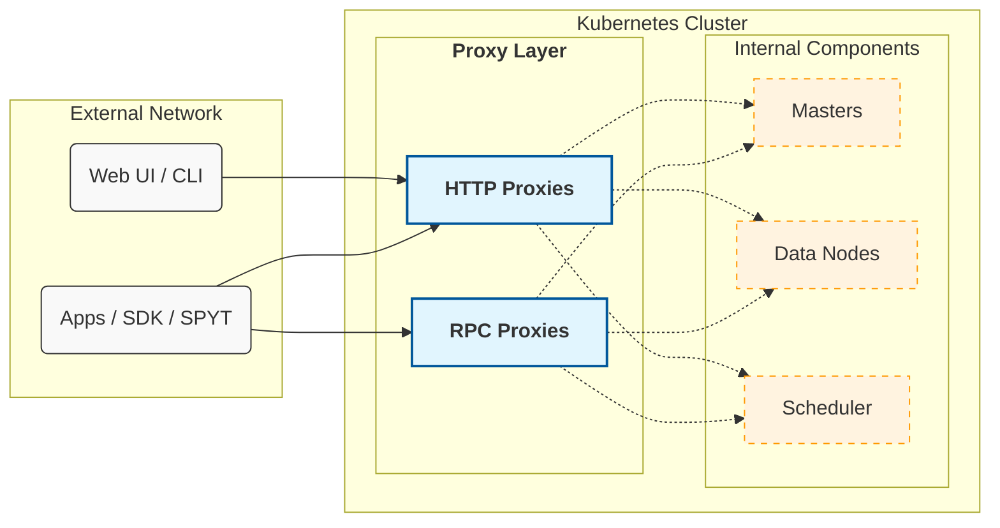
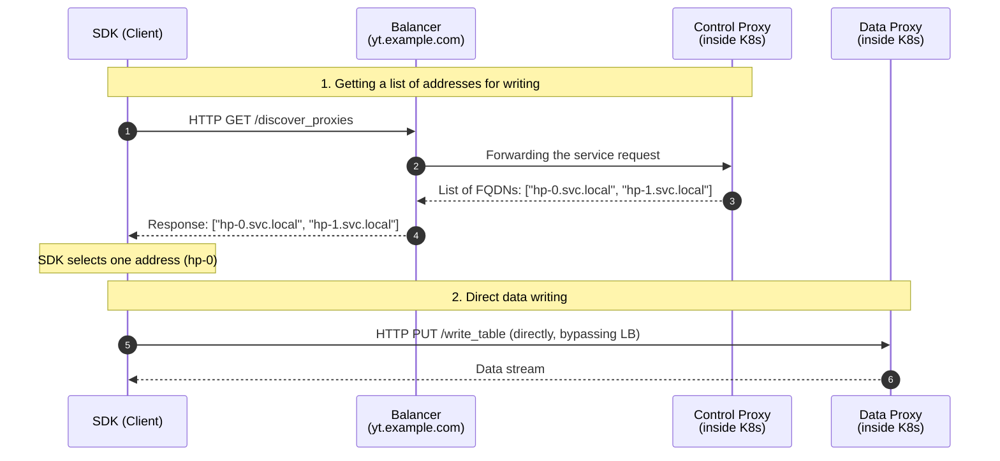

# Configuring External Access to {{product-name}} in Kubernetes

By default, a {{product-name}} cluster deployed in Kubernetes is isolated from external networks. LoadBalancer or Ingress mechanisms are typically used to publish services. These work well for individual web services, providing a single entry point for clients, but they [cannot efficiently handle](*scale-traffic) large volumes of network traffic.

In this guide, you'll learn how to:

- [Solve the network isolation problem](../../../admin-guide/cluster-access-proxy/network-isolation.md)—configure the cluster so that external clients can directly connect to cluster nodes for efficient reading and writing of large data volumes.

- [Split load between clients](../../../admin-guide/cluster-access-proxy/manage-traffic.md)—isolate resources of different projects and split traffic into "light" (metadata, UI) and "heavy" (table reading and writing).

- [Configure access for SPYT](../../../admin-guide/cluster-access-proxy/spyt.md)—set up TCP proxying for direct connections between an external Spark driver and workers inside the cluster.

## Proxy overview {#overview}

Users do not interact with the {{product-name}} server directly; all communication goes through proxies. These are {{product-name}} components that act as a unified entry point and abstract away the cluster's internal topology and inter-component communication—for example, master and data node addresses.

From a Kubernetes perspective, proxies are typically deployed as a StatefulSet consisting of several pods. Their number and allocated resources (CPU, RAM) are specified in the {{product-name}} operator's [specification](https://github.com/ytsaurus/ytsaurus-k8s-operator/blob/main/config/samples/cluster_v1_local.yaml#L56-L74). When the cluster starts, each proxy pod is automatically registered in Cypress (in the system directories `//sys/http_proxies` and `//sys/rpc_proxies`).

{{product-name}} has two proxy types:

- HTTP proxies—implement the {{product-name}} HTTP API. They are used by SDKs, the web interface, and the CLI.
- RPC proxies—implement a faster binary protocol (YT RPC). They're primarily needed where low request latency is required (for example, during intensive streaming operations with dynamic tables). HTTP proxies are recommended for all other scenarios.



## The concept of a role {#proxy-role}

You can [split](../../../admin-guide/cluster-access-proxy/manage-traffic.md) proxies into functional groups using roles. Typically, two main groups are distinguished:

- Control proxies—handle "light" requests (UI navigation, working with Cypress metadata). They're usually assigned the `control` role.
- Heavy (data) proxies—handle "heavy" requests (streaming reads and writes of large tables). In Kubernetes installations, they most often operate under the `default` role.

This separation allows flexible cluster resource management: actively reading a huge table through data proxies won't slow down the web interface or interfere with other users browsing the Cypress tree.

Technically, a role is a string label (the `@role` attribute in Cypress) assigned to a proxy instance at startup. By default, all proxies in the cluster start with the `default` role. You can assign a role in the [Ytsaurus specification](https://github.com/ytsaurus/ytsaurus-k8s-operator/blob/main/config/samples/cluster_v1_local.yaml#L56C3-L74C18).

## Discovery mechanism {#discovery}

When initializing a client (SDK), the developer specifies the cluster's primary address (for example, `yt.example.com`). Usually, a balancer (Ingress or LoadBalancer) behind this address distributes requests among available proxy servers.

However, routing gigabytes of read/write traffic through a single central balancer isn't efficient. To handle large data volumes efficiently, SDKs automatically send heavy requests directly to data proxies, bypassing the central entry point. The developer doesn't need to specify dozens of addresses in the code—the SDK discovers them automatically through the built-in Discovery mechanism. It works as follows:

1. Before executing a heavy request, the SDK sends an HTTP `GET` request to `/api/v4/discover_proxies` at the primary balancer.
1. The server responds with a list of addresses (FQDNs) of active data proxies.
1. The SDK selects one address from the list and sends the heavy request directly to that pod.

Below is a diagram of the Discovery mechanism when calling `write_table` via HTTP proxies:





1. The client library (SDK) sends an HTTP `GET` request to the `discover_proxies` endpoint at the primary cluster address (balancer `yt.example.com`).
2. The balancer accepts the request and redirects it into the cluster to one of the available control proxy servers (Control Proxy).
3. The control proxy forms a list of FQDNs of active data proxies (for example, `hp-0.svc.local`, `hp-1.svc.local`) and returns it to the balancer.
4. The balancer returns this list to the client.
5. The SDK selects one specific address from the list (in our example—`hp-0`) and sends a data write request (`write_table`) directly to that pod, bypassing the central balancer.
6. A direct connection is established between the client and the data proxy, over which the data stream is transmitted.



### Proxy roles in Discovery {#discovery-roles}

When requesting `discover_proxies`, a client can optionally specify a role. The following logic applies:
- If a role is explicitly specified (for example, `role=heavy`), the balancer returns only addresses of proxies dedicated to that role.
- If no role is specified, proxies with the `default` role are requested.

### Discovery in different protocols {#discovery-in-different-protocols}

- HTTP uses a "lazy" approach. The request to `discover_proxies` is made just before starting a file read or write.
- RPC uses a "greedy" approach. The client calls `discover_proxies` immediately on startup, receives a list of RPC proxy addresses, and establishes persistent TCP connections with them.



In older API versions (< v4), entry points to the Discovery service differed.



In API versions lower than v4:

- To get a list of all HTTP proxies, clients accessed the `/v3/entry` endpoint.
- To get RPC proxies, they accessed `/v3/discover_proxies`.

Starting with v4, both client types use a single universal endpoint `/api/v4/discover_proxies` (with the `type=rpc` parameter for RPC clients).





<!--


You can disable the Discovery mechanism on the client side (configuration option `enable_proxy_discovery=%false`). This is convenient for quick debugging and testing: traffic stops being split and is directed to a single entry point. Using this approach in production isn't recommended—it will route the entire volume of big data transfer through the control proxy balancer, which can quickly overload nodes.


-->

## Why the access problem occurs {#about-access-problem}

In a standard Kubernetes configuration, pod addresses are internal (for example, `hp-0.http-proxies.default.svc.cluster.local`).

When an external SDK calls `discover_proxies`, the cluster returns a list of internal FQDNs. The SDK, being outside the cluster perimeter, can't resolve these DNS names to IP addresses. As a result, light commands through the balancer succeed, but attempting to write data ends with various network errors—from DNS resolution failures to connection failures (`Temporary failure in name resolution`, `Connection refused`, `Connection timed out`).



Consider a scenario: a {{product-name}} cluster is deployed in Kubernetes, and you need to test access from a local machine.

For quick access to the control proxy API, a port is exposed via `kubectl port-forward`:

```bash
$ kubectl port-forward service/http-proxies-control-lb 8080:80
Forwarding from 127.0.0.1:8080 -> 80
```

Let's perform a light operation—create a table.

```bash
$ export YT_PROXY=127.0.0.1:8080
$ yt create table //home/my-table
30-56c4-10191-712a11b3
```

The command worked: the table was created. The Discovery mechanism wasn't involved; the request went directly to the address specified in the `YT_PROXY` variable.

Now let's try to write data to this table (`write-table`):

```bash
$ echo '{ "id": 0, "text": "Hello" }' | yt write-table //home/my-table --format json

WARNING HTTP PUT request http://hp-0.http-proxies.default.svc.cluster.local/api/v4/write_table failed with error NewConnectionError...
Failed to establish a new connection: [Errno -3] Temporary failure in name resolution
```

**What happened:**
When executing `write-table`, the SDK requested a list of data proxies. The cluster returned the internal pod address: `hp-0.http-proxies.default.svc.cluster.local`. The SDK tried to connect to this FQDN directly, but the name doesn't resolve from the local machine.

As a temporary debugging solution, you can disable Discovery on the client side. You can do this via environment variables; all traffic will then go through `port-forward`:

```bash
# Via a config patch:
export YT_CONFIG_PATCHES='{proxy={enable_proxy_discovery=%false}}'
# Or via a shorter, more popular alias for the CLI:
export YT_USE_HOSTS=0

echo '{ "id": 0, "text": "Hello" }' | yt write-table //home/my-table --format json
```

If writing succeeds after this—the problem is indeed with Discovery routing.



## See also {#see-also}

- [How to solve the network isolation problem](../../../admin-guide/cluster-access-proxy/network-isolation.md)
- [How to split load between clients](../../../admin-guide/cluster-access-proxy/manage-traffic.md)
- [How to configure access for SPYT](../../../admin-guide/cluster-access-proxy/spyt.md)
- [FAQ](../../../admin-guide/cluster-access-proxy/faq.md)

[*scale-traffic]: LoadBalancer and Ingress route all traffic through a single entry point, but with large data volumes, this becomes a bottleneck.<br>To scale the load, clients must connect to cluster nodes directly. In Kubernetes, pod IP addresses are internal by default—external clients can't access them directly without additional configuration.