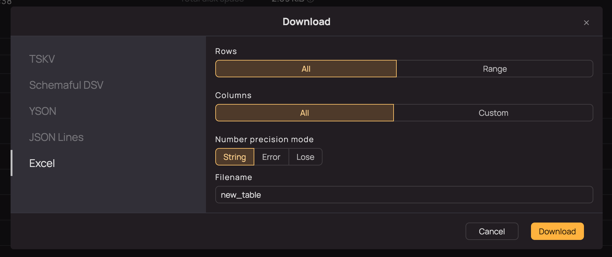

# Excel integration



The instructions below describe how to deploy {{product-name}} Excel integration in Kubernetes. To learn more about the supported functionality, see [Working with Microsoft Excel tables](../../other/excel.md).



The instructions below describe how to deploy {{product-name}} Excel integration in Kubernetes. To learn more about the supported functionality, see [Working with Microsoft Excel tables](../../user-guide/excel.md).



## Description {#description}

The integration includes two microservices:
- Exporter: Downloads data from schematized static {{product-name}} tables or Query Tracker results as an Excel spreadsheet.
- Uploader: Uploads data from Excel spreadsheets into static {{product-name}} tables.

You can find the entire microservice code in a dedicated repository at [ytsaurus/ytsaurus-excel-integration](https://github.com/ytsaurus/ytsaurus-excel-integration).

## Installing the Helm chart {#helm-install}

Both services are installed with one Helm chart.

1. Prepare the `values.yaml` file.

   Minimal configuration:

   ```yaml
   settings:
     clusters:
       - proxy: http-proxies.default.svc.cluster.local
         # Specifies the proxy alias used in the API path:
         #   <http_addr>/<api_path_prefix>/<api_endpoint_name>/api/
         # Default: matches the proxy.
         api_endpoint_name: <cluster-name> # Your cluster name (see //sys/@cluster_connection/cluster_name)
     cors:
       allowed_hosts:
         - "yt.example.com" # Your UI address
   ```

2. Install the chart:

   ```bash
   helm install ytsaurus-excel oci://ghcr.io/ytsaurus/ytsaurus-excel-chart \
     --version {{excel-version}} \
     -f values.yaml \
     -n <namespace>
   ```

## Configuring network access and integrating with the UI {#network-access}

To make Excel export and import functions appear in the interface, configure accessibility of services for the user's browser and specify their addresses in the UI configuration.

### Production {#network-access-prod}

The recommended method for production environments is to configure Ingress.

1. Sample `values.yaml` file with CORS configuration for your UI domain:

   ```yaml
   settings:
     clusters:
       - proxy: http-proxies.default.svc.cluster.local
         api_endpoint_name: ytsaurus
     exporter:
       api_path_prefix: "api/excel/exporter"
     uploader:
       api_path_prefix: "api/excel/uploader"
     cors:
       allowed_hosts:
         - "yt.example.com"
   ```

2. Sample Ingress manifest:

   ```yaml
   apiVersion: networking.k8s.io/v1
   kind: Ingress
   metadata:
     name: ui-ingress
     namespace: <namespace>
   spec:
     rules:
       - host: <your-ui-domain> # Specify your UI domain here
         http:
           paths:
             - backend:
                 service:
                   name: ytsaurus-excel-uploader-svc
                   port:
                     name: http
               path: /api/excel/uploader
               pathType: Prefix
             - backend:
                 service:
                   name: ytsaurus-excel-exporter-svc
                   port:
                     name: http
               path: /api/excel/exporter
               pathType: Prefix
             - backend:
                 service:
                  name: ytsaurus-ui-ytsaurus-ui-chart
                  port:
                     name: http
               path: /
               pathType: Prefix
   ```

3. UI setup:

   Add the following settings to the `values.yaml` file of the `ytsaurus-ui` chart:

   ```yaml
   settings:
     exportTableBaseUrl: "https://yt.example.com/api/excel/exporter"
     uploadTableExcelBaseUrl: "https://yt.example.com/api/excel/uploader"
   ```

   Update the UI chart:

   ```bash
   helm upgrade ytsaurus-ui oci://ghcr.io/ytsaurus/ytsaurus-ui-chart \
     --version "0.5.0" \
     -f values.yaml \
     -n <namespace>
   ```

### Testing  {#network-access-testing}

For local development and testing, you can use `port-forward`:

1. Sample `values.yaml`:

   ```yaml
   settings:
     clusters:
       - proxy: http-proxies.default.svc.cluster.local
         api_endpoint_name: minisaurus
     cors:
       allowed_hosts:
         - "localhost:8080" # Local UI address
   ```

2. Allow access to the microservices:

   ```bash
   kubectl port-forward service/ytsaurus-excel-uploader-svc 9095:80
   ```

   ```bash
   kubectl port-forward service/ytsaurus-excel-exporter-svc 9096:80
   ```

3. UI setup:

   Add the following settings to the `values.yaml` file of the `ytsaurus-ui` chart:

   ```yaml
   settings:
     uploadTableExcelBaseUrl: "http://localhost:9095"
     exportTableBaseUrl: "http://localhost:9096"
   ```

  Update the UI chart:

  ```bash
  helm upgrade ytsaurus-ui oci://ghcr.io/ytsaurus/ytsaurus-ui-chart \
    --version "0.5.0" \
    -f values.yaml \
    -n <namespace>
  ```

## Checking the result {#check-result}

<!-- (пока что UI проверяет наличие схемы, YTFRONT-5525)  -->

1. Open a schematized static table in the {{product-name}} UI.

2. Click `Download`.

3. Make sure the `Excel` tab is displayed:

   

The tab appears if the request from your browser to `<exportTableBaseUrl>/<cluster-name>/api/ready` returns 200 OK. If you don't see the tab, verify the following settings: UI Helm Chart, Excel Helm Chart, and Ingress.

## Detailed configuration {#configuration}

Below are the parameters that you might need to override:

```yaml
replicaCount: 1

settings:
  cors:
    # Allowed hostnames, for example, yt.example.com. Checked via exact match: origin.Host == "yt.example.com"
    allowed_hosts: []
    # Allowed hostname suffixes, for example, .yt.example.com. Checked via HasSuffix(origin.Host, ".yt.example.com")
    allowed_host_suffixes: []

  # List of clusters with cluster-specific settings.
  clusters:
    - proxy: http-proxies.default.svc.cluster.local
      # Specifies the proxy alias used in the API path:
      #   <http_addr>/<api_path_prefix>/<api_endpoint_name>/api/
      # Default: matches the proxy.
      api_endpoint_name: minisaurus

  # Name of the request cookie that the service forwards to {{product-name}}.
  # {{product-name}} proxy uses this cookie to authorize requests.
  auth_cookie_name: "YTCypressCookie"
  sso_cookie_name: "yt_oauth_access_token"

  exporter:
    # Maximum request processing time.
    http_handler_timeout: 2m

    # Maximum input file size.
    max_excel_file_size_bytes: 104857600 # (100 MB)

    # Specifies the global path prefix used in the API path:
    #   <http_addr>/<api_path_prefix>/<api_endpoint_name>/api/
    # Default: empty.
    api_path_prefix: ""

  uploader:
    # Maximum request processing time.
    http_handler_timeout: 2m

    # Maximum input file size.
    max_excel_file_size_bytes: 104857600 # (100 MB)

    # Specifies the global path prefix used in the API path:
    #   <http_addr>/<api_path_prefix>/<api_endpoint_name>/api/
    # Default: empty.
    api_path_prefix: ""
```

You can view all the parameters in the [source code](https://github.com/ytsaurus/ytsaurus-excel-integration/blob/docker/excel/{{excel-version}}/deployments/ytsaurus-excel-chart/values.yaml).
