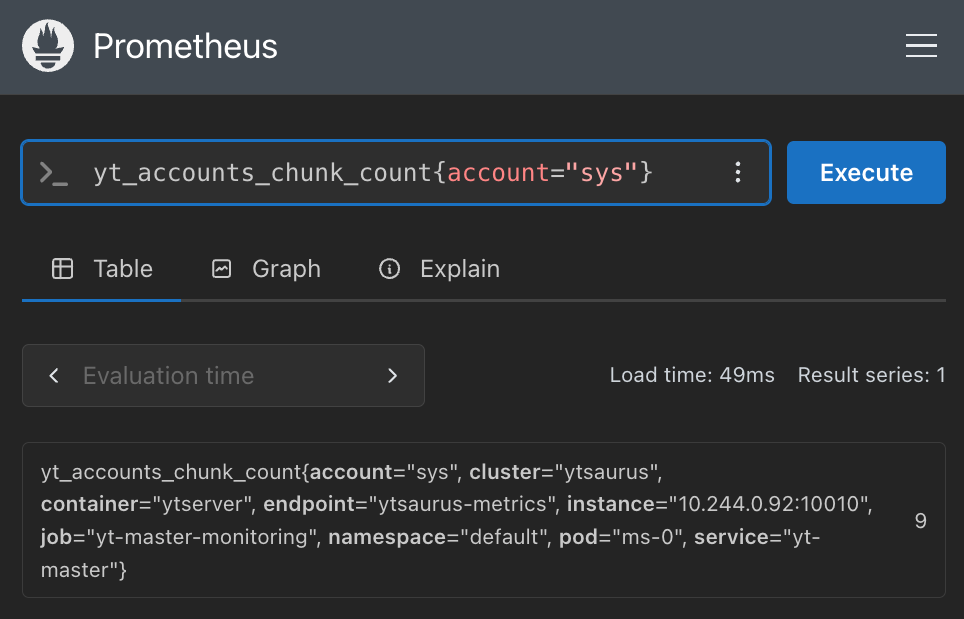
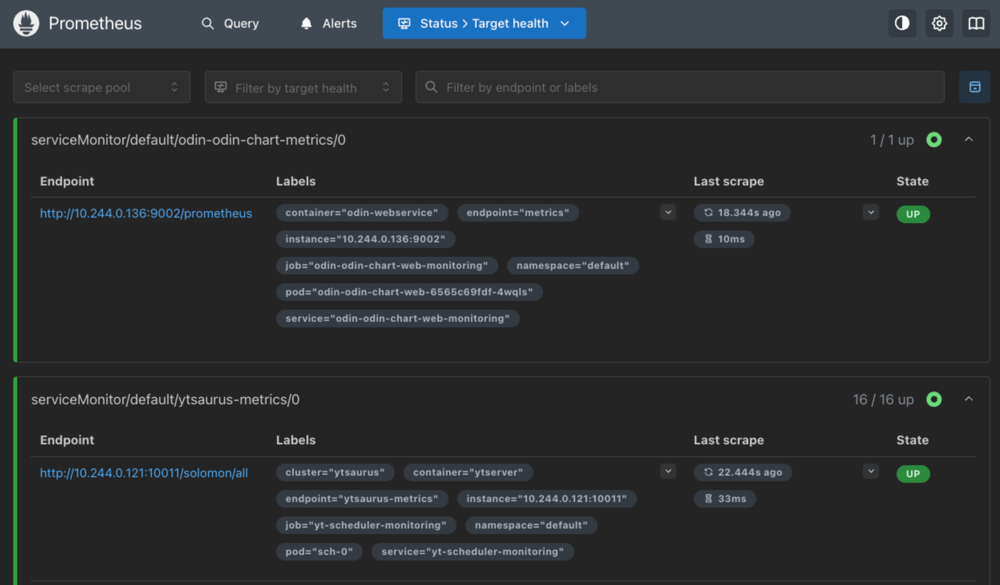
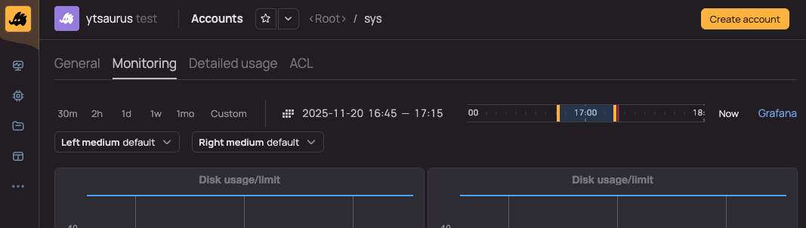
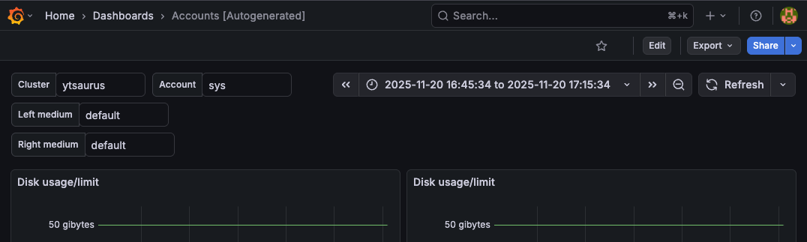

# Cluster monitoring setup

{{product-name}} allows you to export cluster object metrics to various monitoring systems.

[Prometheus](https://prometheus.io/) is used to collect metrics. [Grafana](https://grafana.com/) can be used to view metrics, as well as built-in dashboards in the {{product-name}} UI.

## Installing and configuring Prometheus {#setup-prometheus}

[Prometheus Operator](https://github.com/prometheus-operator/prometheus-operator) is used to collect metrics. {{product-name}} components and [Odin](../../admin-guide/install-odin.md) are automatically labeled for metric collection. The Odin Helm chart automatically creates a ServiceMonitor resource for its metrics during installation. To collect metrics from cluster components, we will create a separate ServiceMonitor manually.

1. Install the Prometheus operator according to the [instructions](https://github.com/prometheus-operator/prometheus-operator?tab=readme-ov-file#quickstart).

2. Make sure the operator pod is in the `Running` state:

    ```bash
    kubectl get pods -l app.kubernetes.io/name=prometheus-operator
    ```

3. Create a `prometheus.yaml` file:

    

    ```yaml
    apiVersion: monitoring.coreos.com/v1
    kind: Prometheus
    metadata:
      name: prometheus
    spec:
      serviceAccountName: prometheus
      resources:
        requests:
          memory: 400Mi
      enableAdminAPI: true

      storage:
        volumeClaimTemplate:
          spec:
            accessModes: ["ReadWriteOnce"]
            resources:
              requests:
                storage: 10Gi

      serviceMonitorSelector:
        matchLabels:
          yt_metrics: "true"

      additionalArgs:
        - name: log.level
          value: debug

    ---
    apiVersion: v1
    kind: ServiceAccount
    metadata:
      name: prometheus

    ---
    apiVersion: rbac.authorization.k8s.io/v1
    kind: ClusterRole
    metadata:
      name: prometheus
    rules:
      - apiGroups: [""]
        resources:
          - services
          - endpoints
          - pods
          - namespaces
        verbs: ["get", "list", "watch"]
      - apiGroups:
          - "discovery.k8s.io"
        resources:
          - endpointslices
        verbs:
          - "get"
          - "list"
          - "watch"

    ---
    apiVersion: rbac.authorization.k8s.io/v1
    kind: ClusterRoleBinding
    metadata:
      name: prometheus
    roleRef:
      apiGroup: rbac.authorization.k8s.io
      kind: ClusterRole
      name: prometheus
    subjects:
      - kind: ServiceAccount
        name: prometheus
        namespace: default

    ---
    apiVersion: monitoring.coreos.com/v1
    kind: ServiceMonitor
    metadata:
      name: ytsaurus-metrics
      labels:
        yt_metrics: "true"
    spec:
      namespaceSelector:
        any: true
      selector:
        matchLabels:
          yt_metrics: "true"
      endpoints:
        - port: ytsaurus-metrics
          path: /solomon/all
          relabelings:
            - sourceLabels: [__meta_kubernetes_pod_label_ytsaurus_tech_cluster_name]
              targetLabel: cluster
          metricRelabelings:
            - targetLabel: service
              sourceLabels:
                - service
              regex: (.*)-monitoring
              replacement: ${1}
    ```

    

    If necessary, you can modify the [ServiceMonitor](https://github.com/prometheus-operator/prometheus-operator/blob/main/Documentation/api-reference/api.md#servicemonitor) based on your requirements.

    For `ClusterRoleBinding` in the `subjects[0].namespace` section, you need to specify the namespace in which you plan to deploy Prometheus.

4. Apply the `prometheus.yaml` file:

    ```bash
    kubectl -n <namespace> apply -f prometheus.yaml
    ```

5. Make sure the Prometheus pod is in the `Running` state:

    ```bash
    kubectl -n <namespace> get pods -l app.kubernetes.io/name=prometheus
    ```

6. Make sure the Prometheus service is created:

    ```bash
    kubectl -n <namespace> get svc -l managed-by=prometheus-operator
    ```

7. Execute a simple query and see which pods metrics are collected from:

    Open access to the Prometheus service:

    ```bash
    kubectl -n <namespace> port-forward service/prometheus-operated 9090:9090
    ```

    

    - Via Prometheus UI

      If possible, open the Prometheus UI: [http://localhost:9090](http://localhost:9090). If not possible, use the `curl` approach.

      In the `Query` section, execute a simple query:

      ```promql
      yt_accounts_chunk_count{account="sys"}
      ```

      We see the number of chunks for the "sys" account:

      

      Fig. 1. Result of querying the number of chunks for the "sys" account in the Prometheus UI.

      It is important to make sure that `cluster` is set in the metrics.

      In the `Status` -> `Target health` section, you can find a list of all monitored components.

    - Via `curl`

      Execute a simple PromQL query:

      ```bash
      curl 'http://localhost:9090/api/v1/query?query=yt_accounts_chunk_count\{account="sys"\}' | jq
      ```

      We see the number of chunks for the "sys" account:

      ```json
      {
        "status": "success",
        "data": {
          "resultType": "vector",
          "result": [
            {
              "metric": {
                "__name__": "yt_accounts_chunk_count",
                "account": "sys",
                "cluster": "ytsaurus",
                "container": "ytserver",
                "endpoint": "ytsaurus-metrics",
                "instance": "10.244.0.178:10010",
                "job": "yt-master-monitoring",
                "namespace": "ytsaurus-dev",
                "pod": "ms-0",
                "service": "yt-master"
              },
              "value": [
                1766656488.985,
                "605"
              ]
            }
          ]
        }
      }
      ```

      Also, execute a request to get a list of pods from which metrics are collected:

      ```bash
      curl 'http://localhost:9090/api/v1/targets?state=active' | jq '
      {
        target_count: (.data.activeTargets | length),
        targets: [
          .data.activeTargets[] | {
            pod: .labels.pod,
            namespace: .labels.namespace,
            job: .labels.job,
            health: .health,
            lastError: .lastError,
            scrapeUrl: .scrapeUrl,
            scrapePool: .scrapePool
          }
        ]
      }'
      ```

      Example of expected result:
      
      ```json
      {
        "target_count": 16,
        "targets": [
          {
            "pod": "end-0",
            "namespace": "ytsaurus-dev",
            "job": "yt-exec-node-monitoring",
            "health": "up",
            "lastError": "",
            "scrapeUrl": "http://10.244.0.200:10029/solomon/all",
            "scrapePool": "serviceMonitor/default/ytsaurus-metrics/0"
          },
          ...
        ]
      }
      ```

    

8. If you have Odin installed, check if its metrics are being collected:

    Collection of qualitative metrics from [Odin](../../admin-guide/install-odin.md) is carried out through a separate `ServiceMonitor` created by the Odin chart itself.

    

    - Via Prometheus UI

      In the `Target health` section, it will be displayed like this:

      

      Fig. 2. Example of Odin service display in Prometheus.

    - Via `curl`

      Execute a request to get a list of pods containing `odin` in the name, from which metrics are collected:

      ```bash
      curl 'http://localhost:9090/api/v1/targets?state=active' | jq '
      .data.activeTargets 
      | map(select(.labels.pod | contains("odin"))) 
      | {
          targets: map({
              pod: .labels.pod,
              namespace: .labels.namespace,
              job: .labels.job,
              health: .health,
              lastError: .lastError,
              scrapeUrl: .scrapeUrl,
              scrapePool: .scrapePool
          })
      }'
      ```

      Example of expected result:
      
      ```json
      {
        "targets": [
          {
            "pod": "odin-odin-chart-web-6f8f5cbb7f-n5slb",
            "namespace": "default",
            "job": "odin-odin-chart-web-monitoring",
            "health": "up",
            "lastError": "",
            "scrapeUrl": "http://10.244.0.33:9002/prometheus",
            "scrapePool": "serviceMonitor/default/odin-odin-chart-metrics/0"
          }
        ]
      }
      ```

    

    If it is not displayed, check for the presence of `ServiceMonitor` in the same namespace as Prometheus:

    ```bash
    kubectl -n <namespace> get servicemonitor -l app.kubernetes.io/name=odin-chart
    ```

    If it is missing, you need to enable `ServiceMonitor` creation in the [chart settings](../../admin-guide/install-odin.md#prepare-values).

Done! Prometheus is installed and configured to collect qualitative and quantitative metrics from Odin and {{product-name}} components.

## Installing dashboards in {{product-name}} UI {#setup-ui}

{{product-name}} provides ready-made dashboards for monitoring. They can be displayed directly in the {{product-name}} web interface.

1. Pass the `PROMETHEUS_BASE_URL` environment variable with the internal Prometheus address to the UI:

    To configure the integration, you need a UI installed via the [Helm chart](../../admin-guide/install-ytsaurus.md#ui).

    In the `PROMETHEUS_BASE_URL` environment variable, you need to pass the internal Prometheus URL, for example: `http://prometheus-operated.<namespace>.svc.cluster.local:9090/`. Add the variable to the `ui.env` section of your `values.yaml` file:
    
    ```yaml
    ui:
      env:
        - name: PROMETHEUS_BASE_URL
          value: "http://prometheus-operated.<namespace>.svc.cluster.local:9090/"
    ```
    
    Update the chart settings:

    ```bash
    helm upgrade --install yt-ui ytsaurus-ui/packages/ui-helm-chart/ -f values.yaml
    ```

2. Dashboards displayed in the UI are stored in Cypress in `//sys/interface_monitoring`. To create and upload them, the `generate_dashboards` utility is used. Go to the directory with the utility and compile it:

    ```bash
    git clone https://github.com/ytsaurus/ytsaurus
    cd ytsaurus/yt/admin/dashboards/yt_dashboards/bin
    ../../../../../ya make
    ```

3. Specifying the cluster proxy and token, create the `//sys/interface_monitoring` node and upload the `master-accounts` dashboard to Cypress:

    ```bash
    export YT_PROXY=<proxy>
    export YT_TOKEN=<token>

    yt create map_node //sys/interface_monitoring
    ./generate_dashboards submit-cypress master-accounts --backend grafana
    ```

    After that, the dashboard will appear in the {{product-name}} web interface.

To view some dashboards, access rights to the viewed objects are required. For example, for the `master-accounts` dashboard to work, the `use` permission on the requested account is required.

## Installing and configuring Grafana {#setup-grafana}

1. Create a `grafana.yaml` file:

    

    ```yaml
    ---
    apiVersion: v1
    kind: PersistentVolumeClaim
    metadata:
      name: grafana-pvc
      labels:
        app: grafana
    spec:
      accessModes:
        - ReadWriteOnce
      resources:
        requests:
          storage: 1Gi
    ---
    apiVersion: v1
    kind: Secret
    metadata:
      name: grafana-secret
      labels:
        app: grafana
    stringData:
      admin-user: admin
      admin-password: password
    type: Opaque
    ---
    apiVersion: v1
    kind: ConfigMap
    metadata:
      name: grafana-datasources
      labels:
        app: grafana
    data:
      prometheus.yaml: |-
        apiVersion: 1
        datasources:
          - name: Prometheus
            type: prometheus
            url: http://prometheus-operated.<namespace>.svc.cluster.local:9090
            access: proxy
            isDefault: true
            editable: true
    ---
    apiVersion: apps/v1
    kind: Deployment
    metadata:
      name: grafana
      labels:
        app: grafana
    spec:
      replicas: 1
      selector:
        matchLabels:
          app: grafana
      template:
        metadata:
          labels:
            app: grafana
        spec:
          securityContext:
            fsGroup: 472
          containers:
            - name: grafana
              image: grafana/grafana:12.1.4
              ports:
                - containerPort: 3000
                  name: http
              env:
                - name: GF_SECURITY_ADMIN_USER
                  valueFrom:
                    secretKeyRef:
                      name: grafana-secret
                      key: admin-user
                - name: GF_SECURITY_ADMIN_PASSWORD
                  valueFrom:
                    secretKeyRef:
                      name: grafana-secret
                      key: admin-password
              volumeMounts:
                - mountPath: /var/lib/grafana
                  name: grafana-storage
                - mountPath: /etc/grafana/provisioning/datasources
                  name: grafana-datasources
                  readOnly: true
              resources:
                requests:
                  cpu: 250m
                  memory: 750Mi
                limits:
                  cpu: 250m
                  memory: 750Mi
          volumes:
            - name: grafana-storage
              persistentVolumeClaim:
                claimName: grafana-pvc
            - name: grafana-datasources
              configMap:
                name: grafana-datasources
    ---
    apiVersion: v1
    kind: Service
    metadata:
      name: grafana
      labels:
        app: grafana
    spec:
      type: ClusterIP
      ports:
        - port: 3000
          targetPort: http
      selector:
        app: grafana
    ```

    

    It is worth specifying a secure password in the Secret and/or creating it via `kubectl create secret` instead of `apply`.

    In the `ConfigMap` in the `url` field, you need to replace `<namespace>` with the one you are using.

2. Apply the `grafana.yaml` file:

    ```bash
    kubectl -n <namespace> apply -f grafana.yaml
    ```

3. Make sure the pod and service for Grafana are running:

    ```bash
    kubectl -n <namespace> get all -l app=grafana
    ```

4. Go to the Grafana interface, execute a simple query and create a service account:

    Open access to the UI:

    ```bash
    kubectl -n <namespace> port-forward service/grafana 3000:80
    ```

    Go to the UI: [http://localhost:3000](http://localhost:3000).

    In the left collapsible window, go to the `Connections` -> `Data sources` section.

    If the `Prometheus` datasource already exists, go to it and click `Save & test` at the very bottom. If the response is "Successfully queried the Prometheus API.", then Grafana has successfully connected to Prometheus.

    If any error occurred, check the specified "Prometheus server URL". Next, update the ConfigMap from the previous stage so that the URL and other parameters in it are correct. Also, for this datasource, save the uid:

    

    Go to the page with the UID:

    ```
    http://localhost:3000/connections/datasources/edit/prometheus
    ```

    The last part of the URL, namely `prometheus`, in this case will be the UID we need.

    

    The dashboard generator interacts with Grafana using a service account. You can get a token in `Administration` -> `Users and access` -> `Service accounts`. The service account role must be at least "Editor". Save the service account token, for example, `glsa_bk1LYYY`.

5. Using the `generate_dashboards` utility [assembled in the previous section](#setup-ui), generate and upload the `master-accounts` dashboard to Grafana:

    ```bash
    ./generate_dashboards \
        --dashboard-id ytsaurus-master-accounts \
        --grafana-api-key glsa_bk1LYYY \
        --grafana-base-url http://localhost:3000/ \
        --grafana-datasource '{"type":"prometheus","uid":"prometheus"}' \
        submit master-accounts \
        --backend grafana
    ```

    It is recommended to pass the dashboard name with the `ytsaurus-` prefix to the `--dashboard-id` parameter. This will be required for further linking the {{product-name}} UI with Grafana.

    The uploaded dashboard will be visible in the `Dashboards` section.

## Redirects from {{product-name}} UI to Grafana {#redirects-to-grafana}

1. Open public access to Grafana, for example at `https://grafana.ytsaurus.tech/`.

2. Pass the `GRAFANA_BASE_URL` environment variable with the external Grafana address to the {{product-name}} UI in the same way as in the [previous section of the documentation](#setup-ui).

3. To the right of the time range selection, a "Grafana" button will appear, clicking on which the user will be taken to the same dashboard with the same parameters for the same time interval.

    

    Fig. 3. Demonstration of the button in the internal cluster UI.

    

    Fig. 4. Grafana interface with the same parameters as in the internal UI from Fig. 3.

By default, the button is available to all cluster users.

If you create a document `//sys/interface_monitoring/allow_grafana_url`, the button will be visible only to users who have the `use` permission on this document.

## Supported dashboards {#supported-dashboards}

Currently, the following dashboards are supported:

<!-- TODO: Add dashboard descriptions -->

- `master-accounts`
- `scheduler-operation`
- `bundle-ui-user-load`
- `bundle-ui-resource`
- `bundle-ui-cpu`
- `bundle-ui-memory`
- `bundle-ui-disk`
- `bundle-ui-lsm`
- `bundle-ui-network`
- `bundle-ui-efficiency`
- `bundle-ui-rpc-proxy-overview`
- `bundle-ui-rpc-proxy`
- `scheduler-internal`
- `scheduler-pool`
- `cluster-resources`
- `master-global`
- `master-local`
- `queue-metrics`
- `queue-consumer-metrics`
- `http-proxies`

