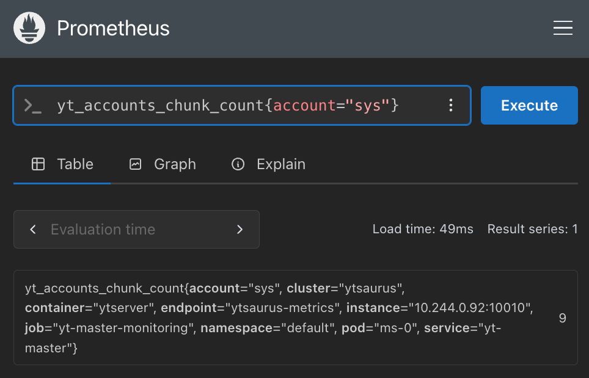
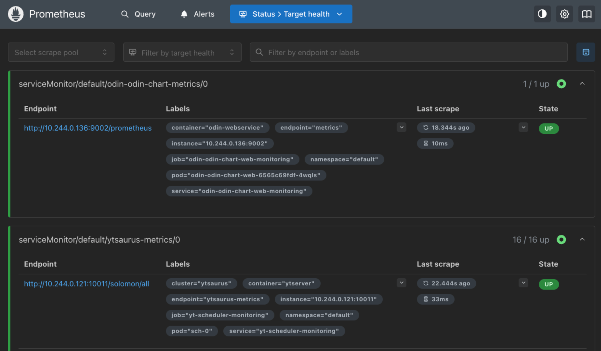
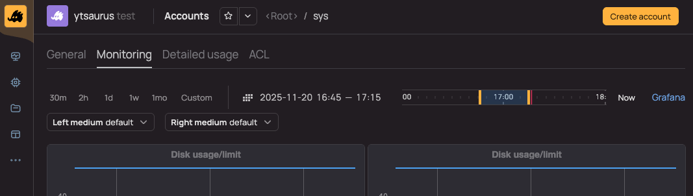
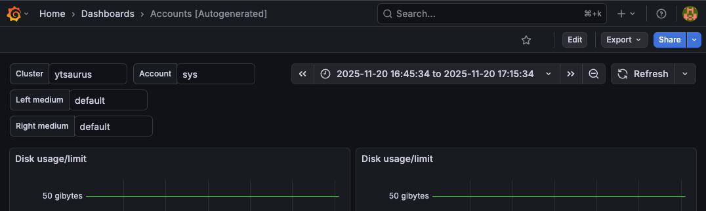

# Cluster monitoring setup

{{product-name}} allows you to export cluster object metrics to various monitoring systems.

[Prometheus](https://prometheus.io/) is used to collect metrics. [Grafana](https://grafana.com/) can be used to view metrics, as well as built-in dashboards in the {{product-name}} UI.

Automated setup of dashboards and alerts is done using the dedicated Helm chart `monitoring-chart`.

## Installing and configuring Prometheus {#setup-prometheus}

[Prometheus Operator](https://github.com/prometheus-operator/prometheus-operator) is used to collect metrics. {{product-name}} components and [Odin](../../admin-guide/install-odin.md) are automatically labeled for metric collection. The Odin Helm chart automatically creates a ServiceMonitor resource for its metrics during installation. To collect metrics from cluster components, we will create a separate ServiceMonitor manually.

1. Install the Prometheus operator according to the [instructions](https://github.com/prometheus-operator/prometheus-operator?tab=readme-ov-file#quickstart).

2. Make sure the operator pod is in the `Running` state:

    ```bash
    kubectl get pods -l app.kubernetes.io/name=prometheus-operator
    ```

3. Create a `prometheus.yaml` file:

    

    ```yaml
    apiVersion: monitoring.coreos.com/v1
    kind: Prometheus
    metadata:
      name: prometheus
    spec:
      serviceAccountName: prometheus
      resources:
        requests:
          memory: 400Mi
      enableAdminAPI: true

      storage:
        volumeClaimTemplate:
          spec:
            accessModes: ["ReadWriteOnce"]
            resources:
              requests:
                storage: 10Gi

      serviceMonitorSelector:
        matchLabels:
          yt_metrics: "true"

      additionalArgs:
        - name: log.level
          value: debug

    ---
    apiVersion: v1
    kind: ServiceAccount
    metadata:
      name: prometheus

    ---
    apiVersion: rbac.authorization.k8s.io/v1
    kind: ClusterRole
    metadata:
      name: prometheus
    rules:
      - apiGroups: [""]
        resources:
          - services
          - endpoints
          - pods
          - namespaces
        verbs: ["get", "list", "watch"]
      - apiGroups:
          - "discovery.k8s.io"
        resources:
          - endpointslices
        verbs:
          - "get"
          - "list"
          - "watch"

    ---
    apiVersion: rbac.authorization.k8s.io/v1
    kind: ClusterRoleBinding
    metadata:
      name: prometheus
    roleRef:
      apiGroup: rbac.authorization.k8s.io
      kind: ClusterRole
      name: prometheus
    subjects:
      - kind: ServiceAccount
        name: prometheus
        namespace: default

    ---
    apiVersion: monitoring.coreos.com/v1
    kind: ServiceMonitor
    metadata:
      name: ytsaurus-metrics
      labels:
        yt_metrics: "true"
    spec:
      namespaceSelector:
        any: true
      selector:
        matchLabels:
          yt_metrics: "true"
      endpoints:
        - port: ytsaurus-metrics
          path: /solomon/all
          relabelings:
            - sourceLabels: [__meta_kubernetes_pod_label_ytsaurus_tech_cluster_name]
              targetLabel: cluster
          metricRelabelings:
            - targetLabel: service
              sourceLabels:
                - service
              regex: (.*)-monitoring
              replacement: ${1}
    ```

    

    If necessary, you can modify the [ServiceMonitor](https://github.com/prometheus-operator/prometheus-operator/blob/main/Documentation/api-reference/api.md#servicemonitor) based on your requirements.

    For `ClusterRoleBinding` in the `subjects[0].namespace` section, you need to specify the namespace in which you plan to deploy Prometheus.

4. Apply the `prometheus.yaml` file:

    ```bash
    kubectl -n <namespace> apply -f prometheus.yaml
    ```

5. Make sure the Prometheus pod is in the `Running` state:

    ```bash
    kubectl -n <namespace> get pods -l app.kubernetes.io/name=prometheus
    ```

6. Make sure the Prometheus service is created:

    ```bash
    kubectl -n <namespace> get svc -l managed-by=prometheus-operator
    ```

7. Execute a simple query and see which pods metrics are collected from:

    Open access to the Prometheus service:

    ```bash
    kubectl -n <namespace> port-forward service/prometheus-operated 9090:9090
    ```

    

    - Via Prometheus UI

      If possible, open the Prometheus UI: [http://localhost:9090](http://localhost:9090). If not possible, use the `curl` approach.

      In the `Query` section, execute a simple query:

      ```promql
      yt_accounts_chunk_count{account="sys"}
      ```

      We see the number of chunks for the "sys" account:

      

      Fig. 1. Result of querying the number of chunks for the "sys" account in the Prometheus UI.

      It is important to make sure that `cluster` is set in the metrics.

      In the `Status` -> `Target health` section, you can find a list of all monitored components.

    - Via `curl`

      Execute a simple PromQL query:

      ```bash
      curl 'http://localhost:9090/api/v1/query?query=yt_accounts_chunk_count\{account="sys"\}' | jq
      ```

      We see the number of chunks for the "sys" account:

      ```json
      {
        "status": "success",
        "data": {
          "resultType": "vector",
          "result": [
            {
              "metric": {
                "__name__": "yt_accounts_chunk_count",
                "account": "sys",
                "cluster": "ytsaurus",
                "container": "ytserver",
                "endpoint": "ytsaurus-metrics",
                "instance": "10.244.0.178:10010",
                "job": "yt-master-monitoring",
                "namespace": "ytsaurus-dev",
                "pod": "ms-0",
                "service": "yt-master"
              },
              "value": [
                1766656488.985,
                "605"
              ]
            }
          ]
        }
      }
      ```

      Also, execute a request to get a list of pods from which metrics are collected:

      ```bash
      curl 'http://localhost:9090/api/v1/targets?state=active' | jq '
      {
        target_count: (.data.activeTargets | length),
        targets: [
          .data.activeTargets[] | {
            pod: .labels.pod,
            namespace: .labels.namespace,
            job: .labels.job,
            health: .health,
            lastError: .lastError,
            scrapeUrl: .scrapeUrl,
            scrapePool: .scrapePool
          }
        ]
      }'
      ```

      Example of expected result:
      
      ```json
      {
        "target_count": 16,
        "targets": [
          {
            "pod": "end-0",
            "namespace": "ytsaurus-dev",
            "job": "yt-exec-node-monitoring",
            "health": "up",
            "lastError": "",
            "scrapeUrl": "http://10.244.0.200:10029/solomon/all",
            "scrapePool": "serviceMonitor/default/ytsaurus-metrics/0"
          },
          ...
        ]
      }
      ```

    

8. If you have Odin installed, check if its metrics are being collected:

    Collection of qualitative metrics from [Odin](../../admin-guide/install-odin.md) is carried out through a separate `ServiceMonitor` created by the Odin chart itself.

    

    - Via Prometheus UI

      In the `Target health` section, it will be displayed like this:

      

      Fig. 2. Example of Odin service display in Prometheus.

    - Via `curl`

      Execute a request to get a list of pods containing `odin` in the name, from which metrics are collected:

      ```bash
      curl 'http://localhost:9090/api/v1/targets?state=active' | jq '
      .data.activeTargets 
      | map(select(.labels.pod | contains("odin"))) 
      | {
          targets: map({
              pod: .labels.pod,
              namespace: .labels.namespace,
              job: .labels.job,
              health: .health,
              lastError: .lastError,
              scrapeUrl: .scrapeUrl,
              scrapePool: .scrapePool
          })
      }'
      ```

      Example of expected result:
      
      ```json
      {
        "targets": [
          {
            "pod": "odin-odin-chart-web-6f8f5cbb7f-n5slb",
            "namespace": "default",
            "job": "odin-odin-chart-web-monitoring",
            "health": "up",
            "lastError": "",
            "scrapeUrl": "http://10.244.0.33:9002/prometheus",
            "scrapePool": "serviceMonitor/default/odin-odin-chart-metrics/0"
          }
        ]
      }
      ```

    

    If it is not displayed, check for the presence of `ServiceMonitor` in the same namespace as Prometheus:

    ```bash
    kubectl -n <namespace> get servicemonitor -l app.kubernetes.io/name=odin-chart
    ```

    If it is missing, you need to enable `ServiceMonitor` creation in the [chart settings](../../admin-guide/install-odin.md#prepare-values).

Done! Prometheus is installed and configured to collect qualitative and quantitative metrics from Odin and {{product-name}} components.


## Installing and configuring Grafana {#setup-grafana}

1. Create a `grafana.yaml` file:

    

    ```yaml
    ---
    apiVersion: v1
    kind: PersistentVolumeClaim
    metadata:
      name: grafana-pvc
      labels:
        app: grafana
    spec:
      accessModes:
        - ReadWriteOnce
      resources:
        requests:
          storage: 1Gi
    ---
    apiVersion: v1
    kind: Secret
    metadata:
      name: grafana-secret
      labels:
        app: grafana
    stringData:
      admin-user: admin
      admin-password: password
    type: Opaque
    ---
    apiVersion: v1
    kind: ConfigMap
    metadata:
      name: grafana-datasources
      labels:
        app: grafana
    data:
      prometheus.yaml: |-
        apiVersion: 1
        datasources:
          - name: Prometheus
            type: prometheus
            url: http://prometheus-operated.<namespace>.svc.cluster.local:9090
            access: proxy
            isDefault: true
            editable: true
    ---
    apiVersion: apps/v1
    kind: Deployment
    metadata:
      name: grafana
      labels:
        app: grafana
    spec:
      replicas: 1
      selector:
        matchLabels:
          app: grafana
      template:
        metadata:
          labels:
            app: grafana
        spec:
          securityContext:
            fsGroup: 472
          containers:
            - name: grafana
              image: grafana/grafana:12.1.4
              ports:
                - containerPort: 3000
                  name: http
              env:
                - name: GF_SECURITY_ADMIN_USER
                  valueFrom:
                    secretKeyRef:
                      name: grafana-secret
                      key: admin-user
                - name: GF_SECURITY_ADMIN_PASSWORD
                  valueFrom:
                    secretKeyRef:
                      name: grafana-secret
                      key: admin-password
              volumeMounts:
                - mountPath: /var/lib/grafana
                  name: grafana-storage
                - mountPath: /etc/grafana/provisioning/datasources
                  name: grafana-datasources
                  readOnly: true
              resources:
                requests:
                  cpu: 250m
                  memory: 750Mi
                limits:
                  cpu: 250m
                  memory: 750Mi
          volumes:
            - name: grafana-storage
              persistentVolumeClaim:
                claimName: grafana-pvc
            - name: grafana-datasources
              configMap:
                name: grafana-datasources
    ---
    apiVersion: v1
    kind: Service
    metadata:
      name: grafana
      labels:
        app: grafana
    spec:
      type: ClusterIP
      ports:
        - port: 3000
          targetPort: http
      selector:
        app: grafana
    ```

    

    It is worth specifying a secure password in the Secret and/or creating it via `kubectl create secret` instead of `apply`.

    In the `ConfigMap` in the `url` field, you need to replace `<namespace>` with the one you are using.

2. Apply the `grafana.yaml` file:

    ```bash
    kubectl -n <namespace> apply -f grafana.yaml
    ```

3. Make sure the pod and service for Grafana are running:

    ```bash
    kubectl -n <namespace> get all -l app=grafana
    ```

4. Go to the Grafana interface, execute a simple query and create a service account:

    Open access to the UI:

    ```bash
    kubectl -n <namespace> port-forward service/grafana 3000:3000
    ```

    Go to the UI: [http://localhost:3000](http://localhost:3000).

    In the left collapsible window, go to the `Connections` -> `Data sources` section.

    If the `Prometheus` datasource already exists, go to it and click `Save & test` at the very bottom. If the response is "Successfully queried the Prometheus API.", then Grafana has successfully connected to Prometheus.

    If any error occurred, check the specified "Prometheus server URL". Next, update the ConfigMap from the previous stage so that the URL and other parameters in it are correct. Also, for this datasource, save the uid:

    

    Go to the page with the UID:

    ```
    http://localhost:3000/connections/datasources/edit/prometheus
    ```

    The last part of the URL, namely `prometheus`, in this case will be the UID we need.

    

    The dashboard generator interacts with Grafana using a service account. You can get the token in `Administration` -> `Users and access` -> `Service accounts`. The service account role must be at least “Editor”. Save the service account token to an environment variable (you’ll need it in the [Secret creation step](#create-secret)):

    ```bash
    export GRAFANA_TOKEN="<your-grafana-token>" # example: glsa_bk1LYYY
    ```
5. To let your cluster users access the Grafana UI, configure network access to it:

    

    Grafana dashboards, unlike dashboards in the {{product-name}} UI, don’t check access rights to cluster objects. Configure access rights and accounts on the Grafana side.

    If you’ve restricted the Grafana user group, you can hide the Grafana button in the {{product-name}} UI for everyone else to avoid cluttering the interface. How to configure button visibility by ACL is described in the [Displaying the Grafana navigation button](#grafana-button) section.

    

    - Via Ingress / LoadBalancer:

      Configure public access to the `grafana` service using your cluster tools (for example, assign the `https://grafana.ytsaurus.tech` domain).

    - Locally:

      If you’re just testing the system locally, the public address will be the same as for port forwarding: `http://localhost:3000/`. Port forwarding must be active while you’re using the UI.

## Configuring the {{product-name}} interface {#setup-ui}

For monitoring and Grafana integration to work properly, you need to pass the required addresses to the {{product-name}} UI installed via the [Helm chart](../../admin-guide/install-ytsaurus.md#ui). When installing the monitoring chart, these variables will be automatically checked for existence.

Specify the `PROMETHEUS_BASE_URL` and `GRAFANA_BASE_URL` variables in the `ui.env` section of your `values.yaml` file for the {{product-name}} UI Helm chart:

```yaml
ui:
  env:
    # Internal Prometheus address that the UI will use
    - name: PROMETHEUS_BASE_URL
      value: "http://prometheus-operated.<namespace>.svc.cluster.local:9090/"
    # Public Grafana address for navigation from the UI
    - name: GRAFANA_BASE_URL
      value: "https://grafana.ytsaurus.tech" # or http://localhost:3000
```

Update the {{product-name}} UI Helm chart settings.

## Install dashboards and alerts (`monitoring-chart`) {#setup-monitoring-chart}

Use the `monitoring-chart` Helm chart to automatically load pre‑built dashboards into Cypress and Grafana, and to create standard alerts.

### Step 1: Prepare a user and grant permissions

Create a robot user `robot-monitoring` in {{product-name}}:

```bash
yt create user --attr "{name=robot-monitoring}"
```

Create a directory in Cypress to store dashboards (by default, `//sys/interface_monitoring`), and grant write and account‑use permissions for the directory owner account (by default, `sys`) to the `robot-monitoring` user:



If you are using UI version 3.12.2 or earlier, create `interface-monitoring` instead of `interface_monitoring`.



```bash
yt create map_node //sys/interface_monitoring --ignore-existing
yt set //sys/interface_monitoring/@acl/end '{action=allow; subjects=[robot-monitoring;]; permissions=[read;write;remove;];}'
yt set //sys/accounts/sys/@acl/end '{action=allow; subjects=[robot-monitoring]; permissions=[use]}'
```

### Step 2: Create a Kubernetes Secret with tokens {#create-secret}

The chart uses a Kubernetes Job to load dashboards. It needs tokens to authenticate with Grafana and {{product-name}}.

Create a Secret, inserting the {{product-name}} token and the Grafana token (saved in the `GRAFANA_TOKEN` variable during the [Grafana setup](#setup-grafana) step):

```bash
kubectl create secret generic ytsaurus-monitoring \
    --from-literal=YT_TOKEN=$(yt issue-token robot-monitoring) \
    --from-literal=GRAFANA_TOKEN="$GRAFANA_TOKEN" \
    -n <namespace>
```

### Step 3: Prepare `values.yaml` for monitoring‑chart

Create a `values.yaml` file with the following settings. Enter your data:

```yaml
cluster:
  # Internal HTTP proxy address of the cluster for loading dashboards
  proxy: "http://http-proxies.<namespace>.svc.cluster.local"
  name: "ytsaurus"

dashboards:
  grafana:
    # Internal address for loading dashboards
    url: "http://grafana.<namespace>.svc.cluster.local:3000"
    datasource:
      # UID obtained during Grafana setup
      uid: <your-uid, for example, PBFA97CFB590B2093>

ui:
  chart:
    name: "ytsaurus-ui"
    namespace: "default"

  # These addresses are used to verify UI configuration correctness
  prometheusInternalUrl: "http://prometheus-operated.<namespace>.svc.cluster.local:9090/"
  grafanaPublicUrl: "https://grafana.ytsaurus.tech"
```

You can view the full list of parameters in [`values.yaml`](https://github.com/ytsaurus/ytsaurus/blob/main/yt/docker/charts/monitoring-chart/values.yaml).



If you use the `//sys/interface-monitoring` directory (for UI versions 3.12.2 and earlier), you must additionally specify its path in `values.yaml`:

```yaml
dashboards:
  cypress:
    path: "//sys/interface-monitoring"
```



### Step 4: Install the chart

Install the monitoring chart:

```bash
helm install ytsaurus-monitoring oci://ghcr.io/ytsaurus/monitoring-chart \
    --version {{monitoring-version}} \
    -f values.yaml \
    -n <namespace>
```

During installation, the chart will automatically create `PrometheusRule` resources with alerts and run a `Job` that loads all dashboards into Grafana and the {{product-name}} UI. After that, you can see monitoring tabs in the cluster interface.



Some dashboards require access permissions to the objects being viewed. For example, the `master-accounts` dashboard requires the `use` permission on the requested account.



## Configure alerts {#alerts-configuration}

The `monitoring-chart` comes with a ready‑made set of alerts (PrometheusRule).

You can use the default values or override them selectively in `values.yaml`. View the full list of alerts in [`values.yaml`](https://github.com/ytsaurus/ytsaurus/blob/main/yt/docker/charts/monitoring-chart/values.yaml).

For example, to disable an entire group of alerts or change the trigger threshold for a specific rule:

```yaml
alerts:
  groups:
    master:
      rules:
        # Disable a specific rule
        MasterAutomatonThreadOverload:
          enabled: false  
        # Override the trigger time (for)
        MediumAlmostOutOfSpace:
          for: 30m  
    # Disable the entire group of Controller Agent alerts
    controllerAgent:
      enabled: false  
```

## Display the Grafana navigation button {#grafana-button}

Since you already added the `GRAFANA_BASE_URL` variable during UI setup, a **Grafana** button appears in the {{product-name}} interface (to the right of the time range selector).

Clicking it takes the user to the same dashboard with the same parameters for the same time period directly in the Grafana interface.



Fig. 3. Button demonstration in the cluster’s internal UI.



Fig. 4. Grafana interface with the same parameters as in the internal UI (Fig. 3).

By default, the button is available to all cluster users. If you create the `//sys/interface_monitoring/allow_grafana_url` document (or `//sys/interface-monitoring/allow_grafana_url` for UI versions 3.12.2 and earlier), the button will only be visible to users who have the `use` permission on this document.

## Supported dashboards {#supported-dashboards}

Currently, the following dashboards are automatically loaded and supported:

<!-- TODO: Add dashboard descriptions -->

- `master-accounts`
- `scheduler-operation`
- `bundle-ui-user-load`
- `bundle-ui-resource`
- `bundle-ui-cpu`
- `bundle-ui-memory`
- `bundle-ui-disk`
- `bundle-ui-lsm`
- `bundle-ui-network`
- `bundle-ui-efficiency`
- `bundle-ui-rpc-proxy-overview`
- `bundle-ui-rpc-proxy`
- `scheduler-internal`
- `scheduler-pool`
- `cluster-resources`
- `master-global`
- `master-local`
- `queue-metrics`
- `queue-consumer-metrics`
- `http-proxies`

