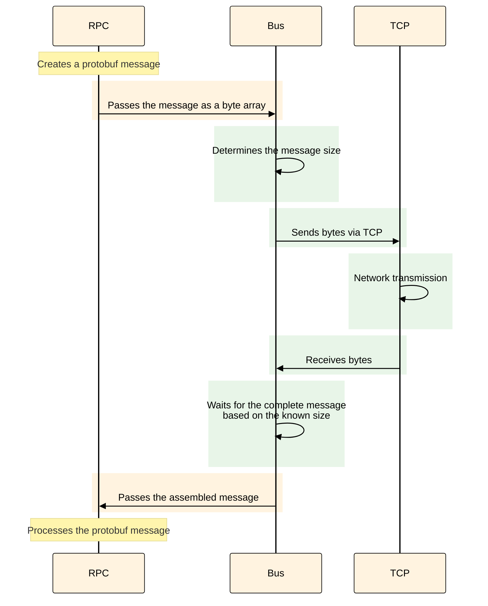
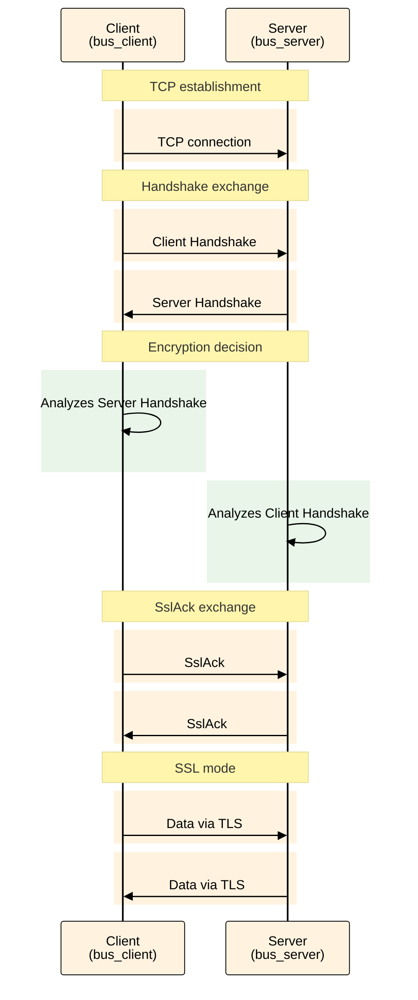

# Encryption in the Native Protocol

{{product-name}} supports encryption of internal traffic between cluster components using TLS. This document describes the encryption architecture and provides setup instructions for various deployment scenarios.

## Overview {#overview}

All components of a {{product-name}} cluster—Master servers, Data Nodes, proxies, and schedulers—communicate with each other over an internal native RPC protocol. By default, data is transmitted in plaintext, which is suitable for trusted networks. If you operate in a public network or need to protect confidential data, use traffic encryption.

{{product-name}} supports [two protection modes](#configuration-examples) for connections:
- [Mutual authentication (mTLS)](#example-mtls) — both parties verify each other's certificates.
- [One-way encryption](#example-one-way) — the client verifies the server's authenticity.

The certificate rotation mechanism allows updating certificates without stopping services. When deploying in Kubernetes, you can use cert-manager for automatic certificate management.



Native protocol encryption is available starting from {{product-name}} version 25.2.



## Encryption Architecture {#architecture}

To configure encryption correctly, it's important to understand how components interact within a {{product-name}} cluster. The architecture of the transport layer and the secure connection establishment process are described below.

### What is the bus layer {#what-is-bus-layer}

`bus` is the {{product-name}} transport layer that facilitates message transmission between components: schedulers, proxies, Data Nodes, and so on. `bus` works with messages, allowing it to define their size precisely, unlike regular TCP, which operates with a byte stream.

<div class="mermaid-diagram-compact">



</div>

The RPC layer operates above the `bus` level, assembling protobuf messages from the transmitted bytes. The TCP layer for network data transmission sits below the `bus` level. The bus layer knows the exact size of each message and waits to receive all bytes before passing the message up.

The diagram below shows the interaction between {{product-name}} cluster components and with external clients. Traffic encryption is configured and occurs exclusively within the cluster—between its components (for example, HTTP Proxy, Master Server, Data Nodes). The type of external client does not affect encryption: it can be a regular HTTP client, CHYT, SPYT, or any other service. For the full list of components that support encryption, see the [Components for configuration](#components-list) section.


Each component (Master server, scheduler, Data Node, etc.) simultaneously acts in two roles:
- `bus_client` — initiates outgoing connections to other components.
- `bus_server` — accepts incoming connections from other components.

For example, when an HTTP Proxy requests data from a Master Server:
- The HTTP Proxy acts as the `bus_client` (the connection initiator).
- The Master Server acts as the `bus_server` (the receiving party).

At the same time, the same Master Server can act as a `bus_client` when connecting to other cluster components.

### Secure connection establishment process {#secure-connection-process}

Establishing an encrypted connection between components happens in several stages:
1. **TCP connection establishment** — the client and server establish a regular TCP connection.
2. **Handshake exchange** — the client sends its Handshake to the server, then the server sends its Handshake to the client.
3. **Encryption decision** — each side learns from the opposite side's Handshake whether to establish an SSL connection.
4. **SslAck exchange** — if encryption is required, the client and server exchange fixed-size SslAck packets.
5. **Switching to SSL mode** — after exchanging SslAck, the parties switch to using the SSL library.

<div class="mermaid-diagram-compact">



</div>

**Handshake** is a protobuf message exchanged by components immediately after establishing a TCP connection. It contains:
- `encryption_mode` — encryption requirements (`disabled`/`optional`/`required`).
- `verification_mode` — certificate verification requirements (`none`/`ca`/`full`).

Key features of the Handshake:
- **Size can vary** — because it's protobuf, the message size can change when new fields are added.
- **Strict sequence** — the client sends its Handshake first, the server receives it and only then sends its own.
- **Decision making** — each side analyzes the opposite side's Handshake and its own configuration to decide whether to enable encryption.

### Encryption decision making {#encryption-decision}

Each component makes the encryption decision based on:
- Its own configuration (`encryption_mode`, `verification_mode`).
- The opposite side's configuration (from the Handshake).

If one side is configured to `required` and the other to `disabled`, the connection won't be established.

## How to enable encryption {#configuration}

To enable encryption, configure the appropriate parameters in the cluster component configurations. The available parameters and their usage scenarios are described below.

### Configuration parameters {#configuration-parameters}

Encryption is configured through the `bus_client` and `bus_server` parameters in each component's configuration:

#|
|| **Parameter** {.cell-align-center}| **Description** {.cell-align-center}||
|| `encryption_mode` {#encryption_mod}| Encryption mode:
- `disabled` — encryption is disabled. If the other party requires encryption (`required`), the connection won't be established.
- `optional` — encryption on demand. The connection will be encrypted only if the other party's mode is `required`.
- `required` — encryption is mandatory. If the other party's mode is `disabled`, the connection will fail. ||
|| `verification_mode` | Certificate verification mode:
- `none` — the other party is not authenticated.
- `ca` — the other party is authenticated via the CA file (checks that the certificate is signed by a trusted CA).
- `full` — the other party is authenticated via the CA and by matching the certificate to the hostname (strictest mode). ||
|| `cipher_list` | Cipher suite list separated by colons. Example: `"AES128-GCM-SHA256:PSK-AES128-GCM-SHA256"`. ||
|| `ca` | CA certificate or path to the file. Example: `{ "file_name" = "/etc/yt/certs/ca.pem" }`. ||
|| `cert_chain` | Certificate or path to the file. Example: `{ "file_name" = "/etc/yt/certs/cert.pem" }`. ||
|| `private_key` | Private key or path to the file. Example: `{ "file_name" = "/etc/yt/certs/key.pem" }`. ||
|| `load_certs_from_bus_certs_directory` | Load certificates from the bus certificates directory. When set to `true`, the `ca`, `cert_chain`, and `private_key` parameters are interpreted as file names, not paths. Convenient for external clusters. ||
|#

### Encryption mode compatibility {#encryption-modes-compatibility}

When establishing a connection, the result depends on the combination of modes in the [encryption_mode](#configuration-parameters) parameter settings for `bus_client` and `bus_server`:

#|
|| **Client** {.cell-align-center}| **Server** {.cell-align-center}| **Result** {.cell-align-center}||
|| `disabled` | `disabled` | Unencrypted connection ||
|| `disabled` | `optional` | Unencrypted connection ||
|| `disabled` | `required` | Connection error ||
|| `optional` | `disabled` | Unencrypted connection ||
|| `optional` | `optional` | Unencrypted connection ||
|| `optional` | `required` | Encrypted connection ||
|| `required` | `disabled` | Connection error ||
|| `required` | `optional` | Encrypted connection ||
|| `required` | `required` | Encrypted connection ||
|#

### Components for configuration {#components-list}

You can configure encryption for the following cluster components:
- controller_agent
- data_node
- discovery
- exec_node
- master
- master_cache
- proxy
- rpc_proxy
- scheduler
- tablet_node
- timestamp_provider
- clock_provider
- qt
- yql_agent

Encryption can also be configured with external cluster components, such as SPYT and CHYT.



To use TLS in CHYT, you need:
- CHYT version 2.17 or higher.
- Strawberry version 0.0.14 or higher.



### Integration with CHYT

Unlike other components, CHYT runs inside a [vanilla operation](../../user-guide/data-processing/operations/vanilla) of {{product-name}}, so certificates are transferred in a special way:
- Strawberry reads certificates from files specified in its configuration.
- The `cluster-connection` configuration with `bus_client`/`bus_server` parameters is taken from Cypress to determine the encryption mode and connection parameters to cluster components.
- All security settings, including certificates and encryption parameters, are passed into the operation via the [secure_vault](*secure_vault) mechanism.
- When certificates change, Strawberry calculates the hash of the new data and, upon detecting changes, automatically restarts the operation to apply the updated settings.

The `secure_vault` mechanism allows you to securely pass certificates and keys into operations without exposing them in plain text. The `cluster-connection` configuration contains all the necessary settings for establishing secure connections between CHYT and other cluster components, including encryption modes (`encryption_mode`) and certificate verification modes (`verification_mode`).

## Configuration examples {#configuration-examples}

The examples below show how to configure TLS with different security levels. These configurations are used in the {{product-name}} component configuration files. For more details on how to apply them, see the [configuration parameters](#configuration) section.

### Mutual certificate verification (mTLS) {#example-mtls}

Configuration for the maximum security level with verification of both parties' certificates:



```yaml
# Client side
bus_client:
  encryption_mode: required
  verification_mode: full
  ca:
    file_name: /etc/yt/certs/ca.pem
  cert_chain:
    file_name: /etc/yt/certs/client.pem
  private_key:
    file_name: /etc/yt/certs/client.key

# Server side
bus_server:
  encryption_mode: required
  verification_mode: full
  ca:
    file_name: /etc/yt/certs/ca.pem
  cert_chain:
    file_name: /etc/yt/certs/server.pem
  private_key:
    file_name: /etc/yt/certs/server.key
```



### One-way encryption {#example-one-way}

Configuration where only the client verifies the server's certificate:



```yaml
# Client side
bus_client:
  encryption_mode: required
  verification_mode: ca
  ca:
    file_name: /etc/yt/certs/ca.pem

# Server side
bus_server:
  encryption_mode: required
  verification_mode: none
  cert_chain:
    file_name: /etc/yt/certs/server.pem
  private_key:
    file_name: /etc/yt/certs/server.key
```



## Setup scenarios {#deployment-scenarios}

The method for setting up encryption depends on how your {{product-name}} cluster is deployed. Instructions for the main deployment scenarios are provided below.



- K8s with operator {selected}

  - [Deploying a new cluster with encryption](#k8s-new-cluster)
  - [Enabling encryption on an existing cluster](#k8s-existing-cluster)
  - [TLS parameters in the operator specification](#k8s-tls-parameters)
  - [Automatic certificate rotation](#k8s-cert-rotation)
  - [TLS operation modes](#k8s-tls-modes)


  #### Deploying a new cluster with encryption {#k8s-new-cluster}

  The simplest way is to use a ready-made demo configuration example with TLS enabled:

  1. Install cert-manager (if not already installed):
     ```bash
     kubectl apply -f https://github.com/cert-manager/cert-manager/releases/download/v1.13.0/cert-manager.yaml
     ```

  2. Apply the cluster configuration with TLS:
     ```bash
     kubectl apply -f https://raw.githubusercontent.com/ytsaurus/ytsaurus-k8s-operator/main/config/samples/cluster_v1_tls.yaml
     ```

  3. Check the deployment status:
     ```bash
     kubectl get ytsaurus -n <namespace>
     ```
     ```
     NAME       CLUSTERSTATE   UPDATESTATE   UPDATINGCOMPONENTS   BLOCKEDCOMPONENTS
     ytsaurus   Running        None
     ```
     This command shows the status of the YTsaurus cluster. The `Running` status means the cluster has started successfully and is operational. The empty `UPDATINGCOMPONENTS` and `BLOCKEDCOMPONENTS` fields indicate all components are functioning normally.

     ```bash
     kubectl get certificates -n <namespace>
     ```
     ```
     NAME                   READY   SECRET                 AGE
     ytsaurus-ca            True    ytsaurus-ca-secret     42d
     ytsaurus-https-cert    True    ytsaurus-https-cert    42d
     ytsaurus-native-cert   True    ytsaurus-native-cert   42d
     ytsaurus-rpc-cert      True    ytsaurus-rpc-cert      42d
     ```
     This command lists certificates managed by cert-manager. The `READY: True` status confirms the certificates have been successfully issued and are ready for use. The `ytsaurus-native-cert` certificate is used for encrypting internal bus traffic between components.

     ```bash
     kubectl get secrets -n <namespace> | grep -E "ytsaurus|tls|cert"
     ```
     ```
     ytsaurus-ca-secret      kubernetes.io/tls   3      41d
     ytsaurus-https-cert     kubernetes.io/tls   3      41d
     ytsaurus-native-cert    kubernetes.io/tls   3      41d
     ytsaurus-rpc-cert       kubernetes.io/tls   3      41d
     ```
     This command shows Kubernetes secrets with TLS certificates and keys.
     - The type `kubernetes.io/tls` indicates a TLS secret.
     - The number `3` in the DATA column means three components:
        - `tls.crt` (certificate).
        - `tls.key` (private key).
        - `ca.crt` (CA certificate for verification).

     ```bash
     kubectl describe ytsaurus <cluster-name> -n <namespace> | grep -A 5 "Native Transport"
     ```
     ```
     Native Transport:
       Tls Client Secret:
         Name:                          ytsaurus-native-cert
       Tls Insecure:                    true
       Tls Peer Alternative Host Name:  interconnect.ytsaurus-dev.svc.cluster.local
       Tls Required:                    true
       Tls Secret:
         Name:  ytsaurus-native-cert
     ```
     This command shows the encryption settings in the cluster configuration. The `Tls Required: true` parameter confirms that encryption is mandatory for internal connections.

     ```bash
     kubectl describe certificate <certificate-name> -n <namespace>
     ```
     ```
     Name:         ytsaurus-native-cert
     Namespace:    default
     Status:
       Conditions:
         Last Transition Time:  2026-01-30T07:45:50Z
         Message:               Certificate is up to date and has not expired
         Reason:                Ready
         Status:                True
         Type:                  Ready
       Not After:               2026-04-30T07:45:50Z
       Not Before:              2026-01-30T07:45:50Z
       Renewal Time:            2026-03-31T07:45:50Z
     ```
     This command shows certificate details. The `Not After` (expiry) and `Renewal Time` fields confirm automatic certificate rotation via cert-manager.

     ```bash
     kubectl get secret <secret-name> -n <namespace> -o jsonpath='{.data.ca\.crt}' | base64 -d > /tmp/ca.crt
     kubectl exec -n ytsaurus hp-0 -- curl --cacert /tmp/ca.crt -k -v https://hp-0.http-proxies.ytsaurus.svc.cluster.local:443/api/v4/
     ```
     This command checks the TLS handshake when connecting to the cluster API **from inside the cluster**. The `-v` option enables verbose mode to view the secure connection establishment process.

     
     ```
     * Connected to hp-0.http-proxies.ytsaurus.svc.cluster.local (10.1.1.93) port 443
     * ALPN, offering h2
     * ALPN, offering http/1.1
     * TLSv1.3 (OUT), TLS handshake, Client hello (1):
     } [512 bytes data]
     * TLSv1.3 (IN), TLS handshake, Server hello (2):
     { [93 bytes data]
     * TLSv1.2 (IN), TLS handshake, Certificate (11):
     { [926 bytes data]
     * TLSv1.2 (IN), TLS handshake, Server key exchange (12):
     { [300 bytes data]
     * TLSv1.2 (IN), TLS handshake, Server finished (14):
     { [4 bytes data]
     * TLSv1.2 (OUT), TLS handshake, Client key exchange (16):
     } [37 bytes data]
     * TLSv1.2 (OUT), TLS change cipher, Change cipher spec (1):
     } [1 bytes data]
     * TLSv1.2 (OUT), TLS handshake, Finished (20):
     } [16 bytes data]
     * TLSv1.2 (IN), TLS handshake, Finished (20):
     { [16 bytes data]
     * SSL connection using TLSv1.2 / ECDHE-RSA-AES256-GCM-SHA384
     * ALPN, server did not agree on a protocol
     * Server certificate:
     *  subject: [NONE]
     *  start date: Jan 30 07:45:50 2026 GMT
     *  expire date: Apr 30 07:45:50 2026 GMT
     *  issuer: O=ytsaurus CA; CN=ytsaurus-ca
     *  SSL certificate verify result: unable to get local issuer certificate (20), continuing anyway.
     > GET /api/v4/ HTTP/1.1
     > Host: hp-0.http-proxies.ytsaurus.svc.cluster.local
     > User-Agent: curl/7.68.0
     > Accept: */*
     < HTTP/1.1 200 OK
     < Content-Length: 18118
     < X-YT-Trace-Id: b430ab8e-c4e8ab91-fcb54bb1-3c53ef11
     < Cache-Control: no-store
     < X-YT-Request-Id: 40981ad3-5ad47b6c-74c2640f-20856da1
     < X-YT-Proxy: hp-0.http-proxies.ytsaurus.svc.cluster.local
     < Content-Type: application/json
     ```
     

     The output shows successful completion of all TLS handshake stages: Client hello → Server hello → Certificate → Key exchange → Finished. The connection is established using the `TLSv1.2` protocol with the `ECDHE-RSA-AES256-GCM-SHA384` cipher. The certificate is issued by `ytsaurus CA` and is valid until the indicated date. The `HTTP/1.1 200 OK` response status confirms the request was successfully executed over the secure connection.

     Key points in the output:
     - Successful completion of all TLS handshake stages (Client hello → Server hello → Certificate → Key exchange → Finished).
     - Connection established using the `TLSv1.2` protocol.
     - Modern cipher `ECDHE-RSA-AES256-GCM-SHA384` is used.
     - Certificate issued by `ytsaurus CA` and valid until `Apr 30 07:45:50 2026 GMT`.
     - The YTsaurus HTTP proxy (`X-YT-Proxy: hp-0.http-proxies.ytsaurus.svc.cluster.local`) successfully processes the request over the secure connection.
     - The `HTTP/1.1 200 OK` response status confirms successful request execution over TLS.

  This configuration automatically creates a self-signed CA, issues certificates, and configures components to operate with mutual authentication (mTLS).

  #### Enabling encryption on an existing cluster {#k8s-existing-cluster}

  To enable encryption on a running cluster, add the following parameters to the YTsaurus specification:

  ```yaml
  spec:
    # CA certificate for verification
    caBundle:
      kind: Secret
      name: ytsaurus-ca-secret
      key: tls.crt

    # TLS settings for internal transport
    nativeTransport:
      tlsSecret:
        name: ytsaurus-native-cert
      tlsRequired: true
      tlsInsecure: true
      tlsPeerAlternativeHostName: "interconnect.ytsaurus-dev.svc.cluster.local"
  ```

  

  The `tlsInsecure: true` parameter disables client certificate verification. For full mutual authentication (mTLS), set `tlsInsecure: false` and specify `tlsClientSecret`.

  

  #### TLS parameters in the operator specification {#k8s-tls-parameters}

  #|
  || **Parameter** {.cell-align-center}| **Description** {.cell-align-center}||
  || `caBundle` | Reference to the secret containing the CA certificate for verification. ||
  || `tlsSecret` | Secret with the server certificate (type kubernetes.io/tls). ||
  || `tlsClientSecret` | Secret with the client certificate for mTLS. ||
  || `tlsRequired` | Require mandatory encryption (`true`/`false`). ||
  || `tlsInsecure` | Disable client certificate verification (`true`/`false`). ||
  || `tlsPeerAlternativeHostName` | Host name to check in the certificate. ||
  |#

  #### Automatic certificate rotation {#k8s-cert-rotation}

  When using cert-manager, rotation happens automatically:
  - Cert-manager monitors certificate expiration dates.
  - A new certificate is issued when the expiration date approaches.
  - The secret is updated without restarting pods.
  - Components use the new certificate for new connections.

  **How automatic rotation works:**
  - When the current certificate's validity expires, cert-manager automatically issues a new certificate.
  - The new certificate and key are updated in the Kubernetes Secret mounted into the container.
  - The certificate file mounted into the server container is automatically updated without restarting the pod.
  - Each server periodically rereads the certificate:
    - At the BUS level — for every new connection.
    - Existing connections continue to work with the old certificate.
    - New connections use the updated certificate.

  #### TLS operation modes {#k8s-tls-modes}

  Different TLS operation modes are formed based on the values of `tlsRequired` and `tlsInsecure`:

  #|
  || **tlsRequired** | **tlsInsecure** | **Description** | **server** | **client** ||
  || `false` | `true` | Encryption is disabled, components communicate in plaintext. | `EO-VN` | `EO-VN` ||
  || `false` | `false` | TLS is enabled but not mandatory. The client verifies the server's certificate, but the server does not require TLS. | `EO-VN` | `ER-VF` ||
  || `true` | `true` | Encryption is enabled, but the server does not verify the client's certificate (one-way encryption). | `ER-VN` | `ER-VF` ||
  || `true` | `false` | Encryption is enabled, both parties verify each other's certificates (mutual verification). | `ER-VF` | `ER-VF` ||
  |#

  **Decoding:**
  - `EO` – Encryption Optional
  - `ER` – Encryption Required
  - `VN` – Verification None
  - `VF` – Verification Full

- Manual deployment

  - [Prepare certificates](#manual-prepare-certs)
  - [Configure components](#manual-configure-components)
  - [Apply configuration](#manual-apply-config)


  #### Prepare certificates {#manual-prepare-certs}

  Before configuring encryption, prepare SSL certificates:
  1. A CA certificate for verification.
  2. Certificates and keys for each component.
  3. Place the files in a location accessible to the components (for example, `/etc/yt/certs/`).

  #### Configure components {#manual-configure-components}

  In each component's configuration file, add encryption parameters:

  ```yaml
  # Server-side settings
  bus_server:
    encryption_mode: required
    verification_mode: none
    ca:
      file_name: /etc/yt/certs/ca.pem
    cert_chain:
      file_name: /etc/yt/certs/server.pem
    private_key:
      file_name: /etc/yt/certs/server.key

  # Client-side settings
  bus_client:
    encryption_mode: required
    verification_mode: ca
    ca:
      file_name: /etc/yt/certs/ca.pem
  ```

  #### Apply configuration {#manual-apply-config}

  1. Update the configuration files of all components.
  1. Restart the cluster components.
  1. Check for the establishment of encrypted connections in the logs.

- External clusters

  - [Configure secure connection between clusters](#external-clusters-mtls)
  - [Preparation](#external-prepare)
  - [Configure cluster A](#external-cluster-a)
  - [Configure cluster B](#external-cluster-b)

  #### Configure secure connection between clusters {#external-clusters-mtls}

  To set up a secure channel between two {{product-name}} clusters, you need to configure mutual authentication (mTLS). This provides the highest level of security for inter-cluster interaction.

  #### Preparation {#external-prepare}

  On each cluster, prepare:
  - The opposite cluster's CA certificate.
  - A client certificate and key for your own cluster.
  - Place the files in the bus certificates directory.

  #### Configure cluster A {#external-cluster-a}

  1. **Download the current clusters configuration**:
     ```bash
     yt get //sys/clusters > clusters.yaml
     ```

  1. **Add configuration for connecting to cluster B**:
     ```yaml
     cluster-b:
       discovery_servers:
         - "cluster-b.example.com:2136"
       primary_master: "cluster-b.example.com:9013"
       bus_client:
         encryption_mode: required
         verification_mode: full
         ca:
           file_name: ca-cluster-b.pem
         cert_chain:
           file_name: client-cluster-a.pem
         private_key:
           file_name: client-cluster-a.key
         load_certs_from_bus_certs_directory: true
     ```

  1. **Upload the updated configuration**:
     ```bash
     yt set //sys/clusters < clusters.yaml
     ```

  #### Configure cluster B {#external-cluster-b}

  Repeat similar steps on cluster B, specifying parameters for connecting to cluster A.

  

  For mutual authentication to work, the configuration must be set up on both clusters. One-sided configuration will lead to connection errors.

  



## Performance {#performance}

Encryption increases CPU load and can slightly reduce performance. Based on test results:
- CPU load increases by 5–15% depending on the operation type.
- Throughput decreases by 3–10%.
- Latency increases by 1–5 ms.

<style>
.mermaid-diagram {
  max-width: 800px !important;
  margin: 20px auto !important;
  text-align: center !important;
  display: block !important;
}

.mermaid-diagram svg {
  max-width: 120% !important;
  height: auto !important;
  display: block !important;
  margin: 0 auto !important;
  font-family: Arial, sans-serif !important;
}

.mermaid-diagram-compact {
  max-width: 800px !important;
  margin: 20px auto !important;
  text-align: center !important;
  display: block !important;
}

.mermaid-diagram-compact svg {
  max-width: 140% !important;
  max-height: 700px !important;
  height: auto !important;
  display: block !important;
  margin: 0 auto !important;
  font-family: Arial, sans-serif !important;
  transform: scaleX(1) scaleY(1);
  transform-origin: center;
}

.mermaid-diagram-small {
  max-width: 700px !important;
  margin: 20px auto !important;
  text-align: center !important;
  display: block !important;
}

.mermaid-diagram-small svg {
  max-width: 100% !important;
  height: auto !important;
  display: block !important;
  margin: 0 auto !important;
  font-family: Arial, sans-serif !important;
  transform: scale(1);
  transform-origin: center;
}
</style>

[*secure_vault]: Secure vault for operation secrets.

[*cluster-name]: Replace with your YTsaurus cluster name.

[*namespace]: Replace with the namespace where the cluster is deployed.
