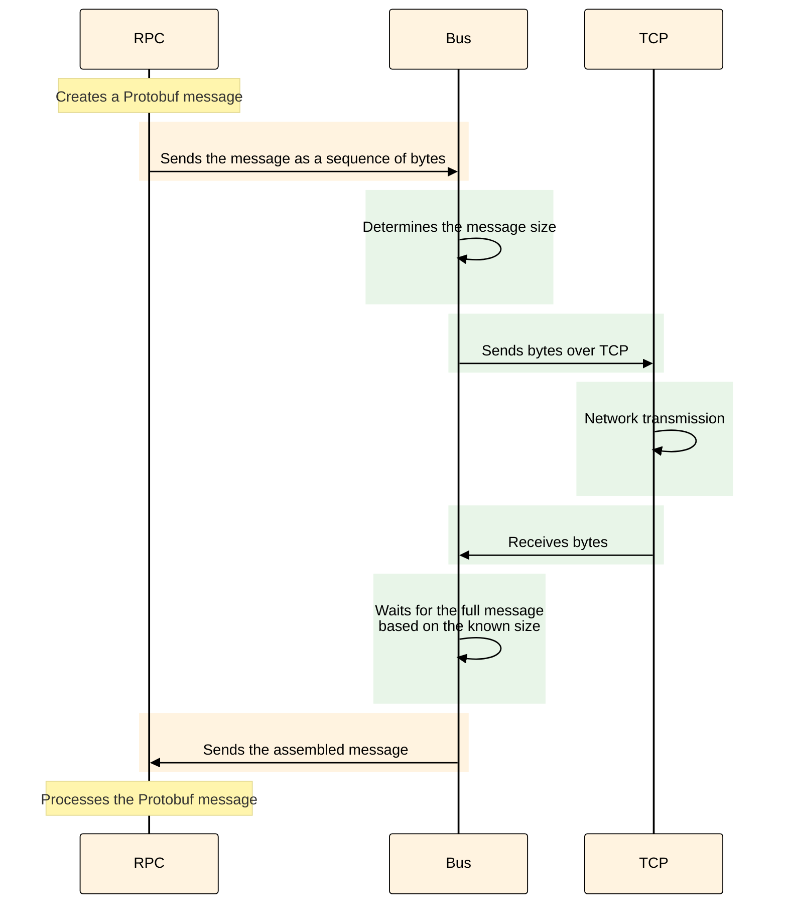
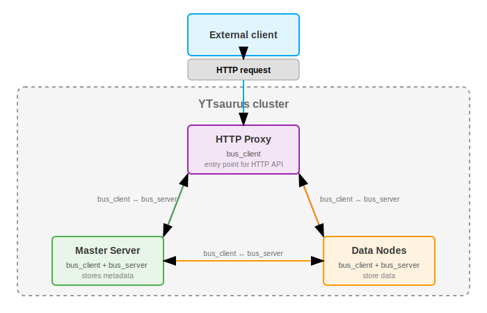
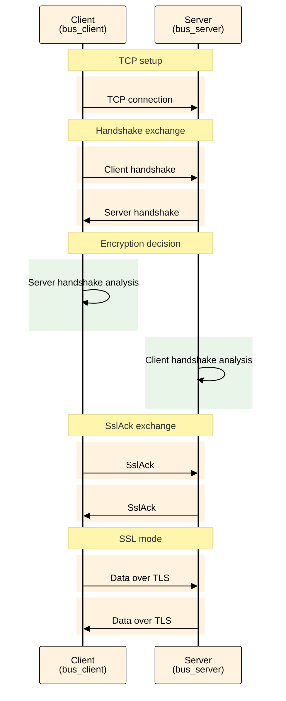

# Native Protocol encryption in {{product-name}}

{{product-name}} supports encryption of internal traffic between cluster components using TLS. This document describes the encryption architecture and provides configuration instructions for various deployment scenarios.

## Overview {#overview}

All components in a {{product-name}} cluster — master servers, data nodes, proxies, and schedulers — communicate over the internal native RPC protocol. By default, data is transmitted in plaintext, which is acceptable as long as the network is trusted. However, if your cluster operates in a public network, or if you need to protect sensitive data, you should enable traffic encryption.

{{product-name}} supports [two connection security modes](#configuration-examples):

- [Mutual authentication (mTLS)](#example-mtls) — both sides verify each other's certificates.
- [One-way encryption](#example-one-way) — the client verifies the server's identity.

With certificate rotation, you can update certificates without service interruptions. When deploying on Kubernetes, certificate management can be automated using cert-manager.



Native protocol encryption is available starting with {{product-name}} version 25.2.



## Encryption architecture {#architecture}

To configure encryption correctly, it's important to understand how components interact within a {{product-name}} cluster. Below, we explain the transport-layer architecture and the process of establishing a secure connection.

### What is the bus layer {#what-is-bus-layer}

The `bus` is the transport layer in {{product-name}} that handles message delivery between components such as schedulers, proxies, data nodes, and others. The `bus` works with messages, which makes their size clearly defined — unlike standard TCP, which operates on a byte stream.

<div class="mermaid-diagram-compact">



</div>

The RPC layer operates above the `bus` layer, assembling Protobuf messages from the transmitted bytes. The TCP layer, which handles network data transmission, sits below the `bus` layer. The `bus` layer knows the exact size of each message and waits for all bytes to arrive before passing the message upward.


The diagram below shows how {{product-name}} cluster components interact with one another and with external clients. Traffic encryption is configured and applied only within the cluster — between its components such as HTTP proxies, master servers, and data nodes. The type of external client doesn't affect encryption: it can be a regular HTTP client, CHYT, SPYT, or any other service. For the full list of components that support encryption, see [Components for configuration](#components-list).




Each component (master server, scheduler, data node, and others) performs two roles at once:

- `bus_client` — initiates outgoing connections to other components.
- `bus_server` — accepts incoming connections from other components.

For example, when an HTTP proxy requests data from a master server:

- The HTTP proxy acts as a `bus_client` (connection initiator).
- The master server acts as a `bus_server` (recipient).

At the same time, the master server can also act as a `bus_client` when communicating with other cluster components.

### Establishing a secure connection {#secure-connection-process}

Establishing an encrypted connection between components happens in several stages:

1. **TCP connection setup** — the client and server establish a standard TCP connection.
2. **Handshake exchange** — the client sends its handshake to the server, and the server then sends its handshake to the client.
3. **Encryption decision** — each side determines, based on the peer's handshake, whether an SSL connection should be established.
4. **SslAck exchange** — if encryption is required, the client and server exchange fixed-size SslAck packets.
5. **Switching to SSL mode** — after exchanging SslAck, both sides switch to using the SSL library.

<div class="mermaid-diagram-compact">



</div>


**Handshake** is a Protobuf message exchanged by components immediately after a TCP connection is established. It includes:

- `encryption_mode` — the encryption requirements (`disabled`/`optional`/`required`).
- `verification_mode` — the certificate verification requirements (`none`/`ca`/`full`).

Key properties of a handshake:

- **Variable size** — because it's a Protobuf message, its size may change when new fields are added.
- **Defined sequence** — the client sends its handshake first, the server receives it and then sends its own.
- **Decision point** — each side analyzes the peer's handshake and its own configuration to determine whether an encryption should be established.

### Encryption decision {#encryption-decision}

Each component decides whether to establish encryption based on:

- Its own configuration (`encryption_mode`, `verification_mode`).
- The peer's configuration (as provided in the handshake).

If one side is configured as `required` and the other as `disabled`, the connection won't be established.

## How to enable encryption {#configuration}

To enable encryption, configure the appropriate parameters in the cluster component settings. Below is an overview of the available parameters and their usage scenarios.

### Configuration parameters {#configuration-parameters}

Encryption is enabled via the `bus_client` and `bus_server` parameters in each component's configuration:

#|
|| **Parameter** {.cell-align-center}| **Description** {.cell-align-center}||
|| `encryption_mode` {#encryption_mod}| Encryption mode:
- `disabled` — encryption is turned off. If the other side requires encryption (`required`), the connection won't be established.
- `optional` — encryption is used only if requested. The connection will be encrypted if the peer's mode is `required`.
- `required` — encryption is mandatory. If the peer's mode is `disabled`, the connection will fail. ||
|| `verification_mode` | Certificate verification mode:
- `none` — no peer authentication is performed.
- `ca` — the peer is authenticated using a CA file (the certificate must be signed by a trusted CA).
- `full` — the peer is authenticated using both the CA and hostname verification against the certificate (strictest mode). ||
|| `cipher_list` | A list of cipher suites separated by colons. Example: `"AES128-GCM-SHA256:PSK-AES128-GCM-SHA256"`. ||
|| `ca` | A CA certificate or a path to the certificate file. Example: `{ "file_name" = "/etc/yt/certs/ca.pem" }`. ||
|| `cert_chain` | A certificate or a path to the certificate file. Example: `{ "file_name" = "/etc/yt/certs/cert.pem" }`. ||
|| `private_key` | A private key or a path to the key file. Example: `{ "file_name" = "/etc/yt/certs/key.pem" }`. ||
|| `load_certs_from_bus_certs_directory` | Load certificates from the `bus` certificates directory. When set to `true`, the `ca`, `cert_chain`, and `private_key` parameters are treated as file names rather than full paths. Convenient when working with external clusters. ||
|#

### Encryption mode compatibility {#encryption-modes-compatibility}

When a connection is established, the result depends on the combination of [encryption_mode](#configuration-parameters) settings configured for `bus_client` and `bus_server`:

#|
|| **Client** {.cell-align-center}| **Server** {.cell-align-center}| **Result** {.cell-align-center}||
|| `disabled` | `disabled` | Unencrypted connection ||
|| `disabled` | `optional` | Unencrypted connection ||
|| `disabled` | `required` | Connection error ||
|| `optional` | `disabled` | Unencrypted connection ||
|| `optional` | `optional` | Unencrypted connection ||
|| `optional` | `required` | Encrypted connection ||
|| `required` | `disabled` | Connection error ||
|| `required` | `optional` | Encrypted connection ||
|| `required` | `required` | Encrypted connection ||
|#

### Components for configuration {#components-list}

You can configure encryption for the following cluster components:

- controller_agent
- data_node
- discovery
- exec_node
- master
- master_cache
- proxy
- rpc_proxy
- scheduler
- tablet_node
- timestamp_provider
- clock_provider
- qt
- yql_agent

You can also enable encryption when working with external cluster components such as SPYT and CHYT.



To use TLS with CHYT, you need:

- CHYT version 2.17 or later.

- Strawberry version 0.0.14 or later.




### Integration with CHYT

Unlike other components, CHYT runs inside a {{product-name}} [vanilla operation](../../user-guide/data-processing/operations/vanilla), so certificates are passed in a specific way:

- Strawberry reads certificates from the files specified in its configuration.
- The `cluster-connection` configuration with `bus_client`/`bus_server` parameters is taken from Cypress to determine the encryption mode and connection settings for cluster components.
- The operation receives all security settings, including certificates and encryption parameters, via a [secure_vault](*secure_vault).
- When certificates change, Strawberry recalculates the hash of the updated configuration data. If either side detects that the hash has changed, Strawberry automatically restarts the operation to apply the new settings.

The `secure_vault` allows you to pass certificates and keys to operations securely, without exposing them in plaintext. The `cluster-connection` configuration includes all the necessary settings for establishing secure connections between CHYT and other cluster components, including encryption modes (`encryption_mode`) and certificate verification modes (`verification_mode`).


## Configuration examples {#configuration-examples}

The examples below show how to configure TLS for different security levels. These settings are used in configuration files for {{product-name}} components. For more details on how to apply them, see [Configuration parameters](#configuration).

### Mutual certificate verification (mTLS) {#example-mtls}

Configuration for the highest security level with certificate verification on both sides:



```yaml
# Client side
bus_client:
  encryption_mode: required
  verification_mode: full
  ca:
    file_name: /etc/yt/certs/ca.pem
  cert_chain:
    file_name: /etc/yt/certs/client.pem
  private_key:
    file_name: /etc/yt/certs/client.key

# Server side
bus_server:
  encryption_mode: required
  verification_mode: full
  ca:
    file_name: /etc/yt/certs/ca.pem
  cert_chain:
    file_name: /etc/yt/certs/server.pem
  private_key:
    file_name: /etc/yt/certs/server.key
```



### One-way encryption {#example-one-way}

Configuration where only the client verifies the server's certificate:



```yaml
# Client side
bus_client:
  encryption_mode: required
  verification_mode: ca
  ca:
    file_name: /etc/yt/certs/ca.pem

# Server side
bus_server:
  encryption_mode: required
  verification_mode: none
  cert_chain:
    file_name: /etc/yt/certs/server.pem
  private_key:
    file_name: /etc/yt/certs/server.key
```




## Setup scenarios {#deployment-scenarios}

The way you configure encryption depends on how your {{product-name}} cluster is deployed. Here are instructions for the main deployment scenarios.



- K8s with an operator {selected}

  - [Deploying a new cluster with encryption](#k8s-new-cluster)
  - [Enabling encryption on an existing cluster](#k8s-existing-cluster)
  - [TLS parameters in the operator specification](#k8s-tls-parameters)
  - [Automatic certificate rotation](#k8s-cert-rotation)
  - [TLS operation modes](#k8s-tls-modes)


  #### Deploying a new cluster with encryption {#k8s-new-cluster}

  The easiest way to get started is to use the ready-made demo configuration with TLS enabled:

  1. Install cert-manager (if it isn't already installed):

     ```bash
     kubectl apply -f https://github.com/cert-manager/cert-manager/releases/download/v1.13.0/cert-manager.yaml
     ```

  2. Apply the cluster configuration with TLS:

     ```bash
     kubectl apply -f https://raw.githubusercontent.com/ytsaurus/ytsaurus-k8s-operator/main/config/samples/cluster_v1_tls.yaml
     ```

  3. Check the deployment status:

     ```bash
     kubectl get ytsaurus -n <namespace>
     ```

     ```
     NAME       CLUSTERSTATE   UPDATESTATE   UPDATINGCOMPONENTS   BLOCKEDCOMPONENTS
     ytsaurus   Running        None
     ```

     This command shows the status of the YTsaurus cluster. The `Running` status means the cluster has started successfully and is operational. Empty `UPDATINGCOMPONENTS` and `BLOCKEDCOMPONENTS` fields indicate that all components are working normally.

     ```bash
     kubectl get certificates -n <namespace>
     ```

     ```
     NAME                   READY   SECRET                 AGE
     ytsaurus-ca            True    ytsaurus-ca-secret     42d
     ytsaurus-https-cert    True    ytsaurus-https-cert    42d
     ytsaurus-native-cert   True    ytsaurus-native-cert   42d
     ytsaurus-rpc-cert      True    ytsaurus-rpc-cert      42d
     ```

     This command lists the certificates managed by cert-manager. The `READY: True` status confirms that the certificates have been issued and are ready for use. The `ytsaurus-native-cert` certificate is used to encrypt internal `bus` traffic between components.

     ```bash
     kubectl get secrets -n <namespace> | grep -E "ytsaurus|tls|cert"
     ```

     ```
     ytsaurus-ca-secret      kubernetes.io/tls   3      41d
     ytsaurus-https-cert     kubernetes.io/tls   3      41d
     ytsaurus-native-cert    kubernetes.io/tls   3      41d
     ytsaurus-rpc-cert       kubernetes.io/tls   3      41d
     ```

     This command displays Kubernetes secrets that contain TLS certificates and keys.

     - Type `kubernetes.io/tls` indicates a TLS secret.
     - Value `3` in the DATA column means the secret includes three items:

        - `tls.crt` (certificate).
        - `tls.key` (private key).
        - `ca.crt` (CA certificate used for verification).

     ```bash
     kubectl describe ytsaurus <cluster-name> -n <namespace> | grep -A 5 "Native Transport"
     ```

     ```
     Native Transport:
       Tls Client Secret:
         Name:                          ytsaurus-native-cert
       Tls Insecure:                    true
       Tls Peer Alternative Host Name:  interconnect.ytsaurus-dev.svc.cluster.local
       Tls Required:                    true
       Tls Secret:
         Name:  ytsaurus-native-cert
     ```

     This command shows the encryption settings in the cluster configuration. The `Tls Required: true` parameter confirms that encryption is mandatory for internal connections.

     ```bash
     kubectl describe certificate <certificate-name> -n <namespace>
     ```

     ```
     Name:         ytsaurus-native-cert
     Namespace:    default
     Status:
       Conditions:
         Last Transition Time:  2026-01-30T07:45:50Z
         Message:               Certificate is up to date and has not expired
         Reason:                Ready
         Status:                True
         Type:                  Ready
       Not After:               2026-04-30T07:45:50Z
       Not Before:              2026-01-30T07:45:50Z
       Renewal Time:            2026-03-31T07:45:50Z
     ```

     This command displays certificate details. The `Not After` (expiry) and `Renewal Time` fields confirm automatic certificate rotation via cert-manager.

     ```bash
     kubectl get secret <secret-name> -n <namespace> -o jsonpath='{.data.ca\.crt}' | base64 -d > /tmp/ca.crt
     kubectl exec -n ytsaurus hp-0 -- curl --cacert /tmp/ca.crt -k -v https://hp-0.http-proxies.ytsaurus.svc.cluster.local:443/api/v4/
     ```

     This command checks the TLS handshake when connecting to the cluster API **from inside the cluster**. The `-v` option enables verbose mode so you can see the full process of establishing a secure connection.

     
     ```
     * Connected to hp-0.http-proxies.ytsaurus.svc.cluster.local (10.1.1.93) port 443
     * ALPN, offering h2
     * ALPN, offering http/1.1
     * TLSv1.3 (OUT), TLS handshake, Client hello (1):
     } [512 bytes data]
     * TLSv1.3 (IN), TLS handshake, Server hello (2):
     { [93 bytes data]
     * TLSv1.2 (IN), TLS handshake, Certificate (11):
     { [926 bytes data]
     * TLSv1.2 (IN), TLS handshake, Server key exchange (12):
     { [300 bytes data]
     * TLSv1.2 (IN), TLS handshake, Server finished (14):
     { [4 bytes data]
     * TLSv1.2 (OUT), TLS handshake, Client key exchange (16):
     } [37 bytes data]
     * TLSv1.2 (OUT), TLS change cipher, Change cipher spec (1):
     } [1 bytes data]
     * TLSv1.2 (OUT), TLS handshake, Finished (20):
     } [16 bytes data]
     * TLSv1.2 (IN), TLS handshake, Finished (20):
     { [16 bytes data]
     * SSL connection using TLSv1.2 / ECDHE-RSA-AES256-GCM-SHA384
     * ALPN, server did not agree on a protocol
     * Server certificate:
     *  subject: [NONE]
     *  start date: Jan 30 07:45:50 2026 GMT
     *  expire date: Apr 30 07:45:50 2026 GMT
     *  issuer: O=ytsaurus CA; CN=ytsaurus-ca
     *  SSL certificate verify result: unable to get local issuer certificate (20), continuing anyway.
     > GET /api/v4/ HTTP/1.1
     > Host: hp-0.http-proxies.ytsaurus.svc.cluster.local
     > User-Agent: curl/7.68.0
     > Accept: */*
     < HTTP/1.1 200 OK
     < Content-Length: 18118
     < X-YT-Trace-Id: b430ab8e-c4e8ab91-fcb54bb1-3c53ef11
     < Cache-Control: no-store
     < X-YT-Request-Id: 40981ad3-5ad47b6c-74c2640f-20856da1
     < X-YT-Proxy: hp-0.http-proxies.ytsaurus.svc.cluster.local
     < Content-Type: application/json
     ```

     

     The output shows that every stage of the TLS handshake completed successfully: Client hello → Server hello → Certificate → Key exchange → Finished. The connection is established using the `TLSv1.2` protocol with the `ECDHE-RSA-AES256-GCM-SHA384` cipher. The certificate is issued by `ytsaurus CA` and is valid until the specified date. The `HTTP/1.1 200 OK` response confirms that the request was successfully executed over the secure connection.

     Key points in the output:

     - All TLS handshake stages completed successfully (Client hello → Server hello → Certificate → Key exchange → Finished).
     - The connection was established using the `TLSv1.2` protocol.
     - The connection uses a modern cipher: `ECDHE-RSA-AES256-GCM-SHA384`.
     - The certificate is issued by `ytsaurus CA` and valid until `Apr 30 07:45:50 2026 GMT`.
     - The YTsaurus HTTP proxy (`X-YT-Proxy: hp-0.http-proxies.ytsaurus.svc.cluster.local`) successfully processes the request over the secure connection.
     - The `HTTP/1.1 200 OK` response confirms successful request execution over TLS.

  This configuration automatically creates a self-signed CA, issues certificates, and configures components to use encryption with mutual authentication (mTLS).

  #### Configuring encryption on an existing cluster {#k8s-existing-cluster}

  To enable encryption on a running cluster, add the following parameters to the YTsaurus specification:

  ```yaml
  spec:
    # CA certificate for verification
    caBundle:
      kind: Secret
      name: ytsaurus-ca-secret
      key: tls.crt

    # TLS settings for internal transport
    nativeTransport:
      tlsSecret:
        name: ytsaurus-native-cert
      tlsRequired: true
      tlsInsecure: true
      tlsPeerAlternativeHostName: "interconnect.ytsaurus-dev.svc.cluster.local"
  ```

  

  The `tlsInsecure: true` parameter disables verification of client certificates. For full mutual authentication (mTLS), set `tlsInsecure: false` and specify `tlsClientSecret`.

  

  #### TLS parameters in the operator specification {#k8s-tls-parameters}

  #|
  || **Parameter** {.cell-align-center}| **Description** {.cell-align-center}||
  || `caBundle` | Reference to the secret containing the CA certificate for verification. ||
  || `tlsSecret` | Secret with the server certificate (type kubernetes.io/tls). ||
  || `tlsClientSecret` | Secret with the client certificate for mTLS. ||
  || `tlsRequired` | Require mandatory encryption (`true`/`false`). ||
  || `tlsInsecure` | Disable verification of client certificates (`true`/`false`). ||
  || `tlsPeerAlternativeHostName` | Hostname that should be checked in the certificate. ||
  |#

  #### Automatic certificate rotation {#k8s-cert-rotation}

  When using cert-manager, rotation happens automatically:

  - Cert-manager monitors certificate expiration dates.
  - A new certificate is issued when the expiration date approaches.
  - The secret is updated without restarting any pods.
  - Components begin using the new certificate for new connections.

  **How automatic rotation works:**

  - When the current certificate is about to expire, cert-manager automatically issues a new one.
  - The new certificate and key are updated in the Kubernetes Secret mounted inside the container.
  - The certificate file mounted inside the server container is refreshed automatically without requiring a pod restart.
  - Each server periodically reloads the certificate:

    - At the `bus` layer — for every new connection.
    - Existing connections remain active with the old certificate.
    - New connections use the updated certificate.

  #### TLS operation modes {#k8s-tls-modes}

  Different TLS operation modes are formed based on the values of `tlsRequired` and `tlsInsecure`:

  #|
  || **tlsRequired** | **tlsInsecure** | **Description** | **server** | **client** ||
  || `false` | `true` | Encryption is disabled, components communicate in plaintext. | `EO-VN` | `EO-VN` ||
  || `false` | `false` | TLS is enabled but not required. The client verifies the server's certificate, but the server doesn't require TLS. | `EO-VN` | `ER-VF` ||
  || `true` | `true` | Encryption is enabled, but the server doesn't verify the client's certificate (one-way encryption). | `ER-VN` | `ER-VF` ||
  || `true` | `false` | Encryption is enabled, both sides verify each other's certificates (mutual verification). | `ER-VF` | `ER-VF` ||
  |#

  **Legend:**
  - `EO` – Encryption Optional
  - `ER` – Encryption Required
  - `VN` – Verification None
  - `VF` – Verification Full

- Manual deployment

  - [Prepare certificates](#manual-prepare-certs)
  - [Configure components](#manual-configure-components)
  - [Apply configuration](#manual-apply-config)


  #### Prepare certificates {#manual-prepare-certs}

  Before configuring encryption, prepare SSL certificates:

  1. CA certificate for verification.
  2. Certificates and keys for each component.
  3. Place the files in the directory accessible to the components (for example, `/etc/yt/certs/`).

  #### Configure components {#manual-configure-components}

  In each component's configuration file, add encryption parameters:

  ```yaml
  # Server-side settings
  bus_server:
    encryption_mode: required
    verification_mode: none
    ca:
      file_name: /etc/yt/certs/ca.pem
    cert_chain:
      file_name: /etc/yt/certs/server.pem
    private_key:
      file_name: /etc/yt/certs/server.key

  # Client-side settings
  bus_client:
    encryption_mode: required
    verification_mode: ca
    ca:
      file_name: /etc/yt/certs/ca.pem
  ```

  #### Apply configuration {#manual-apply-config}

  1. Update the configuration files of all components.
  1. Restart the cluster components.
  1. Check the logs to verify that encrypted connections were established.

- External clusters

  - [Configure secure connection between clusters](#external-clusters-mtls)
  - [Preparation](#external-prepare)
  - [Configure cluster A](#external-cluster-a)
  - [Configure cluster B](#external-cluster-b)

  #### Configure secure connection between clusters {#external-clusters-mtls}

  To set up a secure channel between two {{product-name}} clusters, you need to configure mutual authentication (mTLS). This provides the highest level of security for inter-cluster interaction.

  #### Preparation {#external-prepare}

  On each cluster, prepare:

  - The opposite cluster's CA certificate.
  - A client certificate and key for your own cluster.
  - Place the files in the directory used for `bus` certificates.

  #### Configure cluster A {#external-cluster-a}

  1. **Download the current cluster configuration**:
     ```bash
     yt get //sys/clusters > clusters.yaml
     ```

  1. **Add the configuration for connecting to cluster B**:
     ```yaml
     cluster-b:
       discovery_servers:
         - "cluster-b.example.com:2136"
       primary_master: "cluster-b.example.com:9013"
       bus_client:
         encryption_mode: required
         verification_mode: full
         ca:
           file_name: ca-cluster-b.pem
         cert_chain:
           file_name: client-cluster-a.pem
         private_key:
           file_name: client-cluster-a.key
         load_certs_from_bus_certs_directory: true
     ```

  1. **Upload the updated configuration**:
     ```bash
     yt set //sys/clusters < clusters.yaml
     ```

  #### Configure cluster B {#external-cluster-b}

  Repeat the same steps on cluster B, specifying parameters for connecting to cluster A.

  

  For mutual authentication to work, you need to set up this configuration on both clusters. A one-sided configuration will lead to connection errors.

  




## Performance {#performance}

Encryption increases CPU load and may slightly reduce performance. Based on test results:

- CPU load increases by 5–15%, depending on the operation type.
- Throughput decreases by 3–10%.
- Latency increases by 1–5 ms.

<style>
.mermaid-diagram {
  max-width: 800px !important;
  margin: 20px auto !important;
  text-align: center !important;
  display: block !important;
}

.mermaid-diagram svg {
  max-width: 120% !important;
  height: auto !important;
  display: block !important;
  margin: 0 auto !important;
  font-family: Arial, sans-serif !important;
}

.mermaid-diagram-compact {
  max-width: 800px !important;
  margin: 20px auto !important;
  text-align: center !important;
  display: block !important;
}

.mermaid-diagram-compact svg {
  max-width: 140% !important;
  max-height: 700px !important;
  height: auto !important;
  display: block !important;
  margin: 0 auto !important;
  font-family: Arial, sans-serif !important;
  transform: scaleX(1) scaleY(1);
  transform-origin: center;
}

.mermaid-diagram-small {
  max-width: 700px !important;
  margin: 20px auto !important;
  text-align: center !important;
  display: block !important;
}

.mermaid-diagram-small svg {
  max-width: 100% !important;
  height: auto !important;
  display: block !important;
  margin: 0 auto !important;
  font-family: Arial, sans-serif !important;
  transform: scale(1);
  transform-origin: center;
}
</style>

[*secure_vault]: Secure vault for operation secrets.

[*cluster-name]: Replace with your YTsaurus cluster name.

[*namespace]: Replace with the namespace where the cluster is deployed.


