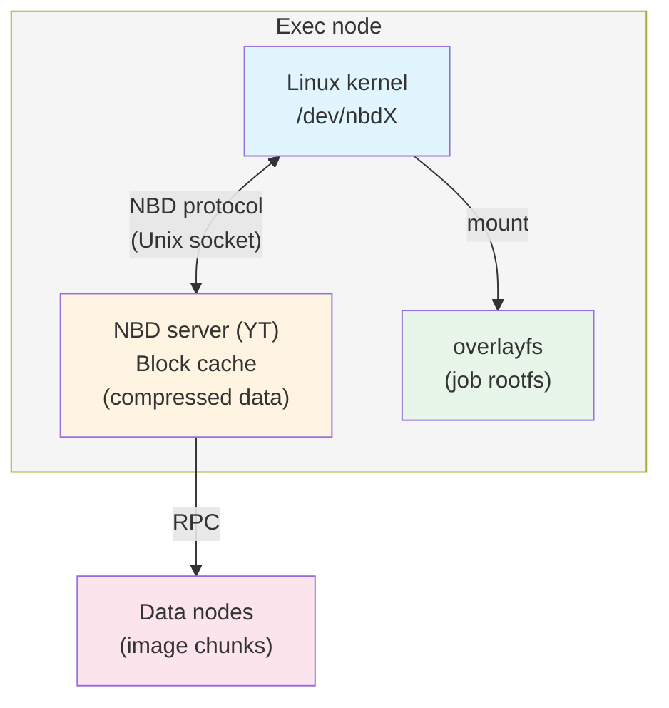

# NBD on the {{product-name}} cluster

This document describes how to configure and use NBD (Network Block Device) on the {{product-name}} cluster. NBD lets you mount filesystem images from Cypress as layers of a job’s root filesystem. This speeds up environment setup, reduces disk load, and, under some conditions, network load.

## How NBD works { #how-it-works }

NBD (Network Block Device) is a Linux kernel mechanism that lets you mount block devices whose data is stored remotely. In {{product-name}}, NBD is used to mount SquashFS filesystem images from Cypress as layers of a job’s root filesystem.

### Architecture { #architecture }

An NBD server runs on each exec node. It’s a {{product-name}} component that implements the NBD protocol over a Unix Domain Socket or TCP. Here’s how it works:



Sequence of events when preparing an NBD layer:

- The exec node receives a task with `layer_paths` that includes an NBD layer.
- YT downloads the image chunk metadata, not the data itself.
- The NBD server registers an export for the image.
- The Linux kernel mounts `/dev/nbdX` to the export via a Unix Domain Socket.
- Porto mounts `/dev/nbdX` as a layer in overlayfs.
- When the job accesses a file, the kernel reads the needed blocks through `/dev/nbdX` → NBD server → data nodes.

### Block cache { #block-cache }

The NBD server maintains an in-memory LRU block cache to store compressed chunk data. The cache helps avoid repeated requests to data nodes when different jobs read the same blocks. You configure the cache size with the `block_cache_compressed_data_capacity` parameter.

### Volume cache { #volume-cache }

The exec node caches read-only (RO) NBD volumes, which are mounted images. If multiple jobs use the same NBD layer on one exec node, the system creates the volume once and reuses it. Cache metrics: `exec_node/ronbd_volume_cache/missed_count`, `exec_node/ronbd_volume_cache/hit_count`.

### Installing packages { #packages }

Install these packages to work with NBD and SquashFS:

```bash
sudo apt install nbd-client squashfs-tools
```

- `nbd-client` — a utility for manually mounting NBD devices. You use it for diagnostics: the {{product-name}} NBD server is built into the exec node, and in normal operation the kernel connects to it directly.
- `squashfs-tools` — utilities `mksquashfs` and `unsquashfs` for building and checking SquashFS images.

To convert existing tar layers to SquashFS, also install `squashfs-tools-ng` with the `tar2sqfs` utility:

```bash
sudo apt install squashfs-tools-ng
```

Verify the installation:

```bash
nbd-client --version
# This is nbd-client, from nbd 3.26.1

mksquashfs -version
# mksquashfs version 4.6.1 (2023/03/25)
```

### The nbd kernel module { #kernel-module }

You need to load the `nbd` kernel module for NBD to work. The `nbds_max` parameter defines how many NBD devices the kernel creates when loading the module. You can create and delete NBD devices dynamically.

Manually load the module:

```bash
modprobe nbd nbds_max=1024
```

For automatic loading after reboot, we recommend:

Create the `/etc/modules-load.d/nbd.conf` file:

```ini
nbd
```

Create the `/etc/modprobe.d/nbd.conf` file:

```ini
options nbd nbds_max=1024
```



The `nbd` module must load automatically after the host reboots. Without this, the exec node won’t be able to create NBD devices after a reboot.



Check that the module is loaded:

```bash
lsmod | grep nbd
# nbd                    49152  0
cat /sys/module/nbd/parameters/nbds_max
# 128
```

We recommend setting `nbds_max` to at least the number of job slots on the node multiplied by the maximum number of NBD layers in one job. For example, for 32 slots and 2 NBD layers per job: `nbds_max=128`. Devices can be created dynamically, so the value doesn’t limit operation. But having a pre-created reserve reduces overhead for device creation under load.

## Configuring NBD { #configuration }

You configure NBD through the exec node’s dynamic config. All parameters are in the `exec_node/nbd` section.

### Enabling NBD { #enable }

```yaml
exec_node:
  nbd:
    enabled: true
```



After you enable NBD, the exec node starts the NBD server at boot. Changing `enabled` requires restarting the node.



### Full config example { #full-config }

```yaml
exec_node:
  nbd:
    enabled: true
    block_cache_compressed_data_capacity: 536870912  # 512 MB
    client:
      io_timeout: 30000          # 30 seconds, in milliseconds
      reconnect_timeout: 5000    # 5 seconds, in milliseconds
      connection_count: 1
    server:
      thread_count: 2
      unix_domain_socket:
        path: /tmp/nbd.sock
```

### Config parameters { #config-params }

#|
|| **Parameter** | **Type** | **Default** | **Description** ||
|| `exec_node/nbd/enabled` | `bool` | `false` | Enables or disables NBD on the exec node. When `enabled: true`, the system starts the NBD server at node boot. ||
|| `exec_node/nbd/block_cache_compressed_data_capacity` | `int64`, bytes | `0` — cache disabled | Size of the compressed data block cache in bytes. The cache is stored in the exec node’s memory, and the system uses it to cache chunk blocks read from data nodes. Recommended value: from 512 MB to 4 GB, depending on available memory and load. ||
|| `exec_node/nbd/client/io_timeout` | `duration`, ms | `30000` — 30 seconds | Timeout for waiting for a response to an NBD read request. If the timeout is exceeded, the system aborts the job with `abort_reason=NbdError`. ||
|| `exec_node/nbd/client/reconnect_timeout` | `duration`, ms | `5000` — 5 seconds | Timeout for the NBD client to reconnect to the NBD server after a connection drop. ||
|| `exec_node/nbd/client/connection_count` | `int` | `1` | Number of connections the NBD client makes to the NBD server per device. ||
|| `exec_node/nbd/server/thread_count` | `int` | `2` | Number of NBD server threads. We recommend a value of 2–4. ||
|| `exec_node/nbd/server/unix_domain_socket/path` | `string` | — | Path to the Unix Domain Socket that the Linux kernel uses to connect to the NBD server. This must be unique for each exec node. ||
|| `exec_node/nbd/server/internet_domain_socket/port` | `int` | — | TCP socket port for the NBD server. The system uses this instead of a Unix Domain Socket if you need network access to the NBD server. ||
|#



### Configuring with ytdyncfgen { #ytdyncfgen }

On internal clusters, the exec nodes’ dynamic config is managed with `ytdyncfgen`. To enable NBD, add this to the cluster config:

```yaml
exec_node:
  nbd:
    enabled: true
    block_cache_compressed_data_capacity: 536870912
    client:
      io_timeout: 30000
    server:
      thread_count: 2
      unix_domain_socket:
        path: /tmp/nbd.sock
```



## Checking health { #health-check }

### Checking node status { #node-state }

After enabling NBD, make sure the exec node is in the `online` state and has no alerts:

```bash
yt get //sys/exec_nodes/<node-address>/@state
# "online"

yt get //sys/exec_nodes/<node-address>/@alerts
# []
```

### Checking with a test operation { #test-operation }

Run a test operation with an NBD layer:

```python
import yt.wrapper as yt

# Create a test SquashFS image and upload it to Cypress
# yt set //path/to/layer.squashfs/@filesystem squashfs
# yt set //path/to/layer.squashfs/@access_method nbd

yt.run_map(
    lambda row: row,
    source_table="//tmp/test_input",
    destination_table="//tmp/test_output",
    spec={
        "mapper": {
            "layer_paths": ["//path/to/layer.squashfs"],
        }
    }
)
```

### Checking via logs { #logs }

When the NBD server starts successfully, you’ll see these entries in the exec node logs (`exec-node.info.log`):

```text
NBD server started (UnixDomainSocket: /tmp/nbd.sock, ThreadCount: 2)
```

When an NBD device is created:

```text
Creating NBD device (FilePath: //path/to/layer.squashfs, DeviceName: /dev/nbd0)
NBD device created (FilePath: //path/to/layer.squashfs, DeviceName: /dev/nbd0)
```

## Monitoring { #monitoring }



### Dashboards { #dashboards }

- [General NBD dashboard](https://monitoring.yandex-team.ru/projects/yt/dashboards/all-nbd) — NBD metrics for all clusters.
- [Dashboard for tasklets](https://monitoring.yandex-team.ru/projects/yt/dashboards/tasklets-nbd) — NBD metrics for tasklets.
- [Dashboard for self‑driving vehicles](https://monitoring.yandex-team.ru/projects/yt/dashboards/selfdriving-nbd) — NBD metrics for self‑driving vehicles.



### Solomon sensors { #sensors }

The system exports all NBD metrics to Solomon. Key sensors:

Server metrics:

#|
|| **Sensor** | **Description** ||
|| `nbd/server/count` | Shows the current number of NBD servers ||
|| `nbd/server/created` | Shows the number of created NBD servers ||
|#

Device metrics. The `file_path` tag is the path to the layer file in Cypress:

#|
|| **Sensor** | **Description** ||
|| `nbd/device/count` | Shows the current number of active NBD devices ||
|| `nbd/device/created` | Shows the number of created devices ||
|| `nbd/device/removed` | Shows the number of removed devices ||
|| `nbd/device/registered` | Shows the number of devices registered with the NBD server ||
|| `nbd/device/unregistered` | Shows the number of devices unregistered ||
|| `nbd/device/read_count` | Shows the number of read requests ||
|| `nbd/device/read_bytes` | Shows the number of bytes read ||
|| `nbd/device/read_time` | Shows the read time, histogram ||
|| `nbd/device/read_block_bytes_from_cache` | Shows the number of bytes read from the block cache ||
|| `nbd/device/read_block_bytes_from_disk` | Shows the number of bytes read from data nodes ||
|#

Volume metrics. Tags: `type=nbd`, `file_path`:

#|
|| **Sensor** | **Description** ||
|| `volumes/count` | Shows the current number of volumes ||
|| `volumes/created` | Shows the number of created volumes ||
|| `volumes/create_errors` | Shows the number of volume creation errors ||
|| `volumes/create_time` | Shows the volume creation time, histogram ||
|| `volumes/removed` | Shows the number of removed volumes ||
|| `volumes/remove_time` | Shows the volume removal time, histogram ||
|#

Volume cache metrics:

#|
|| **Sensor** | **Description** ||
|| `exec_node/ronbd_volume_cache/missed_count` | Shows the number of cache misses for RO NBD volumes ||
|| `exec_node/ronbd_volume_cache/hit_count` | Shows the number of cache hits. Tag: `hit_type=sync\|async` ||
|| `exec_node/squashfs_volume_cache/missed_count` | Shows the number of cache misses for SquashFS volumes ||
|| `exec_node/squashfs_volume_cache/hit_count` | Shows the number of cache hits for SquashFS volumes ||
|#

### Key metrics for monitoring { #key-metrics }

#|
|| **Metric** | **Description** ||
|| `nbd/device/read_block_bytes_from_cache` vs `nbd/device/read_block_bytes_from_disk` | Shows the block cache efficiency. If most data is read from disk, increase `block_cache_compressed_data_capacity` ||
|| `volumes/create_errors` | Shows issues with mounting NBD layers. A non‑zero value indicates errors ||
|| `exec_node/ronbd_volume_cache/missed_count` | Shows the volume cache efficiency. A high value when repeatedly launching the same layers may indicate volume cache issues ||
|#

## Error handling { #error-handling }



Cause: a read error from an NBD device during job execution. The job is aborted with `abort_reason=NbdError`. Typical causes:

- A connection drop between the NBD server and the data node.
- Exceeding `io_timeout`.
- The data node storing the image chunks is unavailable.

Behavior: the job is automatically aborted and restarted. If errors repeat across several attempts, the operation ends with an error.

Diagnostics: in the exec node logs, look for entries with `NbdError` or `NBD read failed`. Check the availability of data nodes and the network status.





Cause: an error mounting the layer during the job’s root filesystem preparation. Typical causes:

- A corrupted layer image.
- An incorrect filesystem type — `@filesystem`.
- The NBD server is not running or not configured.
- The `nbd` kernel module is not loaded.
- The kernel failed to prepare the NBD device. For more details, see the section [NBD device access errors](#troubleshooting).

Diagnostics: check the exec node logs and the kernel module status:

```bash
lsmod | grep nbd
dmesg | grep nbd
```





Cause: an attempt to use an NBD layer on an exec node where NBD is not enabled or the NBD server hasn’t started.

Solution: enable NBD in the dynamic config — `exec_node/nbd/enabled: true` — and ensure the NBD server has started successfully.



### Diagnostics via Orchid { #orchid }

You can check the NBD server status via the exec node Orchid:

```bash
yt get //sys/exec_nodes/<node-address>/orchid/exec_node
```

## Common issues and solutions { #troubleshooting }



Symptom: after rebooting the host, jobs with NBD layers fail with the `RootVolumePreparationFailed` error.

Cause: the `nbd` kernel module isn’t loaded automatically.

Solution: configure the module to load at startup. For more details, see the section [NBD kernel module](#kernel-module).





Symptom: the first file accesses in an NBD layer are slow.

Cause: data is read from data nodes, and the block cache is empty.

Solution:

- Increase `block_cache_compressed_data_capacity`.
- Store layers on SSD — use the `primary_medium=ssd_blobs` attribute.
- Increase the layer’s `replication_factor`.





Symptom: jobs are regularly aborted with `abort_reason=NbdError`.

Cause: unstable network or overloaded data nodes.

Solution:

- Increase `io_timeout`.
- Check the status of data nodes and the network.
- Ensure layers are stored on SSD with a sufficient `replication_factor`.





Symptom: errors like `No such device` or `Failed to open /dev/nbdX` appear in the logs.

Cause: the kernel failed to create an NBD device. This is usually due to an outdated kernel without support for dynamic device creation or a lack of system resources.

Solution: increase the number of devices created when loading the module:

```bash
modprobe nbd nbds_max=256
```

If the issue persists, check the kernel version and the output of `dmesg | grep nbd`.




<style>
.dc-mini-toc__section_child {
    display: none;
}

@media screen and (max-width: 768px) {
    .dc-doc-page__content-mini-toc ul li ul {
        display: none;
    }
}
</style>
