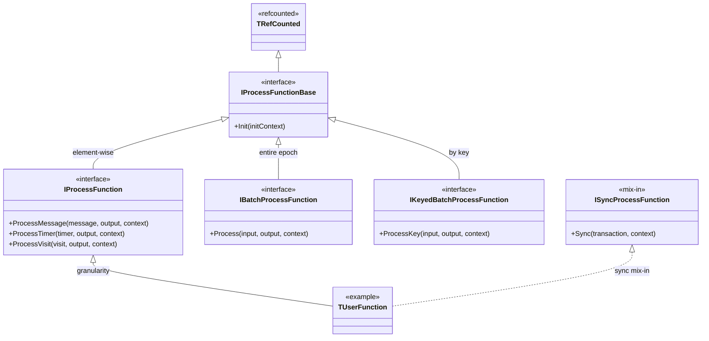

# Process function in {{product-name}} Flow (C++)

## Why you need it

The classic way to write a [Computation](../../../flow/concepts/computation.md) in C++ is to inherit from `TTransformComputation` (or `TSwiftMapComputation` / `TSwiftOrderedSourceComputation`) and override the `DoProcessMessage`, `DoProcessTimer`, `DoProcessVisit`, and `DoInit` methods. In this approach, your custom logic becomes tightly coupled with the `Computation` object: it inherits dozens of protected methods and can only be constructed from a fully built `TComputationContext` (which includes {{product-name}} clients, stores, the state manager, and so on). As a result, it’s nearly impossible to test this logic in isolation with unit tests.

A process function moves your custom logic into a separate, lightweight object. This object receives its dependencies (`IOutputCollector`, `IRuntimeContext`) as narrow interfaces and doesn’t depend on the `Computation` object itself. This lets you test the function in isolation with unit tests.

## How it works {#how-it-works}

The process function isn’t run directly. Instead, a built-in `Computation` adapter executes it. You specify this adapter in the spec via the `computation_class_name` field (see [Registration](#registration)). The adapter gives the function the same environment as a regular `Computation`: the same spec, the same stores and states, and the same epoch-processing logic. That’s why a pipeline with a process function provides the same [processing guarantees](../../../flow/concepts/guarantees.md) (including exactly-once) as a manually written `Computation`.

The adapter also defines the function’s execution mode. There are four built-in adapters:

| `computation_class_name` | Mode |
| --- | --- |
| `NYT::NFlow::TProcessFunctionComputation` | transform |
| `NYT::NFlow::TProcessFunctionSwiftMapComputation` | swift-map |
| `NYT::NFlow::TProcessFunctionSourceComputation` | source |
| `NYT::NFlow::TProcessFunctionTransformOrderedSourceComputation` | [ordered source with output materialization and state](../../../flow/cpp/computation.md#ttransformorderedsourcecomputation) |

You can run the same function under different adapters without rebuilding the binary.

## Interfaces

The library is `library/cpp/common` (`common/process_function.h`). The function’s methods mirror the worker’s `Do*` methods. The function selects **one** processing granularity by inheriting the corresponding interface. The spec determines which `Computation` (source, swift map, or transform) the function attaches to (see [Registration](#registration)). The base `IProcessFunctionBase` only includes `Init(initContext)` — initialization at the start of an [epoch](../../../flow/concepts/glossary.md#epoch) (analogous to `TTransformComputation::DoInit`). By default, this is a no-op. The granularity interfaces add the actual processing methods.

Choose the interface based on how you want to process the epoch’s input: one entity at a time, the entire batch at once, or by key. Then override only the methods you need. The worker will call them with the same states and exactly-once semantics as a regular `Computation`.

The function inherits one granularity interface and, if needed, the `ISyncProcessFunction` mix-in:



- `IProcessFunction` — element-wise processing (the most common case). The worker calls a method for each entity in the epoch (similar to `TTransformComputation::DoProcessMessage`, etc.). Override the methods you need; all are no-op by default:
    - `ProcessMessage(message, output, context)` — handles a single message.
    - `ProcessTimer(timer, output, context)` — handles a single [timer](../../../flow/concepts/glossary.md#timer).
    - `ProcessVisit(visit, output, context)` — handles a single visit.

    In source mode, only messages arrive, so `ProcessTimer` and `ProcessVisit` aren’t called.
- `IBatchProcessFunction` — processes the entire epoch input in a single call (similar to `TTransformComputation::DoProcess`). Override `Process(input, output, context)` when your logic works with the whole batch at once (for example, a single batched external request). The input isn’t grouped by key.
- `IKeyedBatchProcessFunction` — processes by key using group-by, for keyed modes (swift map and transform). The worker groups the epoch’s input by key and calls `ProcessKey` for each key:
    - `ProcessKey(input, output, context)` — handles all input for a single key (messages, timers, and visits together; similar to `TTransformComputation::DoProcessKey`). It’s no-op by default. Override it when your logic relies on the entire key batch at once (for example, to reconcile messages and timers via the key’s shared state).
- `ISyncProcessFunction` — an optional mix-in for functions that commit side effects in a separate sync phase at the end of the epoch. You inherit it in addition to the granularity interface:
    - `Sync(transaction, context)` — commits side effects in the `transaction` (similar to `TTransformComputation::DoSync`). The `context` gives access to runtime accessors. You must implement this method. It’s called only by a `Computation` adapter that has a sync phase — among the built-in adapters, that’s `TProcessFunctionComputation` (transform). The spec validation checks this match: you can’t attach a function with `Sync` to a `Computation` without a sync phase.

In `Process` (`IBatchProcessFunction`) and `ProcessKey`, the `output` doesn’t have parent messages set — you must set them yourself via `output->SetParents(...)`. In the element-wise methods of `IProcessFunction` (`ProcessMessage`, `ProcessTimer`, `ProcessVisit`), they’re already set for the corresponding entity.

The `distribute` flag in `output->AddMessage(message, distribute)` mirrors the `OutputCollector` semantics in `Computation`: for source, a message with `distribute = false` isn’t published but is still considered when evaluating the [watermark](../../../flow/concepts/glossary.md#timestamps-and-watermarks); for other `Computation` types, a message with `distribute = false` is simply discarded.



A process function is `TRefCounted`, so you must always create it via `New<...>()`.



## IRuntimeContext

`context` (of type `IRuntimeContext`, `common/runtime_context.h`) is an interface that collects everything a `Computation` usually reads from `this`:

| Method | Description |
| --- | --- |
| `GetWatermark(streamId)` / `GetInputEventWatermark()` | Event-time [watermarks](../../../flow/concepts/glossary.md#timestamps-and-watermarks) |
| `GetSpec()` / `GetStreamSpecs()` / `GetKeySchema()` | Spec and stream schemas |
| `MakeOutputMessageBuilder(streamId)` | Output message builder |
| `ConvertToOutputMessage(message, streamId)` | Converts a message to the output stream’s schema |
| `ConvertToMessage(ysonMessage)` | `TYsonMessage` → `TMessage` |
| `ConvertToYsonMessage<T>(message)` | `TMessage` → typed `TYsonMessage` |
| `MakeTimer(key, streamId, trigger, event)` | Creates a [timer](../../../flow/concepts/glossary.md#timer) |
| `GetThrottlerOrThrow(throttlerId)` | Gets a distributed throttler |
| `TryGetThrottler(throttlerId)` | Same, but returns `nullptr` if the throttler is not declared |

## States

States work the same way as in `Computation`: typed clients (`TMutableStateKeyClient<T>` and others) are stored as function fields and initialized in `Init` via `IRuntimeInitContext` (`common/runtime_init_context.h`), which mirrors the `IJobInitContext` API:

```cpp
void Init(const IRuntimeInitContextPtr& initContext) override
{
    initContext->InitExternalStateClient(StateClient_, "/state");
    // or: initContext->InitClient<TMyState>(Client_, "my-state");
}
```

For more details on state types, see the [Working with states](../../../flow/cpp/state.md) section.

## Parameters {#parameters}

A function can declare its own parameter structure — a regular `TYsonStruct` — and read it in a typed way. You pass parameters in the `processing_function_parameters` field at the top level of the `Computation` spec (next to `processing_function`):

- Static — `processing_function_parameters` in `spec`, read once in `Init` via `initContext->GetParameters<T>()`.
- Dynamic — `processing_function_parameters` in `dynamic_spec`, read via `context->GetDynamicParameters<T>()` and reflect the latest reconfiguration.

If the `processing_function_parameters` field is missing, the structure is filled with default values. `GetDynamicParameters<T>()` caches the result and reparses the node only when it changes (that is, on reconfiguration).

You specify parameter types when registering the function via macro arguments: `YT_FLOW_DEFINE_PROCESS_FUNCTION(function, TStaticParams)` for the static block, `YT_FLOW_DEFINE_PROCESS_FUNCTION(function, TStaticParams, TDynamicParams)` also for the dynamic one. Then the corresponding `processing_function_parameters` block (in `spec` and `dynamic_spec`) is validated against the schema when loading the spec, just like `parameters` for `Computation`: an unknown field or incorrect type causes an error before the run. A block for which you didn’t declare a type (including for a parameterless `YT_FLOW_DEFINE_PROCESS_FUNCTION(function)`) is treated as empty — any passed field will be rejected.

```cpp
struct TMyParameters
    : public NYTree::TYsonStruct
{
    i64 Threshold;

    REGISTER_YSON_STRUCT(TMyParameters);

    static void Register(TRegistrar registrar)
    {
        registrar.Parameter("threshold", &TThis::Threshold).Default(0);
    }
};

void Init(const IRuntimeInitContextPtr& initContext) override
{
    Threshold_ = initContext->GetParameters<TMyParameters>()->Threshold;
}

void ProcessMessage(const TInputMessageConstPtr& message, const IOutputCollectorPtr& output, const IRuntimeContextPtr& context) override
{
    auto currentThreshold = context->GetDynamicParameters<TMyParameters>()->Threshold;
    // ...
}

// Registering with a parameter type enables validation in the spec.
YT_FLOW_DEFINE_PROCESS_FUNCTION(TMyFunction, TMyParameters);
```

In the spec:

```yson
"counter" = {
    "computation_class_name" = "NYT::NFlow::TProcessFunctionComputation";
    "processing_function" = "NYT::NFlow::NExample::TWordCountFunction";
    "processing_function_parameters" = {
        "threshold" = 5;
    };
};
```

In unit tests, set static parameters via `TTestStateEnvironment::SetStaticParameters(...)`, and dynamic ones via `TTestRuntimeContextBuilder().SetDynamicParameters(...)`.

## Registration {#registration}

You link the function and `Computation` via the spec. Register the function with a single macro from `common/registry.h` (in the same `TRegistry` as computation / source / sink) under its `TypeName`; the optional second argument is the type of its parameters (see [Parameters](#parameters)):

```cpp
YT_FLOW_DEFINE_PROCESS_FUNCTION(TWordCountFunction);                   // no parameters
YT_FLOW_DEFINE_PROCESS_FUNCTION(TTextReadFunction, TTextReaderParameters);  // with parameters
```

In the `Computation` spec, the `computation_class_name` field points to the built-in `Computation` adapter (which also sets the mode — see the [list of adapters](#how-it-works)), and the adjacent `processing_function` field names the function:

```yson
"counter" = {
    "computation_class_name" = "NYT::NFlow::TProcessFunctionComputation";
    "processing_function" = "NYT::NFlow::NExample::TWordCountFunction";
};
```

## Testing

The `library/cpp/process_function/testing` library provides a ready-made set of utilities for unit tests with sensible defaults (all its utilities live in the separate `NYT::NFlow::NTesting` namespace to keep test code separate from production):

- `TRecordingOutputCollector` — an `IOutputCollector` that records messages and timers in vectors (`GetMessages()` / `GetTimers()`).
- `TTestRuntimeContextBuilder` — builds an `IRuntimeContext`; by default, it uses zero watermarks, one output stream for each registered `RegisterStream<T>(id)`, and the key schema `DefaultTestKeySchema()`.
- `TTestStateEnvironment` — starts a `TJobStateManager` over in-memory mock tables and provides an `IRuntimeInitContext`; `PreloadKeyStates(inputContext)` loads keys before processing, and `ReadKeyState<T>(name, key)` reads the state afterward.
- `entity_builders.h` — `MakeTestMessage`, `MakeTestRawMessage`, `MakeTestTimer`, `MakeTestVisit`.
- `TProcessFunctionTestHarness` — runs the function across epochs like a worker does: it wraps the function as batch (via `WrapAsBatch`, so per-element, whole-batch, and per-key forms all work the same way, and timers and visits are dispatched alongside messages), calls `Init` once, and for each `RunEpoch(...)` it preloads the state, processes the input, executes the end-of-epoch `Sync` for `ISyncProcessFunction`, and commits the state. You can access the last epoch’s messages and timers via `GetMessages()` / `GetTimers()`.

The umbrella header `process_function/testing/unittest.h` includes all the listed utilities; in a test, you only need to include it instead of the individual harness headers.

`TTestStateEnvironment` covers all state types the function uses:

- Internal (`InitClient`) — work directly via `TJobStateManager` over in-memory tables; the function writes them and reads them back via `ReadKeyState<T>(name, key)`.
- External managers (`InitExternalStateClient` with `TMutableStateKeyClient<T>`) — register via `RegisterExternalState(name, ...)`; there’s a ready-made in-memory `TInMemorySimpleExternalStateManager` for `TSimpleExternalState`, and you can read the result via `ReadExternalKeyState<T>(name, key)`.
- External joiners (`InitExternalStateClient` with `TJoinedStateKeyClient<T>`) — register via `RegisterExternalStateJoiner(name, ...)`; the in-memory `TInMemorySimpleExternalStateJoiner` is seeded via `GetMutableState(key)` before the function starts.
- Internal joiners of another computation’s state (`InitClient` with `TJoinedStateKeyClient<T>`) — register via `RegisterStateJoiner(name, stateName)`; in a single environment, you can run a producer function (it writes the state), call `Sync()`, and then run a joiner function that reads it.

`RegisterExternalState` / `RegisterExternalStateJoiner` also accept an arbitrary `IExternalStateManagerPtr` / `IExternalStateJoinerPtr` — this way, you connect a real manager built over a {{product-name}} mock client in the test. For BigRT profiles, there are ready-made wrappers; see [Serializable Profile](#profile-testing).

Example of a test for a row function with state:

```cpp
TTestStateEnvironment stateEnv;
auto context = TTestRuntimeContextBuilder().Build();
auto output = New<TRecordingOutputCollector>();

auto function = New<TCountingRowFunction>();
function->Init(stateEnv.GetInitContext());

auto key = MakeKey<ui64>(7);
auto message = MakeTestMessage("input", key, New<NTableClient::TTableSchema>());
stateEnv.PreloadKeyStates(New<TInputContext>(
    std::vector<TInputMessageConstPtr>{message},
    std::vector<TInputTimerConstPtr>{}));

function->ProcessMessage(message, output, context);

EXPECT_EQ(stateEnv.ReadKeyState<i64>("counter", key), 1);
```

The same test using `TProcessFunctionTestHarness`, which hides `Init`, preload, context/output setup, and epoch commit (full example — [queue_reduce/unittest]({{source-root}}/yt/yt/flow/yandex/extensions/bigrt/examples/queue_reduce/unittest/queue_reduce_functions_ut.cpp)):

```cpp
TTestStateEnvironment stateEnv;
TProcessFunctionTestHarness harness(stateEnv, New<TCountingRowFunction>());

auto key = MakeKey<ui64>(7);
harness.RunEpoch({MakeTestMessage("input", key, New<NTableClient::TTableSchema>())});

EXPECT_EQ(stateEnv.ReadKeyState<i64>("counter", key), 1);
```



### Serializable Profile {#profile-testing}

If a function’s external state is stored in [Serializable Profile](../../../flow/cpp/state.md#profile-manager) format (`TProfileManager<TProfile>` / `TProfileJoiner<TProfile>`), the `yandex/extensions/bigrt/cpp/serializable_profile/testing` library (namespace `NYT::NFlow::NBigRTExtensions::NTesting`) starts a real manager or joiner over an in-memory {{product-name}} mock client. The mock table schema is derived automatically from `TProfile::RemoteTableSchema()`; you don’t need to write it manually.

- `TTestProfileManager<TProfile>` — a wrapper around `TProfileManager<TProfile>`. `Create(env, {.KeySchema = ...})` registers the manager in `TTestStateEnvironment` (call this before the function’s `Init`). Then, for the epoch lifecycle: `PreloadKeyStates({key})` loads keys (reading a non-preloaded key throws an exception), `GetState(key)` returns a mutable accessor for seeding or checking, `Commit()` flushes changes to the mock table, and `ReadKeyState(key)` re-reads the state via a fresh manager.
- `TTestProfileJoiner<TProfile>` — a read-only analog over `TProfileJoiner<TProfile>`: `Seed(key, fill)` populates the reference profile, and `PreloadKeyStates({key})` is called before the function reads it.

The profile type must be registered in the test binary — the manager and joiner resolve their parameters via the registry:

```cpp
YT_FLOW_DEFINE_EXTERNAL_STATE_MANAGER(NYT::NFlow::NBigRTExtensions::TProfileManager<TMyProfile>);
```

For `TTestProfileJoiner::Seed`, which writes via the internal manager, you need both the joiner and manager registrations.

Example of a test for a function with Serializable Profile state — a full, compilable test for `TProfileCountingFunction` (increment `SimpleColumn` of the `TTestProfile` profile for each message). `TProcessFunctionTestHarness` handles the preload and epoch commit; the test only needs to `Create` the manager and use `ReadKeyState` for verification:



Another full test example — [queue_reduce/unittest]({{source-root}}/yt/yt/flow/yandex/extensions/bigrt/examples/queue_reduce/unittest/queue_reduce_functions_ut.cpp).



For more details on the general approach to testing C++ computations, see the [Testing](../../../flow/cpp/testing.md) section.

## Example

Full example — [examples/cpp/word_count]({{source-root}}/yt/yt/flow/examples/cpp/word_count) (both classes are `IProcessFunction` in the `NYT::NFlow::NExample` namespace, registered via `YT_FLOW_DEFINE_PROCESS_FUNCTION`). In `pipeline.yson`, `TTextReadFunction` is connected to `TProcessFunctionSourceComputation`, and `TWordCountFunction` is connected to `TProcessFunctionComputation` via `processing_function`; `TTextReadFunction` reads its static `min_word_length` parameter from `processing_function_parameters`. A more complex example with timers and window-based joining is [examples/cpp/wait_click_join]({{source-root}}/yt/yt/flow/examples/cpp/wait_click_join).

## See also

- [Computation (C++)](../../../flow/cpp/computation.md)
- [Working with states (C++)](../../../flow/cpp/state.md)
- [Testing (C++)](../../../flow/cpp/testing.md)
- [Quick start (C++)](../../../flow/cpp/getting-started.md)