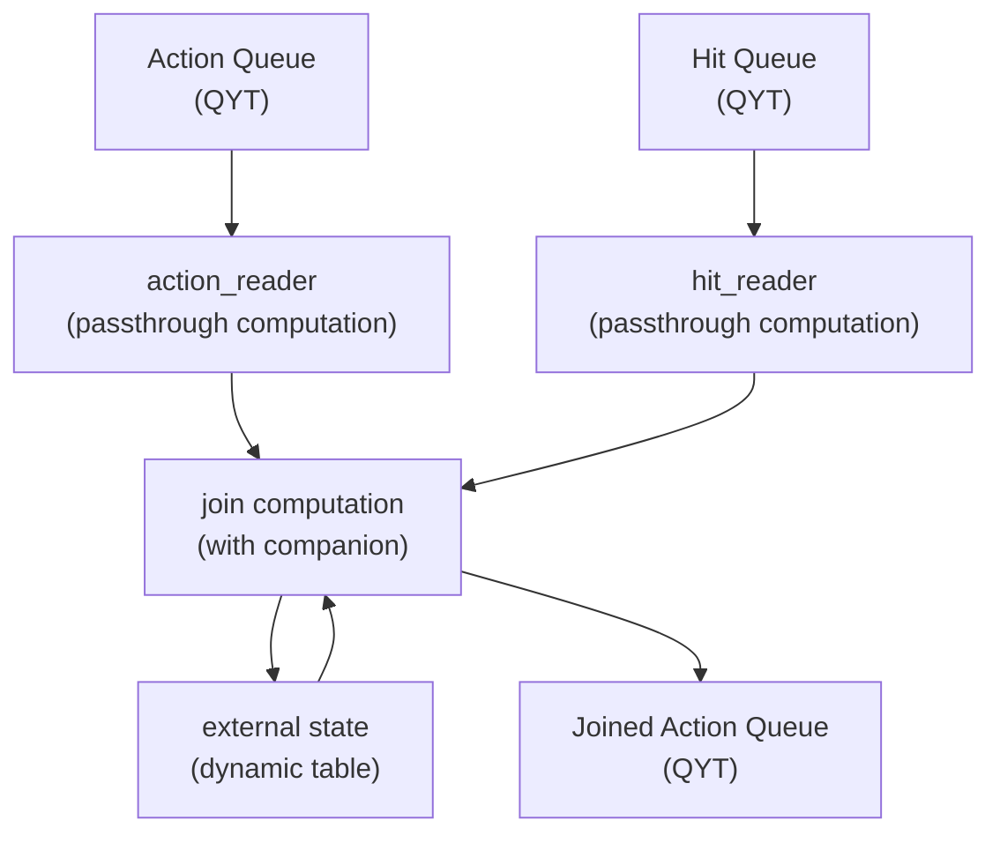

# Wait Click Join in {{product-name}} Flow (Java)

The [pipeline](../../../../flow/concepts/glossary.md#pipeline) performs a join of [streams](../../../../flow/concepts/glossary.md#stream-and-computation) of hits and actions within a time window. For each hit, the system waits for related actions (show, click) within a specified time interval, then generates a merged event.

[Source code (Java)]({{source-root}}/yt/yt/flow/examples/java/wait_click_join)

[Source code (Kotlin)]({{source-root}}/yt/yt/flow/examples/kotlin/wait_click_join)
For a detailed description of the task and join logic, see the [C++ version description](../../../../flow/cpp/examples/wait_click_join.md).

## Problem statement {#problem-statement}

You have a system with three types of events:
- **hit** — a user request event. It contains `hit_id`, `hit_time`, and `hit_payload`.
- **action show** — an event indicating that the user saw the response. It contains `hit_id`, `hit_time`, `action_time`, and `is_click = false`.
- **action click** — an event indicating that the user clicked the response. It contains `hit_id`, `hit_time`, `action_time`, and `is_click = true`.

Data arrives in two streams: `hit` and `action`.

The output produces a join: for each show, you attach information about whether a click occurred and the `hit_payload` from the hit. Hits without shows are ignored. The system waits for action events for `wait_for_actions` seconds after `hit_time`.

## Data flow diagram {#data-flow}



## JoinProcessFunction

The core pipeline logic is implemented in `JoinProcessFunction`, which processes two streams — `hit` and `action`:



- Java

  

- Kotlin

  



## Key patterns

### Late data filtering {#late-data-check}



- Java

  

- Kotlin

  



Messages that arrive with an event time less than the current [watermark](../../../../flow/concepts/glossary.md#timestamps-and-watermarks) are considered late and are ignored. For more details about watermarks, see the [Watermarks & Timers](../../../../flow/concepts/watermarks.md) section.

### [Timers](../../../../flow/concepts/glossary.md#timer) for closing the window



- Java

  

- Kotlin

  



When you receive a hit, you set a timer for `hit_time + wait_for_actions`. The timer triggers when the watermark reaches `maxTime`, meaning the system is sure that all events with `event_time < maxTime` have been processed.

### ExternalStateAccessor with PayloadBuilder

The [state](../../../../flow/concepts/glossary.md#state) is stored in an external dynamic table. `PayloadBuilder` lets you update individual state fields without full re-serialization:



- Java

  

- Kotlin

  



### State cleanup

After the timer fires and the output event is generated, you clear the state using `stateAccessor.clear()` to avoid accumulating outdated profiles.

## Data models {#models}

POJO classes with JPA annotations are defined for typed message handling.



### Hit



- Java

  

- Kotlin

  



### Action



- Java

  

- Kotlin

  



### JoinedAction



- Java

  

- Kotlin

  



## Pipeline configuration (Spring) {#pipeline-configuration}

[Source code (Java)]({{source-root}}/yt/yt/flow/examples/java/wait_click_join/wait_click_join/src/main/java/tech/ytsaurus/flow/examples/waitclickjoin/PipelineConfiguration.java)

[Source code (Kotlin)]({{source-root}}/yt/yt/flow/examples/kotlin/wait_click_join/wait_click_join/src/main/kotlin/tech/ytsaurus/flow/examples/waitclickjoin/PipelineConfiguration.kt)
The example uses the [Spring Boot integration](../../../../flow/java/spring.md) for configuration. The `join` computation is registered with the `@FlowComputation` annotation on the `JoinProcessFunction` class:



- Java

  

- Kotlin

  



Typed streams are declared via `ComputationProvider` (the `getStreams()` method):



- Java

  

- Kotlin

  



Key points:
- The `join` computation (`JoinProcessFunction`) is registered with the `@FlowComputation(id = "join")` annotation.
- You register three typed streams: `hit`, `action`, and `joined_action`.
- Typed streams let you use `message.getPayload()` to retrieve POJO objects.

## Entry points {#entry-points}

### NodeCompanionMain



- Java

  

- Kotlin

  



### RunnerMain



- Java

  

- Kotlin

  



## Static spec {#static-spec}

### Computation join

```yson
"join" = {
    "computation_class_name" = "TJoin";
    "group_by_schema" = [
        {"name" = "hash"; "expression" = "farm_hash(hit_id)"; "type" = "uint64"};
        {"name" = "hit_id"; "type" = "string"};
        {"name" = "hit_time"; "type" = "uint64"};
    ];
    "input_stream_ids" = ["action"; "hit"];
    "output_stream_ids" = ["joined_action"];
    "external_state_managers" = {
        "/join-state" = {
            "external_state_manager_class_name" = "NYT::NFlow::TSimpleExternalStateManager";
            "parameters" = {
                "path" = "//path/to/state";
            };
        };
    };
    "parameters" = {
        "wait_for_actions" = "10s";
    };
    "timers" = {
        "timer" = {};
    };
};
```

- `group_by_schema` is the partitioning key: `(hash, hit_id, hit_time)`.
- `input_stream_ids` are two input streams: `action` and `hit`.
- `output_stream_ids` is one output stream: `joined_action`.
- `external_state_managers` is a top-level section that describes [External State](../../../../flow/java/external-state.md) (on the same level as `parameters`). The key (`"/join-state"`) is the state name that starts with `/`; you pass the same name to the `StateDescriptors.external("/join-state")` descriptor. `external_state_manager_class_name` is the registered manager class (`NYT::NFlow::TSimpleExternalStateManager` for the standard option). `parameters/path` is the path to the {{product-name}} dynamic table; the key column schema of the table must match `group_by_schema`.
- `parameters.wait_for_actions` is the time you wait for action events after a hit. You can access it in Java via `RuntimeContext.getComputationParameters()`.
- `timers.timer` declares the timer stream for closing hits.

## Testing {#testing}

[Test source code (Java)]({{source-root}}/yt/yt/flow/examples/java/wait_click_join/wait_click_join/src/test/java/tech/ytsaurus/flow/examples/waitclickjoin/JoinProcessFunctionTest.java)

[Test source code (Kotlin)]({{source-root}}/yt/yt/flow/examples/kotlin/wait_click_join/wait_click_join/src/test/kotlin/tech/ytsaurus/flow/examples/waitclickjoin/JoinProcessFunctionTest.kt)

You use `TestComputationHarness` for testing. It’s a test harness that lets you call `doProcess` without running the full pipeline.

### Set up the test environment



- Java

  

- Kotlin

  



### Test hit message processing



- Java

  

- Kotlin

  



### Test the full join flow



- Java

  

- Kotlin

  



The full test suite (9 scenarios) is in the [source code]({{source-root}}/yt/yt/flow/examples/java/wait_click_join/wait_click_join/src/test/java/tech/ytsaurus/flow/examples/waitclickjoin/JoinProcessFunctionTest.java).

## Integration testing {#integration-testing}

You run integration testing for Java pipelines the same way as for C++ pipelines: by launching the full pipeline, including C++ workers, queues, and streams. For details, see [Integration tests](../../../../flow/java/testing.md).

## Key ideas {#key-ideas}

1. **Time window**: The system waits for action events for `wait_for_actions` seconds after `hit_time`. You discard all events outside this window.

2. **Watermark for late data**: Events with `event_timestamp < watermark` are considered late and are discarded. This inevitably leads to some data loss, but it ensures watermark correctness.

3. **External State for data accumulation**: You store intermediate data (hit_payload, show_time, click_time) in External State, which is bound to the key `(hit_id, hit_time)`. In this case, you’re not limited to using only External State; an implementation with Internal State is also possible.

4. **Timer for closing the window**: A timer with `triggerTimestamp = hit_time + wait_for_actions` ensures result generation after the wait window closes.

5. **Idempotency of timers**: You set the timer on every message, but with the same `triggerTimestamp`. Flow deduplicates timers with the same key and `triggerTimestamp`.

6. **State cleanup**: After you generate the result, you clear the state via `stateAccessor.clear()`, which removes the row from the table.

