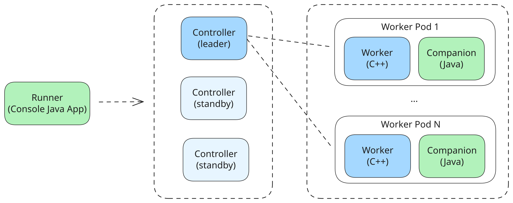

# Quick start with {{product-name}} Flow (Java)

You implement Java and Kotlin computations in Flow through the companion mechanism. Java or Kotlin code runs in a separate gRPC process that interacts with the C++ worker.

[Java SDK source code for Flow]({{source-root}}/yt/java/flow)

[Examples]({{source-root}}/yt/yt/flow/examples/java)

## Application architecture {#architecture}

Any Flow pipeline consists of three components:
- `Runner` — starts the pipeline and sets a new spec version.
- `Controller` — manages the pipeline’s operation.
- `Worker` — performs the actual data processing.

You use Java and Kotlin in the `Runner` and `Worker`.



## Two configuration approaches

The Java SDK for Flow (with Kotlin support) provides two approaches to configure a companion:

1. **Manual** (`PipelineContext` + `FlowApplication.run`) — suitable for simple cases where you don’t need dependency injection.
2. **Spring Boot** (auto-config with `@FlowComputation` annotations) — the recommended approach for production services with complex configuration and dependencies.

## Computation and SourceComputation

To create a computation in Java, choose the appropriate builder that matches the Computation type in C++:

- `Computation.builder()` — for `TTransformCompanionComputation` and `TSwiftMapCompanionComputation`.
- `SourceComputation.builder()` — for `TSwiftOrderedSourceCompanionComputation` and `TTransformOrderedSourceCompanionComputation`.



- Java

  ```java
  // SourceComputation for reading data from a source
  var reader = SourceComputation.builder()
         .setComputationId("reader")
         .build();

  // Computation for data processing
  var mapper = Computation.builder()
         .setComputationId("mapper")
         .setProcessFunction(new WordCountMapper())
         .build();
  ```

- Kotlin

  ```kotlin
  // SourceComputation for reading data from a source
  val reader = SourceComputation.builder()
         .setComputationId("reader")
         .build()

  // Computation for data processing
  val mapper = Computation.builder()
         .setComputationId("mapper")
         .setProcessFunction(WordCountMapper())
         .build()
  ```



`Computation.builder()` requires two mandatory parameters:
- **Computation id** — this maps requests between the worker and the companion.
- **Process function** — the function that contains the message-processing logic.

## Process Function

There are two types of ProcessFunction:

- `RowFunction` — receives messages and timers one at a time; it provides the `onMessage` and `onTimer` methods.
- `BatchFunction` — receives the entire batch of messages and timers; it provides the `onMessages` and `onTimers` methods.

For more details, see the [Computation (Java)](../../../flow/java/computation.md) section.

## Entry point {#entry-point}

Without Spring Boot, the pipeline entry point is a class whose `main` method calls `FlowApplication.run(args, context)`. With Spring Boot, the application `main` starts Spring, which configures Flow; see [Spring Boot integration](../../../flow/java/spring.md). The process chooses its role from `YT_FLOW_MODE`:

- When the variable is unset, the process runs as the **runner**: it enriches the pipeline spec and hands the launch to `flow_server`.
- With `YT_FLOW_MODE=Worker`, the process runs as a **companion**: it starts a gRPC server and handles worker requests. The worker sets this variable when it starts the companion.

Configure computations and streams in `main`, and add them to `PipelineContext`:



- Java

  ```java
  import tech.ytsaurus.flow.computation.Computation;
  import tech.ytsaurus.flow.context.PipelineContext;
  import tech.ytsaurus.flow.pipeline.FlowApplication;

  public class PipelineMain {
      public static void main(String[] args) throws Exception {
          var mapper = Computation.builder()
              .setComputationId("mapper")
              .setProcessFunction(new WordCountMapper())
              .build();

          var context = new PipelineContext();
          context.registerComputation(mapper);
          context.registerTypedStreams(Word.class);

          FlowApplication.run(args, context);
      }
  }
  ```

- Kotlin

  ```kotlin
  import tech.ytsaurus.flow.computation.Computation
  import tech.ytsaurus.flow.context.PipelineContext
  import tech.ytsaurus.flow.pipeline.FlowApplication

  object PipelineMain {
      @JvmStatic
      fun main(args: Array<String>) {
          val mapper = Computation.builder()
              .setComputationId("mapper")
              .setProcessFunction(WordCountMapper())
              .build()

          val context = PipelineContext()
          context.registerComputation(mapper)
          context.registerTypedStreams(Word::class.java)

          FlowApplication.run(args, context)
      }
  }
  ```



The runner needs `--config` for the pipeline config and `--flow-bin` for the `flow_server` binary:

```bash
./run.sh com.example.pipeline.PipelineMain --config pipeline.yson --flow-bin flow_server
```

Use the fully qualified class name: `run.sh` passes its first argument directly to `java`.

The runner fills in `spec.streams` from registered message types when the spec does not define those schemas explicitly. Set the `main_class` of the `TJavaCompanionManager` resource in the pipeline spec.

If your functions need extra resources, such as a dictionary or cache, create them in `main` and make them thread-safe.

### Spring Boot approach {#spring-boot-approach}

With Spring Boot, annotate the `mapper` process-function class with `@FlowComputation`. The passthrough `reader` source stays in the pipeline spec and is not registered in the Java companion:



- Java

  ```java
  @FlowComputation(id = "mapper")
  public class WordCountMapper implements RowFunction {
      @Override
      public void onMessage(ExtendedMessage message, OutputCollector output, RuntimeContext ctx) {
          // message processing
      }
  }
  ```

- Kotlin

  ```kotlin
  @FlowComputation(id = "mapper")
  class WordCountMapper : RowFunction {
      override fun onMessage(message: ExtendedMessage, output: OutputCollector, ctx: RuntimeContext) {
          // message processing
      }
  }
  ```



Declare typed streams on the message POJO with `@FlowMessage(streamIds = ...)`. The existing JPA `@Entity` annotation supplies the schema; Spring Boot discovers the class and registers its streams:



- Java

  ```java
  @Entity
  @FlowMessage(streamIds = {"words"})
  public class Word {
      // fields, constructors, getters, setters...
  }
  ```

- Kotlin

  ```kotlin
  @Entity
  @FlowMessage(streamIds = ["words"])
  class Word {
      // fields and constructors...
  }
  ```



The Spring Boot application has one entry point for both roles:



- Java

  ```java
  @SpringBootApplication
  public class WordCountApplication {
      public static void main(String[] args) {
          new SpringApplicationBuilder(WordCountApplication.class)
                  .run(args);
      }
  }
  ```

- Kotlin

  ```kotlin
  @SpringBootApplication
  open class WordCountApplication {
      companion object {
          @JvmStatic
          fun main(args: Array<String>) {
              SpringApplicationBuilder(WordCountApplication::class.java).run(*args)
          }
      }
  }
  ```



`getStreams()` remains available when you want to register typed [streams](../../../flow/concepts/glossary.md#stream-and-computation) with `FlowStreams.typed(...)` instead of annotations.

The `@SpringBootApplication` class needs no separate runner entry point. In runner mode, the starter collects the declared streams and launches the pipeline without starting the gRPC or monitoring servers, then exits.

## See also

- [Computation (Java)](../../../flow/java/computation.md)
- [Working with states (Java)](../../../flow/java/state.md)
- [Examples](../../../flow/java/examples/wordcount.md)
- [Spring Boot registration](../../../flow/java/spring.md)
- [Companion](../../../flow/concepts/companion.md)
