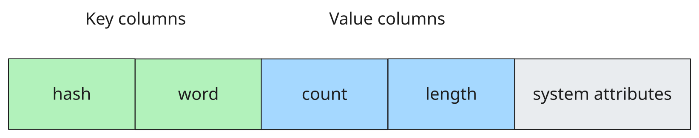

# StateAccessor in {{product-name}} Flow (Java)

StateAccessor is an interface for reading, modifying, and deleting state values. For general information about stateful processing, see the [Stateful processing](../../../flow/concepts/stateful.md) section.

## How it works {#how-it-works}

The [state](../../../flow/concepts/glossary.md#state) in Flow is stored in [sorted dynamic tables](../../../user-guide/dynamic-tables/sorted-dynamic-tables.md).
If you use [external state](../../../flow/java/external-state.md), you create this table. If you use [internal state](../../../flow/java/internal-state.md), Flow creates and manages these tables automatically.

For simplicity, the following description focuses on an example with external state.

You can think of each row in the state table as having two parts: key columns and value columns:



The key columns in the state table must match the `group_by_schema` of the [computation](../../../flow/concepts/glossary.md#stream-and-computation) that uses this state.

The value columns are available for reading and modifying through `StateAccessor`. The format in which you can read and modify these values in Java code depends on the `StateAccessor` implementation.

## Reading and writing data {#reading-and-writing-data}

The [worker](../../../flow/concepts/glossary.md#worker) handles direct operations on the table, including reading, writing, and deleting data. When the worker receives the next batch of [messages](../../../flow/concepts/glossary.md#message), it loads the state values for all [keys](../../../flow/concepts/glossary.md#key) in the batch and sends them to the [companion](../../../flow/concepts/companion.md) along with the messages and [timers](../../../flow/concepts/glossary.md#timer). For more details, see the [interaction schema](../../../flow/concepts/companion.md#schema).

You write new values to the state table as a transaction within an [epoch](../../../flow/concepts/glossary.md#epoch).

## StateAccessor interface {#state-accessor-interface}



- Java

  ```java
  public interface StateAccessor<T> {
      /** Get the state value. */
      Optional<T> get();

      /** Get the state value or a default value. */
      default T getOrDefault(T defaultValue);

      /** Set the state value. */
      void set(T value);

      /** Clear or delete the state for the key. */
      void clear();

      /** Get the state class. */
      Class<T> getStateClass();
  }
  ```

- Kotlin

  ```kotlin
  interface StateAccessor<T> {
      /** Get the state value. */
      fun get(): Optional<T>

      /** Get the state value or a default value. */
      fun getOrDefault(defaultValue: T): T

      /** Set the state value. */
      fun set(value: T)

      /** Clear or delete the state for the key. */
      fun clear()

      /** Get the state class. */
      fun getStateClass(): Class<T>
  }
  ```

