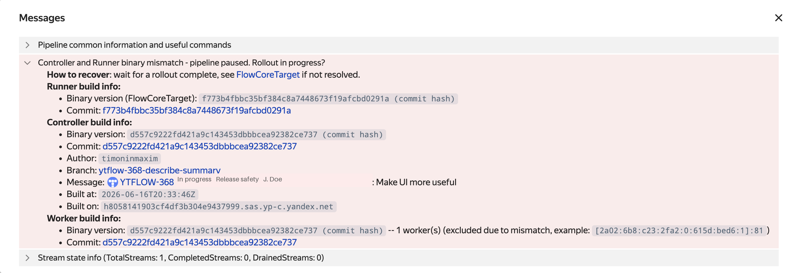

# Protecting Against Zombie Processes: FlowCoreTarget {#flow-core-target}

The Flow components — the Controller, Worker, and Runner — must be built from the same commit. If even one component has a different version, the pipeline stops working correctly. In practice, this most often happens when the Runner is forgotten during a release rollout. Less commonly, zombie processes cause the issue — these are components that didn’t update due to YT cluster unavailability or infrastructure errors.

The `FlowCoreTarget` mechanism protects against such situations: the pipeline stores the expected binary version and doesn’t allow processes that don’t match it to run.

## How It Works {#flow-core-target-how-it-works}

During a typical release rollout, `FlowCoreTarget` works in the background — the pipeline checks the versions automatically, and you don’t need to configure anything.

You can monitor the state in the pipeline UI, in the **Messages** block: it shows the current `FlowCoreTarget` and the versions of active processes. As long as the versions match, the pipeline runs in normal mode. If the versions differ, the `binary mismatch` message appears in the Messages block, and the pipeline enters the `Paused` state:

- The Controller stops scheduling Jobs.
- Workers with mismatched versions are excluded from active operations.
- An attempt to update the spec ends with the `FlowCoreTargetMismatch` error.







Recovery is automatic: once all processes update to the required version, the pipeline returns to the `Working` state. If this doesn’t happen, see the section [What to Do When Versions Mismatch](#flow-core-target-troubleshooting).

## Managing FlowCoreTarget {#flow-core-target-how-to-set}

In a typical scenario, you don’t need to set `FlowCoreTarget` manually — the Runner does it automatically with each spec push. You might need to manually intervene with `FlowCoreTarget` when you must:

- Temporarily [disable automatic setting](#flow-core-target-disable-auto) — for example, for a hotfix or debugging.
- Urgently [disable version checking](#flow-core-target-workarounds) and allow processes of any versions.

### Disabling Automatic Setting {#flow-core-target-disable-auto}

By default, the Runner sets `FlowCoreTarget` with each spec push. You can disable this in two ways:

- **Permanently** — in the Runner config (`pipeline.yson`):

    ```yson
    {
        ...
        "set_flow_core_target" = %false;
    }
    ```

- **For a single run** — using the `--skip-set-flow-core-target` flag in the Runner’s command line. This is convenient for one-off hotfixes or experiments.

### Manual Commands {#flow-core-target-manual}

You can view, set, or reset `FlowCoreTarget` using `yt flow execute`:

```bash
# View the current FlowCoreTarget.
{{yt-cli}} flow execute <pipeline_path> get-flow-core-target --input-format json '{}'

# Set FlowCoreTarget.
{{yt-cli}} flow execute <pipeline_path> set-flow-core-target --input-format json '{"flow_core_target":"<target>"}'

# Reset FlowCoreTarget (disable checking).
{{yt-cli}} flow execute <pipeline_path> set-flow-core-target --input-format json '{"flow_core_target":""}'
```



You can change `FlowCoreTarget` only when the pipeline is in the `stopped` state. In the `paused` state, you can do it only with the additional `"allow_update_on_pause": true` parameter in the request body.



### Custom Runner {#flow-core-target-custom-runner}

If you’re writing a Runner based on `TSimpleRunnerProgram`, `FlowCoreTarget` is set automatically. If you’re implementing a Runner from scratch, you must explicitly set `FlowCoreTarget` to match the `FlowCoreVersion` of your binary when you push the spec.

### Forced Reset {#flow-core-target-workarounds}



After a reset, the pipeline loses protection against zombie processes. If you restart the Runner without the `--skip-set-flow-core-target` flag, it will immediately write a new `FlowCoreTarget` over the reset value.



If you need to temporarily disable version checking and allow processes of any versions in the pipeline:

```bash
# Pause the pipeline.
{{yt-cli}} flow pause-pipeline <pipeline_path>

# Reset FlowCoreTarget.
{{yt-cli}} flow execute <pipeline_path> set-flow-core-target \
    --input-format json '{"flow_core_target":"", "allow_update_on_pause":true}'

# Resume the pipeline.
{{yt-cli}} flow start-pipeline <pipeline_path>
```

## Using in CI/CD {#flow-core-target-cicd}

In a typical CI/CD pipeline, the Runner runs from the same artifact as the Controller/Workers, so `FlowCoreTarget` updates with the spec push, and no additional actions are required.

Pay attention to the following:

- **One artifact, one push.** Don’t run the Runner from a developer branch over a production pipeline — the Runner will write its own `FlowCoreTarget`, and production processes will become zombies.
- **Rollbacks.** When rolling back to an older version from CI, you usually use an older Runner version, which will correctly rewrite `FlowCoreTarget`. If you roll back only the Workers’/Controller’s binary without the Runner, you must either run an older Runner version or manually reset `FlowCoreTarget` (see [Forced Reset](#flow-core-target-workarounds)).

## What to Do When Versions Mismatch {#flow-core-target-troubleshooting}

Wait for the rollout to finish — the Runner will write a new `FlowCoreTarget`, and the pipeline will automatically return from `Paused` to `Working`.

If the error persists significantly longer than the rollout duration:

1. Check that all Flow components are built from the same commit (the problem is most often with the Runner). To read the versions in the UI, see [How FlowCoreVersion Is Calculated](#flow-core-version-source).
2. Check whether there are zombie processes from previous rollouts — compare the IP addresses in the UI (Workers block and Leader controller address) with the actual IP addresses of your installation.



Version mismatch during a rollout is normal: components update at different times, and the `binary mismatch` message stays in the **Messages** block until the Runner pushes the spec with the new `FlowCoreTarget`.



#### How FlowCoreVersion Is Calculated {#flow-core-version-source}

- `(commit hash)` — the version is calculated based on the commit (`arc`/`git`). Two binaries from the same commit, built with different flags (for example, with a sanitizer), will have the same `FlowCoreVersion`.
- `(binary checksum)` — no VCS information is available (build from a tarball, `ya make --no-vcs-info`, or a local build); the binary file’s hash (`CityHash128`) is used. Any rebuild with different flags will result in a different `FlowCoreVersion`.