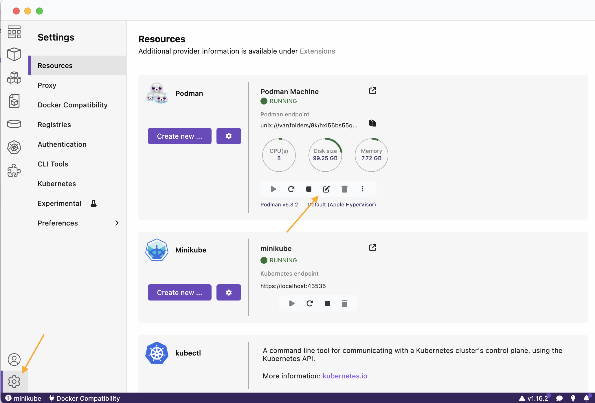
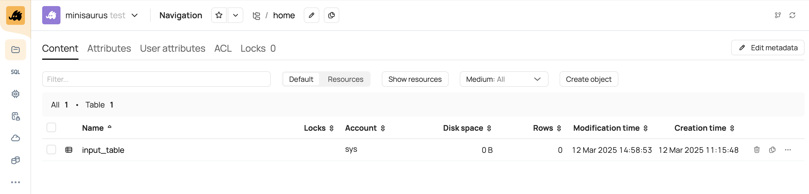
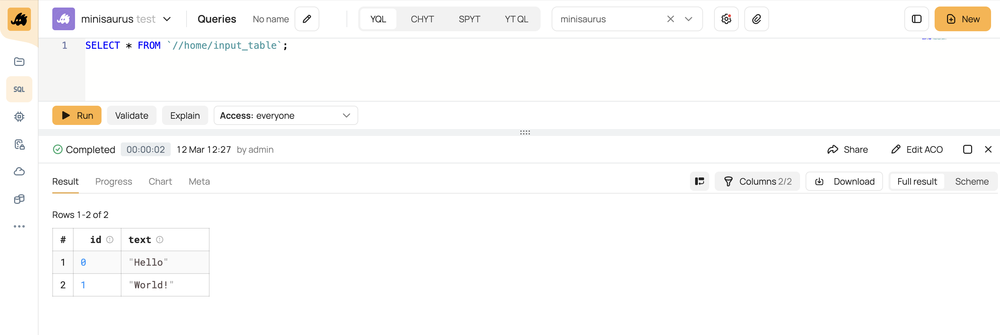
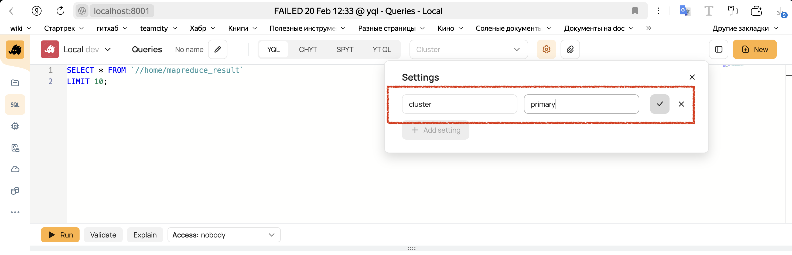
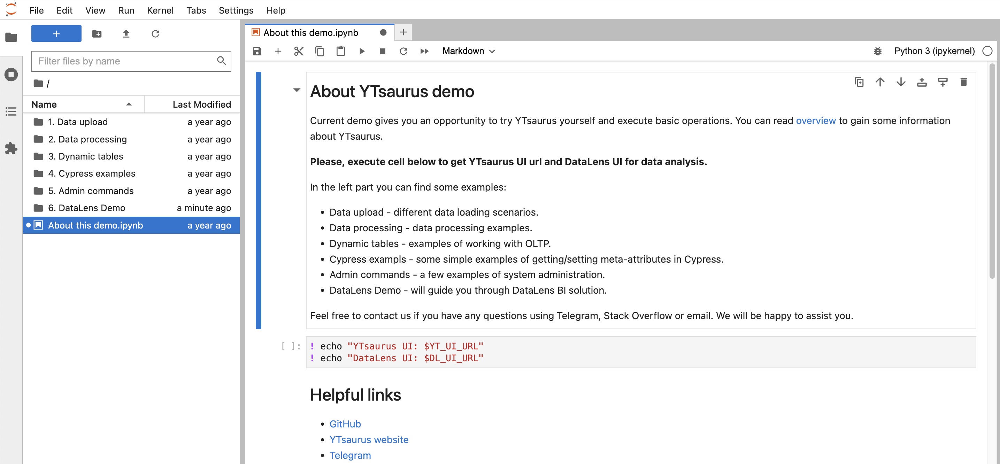
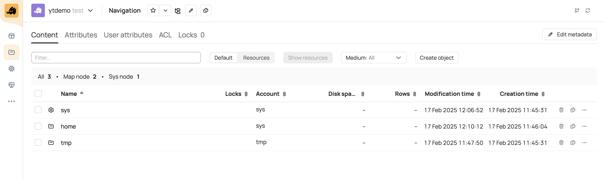

# How to try {{product-name}}

This guide offers a look at {{product-name}} in action and describes the process of installing and starting a cluster. You'll deploy a local {{product-name}} cluster, create a table, and run a simple SELECT query. Then, you'll deal with a slightly more complex challenge and solve the classic Word Count problem with a MapReduce operation.



The fastest way to familiarize yourself with the product's features is by using the [Demo Stand](#demo). It provides temporary access to a demo cluster that includes all the required {{product-name}} components. All you need is a web browser.



## Before you start {#prerequisites}

- We recommend using an x86_64 Linux operating environment for {{product-name}}. If you're using MacOS with an Apple Silicon processor, you'll need to use the x86 emulation mode to install {{product-name}} locally. This can be achieved by using the [Docker Desktop](https://docs.docker.com/desktop/setup/install/mac-install/) virtualization platform with [Rosetta 2](https://support.apple.com/en-us/102527) enabled. However, keep in mind that {{product-name}} **isn't guaranteed** to work in emulation mode. <!--По возможности используйте Linux с процессором архитектуры x86_64.-->

- In this guide, you'll start a {{product-name}} cluster with a minimal configuration, which means it will offer no guarantees of fault tolerance. Don't use this configuration in a production environment or for performance testing. Examples of how to configure your cluster configuration are available in the [Administrator manual](../../admin-guide/prepare-spec.md).

- For the examples to work correctly, Python 3.8+ must be installed on your system.

## Installing and starting a {{product-name}} cluster { #launch-cluster}

This guide offers two methods for installing a {{product-name}} cluster: using [Docker](https://www.docker.com/) and using [Minikube](https://minikube.sigs.k8s.io/docs/).

Regardless of the installation method, the required system components will be deployed in the process, including the [master server](*about-master), [scheduler](*about-scheduler), [YQL](*about-yql), [Query Tracker](*about-qt), and others. All examples in this guide — table creation, data upload, and running MapReduce — apply regardless of your preferred installation method and will be the same for both Docker and Minikube.



- Docker {selected}

  1. Install Docker:
      - If you're using Linux x86_64, install [Docker Engine](https://docs.docker.com/engine/install/ubuntu/).
      - If you're using MacOS, install either [Docker Desktop](https://docs.docker.com/desktop/setup/install/mac-install/) or [Podman](https://podman.io/docs/installation). Make sure that you have [Rosetta 2](https://support.apple.com/en-us/102527) installed and enabled.

  1. Download the [run_local_cluster.sh](https://github.com/ytsaurus/ytsaurus/tree/main/yt/docker/local) script for deploying the cluster, and set execution permissions:
     ```bash
     mkdir ~/yt-local && cd ~/yt-local
     curl -s https://raw.githubusercontent.com/ytsaurus/ytsaurus/main/yt/docker/local/run_local_cluster.sh > run_local_cluster.sh
     chmod +x run_local_cluster.sh
     ```

  1. Run the script to deploy the cluster:
     ```bash
     ./run_local_cluster.sh
     ```

     The script creates and runs [docker containers](*about-docker-containers) for deploying {{product-name}}. If the operation is successful, you'll see the following message:
     ```
     Congratulations! Local cluster is up and running. To use the cluster web interface, point your browser to http://localhost:8001. Or, if you prefer command-line tool 'yt', use it like this: 'yt --proxy localhost:8000 <command>'.
     ```

     Remember the addresses listed in this message — you'll need them later.
     - `localhost:8001` is the web interface address. You can open it in your browser.
     - `localhost:8000` is the cluster's backend address. You'll need to [specify](#set-vars) it as the proxy address to access the cluster via the CLI.

  1. To make sure everything works correctly, run the following command:
     ```bash
     $ docker ps | grep yt
     CONTAINER ID   IMAGE                           COMMAND                  CREATED         STATUS         PORTS              NAMES
     2c254e35037c   ghcr.io/ytsaurus/local:stable   "--fqdn localhost --…"   2 minutes ago   Up 2 minutes   80/tcp, 8002/tcp   yt.backend
     5235b5077b5b   ghcr.io/ytsaurus/ui:stable      ""                       2 minutes ago   Up 2 minutes   80/tcp             yt.frontend
     ```
     You should have two containers running:
     - `yt.frontend`: Handles processes related to the web interface.
     - `yt.backend`: Hosts {{product-name}} cluster components.

       

       To find out what {{product-name}} components are deployed on your system, check the list of processes running within the container:

       ```bash
       $ docker exec -it yt.backend /bin/bash
       $ ps -axo command | grep ytserver
       /mnt/rosetta /usr/bin/python3.8 /usr/local/bin/yt_local start --proxy-port 80 --local-cypress-dir /var/lib/yt/local-cypress --fqdn localhost --ytserver-all-path /usr/bin/ytserver-all --sync --fqdn localhost --proxy-config {coordinator={public_fqdn="localhost:8000"}} --rpc-proxy-count 0 --rpc-proxy-port 8002 --node-count 1 --queue-agent-count 1 --address-resolver-config {enable_ipv4=%true;enable_ipv6=%false;} --native-client-supported --id primary -c {name=query-tracker} -c {name=yql-agent;config={path="/usr/bin";count=1;artifacts_path="/usr/bin"}}
       /mnt/rosetta /primary/bin/ytserver-http-proxy --pdeathsig 9 --config /primary/configs/http-proxy-0.yson --pdeathsig 15 --setsid
       /mnt/rosetta /primary/bin/ytserver-master --pdeathsig 9 --config /primary/configs/master-0-0.yson --pdeathsig 15 --setsid
       /mnt/rosetta /primary/bin/ytserver-queue-agent --pdeathsig 9 --config /primary/configs/queue_agent-0.yson --pdeathsig 15 --setsid
       /mnt/rosetta /primary/bin/ytserver-node --pdeathsig 9 --config /primary/configs/node-0.yson --pdeathsig 15 --setsid
       /mnt/rosetta /primary/bin/ytserver-scheduler --pdeathsig 9 --config /primary/configs/scheduler-0.yson --pdeathsig 15 --setsid
       /mnt/rosetta /primary/bin/ytserver-controller-agent --pdeathsig 9 --config /primary/configs/controller_agent-0.yson --pdeathsig 15 --setsid
       /mnt/rosetta /primary/bin/ytserver-query-tracker --pdeathsig 9 --config /primary/configs/query_tracker-0.yson --pdeathsig 15 --setsid
       /mnt/rosetta /usr/bin/ytserver-yql-agent --pdeathsig 9 --config /primary/configs/yql_agent-0.yson --pdeathsig 15 --setsid
       /mnt/rosetta /usr/bin/grep --color=auto ytserver
       ```

       As you can see, we launched the following components:
       - The [master server](../../admin-guide/components#master) is responsible for fault-tolerant storage of the cluster's metadata. This includes information about system users, stored objects, and the location of the data itself.
       - The node combines the functionality of a [data node](../../admin-guide/components.md#data-nodes) and an [exec node](../../admin-guide/components.md#exec-nodes). It is responsible for data storage, dynamic tables, and job execution.
       - The [scheduler](../../admin-guide/components.md#planirovshik) plans data processing operations, such as Map and Reduce.
       - The [controller agent](../../admin-guide/components.md#planirovshik) schedules the jobs of individual operations.
       - The [HTTP proxy](../../admin-guide/components.md#proxy) is a server used for external communication.
       - The [YQL agent](../../admin-guide/components.md#yql-agent) is an execution engine for SQL-like queries.
       - The [{{product-name}} queue](../../user-guide/dynamic-tables/queues.md) contains ordered dynamic tables.
       - [Query Tracker](../../user-guide/query-tracker/about.md) is a component for running queries in different SQL dialects (YQL, QT, CHYT, SPYT).

       

  1. Done! Now {{product-name}} is deployed and ready for use. You may proceed to the next step. After you finish working with the examples, remember to [delete](#stop-cluster) the cluster.

- Minikube

  In this example, you'll deploy a local Kubernetes cluster consisting of a single node and run a {{product-name}} cluster within it. We'll use Docker as the container execution engine.

  

  To successfully deploy {{product-name}} on a Kubernetes cluster, the host machine must have:
  - At least 4 CPU cores.
  - At least 8 GB of RAM.
  - At least 30 GB of disk space.

  

  To install {{product-name}} in Minikube, follow these steps:

  1. [Set up the environment](#setup)
  1. [Deploy a Kubernetes cluster](#k8s-start)
  1. [Install cert-manager](#cert-manager-apply)
  1. [Install the {{product-name}} operator](#operator-install)
  1. [Start the {{product-name}} cluster](#yt-start)
  1. [Check network access](#set-url)

  

  For a more detailed description of the installation process, watch [this webinar](https://www.youtube.com/watch?v=LTKtY5okG4c).

  

  #### 1. Set up the environment {#setup}

  - Install Docker:
      - If you're using Linux, install [Docker Engine](https://docs.docker.com/engine/install/ubuntu/).
      - If you're using MacOS, install either [Docker Desktop](https://docs.docker.com/desktop/setup/install/mac-install/) or [Podman](https://podman.io/docs/installation). Make sure that you have Rosetta 2 installed and enabled.
  - Install [kubectl](https://kubernetes.io/docs/tasks/tools/#kubectl), a utility program for managing Kubernetes clusters.
  - Install [Minikube](https://kubernetes.io/ru/docs/tasks/tools/install-minikube/), a utility program for running a simple Kubernetes cluster on a local machine.
  - Install [Helm](https://helm.sh/docs/intro/install/), a package manager for installing {{product-name}} components in Kubernetes.

  #### 2. Deploy a Kubernetes cluster {#k8s-start}

  ```bash
  $ minikube start  --cpus=6 --memory=8192 --driver=docker

  # If you're using Podman
  # minikube start --cpus=6 --memory=8192 --driver=podman
  ```

  Once your Kubernetes cluster is deployed, the following command should execute successfully:

  ```bash
  $ kubectl cluster-info
  Kubernetes control plane is running at https://127.0.0.1:36399
  CoreDNS is running at https://127.0.0.1:36399/api/v1/namespaces/kube-system/services/kube-dns:dns/proxy
  ```

  #### 3. Install cert-manager { #cert-manager-apply }

  ```bash
  kubectl apply -f https://github.com/cert-manager/cert-manager/releases/download/{{cert-manager-version}}/cert-manager.yaml
  ```

  Wait for the `cert-manager-webhook` pod to enter the `Running` state:

  ```
  $ kubectl get pods -A
  NAMESPACE        NAME                                        READY   STATUS      RESTARTS   AGE
  cert-manager     cert-manager-7b5cdf866f-5lfth               1/1     Running     0          2m12s
  cert-manager     cert-manager-cainjector-7c9788477c-xdp8l    1/1     Running     0          2m12s
  cert-manager     cert-manager-webhook-764949f558-dldzp       1/1     Running     0          2m12s
  kube-system      coredns-668d6bf9bc-774xg                    1/1     Running     0          2m57s
  ...
  ```

  #### 4. Install the {{product-name}} operator {#operator-install}

  The [{{product-name}} operator](https://github.com/ytsaurus/ytsaurus-k8s-operator) is a program that manages {{product-name}} execution in a Kubernetes cluster. The operator ensures that all {{product-name}} components are up and running correctly.

  Install the chart:
  ```bash
  helm install ytsaurus oci://ghcr.io/ytsaurus/ytop-chart --version {{k8s-operator-version}}
  ```

  

  Check the status of the `cert-manager-webhook` pod:

  ```
  $ kubectl get pods -A
  NAMESPACE       NAME                                      READY   STATUS               RESTARTS   AGE
  cert-manager    cert-manager-7b5cdf866f-5lfth             1/1     ContainerCreating    0          2m12s
  cert-manager    cert-manager-cainjector-7c9788477c-xdp8l  1/1     ContainerCreating    0          2m12s
  cert-manager    cert-manager-webhook-764949f558-dldzp     1/1     ContainerCreating    0          2m12s
  ...
  ```
  If the pod's status is `ContainerCreating`, wait for its installation to complete and try restarting the command: `helm install ytsaurus oci://ghcr.io/ytsaurus/ytop-chart --version {{k8s-operator-version}}`.

  If the pod's status is `ImagePullBackOff`, it means that the system can't download the required images. Most likely, this is caused by the network settings within Minikube. Click [here](https://cert-manager.io/docs/troubleshooting/webhook/#error-connect-connection-refused) for possible solutions.

  

  Wait for the operator to enter the `Running` state:

  ```bash
  $ kubectl get pod
  NAME                                                      READY   STATUS     RESTARTS   AGE
  ytsaurus-ytop-chart-controller-manager-5765c5f995-dntph   2/2     Running    0          7m57s
  ```

  #### 5. Start the {{product-name}} cluster {#yt-start}

  ```bash
  curl -s https://raw.githubusercontent.com/ytsaurus/ytsaurus/refs/heads/main/yt/docs/code-examples/cluster-config/cluster_v1_local.yaml > cluster_v1_local.yaml
  kubectl apply -f cluster_v1_local.yaml
  ```

  It usually takes a few minutes for a {{product-name}} cluster to start. If everything is successful, the list of running pods will look like this:

  ```bash
  $ kubectl get pod
  NAME                                                      READY   STATUS              RESTARTS   AGE
  ca-0                                                      1/1     Running     0          8m43s
  dnd-0                                                     1/1     Running     0          8m44s
  dnd-1                                                     1/1     Running     0          8m44s
  dnd-2                                                     1/1     Running     0          8m44s
  ds-0                                                      1/1     Running     0          11m
  end-0                                                     1/1     Running     0          8m43s
  hp-0                                                      1/1     Running     0          8m44s
  hp-control-0                                              1/1     Running     0          8m44s
  ms-0                                                      1/1     Running     0          11m
  rp-0                                                      1/1     Running     0          8m43s
  rp-heavy-0                                                1/1     Running     0          8m43s
  sch-0                                                     1/1     Running     0          8m39s
  strawberry-controller-679786577b-4p5kz                    1/1     Running     0          7m17s
  yt-client-init-job-user-ljfqf                             1/1     Running     0          8m39s
  yt-master-init-job-default-hdnfm                          1/1     Running     0          9m23s
  yt-master-init-job-enablerealchunks-575hk                 1/1     Running     0          8m50s
  yt-strawberry-controller-init-job-cluster-l5gns           1/1     Running     0          8m17s
  yt-strawberry-controller-init-job-user-nn9lk              1/1     Running     0          8m34s
  yt-ui-init-job-default-6w5zv                              1/1     Running     0          8m43s
  ytsaurus-ui-deployment-7b469d5cc8-596sf                   1/1     Running     0          8m35s
  ytsaurus-ytop-chart-controller-manager-859b7bbddf-jc5sv   2/2     Running     0          14m
  ```

  

  Most likely, this is due to insufficient resources. Delete the Minikube cluster and try creating it again, this time allocating more resources at launch.

  ```bash
  $ kubectl delete -f cluster_v1_local.yaml
  $ minikube delete
  $ minikube start --cpus=8 --memory=10000 --driver=docker
  ```

  If the specified resources exceed the limit set in your Podman configurations, increase this limit in the settings section.

  

  

  #### 6. Check network access {#set-url}

  To check the address at which the {{product-name}} cluster will be available, run the following commands:

  ```bash
  # Network access to the web interface
  $ minikube service ytsaurus-ui --url
  http://192.168.49.2:30539

  # Network access to the proxy
  $ minikube service http-proxies-lb --url
  http://192.168.49.2:30228
  ```

  The web interface is available at the first link. To log in, use:
  ```
  Login: admin
  Password: password
  ```

  

  1. On the remote host, run the command:
     ```bash
     $ minikube service http-proxies-lb --url
     <HOST>:<PORT>
     ```
     You'll need the `<HOST>` and `<PORT>` values for the next step.

  2. On the local host, start a new terminal session and run the following:
     ```
     ssh -fnNT -L 127.0.0.1:8080:<HOST>:<PORT> <VM>
     ```
     The web interface will be available at [127.0.0.1:8080](http://127.0.0.1:8080).

  

  You can use the second link to connect to the cluster from the command line. For more information, see the examples section below.

  #### Done!

  {{product-name}} is now deployed and ready for use. You may proceed to the next step. After you finish working with the examples, remember to [delete](#stop-cluster) the cluster.



## Installing the {{product-name}} CLI {#install-cli}

The most convenient way to interact with the {{product-name}} system is through the console. The [{{product-name}} CLI](../../api/cli/cli.md) utility isn't installed as part of the cluster deployment process. You need to install it on your system separately.

First, install the pip3 package manager if you don't already have it installed:

```bash
sudo apt update
sudo apt install python3-pip
```

Make sure that everything worked correctly:
```bash
$ pip3 --version
pip 22.0.2 from ...
```

Install the `ytsaurus-client` utility:

```bash
pip3 install --user ytsaurus-client
```

Add the path to `$HOME/.local/bin` to the `PATH` variable:

```bash
export PATH="$PATH:$HOME/.local/bin"
```



```bash
echo 'export PATH="$PATH:$HOME/.local/bin"' >> ~/.bashrc # This command appends the string to the end of the ~/.bashrc file
source ~/.bashrc  # Apply the changes now
```



Check if the {{product-name}} CLI was successfully installed:

```bash
$ yt --version
Version: YT wrapper 0.13.20
```

For more information about working with the CLI, watch the [introductory webinar](https://youtu.be/LTKtY5okG4c?t=1456) (the timestamp is 24:30).


## Executing examples { #launch-example }

In this guide, you'll create a table, write data to it, and run a simple SELECT query. The section concludes with a more complex [example](#mr): running a MapReduce operation.

### Set environment variables { #set-vars }

You'll need this to access the cluster via the CLI for the examples that follow.



- Docker {selected}

  ```bash
  export YT_PROXY=localhost:8000
  ```

- Minikube

  ```bash
  export YT_PROXY=`minikube service http-proxies-lb --url`
  # Disable automatic proxy server detection {{product-name}}
  export YT_CONFIG_PATCHES='{proxy={enable_proxy_discovery=%false}}'
  export YT_TOKEN=password
  ```

  

  Here, the token is set in an environment variable. This is done intentionally for the sake of simplicity and clarity of the example. Avoid this practice in real-world scenarios: {{product-name}} provides dedicated commands for managing tokens. For more information, see [Authentication](../../user-guide/storage/auth.md#upravlenie-tokenami).

  



### Create a table { #create-table }

In {{product-name}}, all data is stored in [tables](../../user-guide/storage/static-tables.md). Let's create one!

```bash
$ yt create table //home/input_table --attributes '{schema = [{name = id; type = int64}; {name = text; type = string}]}'
> 16-64ca-10191-47007b7d
```

The value `16-64ca-10191-47007b7d` is the ID of the created [Cypress](*about-cypress) node. Node IDs are useful when working with [transactions](../../user-guide/storage/transactions.md) in {{product-name}}. You won't need these IDs in this example.

You can view the created table in the web interface. In your web browser, open the address that you received when starting the cluster, go to the **Navigation** tab, and click the created table:



### Write data { #insert-data }

Now write some data to the table by calling the [write-table](../../api/cli/commands.md#write-table) command:

```bash
echo '{ "id": 0, "text": "Hello" } { "id": 1, "text": "World!" }' | yt write-table //home/input_table --format json
```

### Read the result { #get-result }

To verify that the data has indeed been written to the table, run the following command:
```bash
$ yt read-table //home/input_table --format json
{"id":0,"text":"Hello"}
{"id":1,"text":"World!"}
```

Another way to read a table is by running a [SELECT](../../yql/syntax/select.md) query in the web interface. To do this, go to the **Queries** tab and enter the following query:

```sql
SELECT * FROM `//home/input_table`;
```





If you deployed your {{product-name}} cluster via Docker, follow these steps:

1. In the web interface, go to the **Queries** tab.
2. Click the settings icon at the top right of the page. Delete your current **Settings**.
3. Click **Add setting** and specify the field values "cluster" and "primary", respectively. Click the checkmark.

   

If you deployed your {{product-name}} cluster via Minikube, please let us know about this error in the [community chat](https://t.me/ytsaurus_ru)[community chat](https://t.me/ytsaurus).



### Advanced example: running MapReduce { #mr }

This section explains how to run a MapReduce operation, using a [Word Count](https://en.wikipedia.org/wiki/Word_count) problem as an example.


1. [Prepare the data](#mr-prepare-data)
2. [Create a table and write the data to it](#mr-create-table)
3. [Run MapReduce](#mr-run)
4. [Read the result](#mr-get-result)




For a Word Count problem, the MapReduce operation is executed according to the following algorithm:
1. The source text is split into strings, with each string written to the table as a separate record.
1. A Map operation is performed for each record, emitting a pair of columns for each word: `(<word>, 1)`.
2. The output of the previous step is sorted by the first column.
3. A Reduce operation is performed on the first column, summing the values from the second column. The resulting output is a set of pairs: `(<word>, <number of mentions of the word>)`.



#### 1. Prepare the data { #mr-prepare-data }

Download the [source text](https://github.com/ytsaurus/ytsaurus/blob/main/yt/docs/code-examples/source/moem.txt) and convert it into a tab-separated format:

```bash
curl -s https://raw.githubusercontent.com/ytsaurus/ytsaurus/refs/heads/main/yt/docs/code-examples/source/moem.txt > source.txt
awk '{gsub(/\t/, "\\t"); print "lineno="NR"\ttext="$0}' source.txt > source.tsv
```



- Table rows are separated by line breaks, `\n`.
- Columns are separated by tabs, `\t`.
- Column names and their corresponding contents are separated by an equals sign `=`.

For example, the string `lineno=1\tsize=6\tvalue=foobar` describes a row with columns `lineno`, `size`, and `value`, which contain the values `1`, `6`, and `foobar`, respectively. Tab characters are escaped.



Prepare the source code of the program that will run the MapReduce operation. Download the Python&nbsp;3 [script]({{pages.try-yt.mr-source}}) and save it locally:

```bash
curl -s https://raw.githubusercontent.com/ytsaurus/ytsaurus/refs/heads/main/yt/docs/code-examples/python/word-count.py > word-count.py
```

#### 2. Create a table { #mr-create-table }

Create two tables, one for the source data and another for the results of executing the MapReduce operation:

```bash
yt create table //home/mapreduce_input --attributes '{schema = [{name = lineno; type = string}; {name = text; type = string}]}'
yt create table //home/mapreduce_result --attributes '{schema = [{name = count; type = string}; {name = word; type = string}]}'
```

If you get 'Cannot determine backend type: either driver config or proxy url should be specified,' [set](#set-vars) the environment variable `YT_PROXY`.

Now write some data to the source table by calling the [write-table](../../api/cli/commands.md#write-table) command:

```bash
cat source.tsv | yt write-table //home/mapreduce_input --format dsv
```
To verify that the data has been written to the table, use the [read-table](../../api/cli/commands.md#read-table) command. The half-interval specified in the square brackets indicates that we want to get the first six rows of the table:

```bash
yt read-table '//home/mapreduce_input[:#6]' --format dsv
```

#### 3. Run MapReduce { #mr-run }

Run the MapReduce operation using the [map-reduce](../../api/cli/commands.md#map-reduce) command:

```bash
yt map-reduce --mapper "python3 word-count.py map" --reducer "python3 word-count.py reduce" --map-local-file word-count.py --reduce-local-file word-count.py --src //home/mapreduce_input --dst //home/mapreduce_result --reduce-by word --format dsv
```

You can track the status of a running operation in the **Operations** section of the web interface.







#### 4. Read the result { #mr-get-result }

Now you can read the resulting table by executing a simple SELECT query. In the web interface, go to the **Queries** tab and enter the following query:

```sql
SELECT * FROM `//home/mapreduce_result`
ORDER BY count
LIMIT 30;
```

## Stopping a cluster { #stop-cluster }



- Docker {selected}

  To stop a {{product-name}} cluster, shut down the `yt.frontend` and `yt.backend` containers. To do this, run the command:
    ```bash
  ./run_local_cluster.sh --stop
  ```

  This command stops (executes `docker stop`) and then removes (`docker rm`) the containers.

- Minikube

  1. Delete the {{product-name}} cluster:
     ```bash
     kubectl delete -f cluster_v1_local.yaml
     ```

  2. Uninstall the operator:
     ```bash
     helm uninstall ytsaurus
     ```

  3. Stop the Kubernetes cluster:
     ```bash
     minikube stop
     ```

  4. Delete the Kubernetes cluster:
     ```bash
     minikube delete
     ```

  5. Clear the Minikube cache:
     ```bash
     rm -rf ~/.minikube/
     ```

  6. If you used Podman:
     ```bash
     podman rm -f minikube
     podman volume rm minikube
     ```



## Demo Stand { #demo }

This is an online demonstration of the capabilities offered by {{product-name}}. To get access to the demo cluster, [fill out this form](https://ytsaurus.tech/#demo). After that, an email with information for accessing the cluster will be sent to your specified address.

The demo stand features several environments for interacting with {{product-name}}:



The notebook provides numerous examples for working with {{product-name}}, including operations for creating tables, uploading data, and using CHYT, SPYT, and YQL, as well as SDK examples. For an overview of all available examples, see **About YTsaurus demo**, the notebook home page.

A link to a deployed Jupyter Notebook will be included in the email.







Here you can test out the features of the {{product-name}} web interface: explore the file system, see the list of pools, and run queries in [Query Tracker](../../user-guide/query-tracker/about.md).

A link to the web interface of a deployed cluster will be included in the email.



For more information about using the web interface, watch the [introductory webinar](https://youtu.be/LTKtY5okG4c?t=929) (the timestamp is 15:30).



## Troubleshooting

If you're having trouble getting something to work, don't hesitate to ask your questions in our [community Telegram chat](https://t.me/ytsaurus_ru)[community Telegram chat](https://t.me/ytsaurus). We'll do our best to help you.

To share your suggestions or comments on the documentation, [create an issue](https://github.com/ytsaurus/ytsaurus/issues) in the project's GitHub repository. Your feedback is always welcome; it helps us make the documentation more informative.

[*about-cypress]: Cypress is a distributed file system and metadata storage. Cypress stores tables and files. To learn more, see the [documentation](../../user-guide/storage/cypress.md).

[*about-docker-containers]: Container images are collected from the Dockerfile available [here](https://github.com/ytsaurus/ytsaurus/blob/main/yt/docker/ytsaurus/Dockerfile).

[*about-qt]: A tool for running SQL-like queries. Query Tracker is available in the web interface, under **Queries**. To learn more, see the [documentation](../../user-guide/query-tracker/about.md).

[*about-yql]: A declarative query language for data storage and processing systems. It's based on SQL syntax. <!--Подробнее читайте в [документации](../../yql/index.md).-->

[*about-master]: The master server is responsible for fault-tolerant storage of the cluster's metadata. This includes information about system users, stored objects, and the location of the data itself. To learn more, see the [documentation](../../admin-guide/components.md#master).

[*about-scheduler]: The scheduler is responsible for allocating resources between operations as well as for their execution on the cluster. To learn more, see the [documentation](../../user-guide/data-processing/scheduler/scheduler-and-pools.md).