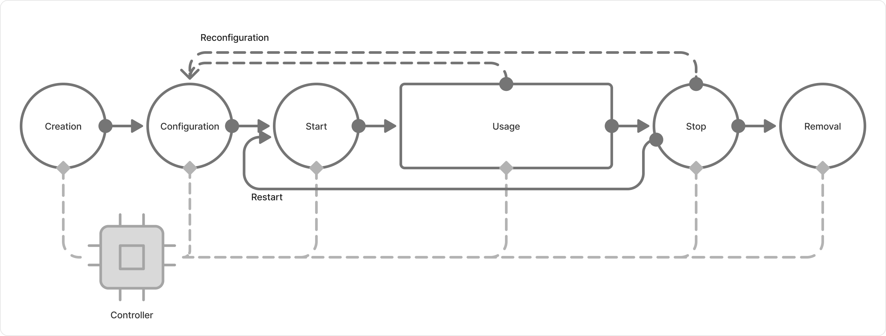

# Overview

Before you run SQL queries through CHYT, you need to prepare a [clique](../../../../../user-guide/data-processing/chyt/general.md#what-is): create it, allocate a compute pool, and start it. This section contains reference information for working with cliques: a description of the web interface, clique settings, and access permissions. If you need step‑by‑step instructions for a specific task, see the [clique management scenarios](../../../../../user-guide/data-processing/chyt/how-to-guides/overview.md) section.

## Clique lifecycle { #lifecycle }

Before using the interface and settings, it’s useful to understand which stage of the lifecycle the clique is currently at. This will help you figure out available actions for now.

The lifecycle is divided into two phases. In the preparation phase, you need to create, configure, and start the clique. After that, active use phase begins: you run queries and manage the clique as needed.

The diagram below shows the stages of the clique lifecycle and transitions between them:

{ .center }

**Preparation for usage**

1. You create a clique: you assign it a unique name — `alias` — and basic access permissions that determine who can run queries and who can manage the configuration. For more details, see: [Creating, starting, and stopping a clique](../../../../../user-guide/data-processing/chyt/how-to-guides/create-start.md) and [Access permissions](../../../../../user-guide/data-processing/chyt/how-to-guides/acl.md).

1. You configure the clique: you assign a compute pool, the number of instances and resources to it. The _pool_ is a required parameter — the controller won’t start the clique without it. You can leave the other options at their default values. For more details, see: [clique settings](../../../../../user-guide/data-processing/chyt/cliques/configs.md) and [Adding compute resources](../../../../../user-guide/data-processing/chyt/how-to-guides/manage-resources.md).

1. You start the clique — the [Strawberry Controller](../../../../../user-guide/data-processing/chyt/controller.md) reads the configuration and starts a [Vanilla operation](../../../../../user-guide/data-processing/operations/vanilla.md). The clique enters the active state and, after some time, is ready to accept queries. For more details, see the [Creating, starting, and stopping a clique](../../../../../user-guide/data-processing/chyt/how-to-guides/create-start.md) section.

**Usage and maintenance**

1. You run queries, scale resources if necessary, update settings and access permissions. The controller monitors the state and applies configuration changes automatically. For more details, see [How to try CHYT](../../../../../user-guide/data-processing/chyt/try-chyt.md).

1. When you temporarily don't need the clique, you stop it: ongoing queries complete, and pool resources are released. For more details, see [Creating, starting, and stopping a clique](../../../../../user-guide/data-processing/chyt/how-to-guides/create-start.md).

1. If you no longer need the clique, you delete it. The system will delete the clique along with its metadata.

## Clique settings { #options }

The clique configuration is stored in a [speclet](../../../../../user-guide/data-processing/chyt/cliques/configs.md#speclet) — a YSON document in Cypress. By editing the speclet, you manage compute resources, query behaviour, and other parameters. For the full list of options, see the [clique settings](../../../../../user-guide/data-processing/chyt/cliques/configs.md#options) section.

## Management tools { #tools }

To prepare and manage a clique, you can use two tools:

- [Web interface](../../../../../user-guide/data-processing/chyt/cliques/ui.md) — convenient for one‑off tasks and visual monitoring of the clique’s state;
- [CLI and Python API](../../../../../user-guide/data-processing/chyt/cli-and-api.md) — suitable for automation, bulk actions on cliques, and integration with external applications.

## Useful links

[Concepts](../../../../../user-guide/data-processing/chyt/general.md)

[CLI or Python API](../../../../../user-guide/data-processing/chyt/cli-and-api.md)

[How to try CHYT](../../../../../user-guide/data-processing/chyt/try-chyt.md)
