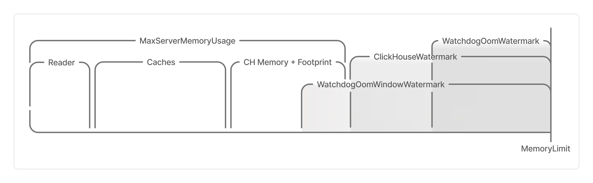
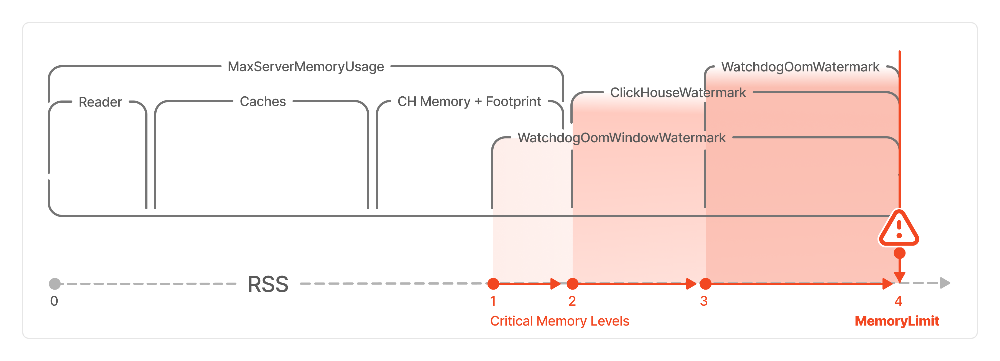

# Advanced settings configuration

This section describes how to work with advanced clique settings. In the web interface, they are located under *Advanced settings*. The full list of advanced settings is provided in [Advanced settings](../../../../../user-guide/data-processing/chyt/cliques/configs.md#options).



The settings described in this section are intended for advanced users only. If you are unsure whether you need them, we recommend keeping the default values.



Advanced settings include:

- configuring queries within the clique — the [Query settings](#query-settings) section;
- configuring server settings — the [{{clickhouse}} config](#ch-config) section;
- configuring the YT components of instances — the [YT config](#yt-config) section;
- allocating memory — the [Instance memory](#memory) section;
- caching queries — the [Query cache](#query-cache) section.

## Query settings { #query-settings }

The parameters in the *Query settings* section are a subset of the [{{clickhouse}} session settings](https://clickhouse.com/docs/ru/operations/settings/settings) that will be applied to all queries within the clique.

To change query behavior, override the default parameter values using:



- Web interface

    1. In the [{{clickhouse}} documentation](https://clickhouse.com/docs/ru/operations/settings/settings), find the required settings and copy their names.
    1. Open the clique interface as described in [How to open the clique interface](../../../../../user-guide/data-processing/chyt/cliques/ui.md#where).
    1. Click  in the upper-right corner, in the [Action buttons](../../../../../user-guide/data-processing/chyt/cliques/ui.md#action-menu) section, or click **Edit speclet** on the **Speclet** tab of the [Tab panel](../../../../../user-guide/data-processing/chyt/cliques/ui.md#tabs).
    1. Select **Advanced** on the left.
    1. Find the **Query settings** section.
    1. In the *Use JSON syntax* field, enter the parameters and their values using JSON syntax as `key: value` pairs enclosed in curly braces `{ }`. For example:

        ```json
        {
            "max_execution_time": 200000,
            "max_insert_threads": 32,
            "max_threads": 32,
            "parallel_distributed_insert_select": 2
        }
        ```

    1. To apply the changes, click **Confirm**.

- CLI

    1. Install the [CHYT CLI](../../../../../user-guide/data-processing/chyt/cli-and-api.md) included in the `ytsaurus-client` package if you have not already done so.
    1. Save the proxy address to an environment variable. This avoids having to specify the {{product-name}} cluster in every command using the `--proxy` argument.
    
        ```bash
        export YT_PROXY=<cluster_name>
        ```
    
    1. Set an environment variable with the controller address:
    
        ```bash
        export CHYT_CTL_ADDRESS=<address>
        ```
    
        , where `<address>` is the Controller address. For example, the address for a demo cluster has the following format: `https://strawberry-XXXXXXXX.demo.ytsaurus.tech`.
        You can obtain the Controller address from the `controller` field in the command output
    
        ```bash
        yt get //sys/strawberry/chyt/<alias>/@strawberry_info_state
        ```
    
    1. Save the cluster name to an environment variable:
    
        ```bash
        export CLUSTER_NAME=<cluster_name>
        ```
    
        , where `<cluster_name>` is the cluster name. For example, the demo cluster name is `ytdemo`.
    1. Find the required settings in the [{{clickhouse}} documentation](https://clickhouse.com/docs/ru/operations/settings/settings) and copy their names.
    1. Set the required parameters using the `query_settings` option. For example:

        ```bash
        yt clickhouse ctl set-option query_settings "{\"max_execution_time\": 200000,\"max_insert_threads\": 32,\"max_threads\": 32,\"parallel_distributed_insert_select\": 2}"
        ```



## {{clickhouse}} config { #ch-config }

The *Clickhouse config* setting is used to manage the configuration of the {{clickhouse}} component. Set it to match the standard {{clickhouse}} XML configuration.

The rules for converting an {{clickhouse}} XML configuration to a CHYT YSON configuration can be described as follows:

- Any configuration node that is not semantically repeatable in the {{clickhouse}} configuration is a map (`map`).
- A repeatable node is represented as a list (`list`).



#|
|| **XML** | **YSON** ||
||

```xml
<foo>42</foo>
<bar>qwe</bar>
<baz>
    <quux>3.14</quux>
</baz>
<baz></baz>
<baz>hi!</baz>
```

|

```yson
{
    foo = 42;
    bar = "qwe";
    baz = [
        {quux = 3.14};
        {};
        "hi!";
    ];
}
```

 ||
|#



### {{clickhouse}} configuration options that may be useful in CHYT { #ch-options }

The main option is `dictionaries`, which configures external dictionaries. Its value must be a list of dictionary configurations.
Each dictionary is configured using a map with the following fields, which retain the semantics of the original {{clickhouse}} configuration:

- `name` — external dictionary name;
- `source` — [data source](https://clickhouse.com/docs/en/sql-reference/dictionaries/external-dictionaries/external-dicts-dict-sources/) for the external dictionary;
- `layout` — [layout](https://clickhouse.com/docs/en/sql-reference/dictionaries/external-dictionaries/external-dicts-dict-layout/) of the external dictionary in the instance memory;
- `structure` — [schema of the data](https://clickhouse.com/docs/en/sql-reference/dictionaries/external-dictionaries/external-dicts-dict-structure/) stored in the dictionary;
- `lifetime` — dictionary [lifetime](https://clickhouse.com/docs/en/sql-reference/dictionaries/external-dictionaries/external-dicts-dict-lifetime/).

Other options are available in the {{clickhouse}} configuration in the [repository](https://github.com/ytsaurus/ytsaurus/blob/main/yt/chyt/server/clickhouse_config.h).



The {{clickhouse}} configuration also has a `settings` option containing the settings described in the [**Query settings**](#query-settings) section. Thus, query settings can also be defined within the {{clickhouse}} configuration.



### How to modify the {{clickhouse}} configuration { #ch-instruction }



- Web interface

    1. Open the clique UI as described in [How to access the clique UI](../../../../../user-guide/data-processing/chyt/cliques/ui.md#where).
    1. Click  in the upper-right corner, in the [Action buttons](../../../../../user-guide/data-processing/chyt/cliques/ui.md#action-menu) section, or click **Edit speclet** on the **Speclet** tab in the [Tab panel](../../../../../user-guide/data-processing/chyt/cliques/ui.md#tabs).
    1. Select **Advanced** on the left.
    1. Find the **Clickhouse config** section.
    1. In the *Use JSON syntax* field, enter the parameters and their values as a JSON configuration.
        Example configuration of a simple dictionary and [**Query settings**](#query-settings) in the `settings` section:

        ```json
        {
            "settings": {
                "max_execution_time": 30
            },
            "dictionaries": [
                {
                    "name": "dict",
                    "layout": {"flat": {}},
                    "structure": {
                        "id": {"name": "key"},
                        "attribute": [
                            {"name": "value_str", "type": "String", "null_value": "n/a"},
                            {"name": "value_i64", "type": "Int64", "null_value": 42}
                        ]
                    },
                    "lifetime": 0,
                    "source": {"yt": {"path": "//home/user/table"}}
                }
            ]
        }
        ```

    1. To apply the changes, click **Confirm**.

- CLI

    1. Install the [CHYT CLI](../../../../../user-guide/data-processing/chyt/cli-and-api.md) included in the `ytsaurus-client` package if you have not already done so.
    1. Save the proxy address to an environment variable. This prevents you from having to specify the {{product-name}} cluster in every command using the `--proxy` argument.
    
        ```bash
        export YT_PROXY=<cluster_name>
        ```
    
    1. Set an environment variable with the controller address:
    
        ```bash
        export CHYT_CTL_ADDRESS=<address>
        ```
    
        , where `<address>` is the controller address. For example, the demo cluster address has the following format: `https://strawberry-XXXXXXXX.demo.ytsaurus.tech`.
        You can obtain the controller address from the `controller` field in the command output
    
        ```bash
        yt get //sys/strawberry/chyt/<alias>/@strawberry_info_state
        ```
    
    1. Save the cluster name to an environment variable:
    
        ```bash
        export CLUSTER_NAME=<cluster_name>
        ```
    
        , where `<cluster_name>` is the cluster name. For example, the demo cluster name is `ytdemo`.
    1. Find the required parameters in the list of [{{clickhouse}} settings](https://clickhouse.com/docs/ru/operations/settings/settings) and copy their names.
    1. Set the required parameters using the `clickhouse_config` option. For example:

        ```bash
        yt clickhouse ctl set-option clickhouse_config "{ ... some JSON params}"
        ```



## YT config { #yt-config }

The YT part of the instance configuration is specified using the `yt_config` option. This option lets you specify advanced settings that are not available as separate speclet options.

For a list of available YT configuration parameters, see [Instance configuration](../../../../../user-guide/data-processing/chyt/reference/configuration.md#yt_config).

### How to modify the YT configuration { #yt-instruction }



- Web interface

    1. Open the clique interface as described in [How to access the clique interface](../../../../../user-guide/data-processing/chyt/cliques/ui.md#where).
    1. Click  in the upper-right corner, in the [Action buttons](../../../../../user-guide/data-processing/chyt/cliques/ui.md#action-menu) section, or click **Edit speclet** on the **Speclet** tab in the [Tab panel](../../../../../user-guide/data-processing/chyt/cliques/ui.md#tabs).
    1. Select **Advanced** on the left.
    1. Find the **YT config** section.
    1. In the *Use JSON syntax* field, enter the parameters and their values as a JSON configuration, for example:

        ```json
        {
            "subquery": {
                "max_data_weight_per_subquery": 12942417591810
            }
        }
        ```

    1. To apply the changes, click **Confirm**.

- CLI

    1. Install the [CHYT CLI](../../../../../user-guide/data-processing/chyt/cli-and-api.md) included in the `ytsaurus-client` package if you have not already done so.
    1. Save the proxy address to an environment variable. This eliminates the need to specify the {{product-name}} cluster in every command using the `--proxy` argument.
    
        ```bash
        export YT_PROXY=<cluster_name>
        ```
    
    1. Set an environment variable with the controller address:
    
        ```bash
        export CHYT_CTL_ADDRESS=<address>
        ```
    
        , where `<address>` is the controller address. For example, the demo cluster address has the following format: `https://strawberry-XXXXXXXX.demo.ytsaurus.tech`.
        You can obtain the controller address from the `controller` field in the command output
    
        ```bash
        yt get //sys/strawberry/chyt/<alias>/@strawberry_info_state
        ```
    
    1. Save the cluster name to an environment variable:
    
        ```bash
        export CLUSTER_NAME=<cluster_name>
        ```
    
        , where `<cluster_name>` is the cluster name. For example, the demo cluster name is `ytdemo`.
    1. Set the required parameters using the `yt_config` option. For example:

        ```bash
        yt clickhouse ctl set-option yt_config "{\"subquery\":{\"max_data_weight_per_subquery\": 12942417591810}}"
        ```
  


## Instance memory { #memory }

To fine-tune memory allocation, it is helpful to understand the memory allocation model in a CHYT instance, which parameters control each memory allocation, and how to change them.



In the context of memory management:

- A watermark is an amount of memory measured downward from the upper bound of the allocated memory limit. When memory usage enters this range, the CHYT instance initiates termination according to one of the predefined scenarios.
- A window is a time interval (15 minutes by default) during which the *average* amount by which memory usage exceeds the lower watermark boundary is calculated. This helps exclude random memory usage spikes.
- RSS (Resident Set Size) is the actual amount of RAM used by a process.
- OOM (out of memory) means memory exhaustion.



### Memory allocation in a CHYT instance { #memory-allocation }

The diagram shows how memory is allocated within a CHYT instance: which memory allocations make up the overall limit and which thresholds determine system behavior when memory is low.



Each parameter in the diagram is described below, including the memory allocations that make up the overall instance limit and the thresholds:

- `MaxServerMemoryUsage` is the overall memory usage limit for a CHYT instance. It includes:

  - `Reader` is the amount of memory allocated to reader caches for prefetching and faster data reads.
  - `Caches` is the designation in the diagram for the amount of memory allocated to caches, including:

    - `CompressedBlockCache` is the cache for *compressed* data blocks. It can hold large amounts of data because the data is stored in compressed form, which is the default behavior, but decompression takes additional time. It is used when rereading *large* data blocks.
    - `UncompressedBlockCache` is the cache for *uncompressed* data blocks. It is useful when many sequential queries access the same data because it saves resources on both reading and decompressing the data.
    - `ChunkMetaCache` is the chunk metadata cache. Chunk metadata is read before any read operation. This cache is useful when rereading data because it avoids repeatedly retrieving the same metadata.

  - `CH Memory` is a dedicated amount of memory reserved for the internal needs of {{clickhouse}};
  - `Footprint` is a dedicated memory reserve that allows the process to exceed the thresholds without causing the total memory usage to exceed critical values;

- `MemoryLimit` is a conditional hard limit on the RSS (memory usage) of a CHYT instance, used for the `WatchdogOomWatermark` and `WatchdogOomWindowWatermark` categories;
- `WatchdogOomWatermark` is an additional amount of memory used to check whether an OOM condition has occurred: the sum of the current RSS value and `WatchdogOomWatermark` is compared against the specified `MemoryLimit`;
- `WatchdogOomWindowWatermark` is an additional amount of memory used to check whether an OOM condition has occurred. The check is performed using the following algorithm:

  - The average RSS value is calculated over the `Window` time window (15 minutes by default);
  - `WatchdogOomWindowWatermark` is added to the calculated value;
  - The sum is compared against the specified `MemoryLimit`.

- `ClickHouseWatermark` is an additional amount of memory used to separate `MaxServerMemoryUsage` from the overall `MemoryLimit`.

### Critical RSS (memory usage) ranges { #critical-limits }

On the RSS scale in the memory allocation diagram, the critical value ranges at which the system terminates the process are numbered.



If the process's physical RAM usage reaches the following range:

- `1` (the average RSS value over more than 15 minutes exceeds the lower bound of the `WatchdogOomWindowWatermark` range) — the instance performs a graceful shutdown: it stops accepting new queries, waits for active queries to complete, and shuts down;
- `2` (the average RSS value exceeds the lower bound of the `ClickHouseWatermark` threshold) — {{clickhouse}} stops allocating memory for any operations, and the system reports insufficient memory;
- `3` (RSS exceeds the lower bound of the `WatchdogOomWatermark` range) — the instance terminates immediately, and active queries fail;
- `4` (RSS exceeds `MemoryLimit`) — {{product-name}} deletes the instance.

### How to configure memory thresholds { #memory-instruction }

We recommend using the web interface:

1. Open the clique interface as described in [How to access the clique interface](../../../../../user-guide/data-processing/chyt/cliques/ui.md#where).
1. Click  in the upper-right corner, in the [Action buttons](../../../../../user-guide/data-processing/chyt/cliques/ui.md#action-menu) section, or click **Edit speclet** on the **Speclet** tab of the [Tab bar](../../../../../user-guide/data-processing/chyt/cliques/ui.md#tabs).
1. Select **Advanced** on the left.
1. Find the **Instance memory** section.
1. In the *Use JSON syntax* field, enter the parameters and their values as a JSON configuration. You can use the following configuration example as a template:

    ```json
    {
        "clickhouse": 10500000000,
        "chunk_meta_cache": 100000000,
        "compressed_cache": 4000000000,
        "uncompressed_cache": null,
        "reader": 500000000,
        "clickhouse_watermark": 10,
        "watchdog_oom_watermark": 0,
        "watchdog_oom_window_watermark": 0,
        "footprint": 2000000000
    }
    ```

1. To apply the changes, click **Confirm**.



## Query cache { #query-cache }

Use the following settings to cache queries:

- **Enable sticky query distribution** — enables query distribution across instances based on query hashes.
- **Query sticky group size** — specifies the size of the group of instances selected deterministically based on the query hash. A coordinator will be selected from these instances to execute the query. This setting works only when **Enable sticky query distribution** is enabled.

To enable caching, use the web interface:

1. Open the clique interface as described in [How to open the clique interface](../../../../../user-guide/data-processing/chyt/cliques/ui.md#where).
1. Click  in the upper-right corner, in the [Action buttons](../../../../../user-guide/data-processing/chyt/cliques/ui.md#action-menu) section, or click **Edit speclet** on the **Speclet** tab in the [Tab panel](../../../../../user-guide/data-processing/chyt/cliques/ui.md#tabs).
1. On the left side of the dialog, select **Advanced**.
1. Enable **Enable sticky query distribution**.
1. Set **Query sticky group size** to `1`.
1. Add the following parameters under **Query settings**:

    ```json
    {
        "query_cache_ttl": 1800,
        "use_query_cache": true
    }
    ```

1. Under **Clickhouse config**, add the `query_cache` field. Set the parameter values according to the clique's requirements:

    ```json
    {
        "query_cache": {
            "max_entries": 20000,
            "max_entry_size_in_bytes": 524288,
            "max_entry_size_in_rows": 100000,
            "max_size_in_bytes": 104585760000,
            "min_query_duration": 500
        }
    }
    ```

    These parameters correspond to the [query cache settings in {{clickhouse}}](https://clickhouse.com/docs/operations/query-cache).

1. To apply the changes, click **Confirm**.
