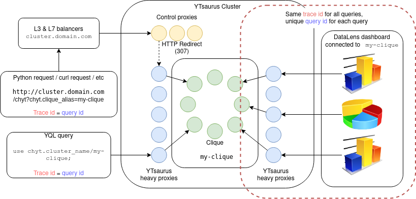

# Query anatomy before and after the ClickHouse engine

This article describes the CHYT architecture and where you can get the query execution information.

## Query IDs: `trace id`, `query id`, and `datalens request id` { #id }

There are several IDs associated with any query which allow you to restore all the necessary query execution information post factum.

- `query id` is the ID assigned to each query in ClickHouse. Unlike original ClickHouse, this ID in CHYT is not controlled by the user and always has the *{{product-name}} GUID* form — four hexadecimal uint32 separated by hyphens.
- `trace id` is the ID that allows you to chain calls in distributed systems, creating a query execution "trace". This is a part of the [opentracing](https://opentracing.io/) protocol, specifically its implementation called [Jaeger Tracing](https://www.jaegertracing.io/) that is used in {{product-name}}. `trace id` is also a {{product-name}} GUID which in some situations coincides with `query id` and in other situations does not as will be detailed below.

## Query execution journey from the client to heavy proxies { #way-to-proxy }

To better understand the logic by which these IDs exist and are assigned, figure out through which components and in which order the query passes to CHYT. Currently, the only public API to access CHYT is the HTTP API, so the following description applies specifically to the HTTP protocol.

The first important point on the query execution journey is the so-called *heavy proxies* to which all {{product-name}} users have network access. They find out where instances of the clique with a given alias currently live, and then send a request to a randomly selected instance.

The 3 most popular ways to access {{product-name}} are shown below.

{ .center }

When you access CHYT directly from the script or from the command line using the curl utility, an SLB balancer such as `http://$YT_PROXY` is used as the endpoint. Behind it lies a complex construction of balancers that directs the query to so called *control proxies* which respond with an HTTP redirect to the heavy proxies that serve all the heavy workload in {{product-name}}. With this access interface, `query id` is the same as `trace id`: you can see them in the `X-Yt-Trace-Id` and `X-ClickHouse-Query-Id` headers. Below is an example of interaction with CHYT using the CURL utility where the most interesting response headers are indicated.

```bash
curl -v --location-trusted 'http://$YT_PROXY/query?database=*ch_public' -d 'select max(a) from "//sys/clickhouse/sample_table"' -H "Authorization: OAuth `cat ~/.yt/token`"
*   Trying ip_address:80...
* Connected to $YT_PROXY (ip_address) port 80 (#0)
> POST /query?database=*ch_public HTTP/1.1
> Host: $YT_PROXY
> User-Agent: curl/7.69.1-DEV
> Accept: */*
> Authorization: OAuth <i>...<my_token>...</i>
> Content-Length: 50
> Content-Type: application/x-www-form-urlencoded
>
* upload completely sent off: 50 out of 50 bytes
* Mark bundle as not supporting multiuse
<b> // Getting redirect to a heavy proxy.</b>
< HTTP/1.1 307 Temporary Redirect
< Content-Length: 0
< Location: http://sas4-9923-proxy-$YT_PROXY/query?database=*ch_public
< X-Yt-Trace-Id: 8e9bcc43-5c2be9b4-56f18c4e-117ea314
<
* Connection #0 to host $YT_PROXY left intact
* Issue another request to this URL: 'http://sas4-9923-$YT_PROXY/query?database=*ch_public'
*   Trying ip_address:80...
* Connected to sas4-9923-$YT_PROXY (ip_address) port 80 (#1)
> POST /query?database=*ch_public HTTP/1.1
> Host: sas4-9923-$YT_PROXY
> User-Agent: curl/7.69.1-DEV
> Accept: */*
> Authorization: OAuth <i>...<my_token>...</i>
> Content-Length: 50
> Content-Type: application/x-www-form-urlencoded
>
* upload completely sent off: 50 out of 50 bytes
* Mark bundle as not supporting multiuse
< HTTP/1.1 200 OK
< Transfer-Encoding: chunked
<b>  // Note: query id = trace id. </b>
< <b>X-ClickHouse-Query-Id:</b> 3fa9405e-15b29877-524e3e67-2be50e94
< <b>X-Yt-Trace-Id:</b> 3fa9405e-15b29877-524e3e67-2be50e94
<b>  // For technical reasons, X-Yt-Trace-Id will appear twice.</b>
< X-Yt-Trace-Id: 3fa9405e-15b29877-524e3e67-2be50e94
< Keep-Alive: timeout=10
<b>  // Address of the query coordinator instance. </b>
< <b>X-ClickHouse-Server-Display-Name:</b> sas2-1374-node-$YT_PROXY
< X-Yt-Request-Id: 3fa9405d-26285349-db14531a-2a12b9f9
< Date: Sun, 05 Apr 2020 18:49:57 GMT
< Content-Type: text/tab-separated-values; charset=UTF-8
< X-ClickHouse-Summary: {"read_rows":"0","read_bytes":"0","written_rows":"0","written_bytes":"0","total_rows_to_read":"0"}
<b>  // Address of the heavy proxy that served the query. </b>
< <b>X-Yt-Proxy:</b> sas4-9923-$YT_PROXY
<
1100
* Connection #1 to host sas4-9923-$YT_PROXY left intact
```
