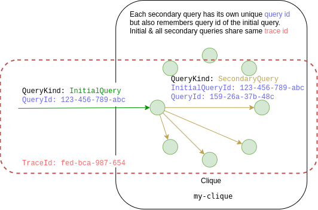

## Executing a query within a clique { #query_execution }

A heavy proxy delegates query execution to a randomly selected instance from the clique. This instance is called the query `coordinator` (or `initiator`). If the query doesn't use {{product-name}} tables (for example, if it only refers to system tables starting with the `system.` prefix or it's an elementary query like `SELECT 1`), then it's executed on the coordinator normally, just like it would be done in ClickHouse.

However, if the query affects {{product-name}} tables , then it's always executed in a distributed manner. Let's examine the execution of a simple scan query that supports filtering, projection, and aggregation:

`SELECT someColumns, someFunctions(someColumns) FROM "//path/to/table" WHERE somePredicate(someColumns) [GROUP BY someColumns]`.

This query splits `//path/to/table` into roughly equal sections, with each section being processed independently on one of the clique nodes. Essentially, each instance receives a modified query, where `//path/to/table` in the FROM clause is replaced by an expression in the form `ytSubquery(...)`, with the description of the next table section encoded in the argument.

Thus, query execution boils down to executing a number of remote subqueries on the clique's instances. The image above illustrates this mechanism.

It's worth noting that there are two kinds of queries:

- `QueryKind: InitialQuery`: Initial queries received from clients.
- `QueryKind: SecondaryQuery`: Modified remote subqueries that reference specific {{product-name}} table sections in the FROM clause.

Each secondary query inherits the `trace id` of its parent. And even though each secondary query has its own `query id`, they still remember their initial query. In system logs, the parent `query id` of the initial query is indicated as `InitialQueryId` for secondary queries.

## I/O and compression in CHYT

Below is some useful information and recommendations on reading data from {{product-name}}. Take these into account when using CHYT.

### Network

Instances of any clique are started on random machines of the cluster, so data reading is likely to be done over the network. You can expect that roughly each successive gigabyte of data that needs to be read will reside on a different machine in the cluster.

Note that even though the {{product-name}} cluster network rarely becomes a bottleneck, this can happen in rare cases.

### Compression

In {{product-name}}, data is typically stored in **compressed** form. Compression is handled by the `/@compression_codec` table attribute, which is also found in the table view web interface. This is further described in a dedicated documentation [article](../../../../../user-guide/storage/compression.md).

Instances read data from compressed tables in compressed form. This data is then decompressed just before being processed by the ClickHouse engine. Data decompression is categorized as [CHYT FSCompression](../../../../../user-guide/data-processing/chyt/cliques/dashboard.md#cpu) on the CPU graph in the [CHYT dashboard](../../../../../user-guide/data-processing/chyt/cliques/dashboard.md). When choosing a compression codec for your data, take into account that the stronger the codec, the more costly it will be to decompress the data.

### Uncompressed block cache

CHYT has an **uncompressed block cache**, which is allocated 20 GiB by default. The cache size can be controlled with the `--uncompressed-block-cache-size` parameter in the clique start string.

This cache stores uncompressed blocks of recently read tables, which significantly speeds up query execution on data recently read by another query, because some of this data may already be ready and available in instance memory. To ensure that this cache is used effectively, make sure that the following conditions are met:

- The cache works without issues as long as the number of instances in the clique remains the same. If an instance disappears (for example, due to preemption, a {{product-name}} node failure, or a CHYT crash), future subqueries are arbitrarily redistributed across instances, and most of the data blocks cached in instance memory may become useless, increasing the block cache miss value. However, in this case, the very next query will restore the necessary cache data.
- If table data changes, the table sections are arbitrarily redistributed across subqueries, which similarly leads to block cache misses.
- Finally, if the amount of processed data per instance is significantly larger than the block cache size (in uncompressed data size terms), then, quite obviously, the cache won't be of much use for any subsequent queries on the same data, because most of it will have to be re-read over the network anyway.

### HDD vs SSD

Even though SSDs offer faster read speeds than HDDs, there is no need to rush to migrate your data to an SSD the moment your queries begin to slow down. It's possible that the bottleneck is actually the CPU, not I/O: for example, the data may already be in the block cache, while you still need to process a few dozens of gigabytes of decompressed data to respond to the query. In this situation, moving your tables from HDD to SSD won't help.

If you believe that migrating your data to an SSD will speed up query execution (in particular, if you've read the case studies in the article on [Troubleshooting](../../../../../user-guide/data-processing/chyt/queries/diagnostics.md)), follow the [action plan](../../../../../user-guide/data-processing/chyt/faq-chyt.md#how-to-set-ssd) provided in the FAQ.

### About columnar storage

In most cases when working with ClickHouse, you want to use the columnar [format](../../../../../user-guide/storage/chunks.md#optimize_for) for table storage, which you can implement by setting the `/@optimize_for` attribute to `scan`.

Columnar storage lets you efficiently read individual table columns without having to load the entire table into memory and helps conserve disk space, as {{product-name}} will apply different codecs for columnar storage, which will optimize column representation.

However, there may be situations where the row-based format (`/@optimize_for = lookup`) is required. The main disadvantage of the columnar format is high memory consumption, especially for tables with a large number of columns, because each column requires its own buffer. In addition, it's worth noting that reading lookup tables is slightly less CPU-intensive.
