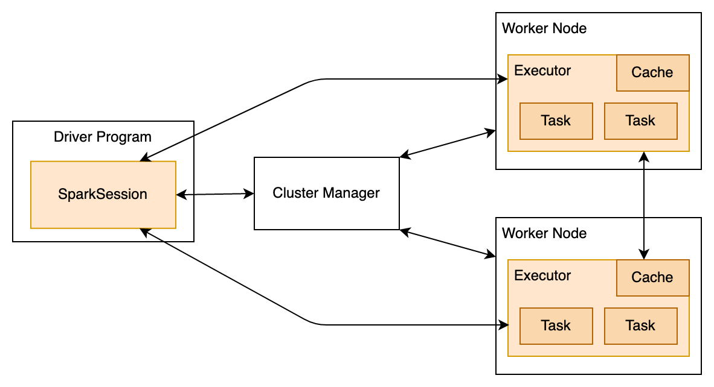
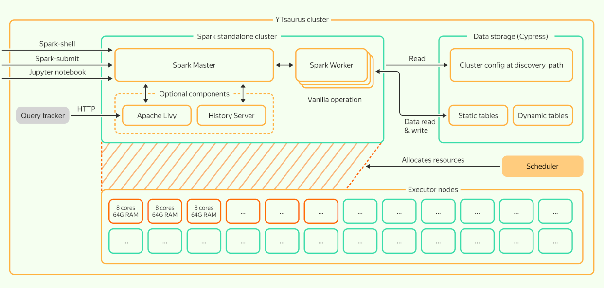

# SPYT cluster

This section features a top-level description of the SPYT cluster, its component, and the Spark application framework.

Cluster start is described in a separate [section](../../../../../user-guide/data-processing/spyt/cluster/cluster-start.md).

## Spark app { #spark-app }

The Spark app consists of a *driver* and *executors*.

1. The driver performs the main code, plans SQL queries, and breaks them up into *tasks* that can be performed at the same time.
2. The driver doesn't perform tasks itself, but delegates them to executors.  The driver sends the scheduler a request to create executors.
3. The scheduler identifies containers of the needed size on the cluster nodes, and sends the executors to them.
4. Executors are created in the cluster and exchange messages with the driver over the network.

{ .center }

When the app is launched, the executors' characteristics (cores and memory) must be specified, as well as the maximum number of executors.

By default, executors with 4 cores and 16 GB of memory (4 GB per core) are specified in all SPYT clients.  This setting should fit most tasks.



The executor can perform several tasks simultaneously. Usually, the number of subtasks the executor can perform is equal to the number of cores it has.



   

### Number of cores in the executor { #number-cores }

Spark cannot change the characteristics of the executor on the fly, but it can work with a smaller number of executors than was initially intended.
An executor is a single process, a single JVM.  If the cluster has no workers with 16 free GB of memory, the executor won't be created even if a smaller amount of memory is available in the cluster.  16 GB of memory must be free all at once.

A separate thread that will perform tasks is created for each core of the executor, in its JVM.  This brings with it all the usual downsides of multi-thread models: the more threads, the more expensive the model is.

Executors with a single core are not profitable due to the expense of communications between executors, broadcast messages, and singleton objects that executor threads can recycle among themselves.  For example, to make a map-side join, a copy of a small table is attached to each executor.  If you have one executor with four cores, you'll only need to store one copy of the table.  If you have four executors with one core each, you'll need to store four copies of the table, and therefore more memory.

A more detailed description is available in the [Spark documentation](https://spark.apache.org/docs/latest/cluster-overview.html).

## Spark Standalone in {{product-name}} { #sparkl-standalone }

To get executors, the driver sends a request to the resource *scheduler*.

To create containers of the appropriate size, you need to know what cluster nodes exist, and how many resources they have. Usually, container creation is performed by [YARN](https://hadoop.apache.org/docs/current/hadoop-yarn/hadoop-yarn-site/YARN.html) or [Mesos](https://mesos.apache.org/), and {{product-name}} has its own resource scheduler.

There are two methods for launching Spark applications in the current implementation: [submitting directly using {{product-name}} scheduler](../../../../../user-guide/data-processing/spyt/launch.md#submit) or deploying an inner Spark standalone cluster using Vanilla operation.

Spark Standalone consists of a *master* and *workers*. Each worker knows how many resources can be borrowed on the cluster node where the worker is launched, and how to provide resources on request. The master coordinates the work: it receives requests from the driver and decides what workers to create executors for.

{ .center }

To request a resource from the master, the driver must know the master host and port.  When the Vanilla operation is launched, the Spark master goes to a random {{product-name}} cluster node, and opens a port ranging from 27000 to 27200 there.  Then, the Spark master specifies its host and port in Cypress, in a special `discovery-path` directory. There is code in the driver that talks to Cypress, finds out the host and port of the Spark master, and then talks to it.

{ .center }

The scheduler's cluster is started with the `spark-launch-yt` command.  The command argument must include:
- How many resources (cores/memory) each worker will have.
- Number of workers.
- Which Cypress directory to use as the `discovery-path`.



The difference between an app and a cluster:
- The driver and the executors comprise the Spark app.  The Spark app performs the application task of the user: for example, to make a join of two tables and record the result.
- The master and workers comprise the Spark cluster.  The Spark cluster answers requests from apps to launch new executors.



## Cluster mode { #cluster-mode }

In the schemas of the previous unit, the driver was represented inside of Jupyter. This is one of the options for starting Spark - *client mode*. In this option, the driver is performed on the client host (outside of the cluster). Executors, meanwhile, are created in the cluster.

There is also another start option, called *cluster mode*. In this option, the driver is launched in the cluster along with the executors.  To work in cluster mode, the Spark Standalone master must be commanded to launch the driver from a pre-created and pre-assembled application code.  For this, the `spark-submit-yt` utility exists.  The master creates a container for the driver on one of the workers.  The worker downloads the code into the container and launches the driver.  After that, the driver works the same as in *client mode*.  The driver requests executors from the master, performs the code, and delegates tasks.

By default, workers can download driver code in HTTP, FTP, and other APIs. With SPYT, workers can upload the driver code from {{product-name}}.

{ .center }
