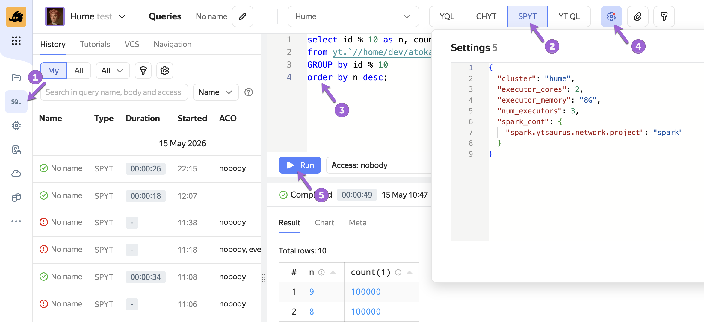
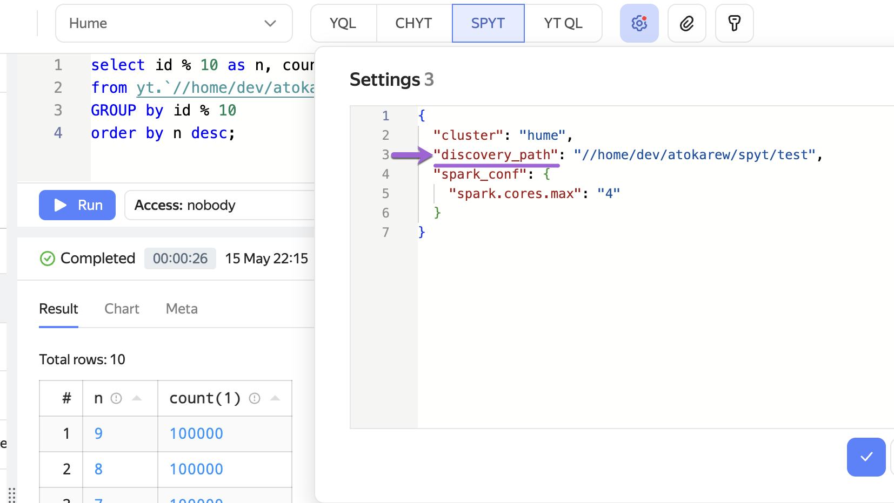

# SPYT Connect

SPYT Connect is a remote connection mechanism for a Spark driver, built on the [Spark Connect](https://spark.apache.org/docs/latest/spark-connect-overview.html) protocol. It lets you run Spark SQL queries via [Query Tracker](../../../../user-guide/query-tracker/about.md) in {{product-name}}. You can also work with data directly from Python code via the Spark Connect API, without installing a JVM on the client side.



This mechanism replaces [Livy](../../../../user-guide/data-processing/spyt/cluster/livy.md) starting from SPYT 2.10.0 and Query Tracker 0.4.



## When query latency may occur {#request-latency}

SPYT Connect starts the Spark driver on demand. If the driver is not active at the moment, you need to start it first — this takes time. The driver may be inactive in three cases:

- First access to SPYT Connect.
  You’re just getting started, and the driver launches from scratch.
- After idle time.
  To avoid wasting resources, the driver automatically stops after 10 minutes of inactivity. The next query will trigger its launch again. The idle timeout is configured via the `spark.ytsaurus.connect.idle.timeout` parameter in the [SPYT configuration settings](../../../../user-guide/data-processing/spyt/thesaurus/configuration.md).
- After changing settings.
  If you change the resource configuration for a query (for example, the number of cores), the old driver stops, and a new one starts with the updated settings.


When you notice initialization delays depends on how you work with SPYT Connect:

- **In Query Tracker (UI or API)**, session launch and sending a query to SPYT Connect happen within a single QT query. So when you launch it in the interface or send a query via the API, it seems that the query itself takes a long time to run. All subsequent queries will run quickly.
- **In Python (Spark Connect API)**, you explicitly control the launch. The delay will occur exactly when you call the `start_connect_server` function (waiting for readiness). The actual computations and DataFrame operations will start without delays.

## Launch modes {#launch-modes}

SPYT Connect operates in two modes — they determine how the Spark application is launched. The mode you choose affects the configuration and code in all connection methods.

#|
|| **Mode** | **When to use** ||
|| [Direct submit](../../../../user-guide/data-processing/spyt/direct-submit/desc.md) | No dedicated cluster; the Spark application launches on demand for each query ||
|| [Internal cluster](../../../../user-guide/data-processing/spyt/cluster/cluster-desc.md) | The cluster is already running; SPYT Connect connects to it ||
|#

## Connection methods {#choose}

#|
|| **Method** | **When to use** ||
|| [Via Query Tracker UI](#ui) | Suitable for analysts and anyone working with data via the {{product-name}} interface ||
|| [Via Query Tracker API](#qt-api) | For automating SQL queries from Python ||
|| [Via Spark Connect API](#spark-connect-api) | For those who want to use the DataFrame API or manually manage the driver lifecycle ||
|#

### Via Query Tracker UI {#ui}

To run an SQL query using SPYT Connect:

1. Open the **Queries** tab in the {{product-name}} interface.
1. Select **SPYT** from the engine list.
1. Enter an SQL query.
1. In the **Settings** field, specify the [configuration](#config) in JSON format.
1. Click **Run** and wait for the result.



To work with an internal Spark cluster, add `discovery_path` — the path to the running cluster. The cluster must run on SPYT 2.9.0 or higher:

```json
{
  "discovery_path": "//home/spark/my-cluster"
}
```



### Via Query Tracker API {#qt-api}

The example below shows how to send an SQL query via the API and read the result:
```python
from yt.wrapper import YtClient, start_query, get_query_result, read_query_result

client = YtClient(proxy="<cluster-proxy>", token="<your-token>")

settings = {
    "cluster": "<cluster-name>",
    "spark_conf": {
        "spark.cores.max": "4"  # Spark-native parameter: maximum number of cores for the entire application
    }
}

# For an internal cluster, add discovery_path:
# settings["discovery_path"] = "//home/spark/my-cluster"

query_id = start_query(
    "spyt",
    "SELECT * FROM yt.`//home/my-table`",
    settings=settings,
    client=client
)

# Get metadata (for example, data schema)
result_meta = get_query_result(query_id=query_id, result_index=0, client=client)

# Iterate over the result
result = read_query_result(query_id=query_id, result_index=0, client=client)
for row in result:
    print(row)
```

For a description of configuration parameters, see the [Configuration parameters](#config) section.

### Via Spark Connect API {#spark-connect-api}

The main difference from classic Spark is only in how the session is created; the rest of the code remains the same.

The examples below show how to create a Spark session in each launch mode:



- Direct submit (without a dedicated cluster)

  ```python
  import spyt
  from yt.wrapper import YtClient
  from spyt.connect import start_connect_server, wait_for_spark_connect_endpoint
  from pyspark.sql import SparkSession

  client = YtClient(proxy="<cluster-proxy>", token="<your-token>")

  operation = start_connect_server(client)
  endpoint = wait_for_spark_connect_endpoint(client, operation.id)

  try:
      spark = SparkSession.builder.remote(f"sc://{endpoint}").getOrCreate()
      df = spark.read.format("yt").load("yt:///home/my-table")
      df.show()
  finally:
      if spark:
          spark.stop()
  ```

- With an internal SPYT cluster (SPYT 2.9.0+)

  ```python
  import spyt
  from yt.wrapper import YtClient
  from spyt.connect import start_connect_server_inner_cluster
  from pyspark.sql import SparkSession

  client = YtClient(proxy="<cluster-proxy>", token="<your-token>")

  endpoint = start_connect_server_inner_cluster(client, discovery_path)

  try:
      spark = SparkSession.builder.remote(f"sc://{endpoint}").getOrCreate()
      df = spark.read.format("yt").load("yt:///home/my-table")
      df.show()
  finally:
      if spark:
          spark.stop()
  ```



## QT configuration parameters {#config}

Parameters apply **only when working via Query Tracker** and are passed in JSON format — in the **Settings** field (UI) or in the `settings` dictionary (API). <!--When working via the Spark Connect API, the same parameters are passed as arguments to the `start_connect_server` and `start_connect_server_inner_cluster` functions.-->

| **Parameter** | **Description** | **Default** |
|:---|:---|:---|
| `driver_cores` | CPU for the driver | 1 |
| `driver_memory` | Memory for the driver | 1.5G |
| `num_executors` | Number of executors | 2 |
| `executor_cores` | CPU per executor | 1 |
| `executor_memory` | Memory per executor | 4G |
| `spark_conf` | Configuration parameters for launching a Spark application. You can specify both [standard Spark parameters](https://spark.apache.org/docs/latest/configuration.html) and [SPYT parameters](../../../../user-guide/data-processing/spyt/thesaurus/configuration.md) | — |

## Migrating from Livy {#migration}

Starting from SPYT 2.10.0 and Query Tracker 0.4, integration via Livy is no longer supported. SPYT Connect replaces it.

The main difference from Livy: in Livy, all drivers ran on the same machine as the server, which limited the number of simultaneous sessions and didn’t allow flexible resource configuration. In SPYT Connect, each user launches a Spark driver as a separate {{product-name}} operation with an individual configuration.

| **Feature** | **Livy** | **SPYT Connect** |
|:---|:---|:---|
| Simultaneous sessions | Limited: all drivers ran on one server, and users waited in line under load | Unlimited: each user gets a separate {{product-name}} operation |
| Session isolation | Shared driver — one user’s load could affect others | Each user works in an isolated execution environment |
| Quotas | Not available | Queries run in a user pool in {{product-name}} with standard quotas |
| Resource configuration | Fixed, set at the server level | Flexible: CPU and memory are configured separately for the driver and each executor |
| Resource pool selection | Not available | You can explicitly specify the pool where tasks will run |


## Versions and compatibility {#versions}

| **Feature** | **Minimum version** |
|:---|:---|
| SPYT Connect with direct submit | SPYT 2.8.0 |
| SPYT Connect with internal cluster | SPYT 2.9.0 |
| Spark 4.x support | SPYT 2.10.0 |
| Replacing Livy in Query Tracker | SPYT 2.10.0 + Query Tracker 0.4 |

The Spark Connect protocol appeared in Spark 3.4, so earlier Spark versions are not supported. The current SPYT Connect works starting from Spark 3.5.x.



To work via the Spark Connect API, you’ll need the `ytsaurus-spyt` and `pyspark-client` packages.



## What’s next {#see-also}

- [Direct submit](../../../../user-guide/data-processing/spyt/direct-submit/desc.md)
- [Internal SPYT cluster](../../../../user-guide/data-processing/spyt/cluster/cluster-desc.md)
- [SPYT configuration parameters](../../../../user-guide/data-processing/spyt/thesaurus/configuration.md)
