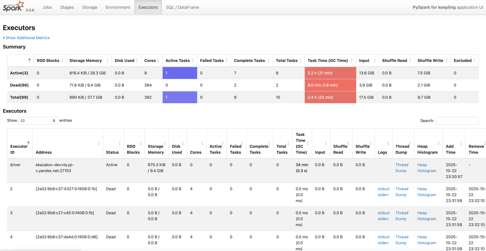
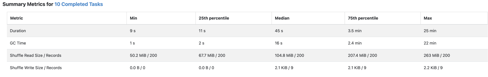
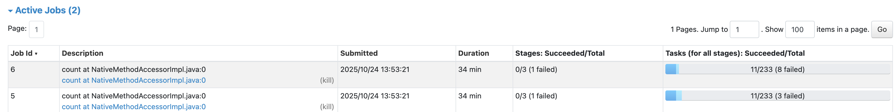
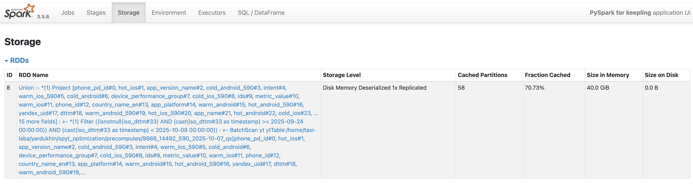
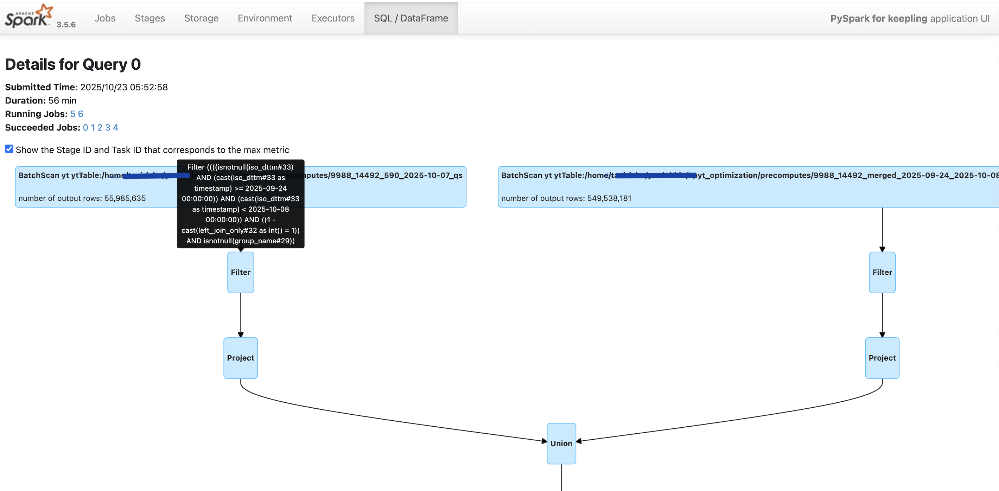

# Diagnosing Spark application issues

When working with Spark applications, issues can be divided into two main categories:

1. **Application not working (critical failures):** crashes with errors (`OutOfMemoryError`, `Container killed ...`, etc.), fails to start at all, or gets stuck indefinitely without completing.
2. **Application running slowly (performance issues):** the task usually completes, but takes too much time; there’s a sense of inefficient resource usage (CPU, memory).

Diagnosing these two scenarios starts with different steps, although methods may overlap at later stages (for example, memory shortage can both cause crashes and slowdowns due to long GC pauses).

- In the case of **critical failures**, the application may not reach the stage where tools like Spark UI are available. Therefore, the primary diagnostic tools are **logs**: driver logs, executor logs, and cluster manager logs.
- In the case of **performance issues**, the application is running and therefore generates a lot of useful data. The primary diagnostic tools are **Spark UI**, **Spark History Server (SHS)**, and execution **metrics**.

Information on resolving **critical failures** for a standalone SPYT cluster is available in the [SPYT Cluster / Troubleshooting](../../../../../user-guide/data-processing/spyt/problems.md) section.

## Steps to diagnose performance issues { #steps }

### Step 1: Quick analysis (Initial diagnosis) { #step1 }

At this stage, you need to identify obvious “symptoms” of inefficient application operation by analyzing **Spark UI** or **Spark History Server**.

* **Cumbersome execution plan.** A physical plan that’s too complex or long in the **SQL/DataFrame** section is hard to analyze for identifying bottlenecks (suboptimal areas). Also, if some partitions are lost, the plan will be re‑executed in full.
* **Frequent garbage collector (GC) pauses.** In the **Executors** section, check the `GC Time` column. If this value makes up a significant part of `Task Time` (in which case a red background is used), it indicates memory shortage, inefficient JVM object usage, or partitions that are too large.

{ .center }

* **Data skew in partitions (Data Skew).** In the **Stages** section, check task statistics. If the maximum execution time (`Max`) significantly exceeds the median (`Median`), this indicates uneven data distribution across keys. A few tasks are slowing down the entire stage.

{ .center }

* **Suspicious parallel jobs.** In the **Jobs** section, you see several jobs starting simultaneously, although you expected only one. This may indicate repeated reading of the same data due to multiple `actions` (for example, `.show()`, `.count()`, `display()`) on an uncached DataFrame.

{ .center }

### Step 2: “Divide and conquer” principle { #step2 }

This is a key step for analyzing large and complex applications. Instead of optimizing monolithic code, break it down into logical parts.

1. **Code splitting.** Break the transformation chain into separate steps. Save the result of each step into a named DataFrame.
    ```python
    # Instead of:
    # final_df = source_df.filter(...).join(...).groupBy(...).agg(...)

    # Use:
    filtered_df = source_df.filter(...)
    joined_df = filtered_df.join(...)
    aggregated_df = joined_df.groupBy(...).agg(...)
    ```

2. **Caching (`.persist()`) and materialization (`.count()`).** Cache intermediate DataFrames, especially before heavy operations (join, groupBy).
    * You can see which DataFrame calculation takes the most time.
    * It allows you to restart only the problematic code section without recalculating the whole previous chain.
    * After caching, you can estimate the actual data size at each stage in the tab.

{ .center }

3. **Saving to disk.** You can save some intermediate DataFrames to persistent storage (Cypress) and read them in the next step. This way, you “cut” the execution plan and don’t use memory for caching.

### Step 3: Reducing data volume at early stages { #step3 }

The earlier you filter out unnecessary information, the fewer resources will be needed at later stages.

* **Pushdown filters and Column Pruning.** Make sure that Spark pushes filters (`.filter()`, `.where()`) and column selection (`.select()`) down to the data source level. This allows reading only the data you actually need from disk.

   

   In Spark UI, in the **SQL/DataFrame** tab, find the `Scan` stage for your source. Compare the number of rows in the original table and the `number of output rows` value. If they match when filters are present, pushdown hasn’t worked.

   

{ .center }

* **Proper type casting.** If a filtering condition compares a column and a value of different types, cast the value to the column’s type, not the other way around.

    ```python
    # Good: the predicate can be pushed down to the data storage level
    df.filter(col("date_str") == "2023-01-01")

    # Bad: a function on the column prevents pushdown
    df.filter(to_date(col("date_str")) == lit(some_date_object))
    ```

### Step 4: Execution plan analysis { #step4 }

After isolating the problematic section, study its execution plan in detail in Spark UI.

* **Aggregations (`HashAggregate` vs `ObjectHashAggregate`):**
    * `HashAggregate` works fast and efficiently in terms of memory, using whole‑stage codegen.
    * `ObjectHashAggregate` in the plan is a warning sign. It operates with JVM objects, which leads to high memory consumption and frequent GC. It usually appears when aggregating by keys with complex data types.

* **Heavy aggregations and Data Skew:** One common cause of OOM is aggregation by a key with strong skew, when all data for one key tries to be processed on a single executor. Adaptive Query Execution (AQE) doesn’t always handle this case.
    * **Approximate calculations.** Use them if absolute precision isn’t required for the business task. They work orders of magnitude faster and require significantly fewer resources. For example, use `approx_count_distinct()` instead of `countDistinct()`.
    * **Two‑stage aggregation.** To deal with skew, you can first perform aggregation by adding “salt” (a random value) to the key, then do the final aggregation by the original key.
    * **Split aggregations into “light” and “heavy” ones.** Calculate them separately, then combine the results using `.join()`.

* **Using hints (Hints).** Manually tell Spark how to best execute an operation. Using `.hint()` doesn’t break AQE.

    ```python
    # Example: forcefully set the number of partitions
    df.hint("REPARTITION", 100)
    ```

* **Spark configuration.** Optimize parameters once you understand the bottlenecks:
    * **Memory allocation:** `spark.executor.memory`, `spark.memory.fraction`.
    * **AQE settings:** `spark.sql.adaptive.enabled`, `spark.sql.adaptive.skewJoin.enabled`.
    * **Auto‑Broadcast Join threshold:** `spark.sql.autoBroadcastJoinThreshold`.



   Change memory allocation settings with caution. This can lead to significant degradation.


