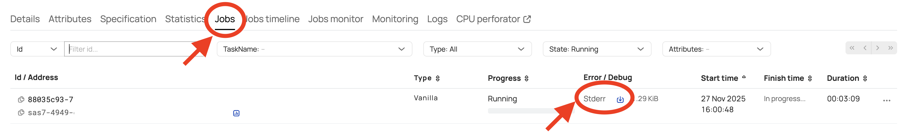

# Diagnostics

To diagnose the operation of direct submit, you can use the following tools:

- **Job log analysis** — diagnostic information can be obtained in [{{product-name}} operation logs](../../../../../user-guide/data-processing/spyt/direct-submit/desc.md#joblogs).
- **SparkUI** — for monitoring during application execution. [Below](../../../../../user-guide/data-processing/spyt/direct-submit/desc.md#info) is information on how to get a link to SparkUI.
- **Spark History Server** — for analyzing the Spark application event logs after it has completed. [More details](../../../../../user-guide/data-processing/spyt/direct-submit/shs.md).

### Job Log Analysis {#joblogs}

To analyze job logs, you need to go to the page of the corresponding driver or executor operation, go to the Jobs tab, and select the stderr of the desired job for viewing.
Please note the following:
- Only logs that are written to stderr are available, so you need to make the appropriate logging settings in the running Spark application.
- Currently, the driver and executors are launched in different {{product-name}} operations, so logs need to be checked in both.

{ .center }

### Reference Information {#info}

After launching a Spark application, additional reference information about the Spark application becomes automatically available in the driver operation: the operation ID with executors for quick access to logs, as well as the SparkUI URL.

{ .center width="75%"}
