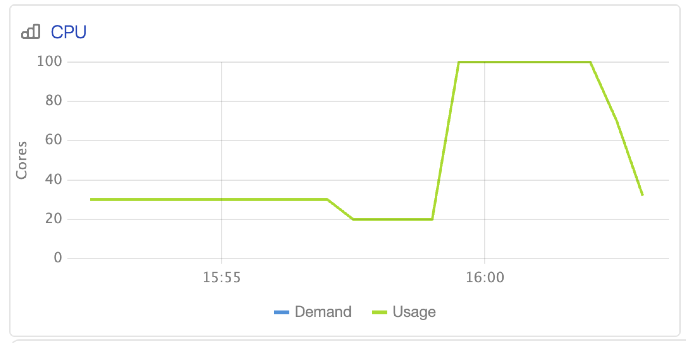

# Dynamic Resource Allocation (available since SPYT version 2.8.0)

Dynamic allocation allows you to scale resources to meet the needs of a Spark application within specified limits.
To use dynamic allocation, you need a connected external shuffle service that ensures data integrity when executors are removed.

To enable the option, you need to set the following parameters:

```
--conf spark.dynamicAllocation.enabled=true
--conf spark.ytsaurus.shuffle.enabled=true
```

In addition, you need to specify the initial, minimum, and maximum number of executors, and additional parameters if necessary, using the standard [Spark configuration](https://spark.apache.org/docs/latest/configuration.html#dynamic-allocation).



Currently, dynamic allocation does not support multiple executor resource profiles.



If everything is set up correctly and the nature of the application implies uneven use of computing resources, you will see the CPU count changing over time on the operation monitoring page.

{ .center width="40%" }
