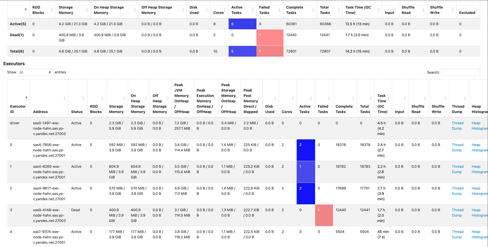
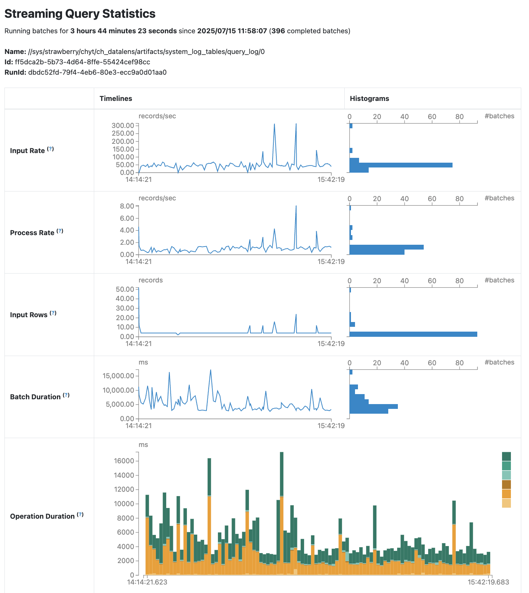

# Structured Streaming

SPYT 1.77.0 introduced support for [streaming processes](https://spark.apache.org/docs/latest/streaming/index.html) over {{product-name}}.

## General scheme of Spark Structured Streaming in SPYT

{ .center }

### Concepts

`Queue`: Any ordered dynamic table.

`Consumer`: A sorted table that has a defined schema. It has a many-to-many relationship with queues and represents a consumer of one or more queues. A consumer's function is to store offsets across the partitions of readable queues.

`Source`: A data source. In regard to streaming over the Queue API, this is a queue (ordered dynamic table).

`Sink`: A data sink. Dependent on task an output table may be either sorted or ordered dynamic table.

`Microbatch`: An amount of data that's processed within a single streaming iteration.

`Streaming Query`: A continuously running process that processes data streams in microbatches. It reads data from `Source`, applies specified transformations, and writes results to `Sink`. It's created using the `start()` method of the `DataStreamWriter` class.

## Checkpoint storage { #checkpoint-location }

{{product-name}} can serve as a reliable storage for offsets and other metadata. For this, specify the `checkpointLocation` option with the `yt:///...` value. This saves all subsequent metainformation about the task at the specified path.

<small>Listing 1 — Example of using checkpoint storage</small>

```scala
val numbers = spark
  .readStream
  .format("rate")
  .option("rowsPerSecond", 1)
  .load()
  .select($"timestamp", floor(rand() * 10).as("num"))

val groupedNumbers = numbers
  .withWatermark("timestamp", "5 seconds")
  .groupBy(window($"timestamp", "5 seconds", "3 seconds"), $"num")
  .count()

val job = groupedNumbers
  .writeStream
  .option("checkpointLocation", "yt:///tmp/spark-streaming/sample01/checkpoints")
  .trigger(ProcessingTime(1000))
  .foreachBatch { (frame: DataFrame, batchNum: Long) =>
    frame.write.mode(SaveMode.Append).yt("//tmp/spark-streaming/sample01/result")
  }

val query = job.start()
query.awaitTermination()
```

## Streaming {{product-name}} queues { #queues }

{{product-name}} has its own implementation of [queues](../../../../user-guide/dynamic-tables/queues.md) based on ordered dynamic tables.

Currently, the SPYT cluster can operate only on data located on the same {{product-name}} cluster. This limitation also applies to queues and consumers.

Before starting a streaming task, create and configure queues as described in the [documentation](../../../../user-guide/dynamic-tables/queues.md#api). For read tasks, create queue and consumer tables, then register the consumers. Streaming results are written to an ordered dynamic table that is created and mounted in advance.

After processing a chunk of data, a new offset is committed to notify the input table to delete unnecessary rows.

When using queues for reading and writing, at-least-once guarantees can be enabled.

<small>Listing 2 — Example of using queues in Scala</small>

```scala
val numbers = spark
  .readStream
  .format("yt")
  .option("consumer_path", "//tmp/spark-streaming/sample02/consumer")
  .load("//tmp/spark-streaming/sample02/queue")

val job = numbers
  .writeStream
  .option("checkpointLocation", "yt:///tmp/spark-streaming/sample02/checkpoints")
  .trigger(ProcessingTime(2000))
  .format("yt")
  .option("path", "//tmp/spark-streaming/sample02/result")

val query = job.start()
query.awaitTermination()
```

<small>Listing 3 — Example of using queues in Python</small>

```python
from pyspark.sql.functions import length
from spyt import spark_session

with spark_session() as spark:
    df = spark \
        .readStream \
        .format("yt") \
        .option("consumer_path", "//tmp/spark-streaming/sample02/consumer") \
        .load("//tmp/spark-streaming/sample02/queue")
    df\
        .select("data") \
        .withColumn('data_length', length("data")) \
        .writeStream \
        .format("yt") \
        .option("checkpointLocation", "yt:///tmp/spark-streaming/sample02/checkpoints") \
        .option("path", "//tmp/spark-streaming/sample02/result") \
        .start().awaitTermination()
```

## Mechanism of microbatch processing in Streaming Query { #streaming-query-processing-mechanism }

1. **Initializing a batch**

   The driver runs processing of the new **#N** microbatch:
   - It retrieves current offsets (lowerIndex) for all partitions in the queue.
   - It calculates upperIndex for each partition using the formula:
     ```
     upperIndex = min(
         lowerIndex + max_rows_per_partition,
         current_end_of_queue
     )
     ```

2. **Comparing lowerIndex and upperIndex**

   For each partition:
   - If lowerIndex < upperIndex:
     - The [advanceConsumer](../../../../user-guide/dynamic-tables/queues.md#rabota-s-konsyumerom) method is executed to commit offsets of batch `#N-1` in the consumer.
     - Tasks for executors are created.
   - Otherwise: processing is skipped (the batch is empty).

3. **Running on executors**

   For its partition, each executor:
   - Writes data using the [pullConsumer](../../../../user-guide/dynamic-tables/queues.md#chtenie-dannyh) method.
   - Applies transformations (if any).
   - Writes data to an output table.

4. **Creating checkpoint files on Cypress for batch #N**
   - A file in the `offsets` directory.
   - A file in the `commits` directory.

5. **New iteration**
   - The system proceeds to batch `#N+1`.
   - Then it repeats steps 1–3 with new offsets.
   - The commit of batch **#N** is only invoked at stage 2 of the `#N+1` iteration, provided there are available rows.

## Working with offsets { #streaming-offsets }

Offsets are currently stored in two places:

1. In [checkpoint files](../../../../user-guide/data-processing/spyt/structured-streaming#checkpoint-location) automatically created by Spark in the directory.
2. In the "consumer" table.


### Defining lowerIndex and upperIndex for each partition

1. Spark tries to find the last checkpoint file on Cypress.
   - If there is one, the offset structure containing `lowerIndex` for each partition is retrieved.
   - If not, offsets are retrieved from the consumer.
2. For each partition of the input queue, the maximum $row_index is retrieved — `upper_row_index`.
3. The `max_rows_per_partition` option is analyzed:
   - If it's set, `upperIndex` is calculated for each partition using the formula:
     ```
     upperIndex = min(
         lowerIndex + max_rows_per_partition,
         upper_row_index
     )
     ```

### Possible offset misalignment

Due to the late `commit` method call implemented in Spark, offsets in the consumer may be one batch behind offsets in checkpoint files if:
- Batch **#N** has been fully processed, but batch `#N+1` hasn't been initialized yet.
- Batch `#N+1` is empty and won't be processed because there are no (or none left) unread rows in the input queue.

Then the offsets in the last checkpoint file will correspond to `upperIndex` of batch **#N**, while the `offset` field in the consumer will correspond to `upperIndex`.


## Achieving exactly-once semantics { #exactly-once }

Spark Structured Streaming running over {{product-name}} queues provides the `at-least-once` guarantee.

In some scenarios, it's possible to achieve the `exactly-once` guarantee if two conditions are met simultaneously:

1. **Stateless processing**

   Such operations include:
   - Simple transformations (`select`, `filter`, `withColumn`).
   - Projections and column renaming.
   - Any operations where each output row is **strictly dependent on a single input row**.

2. **Injective mapping**

   The following requirements must be met:
   - Each input row is converted to **no more than one output row**.
   - No operations generate duplicates. For example, `join`, `groupBy`, `union` without deduplication must not be used.


**Required actions:**

1. Set the `include_service_columns` option to `true`. With this option, the streaming DataFrame will include the `__spyt_streaming_src_tablet_index` and `__spyt_streaming_src_row_index` columns, which correspond to the `$tablet_index` and`$row_index` columns of the queue being read.
2. Create a sorted dynamic output table with the `__spyt_streaming_src_tablet_index` and `__spyt_streaming_src_row_index` key columns. You can assign these columns different names in the output table, but in that case, you also need to rename them in the DataFrame (see the example below).
3. If reads originate from more than one queue, you can add a key column containing a unique ID of the source queue to the DataFrame (using `withColumn()`) and to the output table. For example, you can use the queue's ID or path (see the example below).
4. Achieve at-most-once by ensuring that
   - All pairs of the `$tablet_index` and `$row_index` column values are unique within each queue.
   - In the sorted dynamic output table, `__spyt_streaming_src_tablet_index` and `__spyt_streaming_src_row_index` are key columns.

As a result, `at-least-once` + `at-most-once` = `exactly-once`.



Remember that using a sorted dynamic table instead of an ordered one adds sorting overhead. Because of this, if you don't require at-most-once semantics, it's preferable to write to ordered dynamic tables.



<small>Listing 4 — Using the include_service_columns option</small>

```python
import spyt
from pyspark.sql import SparkSession
from pyspark.sql.functions import lit
from yt.wrapper import YtClient
import os


yt = YtClient(proxy="hume.yt.yandex.net", token=os.environ['YT_SECURE_VAULT_YT_TOKEN'])
spark = SparkSession.builder.appName('streaming example').getOrCreate()

schema = [
    {"name": "src_queue_path", "type": "string"},
    {"name": "tablet_idx", "type": "int64"},
    {"name": "row_idx", "type": "int64"},
    {"name": "some_data", "type": "string"},
]
yt.create("table", result_table_path, recursive=True, attributes={"dynamic": "true", "schema": schema})
yt.mount_table(result_table_path, sync=True)

df = spark \
  .readStream \
  .format("yt") \
  .option("consumer_path", consumer_path) \
  .option("include_service_columns", True) \
  .load(queue_path)
  .withColumnRenamed("__spyt_streaming_src_tablet_index", "tablet_idx")
  .withColumnRenamed("__spyt_streaming_src_row_index", "row_idx")
  .withColumn("src_queue_path", lit(queue_path))

query = df\
  .writeStream \
  .outputMode("append") \
  .format("yt") \
  .option("checkpointLocation", checkpoints_path) \
  .option("path", result_table_path) \
  .start()
```

## Configuring the number of rows per batch { #rows-limit }

By default, Spark attempts to read all available rows in the queue as part of a single streaming microbatch. If the queue contains a large number of unread rows, this will lead to `OutOfMemoryError` on the executors. There are two ways to set the microbatch row limit:

1. The `max_rows_per_partition` option sets the maximum number of rows that can be read from a single queue partition within a single batch. For example:
   - If the queue consists of three partitions and `max_rows_per_partition` is set to 1000, no more than 1000 rows will be read from each partition, resulting in a total of no more than 3000 rows per batch. Partitions are evenly distributed among the executors. If there are at least as many executors as there are partitions, each executor processes no more than one partition.
   - In the simplest case where the queue contains one partition, `max_rows_per_partition` effectively sets the row limit per batch.
2. The `spark.yt.write.dynBatchSize` configuration parameter sets the maximum number of rows that can be written to a dynamic table in a single `modifyRows` call. For example:
   - If the executor read 1000 rows, and `spark.yt.write.dynBatchSize` is set to 100, `ModifyRowsRequest` containing 100 rows will be generated 10 times sequentially.

<small>Listing 5 — Using the max_rows_per_partition option</small>

```python
spark = SparkSession.builder.appName('streaming example') \
   .config("spark.yt.write.dynBatchSize", 100) \
   .getOrCreate()

df = spark \
  .readStream \
  .format("yt") \
  .option("consumer_path", consumer_path) \
  .option("max_rows_per_partition", 1000) \
  .load(queue_path)

query = df\
  .writeStream \
  .outputMode("append") \
  .format("yt") \
  .option("checkpointLocation", checkpoints_path) \
  .option("path", result_table_path) \
  .start()
```

## Composite types { #type-v3 }
To process [composite data types](../../../../user-guide/storage/data-types.md) using streaming, enable the `parsing_type_v3` and `write_type_v3` options, same as for batch jobs.

<small>Listing 6 — Processing composite types in Structured Streaming</small>

```python
df = spark \
  .readStream \
  .format("yt") \
  .option("consumer_path", consumer_path) \
  .option("parsing_type_v3", "true") \
  .load(queue_path)

query = df\
  .writeStream \
  .outputMode("append") \
  .format("yt") \
  .option("write_type_v3", True) \
  .option("checkpointLocation", checkpoints_path) \
  .option("path", result_table_path) \
  .start()
```

## Spark Structured Streaming parameters set via Spark methods { #streaming-required-params }

| Parameter | Description | Mandatory | Default value |
|------------|---------------------------------------------------------------|-----------------------------------------------------------------------------|-----------------------|
| format | Format. Specified separately for readStream and writeStream | yes (for Structured Streaming using dynamic tables, specify the `yt` value) | — |
| load | Input queue | yes | — |
| outputMode | Write mode | no | "append" |


## Spark session parameters for the streaming configuration { #streaming-configs }

| Option | Description | Mandatory | Default value |
|-----------------------------|------------------------------------------------------------------------------|--------------|-----------------------|
| spark.yt.write.dynBatchSize | Maximum number of rows in a single dynamic table write operation | no | 50000 |


## Options { #streaming-options }

| Option | Description | Mandatory | Default value |
|-------------------------|-----------------------------------------------------------------------------------------|--------------|-----------------------|
| consumer_path | Path to the consumer table | yes | — |
| checkpointLocation | Path to the directory containing checkpoint files | yes | — |
| path | Path to the output table | yes | — |
| include_service_columns | Add the `$tablet_index` and `$row_index` columns of the queue being read to the DataFrame | no | false |
| max_rows_per_partition | Maximum number of rows read from a queue partition as part of a single batch | no | ∞ |
| parsing_type_v3 | Read composite types with types preserved | no | false |
| write_type_v3 | Write composite types with types preserved | no | false |


## Compatibility matrix { #compatibility-matrix }

| Functionality | Minimum SPYT version |
|--------------------------------------------------------|---------------------------------------------------------------------------------|
| {{product-name}} checkpoint storage | 1.77.0 |
| Structured Streaming over the {{product-name}} Queue API | 1.77.0 |
| Support for composite data types | 2.6.0 |
| Max_rows_per_partition option | 2.6.0 |
| Include_service_columns option | 2.6.0 |
| Spark.yt.write.dynBatchSize parameter | Starting from version 2.6.5, became configurable for streaming (previously, was fixed at 50000) |


## Monitoring in the Spark webUI { #monitoring }

The Jobs, Stages, and SQL/Dataframes pages, similar to those in standard Spark applications, serve to monitor jobs, execution stages, and query plans.

The Environment page is used to view all configuration parameters of the Spark session and certain metrics.

On the Executors page, you can see the number of active, failed, and completed tasks and figure out how optimally the executor cores are loaded. Additionally, you can check memory usage statistics. Occasionally, when dealing with memory leaks, you can go to Thread Dump or Heap Histogram to identify the cause for them.

{ .center }

For streaming processes, the Structured Streaming page appears in the webUI by default. Here you can view statistics for active and completed streams. For example, it may be useful to check the error that caused the Streaming Query to terminate.

{ .center }

By clicking the Run ID value, you can view detailed statistics for a specific Streaming Query.

{ .center }

## Best practices { #best-practices }

- Set up the `max_rows_per_partition` option and the `spark.yt.write.dynBatchSize` config properly to limit the size of rows processed per batch. Don't make them too large to avoid the risk of getting `OutOfMemoryError`. However, don't make them too small, as this will result in batches being created too frequently, significantly increasing the load on {{product-name}} master and proxy servers.
- Set a small value for the `spark.sql.streaming.minBatchesToRetain` config. This parameter defines the minimum number of recent batches whose metadata must be stored. These are files in the checkpoint directory on Cypress and objects in the internal driver structures. The default value for this config is 100. For streaming without stateful transformations, just set `--conf spark.sql.streaming.minBatchesToRetain=2`. This helps you save chunks on Cypress and reduce driver memory usage.
- Set the following configuration parameters when creating a Spark session:
   - `.config("spark.streaming.stopGracefullyOnShutdown", True)`: Properly complete processing of all created batches and clean up resources prior to streaming shutdown.
   - `.config("spark.streaming.stopGracefullyOnShutdown.timeout", ...)`: Proper shutdown timeout in milliseconds.
   - `.config("spark.sql.adaptive.enabled", False)`: Standard adaptive execution doesn't work for streaming. Disable it.
   - `.config("spark.sql.streaming.adaptiveExecution.enabled", True)`: Enable special adaptive execution for streaming jobs.

- Configure memory allocation using the `spark.memory.fraction` and `spark.memory.storageFraction` parameters, for example:
  - `.config("spark.memory.fraction", 0.5)`: 50% of memory for execution, 50% for storage.
  - `.config("spark.memory.storageFraction", 0.2)`: allocate 20% of memory for cache and 80% — for data processing (optimal for non-caching scenarios).
