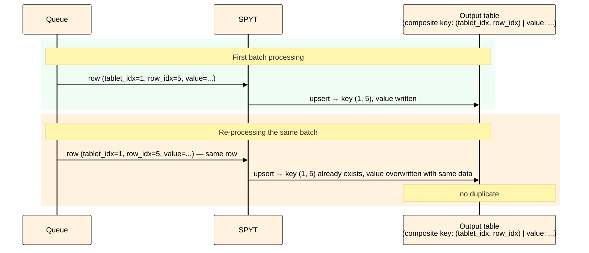

# Idempotent receiver

This article provides instructions for configuring an idempotent receiver.



The idempotent receiver is slower than non‑transactional streaming and the [transactional mode](../../../../../../user-guide/data-processing/spyt/structured-streaming/exactly-once/transactional-mode.md). This is because data is written to a sorted dynamic table, which requires index updates on every write. If write speed is critical, consider the transactional mode: it’s faster and supports any transformations.



## How it works { #how-it-works }

The idempotent receiver achieves `exactly‑once` semantics differently from the [transactional mode](../../../../../../user-guide/data-processing/spyt/structured-streaming/exactly-once/transactional-mode.md): not through atomicity, but through idempotent writes. If the same rows are written to the table when a batch is re‑executed, no duplicates are created.

The mechanism is based on unique identification of each queue row:

1. Each row in an ordered dynamic table (queue) is addressed by an immutable pair (`$tablet_index`, `$row_index`) — the tablet index and the row’s position within it.
2. SPYT passes these values to the streaming dataframe as service columns `__spyt_streaming_src_tablet_index` and `__spyt_streaming_src_row_index`.
3. The output table is created as a sorted dynamic table with a composite primary key on these two columns.
4. Writing occurs via upsert: if a row with this composite key already exists, it is overwritten with the same data. When a batch is processed again, the result is the same as the first write.

<div class="mermaid-diagram-compact">



</div>

## When to use it { #applicability }

The idempotent receiver works only with stateless 1:1 transformations — that is, those where:

- Row processing does not depend on previous micro‑batches.
- Each input row is transformed into exactly one output row.

Below are examples of Spark operations that do and do not work with the idempotent receiver:

| **Works with the idempotent receiver** | **Does not work with the idempotent receiver** |
|---|---|
| `select`, `filter`, `withColumn`, projections, renaming | `join`, `groupBy`, `explode`, `flatMap`, `union`[*](*union), aggregations |

With operations that produce multiple output rows (e.g., `explode` or `join` in one‑to‑many mode) or with aggregations (`groupBy`), the link between the row’s position in the queue and the output data is broken — service columns are either lost or stop uniquely identifying the result.

## How to enable it { #steps }


1. When reading the queue, set the [include_service_columns](../../../../../../user-guide/data-processing/spyt/thesaurus/streaming-options.md#service-columns) option to `true`. Then the streaming dataframe will contain the columns `__spyt_streaming_src_tablet_index` and `__spyt_streaming_src_row_index`, which correspond to `$tablet_index` and `$row_index` of the row in the queue being read.
2. Create an output [sorted dynamic table](../../../../../../user-guide/dynamic-tables/sorted-dynamic-tables.md) and mount it before starting streaming.
   - If reading from a single queue, use `__spyt_streaming_src_tablet_index` and `__spyt_streaming_src_row_index` as key columns. Key columns must be specified in the schema and form its prefix; see the [table schema](../../../../../../user-guide/storage/static-schema.md). You can rename these columns — then rename them in the dataframe too, as shown in the listing below.
   - If reading from more than one queue, add another column with a unique identifier of the source queue (e.g., its path) to the output table’s key and to the dataframe. See the [example](#multi-queues) for how to do this.

After this setup, the output table’s key is uniquely determined by the original queue row, so re‑writing the same row does not create a duplicate.

## How to verify it { #verify }


To check that the setup is correct, open the output table after several micro‑batches have been processed — it should contain rows with key columns (or their renamed equivalents). If there is no data, check that the table is mounted and that the `include_service_columns` option is set to `true`.


## Example { #example }

### Single queue

<small>Listing — Using an idempotent receiver for a single queue</small>

```python
# In the example, the output table contains only key columns — this is the minimum
# configuration required for idempotent writing.
# In a real task, add the remaining result columns to the table schema and dataframe.

import os
import spyt
import yt.yson as yson
from pyspark.sql import SparkSession
from yt.wrapper import YtClient

queue_path = "//path/to/queue"
consumer_path = "//path/to/consumer"
result_table_path = "//path/to/result"
checkpoints_path = "//path/to/checkpoints"


yt = YtClient(
    proxy="<cluster-name>",
    token=os.environ["YT_SECURE_VAULT_YT_TOKEN"],
)

spark = SparkSession.builder.appName("streaming example").getOrCreate()

# The table key must uniquely identify the original queue row.
schema = yson.YsonList([
    {"name": "tablet_idx", "type": "int64", "sort_order": "ascending"},
    {"name": "row_idx", "type": "int64", "sort_order": "ascending"},
])
schema.attributes["unique_keys"] = True

# Create and mount the output dynamic table in advance.
yt.create(
    "table",
    result_table_path,
    recursive=True,
    attributes={
        "dynamic": True,
        "schema": schema,
    },
)
yt.mount_table(result_table_path, sync=True)


# Rename service columns so they match the output table schema.
df = (
    spark.readStream.format("yt")
    .option("consumer_path", consumer_path)
    .option("include_service_columns", True)
    .load(queue_path)
    .withColumnRenamed("__spyt_streaming_src_tablet_index", "tablet_idx")
    .withColumnRenamed("__spyt_streaming_src_row_index", "row_idx")
    .select("tablet_idx", "row_idx")
)

query = (
    df.writeStream.outputMode("append")
    .format("yt")
    .option("checkpointLocation", checkpoints_path)
    .option("path", result_table_path)
    .start()
)
```

### Multiple queues { #multi-queues }

If reading from multiple queues, add another key column with the queue identifier (e.g., its path) to the output table schema and to the dataframe. There is no service column with the queue path in SPYT: only `__spyt_streaming_src_tablet_index` and `__spyt_streaming_src_row_index` are available, and there is no equivalent of `input_file_name()`. Therefore, you must add the queue identifier manually when reading each queue:

<small>Listing — Reading from multiple queues with a source identifier</small>

```python
from pyspark.sql.functions import lit

df1 = (
    spark.readStream.format("yt")
    .option("consumer_path", consumer_path)
    .option("include_service_columns", True)
    .load(queue_path_1)
    .withColumn("queue_id", lit(queue_path_1))
)

df2 = (
    spark.readStream.format("yt")
    .option("consumer_path", consumer_path)
    .option("include_service_columns", True)
    .load(queue_path_2)
    .withColumn("queue_id", lit(queue_path_2))
)

df = df1.union(df2)
```

In this case, the output table key must include `queue_id` together with columns derived from `__spyt_streaming_src_tablet_index` and `__spyt_streaming_src_row_index`.

## Common configuration errors { #violations }

| **Error** | **Consequence** |
|---|---|
| One input row produces multiple output rows | The idempotent key is no longer one‑to‑one: multiple output rows compete for the same key. As a result, some data may be overwritten without the job failing, leading to silent data loss |
| The transformation loses the service columns `__spyt_streaming_src_tablet_index` and `__spyt_streaming_src_row_index` (or their renamed equivalents) | The batch write will fail: the dataframe will lack the key columns required for the output table |
| Reading from multiple queues (e.g., combined via `union`) but the queue identifier is not included in the key | Each queue numbers rows independently, so rows from different queues may get the same key `(tablet_index, row_index)`. The `upsert` operation will overwrite one row with another — data will be lost without errors or warnings |
| The output table is not configured as a sorted dynamic table with the required key columns | The idempotent write mechanism will not work: re‑writing the same original row will not be reliably deduplicated, and the `exactly‑once` guarantee is not achieved |

## See also { #see-also }

- [Exactly‑once guarantee](../../../../../../user-guide/data-processing/spyt/structured-streaming/exactly-once/index.md) — choosing an approach to write guarantees
- [Transactional mode](../../../../../../user-guide/data-processing/spyt/structured-streaming/exactly-once/transactional-mode.md) — recommended approach for new tasks
- [Streaming options](../../../../../../user-guide/data-processing/spyt/thesaurus/streaming-options.md) — options reference


[*union]: Each queue numbers rows independently: queue A and queue B may have a row with the same key `(tablet_index=0, row_index=42)`, although these are different data. If you combine them directly via `union`, both rows will go to the output table with the same key — upsert will overwrite one with the other, and data will be lost without any errors or warnings. To keep keys unique, add a source identifier column to each row before combining: `.withColumn("queue_id", lit(queue_path))` — and include `queue_id` in the output table key.
