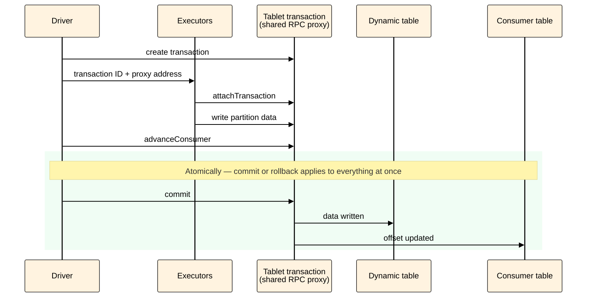

# Transactional streaming mode



Currently, the transactional mode is experimental. Due to architectural specifics, this mode may create increased load on shared RPC proxy pools. We recommend enabling this option only where the `exactly‑once` guarantee is truly required.



## How it works { #how-it-works }

In transactional mode, data writing and consumer offset committing are combined into a single tablet transaction. This eliminates duplicates when re‑executing a micro‑batch. Unlike the [idempotent receiver](../../../../../../user-guide/data-processing/spyt/structured-streaming/exactly-once/idempotent-receiver.md), this approach works with any transformations, including shuffle (`join`, aggregations).

Sequence of actions when processing each micro‑batch:

1. The driver creates a tablet transaction on the shared RPC proxy.
2. The driver passes the transaction ID and proxy address to the executors.
3. Each executor joins the transaction via `attachTransaction` and writes data from its partition.
4. The driver calls `advanceConsumer` within the same transaction.
5. The driver commits the transaction.
6. The transaction atomically finalizes the result: data is written to the output table, and the offset is updated in the consumer table.

<div class="mermaid-diagram-compact">



</div>

## Prerequisites { #prerequisites }

Before enabling the transactional mode:

1. Check your SPYT version — the transactional mode is available starting from version 2.10. To check: Spark UI → **Environment** tab → **Spark Properties** section → `spark.yt.version`.

2. Create an output table with a sufficient number of tablets and mount it. Do this before starting the stream — the transaction writes the entire micro‑batch atomically. If there are too few tablets, the transaction will fail due to the row limit per tablet. For details, see the [Output table sharding](#sharding) section.

## How to enable { #enable }

Set two Spark session parameters:

- `spark.yt.streaming.transactional = true` — enables transactional writing of micro‑batches.
- `spark.ytsaurus.rpc.job.proxy.enabled = false` — disables local Job Proxies and switches the driver and executors to work via shared pools of external RPC proxies.

The `spark.ytsaurus.rpc.job.proxy.enabled = false` flag is an architectural requirement. By default, the driver and each executor run their own RPC proxy. A transaction opened in the driver’s RPC proxy is not visible in the executors’ RPC proxies — therefore, all participants must work through a single shared proxy.




Due to shared pool usage, commit stability and speed depend on other cluster tenants. If the pools are overloaded with other tasks, micro‑batch write time may increase. In rare cases, `transaction expired` errors may occur. Consider this when estimating throughput and be ready to adjust the micro‑batch size in case of frequent timeouts — see the `max_rows_per_partition` parameter in [Streaming options](../../../../../../user-guide/data-processing/spyt/thesaurus/streaming-options.md).



Examples:



- Python

  ```python
  spark = SparkSession.builder \
    .config("spark.yt.streaming.transactional", "true") \
    .config("spark.ytsaurus.rpc.job.proxy.enabled", "false") \
    .getOrCreate()

  # The rest of the code is standard Spark Structured Streaming, unchanged
  ```

- CLI

  ```bash
  spark-submit \
    --conf spark.yt.streaming.transactional=true \
    --conf spark.ytsaurus.rpc.job.proxy.enabled=false \
    ...
  ```



## How to verify { #verify }

Open Spark UI → **Environment** tab → **Spark Properties** section and look for:

```
spark.yt.streaming.transactional      true
spark.ytsaurus.rpc.job.proxy.enabled  false
```

If either parameter is missing or has a different value, the transactional mode is not enabled.

## Output table sharding { #sharding }

YTsaurus has an internal [limitation](../../../../../../user-guide/dynamic-tables/transactions.md#restrictions): within a single transaction, you cannot write more than a certain number of rows to one tablet (100 000 by default). Since the transactional mode writes the entire micro‑batch atomically in one transaction, all its rows are distributed across the output table’s tablets. If there are too few tablets and the micro‑batch is large, each tablet will receive too much data — the limit will be exceeded, and the transaction will fail with the `Transaction affects too many rows in tablet` error.

To ensure transactions stay within limits, shard the output table — split it into more tablets before starting the stream. There is no exact formula for calculating the required number of tablets — determine it empirically based on the load pattern:

- For non‑shuffle loads, when data is written unchanged or with simple transformations (`filter`, `select`), follow the number of tablets in the source queue.
- For shuffle operations (`join`, `groupBy`, aggregations), there is no universal rule — estimate the expected micro‑batch result size and adjust as needed.

For instructions on setting the number of tablets when creating a table or changing it later, see the [Sharding](../../../../../../user-guide/dynamic-tables/resharding.md) section.


## Failure behavior { #failures }

Error during batch processing or writing:

:   The transaction is aborted (`abort`). No data is written, and the consumer offset is not advanced. Spark automatically retries the micro‑batch — thanks to transactionality, no duplicates will be written.

Driver restart after a successful commit:

:   The transaction has already been committed: data is written, and the consumer offset is advanced. On restart, Spark reads the current offset from YTsaurus and continues from the new position — no duplicates will occur.

## Troubleshooting { #troubleshooting }

#|
|| **Issue** | **Description and solution** ||
|| `Transaction affects too many rows in tablet` error | The row limit per tablet within a single transaction is exceeded.

Solution: Increase the number of tablets in the output table. See [Output table sharding](#sharding) ||
|| `transaction expired` error | The micro‑batch exceeds the transaction timeout.

Solution: Reduce `max_rows_per_partition` or optimize the transformation ||
|| Executor cannot write data (transaction not found) | A sticky transaction is tied to a single RPC proxy; if the driver and executor go through different proxies, the executor will not find the transaction.

Solution: Make sure the `spark.ytsaurus.rpc.job.proxy.enabled` flag is set to `false` ||
|#

## See also { #see-also }

- [Exactly‑once guarantee](../../../../../../user-guide/data-processing/spyt/structured-streaming/exactly-once/index.md) — choosing an approach to write guarantees
- [Idempotent receiver](../../../../../../user-guide/data-processing/spyt/structured-streaming/exactly-once/idempotent-receiver.md) — alternative for stateless 1:1 transformations
- [Streaming options](../../../../../../user-guide/data-processing/spyt/thesaurus/streaming-options.md) — options reference
- [Configuration parameters](../../../../../../user-guide/data-processing/spyt/thesaurus/configuration.md) — Spark session parameters
