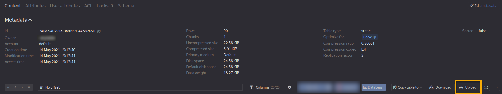

# Working with Microsoft Excel tables

The {{product-name}} web interface allows to upload small Microsoft Excel spreadsheets into static {{product-name}} tables and export data from strict-schema static tables as Microsoft Excel spreadsheets.

## Upload to a new table

To upload data and create a {{product-name}} table at the same time, use the **Create object** menu on the directory page.


{ .center }

{ .center }


Be sure to set the **Column names** and the **Types** toggles to the correct values in the upload menu.

With enabled **Column names**, column names are displayed in the first row of an Excel spreadsheet. If a spreadsheet doesn't have a header row, the Excel column names, such as A, B, C, and so on, are used as column names in the {{product-name}} table.

With enabled **Types**, there's a row with types. The row with types must follow the row with column names (if present). Types are defined in the `type` format (see [type mapping](excel.md#type-mapping)).



If no types are specified, all columns use `any` as their type.




{ .center }

{ .center }


## Uploading into an existing table

To upload data into an existing {{product-name}} table, click the **Upload** button on the table page.


{ .center }

{ .center }




The Excel spreadsheet must include columns from the {{product-name}} table schema. Additional columns in the Excel spreadsheet are ignored.



Use the **Append** toggle in the upload menu to choose the upload mode. The on state corresponds to rows being appended at the end of the {{product-name}} table, the off state means that the table will be overwritten.


{ .center }

{ .center }


## Upload limitations

* Only the first sheet of an Excel workbook is uploaded.
* Maximum number of rows is `1,048,576`.
* Maximum number of columns is `16,384`.
* Maximum input file size is 50 MB.

## Downloading

The interface provides a way to specify the required row and column subset.


{ .center }

{ .center }


The first row of the output contains column names, while the second one their types.

### Limitations

* Strict-schema static tables.
* Maximum number of rows is `1,048,574`.
* Maximum number of columns is `16,384`.
* Maximum output file size is 50 MB.
* Maximum string length in a cell is `32,767`; Strings longer than `32,767` are truncated.

### Type mapping {#type-mapping}

Microsoft Excel supports [4 data types](http://johnatten.com/2011/10/03/microsoft-excel-basics-part-ii-data-types-in-excel/): `Logical`, `Number`, `Text`, and `Error`.

| **{{product-name}} data type description** | **Representation in `type`** | **Representation in `type_v3`** | **Representation in Excel** |
|----------------|--------------------|-----------------------|---------------------|
| An integer within the range `[-2^63, 2^63-1]` | `int64` | `int64` | [Number*](#number*) |
| An integer within the range `[-2^31, 2^31-1]` | `int32` | `int32` | `Number` |
| An integer within the range `[-2^15, 2^15-1]` | `int16` | `int16` | `Number` |
| An integer within the range `[-2^7, 2^7-1]` | `int8` | `int8` | `Number` |
| An integer within the range `[0, 2^64-1]` | `uint64` | `uint64` | [Number*](#number*) |
| An integer within the range `[0, 2^32-1]` | `uint32` | `uint32` | `Number` |
| An integer within the range `[0, 2^16-1]` | `uint16` | `uint16` | `Number` |
| An integer within the range `[0, 2^8-1]` | `uint8` | `uint8` | `Number` |
| A 4-byte real number | `float` | `float` | [Number*](#number*) |
| An 8-byte real number | `double` | `double` | [Number*](#number*) |
| Standard `true/false` Boolean | `boolean` | `bool` (different from `type`) | `Logical` |
| A random sequence of bytes | `string` | `string` | [Text*](#text*) |
| A valid UTF-8 sequence | `utf8` | `utf8` | [Text*](#text*) |
| An integer within the range `[0, 49673 - 1]`  that represents the number of days since the Unix epoch,  with a representable date range of `[1970-01-01, 2105-12-31]` | `date` | `date` | [Number**](#number**) |
| An integer within the range `[0, 49673 * 86400 - 1]`  that represents the number of seconds since the Unix epoch,  with a representable time range of `[1970-01-01T00:00:00Z, 2105-12-31T23:59:59Z]` | `datetime` | `datetime` | [Number**](#number**) |
| An integer within the range `[0, 49673 * 86400 * 10^6 - 1]`  that represents the number of microseconds since the Unix epoch,  with a representable time range of `[1970-01-01T00:00:00Z, 2105-12-31T23:59:59.999999Z]` | `timestamp` | `timestamp` | [Number***](#number***) |
| An integer within the range  `[-49673 * 86400 * 10^6 + 1, 49673 * 86400 * 10^6 - 1]`  that represents the number of microseconds between two timestamps | `interval` | `interval` | [Number*](#number*) |
| An arbitrary YSON structure  that is represented as a byte sequence  and can't have a `required=%true` attribute | `any` | `yson` (different from `type`) | [Text**](#text**) |

#### Number* {#number*}

`Number` is a Double-Precision Floating Point value.

The number can have only [15 digits](https://stackoverflow.com/questions/38522197/converting-the-text-data-to-a-int64-format-in-excel). When entering `99999999999999999` (`10^17-1`), the cell displays `99999999999999900`.

Numbers exceeding this limit are exported as strings.

#### Number** {#number**}

The value from the {{product-name}} table is written to an Excel table cell as the `Number` type, without loss of accuracy. The `date` and `datetime` types are exported as `Number` with special display formats and appear in Excel as:

* `date` — `2020-12-05`
* `datetime` — `2000-12-10 10:22:17`

#### Number*** {#number***}

The value can't fit in `Number`.

`Timestamp` in milliseconds is exported as `Number` with special display formats (`1969-12-30 00:00:00`). For smaller units, it comes out as a string in the following format: `2006-01-02T15:04:05.999999Z`.

#### Text* {#text*}

`Text` is a string type. Maximum strings length in a cell is `32,768`.

In {{product-name}}, a string may be longer: up to `128 * 10^6`. Long strings are truncated.

#### Text** {#text**}

Values are serialized as [YSON](../user-guide/storage/yson.md). Long strings are truncated like in `Text*`.

### Missing values

For missing values of `optional` types, an empty string is added to the cell.
