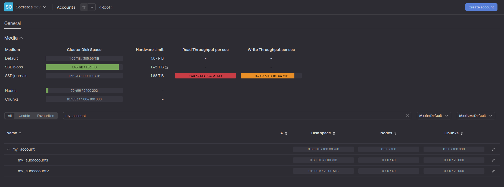
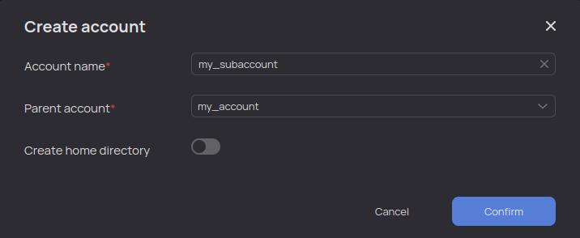

# Accounts

This section contains information about accounts and related quotas in the {{product-name}} system. A description of the account hierarchy, examples of actions with accounts, and a list of account attributes are given.

## General information { #common }

All types of data storage quotas are linked to the project **account**. An account is a service object in [Cypress](../../../user-guide/storage/cypress.md). All accounts have unique names. However, they are located in a separate namespace, so the username and account name may be the same. The account name is stored in the `name` attribute which is both readable and writable.

All accounts known to the system can be found at `//sys/accounts`. You can create and remove accounts using the `create` and `remove` commands.

## Node attributes { #attributes }

Each Cypress node has the readable and writable `account` attribute. This attribute stores the name of the account to which this node is linked. In the case of files and tables, assigning an account causes its disk quota to be consumed. This takes into account the space physically allocated on the cluster nodes for data storage, so it depends on the replication degree (the `replication_factor` attribute), erasure coding method (the `erasure_codec` attribute), and the compression utilized (the `compression_codec` attribute).

Different Cypress nodes (files or tables) can refer to the same chunks. In addition, the same node can refer to a chunk multiple times. Such reuse can occur, for example, as a result of the `copy` command for tables and files, as well as the `merge` and `erase` commands for tables. Such chunks are counted in the quota once (with the maximum replication factor among the tables referring to them).

Nodes of all other types (other than files and tables) do not require data storage on cluster nodes and therefore do not consume the disk quota of the account.

In case of composite nodes, descendants automatically inherit the parent's account when created (unless otherwise specified). Setting the proper value of the `account` attribute on the user's home directory ensures that the tables and files created by the user are assigned to the proper account by default.

To find out how many and which resources a given Cypress node consumes, you should use its `resource_usage` attribute. There is also a computed `recursive_resource_usage` attribute that measures resource usage taking descendants into account. These attributes have the `ClusterResources` structure, see below.

To assign account `A` to a Cypress node, the user who initiated this change must have the `use` permission for account `A`. It must also have the `write` permission. An account for the node can likewise be specified at the time the node is created. In this case, you must also have the `use` permission.

When you copy Cypress parts with the `copy` command and move them with the `move` command, the accounts and the owners in the copied subtree change — they become equal to the account of the folder to which the copying is performed, and to the user who is copying, respectively. To prevent the account from being changed, use the `preserve_account` option.

If the user exceeds the account quota for certain resource types, the system starts denying the account further access to the exceeded resource type. This does not mean that an account never exceeds its limits when used. For example, the limits may have been forcibly set below usage. Besides that, disk and chunk quota consumption tracking works asynchronously, which can also result in exceeding allocated limits.

## Account hierarchy { #account_tree }

Accounts can be nested in other accounts. This enables you to flexibly configure quotas and naturally reflect the organizational structure to which users and projects belong in them. For example, there may be a general organization unit quota and nested project quotas, or a service account and sub-accounts of its constituent groups. The main advantage of representing accounts as a tree is that users are able to manage the quotas assigned to them independently, splitting them into parts and merging them as needed.

Further is a description of the hierarchical organization of accounts and the principles of working with this hierarchy — from the command line and the web interface.

### Quotas { #account_tree_algo }

The quota given to any non-topmost account cannot exceed the quota of its parent (and, by induction, any ancestor).

By default, the sum of sub-account quotas cannot exceed the parent's quota. But such oversubscription can sometimes be convenient, so it can be enabled:

```bash
yt set //sys/account_tree/my_account/@allow_children_limit_overcommit %true
```

In this mode, the sum of children's limits can exceed the parent's limit. However, the limit of an individual sub-account must still be less than or equal to the limit of the parent account.

The above refers to consumption limits (`limits`), not used resources (`usage`). Resources used in an account are counted in its quota, as well as in the quotas of all its ancestors. Validation works the same way: if an increase in consumption causes the account or any of its ancestors to run out of quota, an error is generated.

**Is it possible to borrow resources in non-leaf accounts?**
It is technically possible, but it will be more difficult for the user to evaluate where the quota is spent.

**Is it true that an account cannot overflow if it does not have the enabled flag that allows overcommit of child accounts?**
It is true if and only if resources are not used directly in the account.

### Viewing an account tree { #account_tree_viewing }

Despite the hierarchical organization, accounts have globally unique names. This fact greatly simplifies working with them, because it enables you to refer to the account without specifying the full path to it.



The account hierarchy is represented on the **Accounts** page (as well as in the **Dashboard** section). Due to the global uniqueness of names, when editing the path to an account, you only need to specify its name.

{ .center }





The account tree in Cypress is located at `//sys/account_tree`. The full flat list is available at `//sys/accounts` (account names are globally unique, despite the hierarchical organization).

```bash
yt list //sys/account_tree/my_account
my_subaccount1
my_subaccount2

yt list //sys/accounts
my_account
my_subaccount1
my_subaccount2
```



### Creating an account { #account_tree_creating }

The maximum allowable account tree height is 10.
You can create a topmost account in the {{product-name}} web interface by clicking **Create account** on the **Accounts** page.



To create a new account, you need to:

1. On the **Accounts** page, click **Create account**.
2. Specify the ABC service, the name of the new account, the name of the parent account into which the created account will be nested, as well as the users responsible for the new account. If necessary, you can also request the automatic creation of a home directory corresponding to the account.

{ .center }





To create an account, specify its name in the `name` attribute and the parent name in the `parent_name` attribute. If no parent name is specified, a topmost account will be created. Only {{product-name}} administrators have the right to create such accounts.

```bash
yt create account --attributes='{ name = "my_subaccount3"; parent_name = "my_account" }'
```



### Removing an account { #account_tree_removing }

Accounts can be moved and renamed, so you should only remove an account when you really do not need it anymore.



Before removing an account, make sure there is no data in it. Otherwise, the account will be put into a special pending state instead of being removed until all associated Cypress nodes are removed, after which it will be removed automatically. You can neither use the account in that state, nor return it to its normal state.





To remove an account, you need to:

1. On the **Accounts** page, find the account in the list and click the pencil to edit the account.
2. In the dialog window that opens, go to the **Delete** section, click **Delete**, and confirm the action.





To remove an account, specify the path to it:

```bash
yt remove //sys/accounts/my_subaccount3

# или

yt remove //sys/account_tree/my_account/my_subaccount3
```



#### Moving or renaming an account { #account_tree_moving }



To move an account you need to:

1. On the **Accounts** page, find the account in the list and click the pencil to edit the account.
2. In the dialog window that opens, in the **General** section, in the **Parent** drop-down list, select where to move the account.





There are two ways to move an account:

1. Moving an account using the `parent_name` attribute.

```bash
yt set //sys/account_tree/my_account/my_subaccount3/@parent_name my_subaccount2
yt exists //sys/account_tree/my_account/my_subaccount3
%false
yt exists //sys/account_tree/my_account/my_subaccount2/my_subaccount3
%true
```

Due to the global uniqueness of account names, you only need to specify the name of the parent, not the full path to it.

2. Moving an account using the `move` command.

```bash
yt move //sys/account_tree/my_account/my_subaccount3 //sys/account_tree/my_account/my_subaccount2/my_subaccount3
```

Note that the full path to the account, including its name, is specified as the destination path. In particular, this enables you to rename an account at the same time as you move it.



### Transferring resources from one account to another { #account_tree_transferring_resources }



To transfer resources, you need to:

1. On the **Accounts** page, find the account you want to transfer resources to in the list and click the pencil to edit it.
2. In the dialog window that opens, go to the section corresponding to the type of resource you want to transfer, specify the account whose resources will be reallocated (by default, the parent account is suggested), the new limit, and click **Save**.

{ .center }





Transferring account resources using the `transfer-account-resources` command:

```bash
# yt transfer-account-resources <src_account> <dst_account> --resource-delta <resource_delta>
yt transfer-account-resources my_subaccount1 my_subaccount2 --resource-delta '{node_count=10}'
```

The `resource-delta` argument is a yson structure of the `ClusterResources` type (see below). For example: `{node_count=5;disk_space_per_medium={default=1024}}`. You need to specify the volume of transferred resources, not the new limits. Missing quotas can be skipped.

In case of the `argument command: invalid choice` error, update the `yt` utility. For more information, see the [Installation](../../../overview/try-yt.md) section.



## Built-in accounts { #builtin_accounts }

These accounts appear in the system at the moment of initialization. They cannot be removed.

1. The `tmp` account. During initialization, it is assigned to the `//tmp` folder and therefore to all its descendants. By default, all authenticated users of the system (the `users` group) have the right to use this account.
2. The `sys` account. During initialization, it is assigned to all other nodes. By default, no explicit permissions to use it are given to anyone. The account is used for the internal needs of the {{product-name}} system.

## Account attributes { #account_attributes }

| **Attribute** | **Type** | **Description** |
| ---------------------------------- | --------------------------------- | ------------------------------------------------------------ |
| name | string | Account name (non-empty string) |
| parent_name | string | Parent account name |
| resource_limits | ClusterResources | Resource limits for the account |
| allow_children_limit_overcommit | bool | Whether the sum of sub-account limits can exceed the limit of this account (see above) |
| resource_usage | ClusterResources | Resources occupied directly by this account (including uncommitted transactions) |
| committed_resource_usage | ClusterResources | Resources occupied directly by this account (without taking into account active transactions) |
| recursive_resource_usage | ClusterResources | Resources occupied by this subtree of accounts (including uncommitted transactions) |
| recursive_committed_resource_usage | ClusterResources | Resources occupied by this subtree of accounts (without taking into account active transactions) |
| violated_resource_limits | ViolatedClusterResources | Resource excess flags for the account |
| recursive_violated_resource_limits | RecursiveViolatedClusterResources | For each resource type — the number of accounts that exceeded the limit in this subtree |

`ClusterResources` is the following structure:

### The ClusterResources structure

| **Attribute** | **Type** | **Description** |
| --------------------- | --------------- | ------------------------------------------------------- |
| disk_space | integer | Total disk space in bytes |
| disk_space_per_medium | string->integer | Disk space in bytes (for each medium) |
| node_count | integer | Number of Cypress nodes |
| master_memory | integer | Amount of consumed master server RAM |
| chunk_count | integer | Number of chunks |
| tablet_count | integer | Number of tablets |
| tablet_static_memory | integer | Memory volume for dynamic tables loaded into memory |

The `disk_space` field is read-only. To change the limits, change the values of the `disk_space_per_medium` dict.

`ViolatedClusterResources` is the following structure:

### The ViolatedClusterResources structure

| **Attribute** | **Type** | **Description** |
| --------------------- | --------------- | ------------------------------------------------------------ |
| disk_space | boolean | Whether the disk space limit is exceeded for at least one medium |
| disk_space_per_medium | string->boolean | Whether the disk space limit is exceeded (for each medium) |
| node_count | boolean | Whether the limit on the number of Cypress nodes is exceeded |
| chunk_count | boolean | Whether the limit on the number of chunks is exceeded |
| tablet_count | boolean | Whether the limit on the number of tablets is exceeded |
| tablet_static_memory | boolean | Whether the limit on the memory volume occupied by dynamic tables loaded into memory is exceeded |

`RecursiveViolatedClusterResources` is the following structure:

### The RecursiveViolatedClusterResources structure

| **Attribute** | **Type** | **Description** |
| --------------------- | --------------- | ------------------------------------------------------------ |
| disk_space | integer | The number of accounts in the subtree that have exceeded the disk space limit for at least one medium |
| disk_space_per_medium | string->integer | The number of accounts in the subtree that have exceeded the disk space limit (for each medium) |
| node_count | integer | The number of accounts in the subtree that have exceeded the limit on the number of Cypress nodes |
| chunk_count | integer | The number of accounts in the subtree that have exceeded the limit on the number of chunks |
| tablet_count | integer | The number of accounts in the subtree that have exceeded the limit on the number of tablets |
| tablet_static_memory | integer | The number of accounts in the subtree that have exceeded the limit on the memory volume occupied by dynamic tables loaded into memory |
