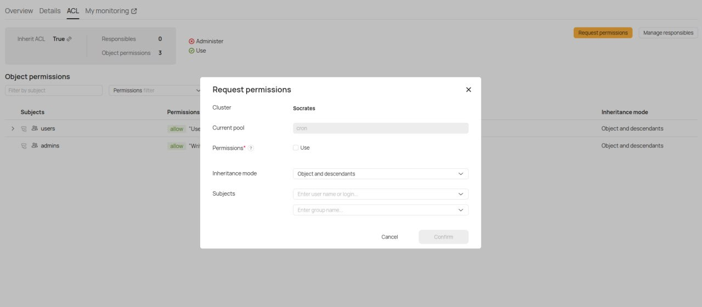
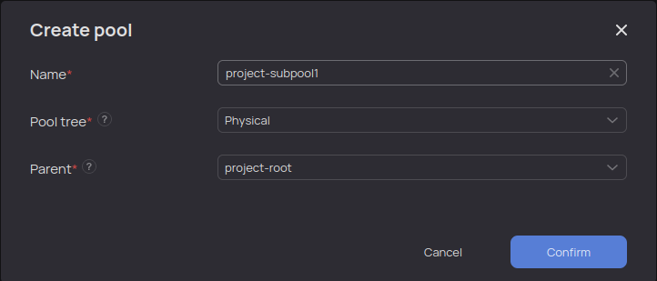
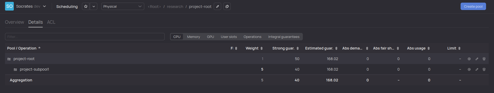
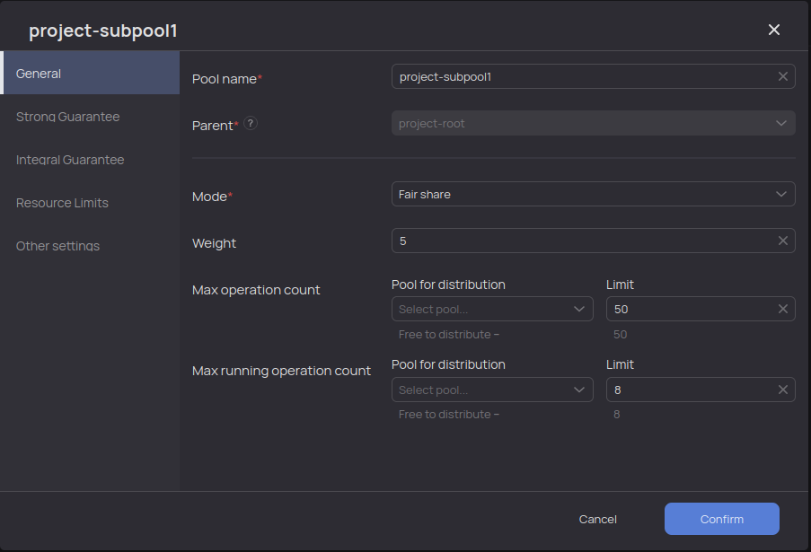
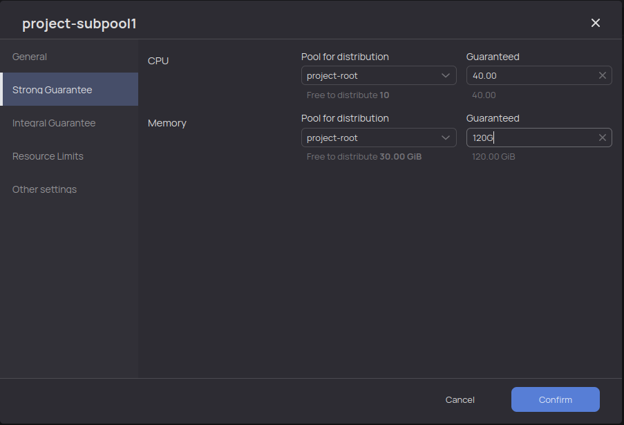



## Access rights

To manage a pool, you need to request access to the pool. You can do this via the {{product-name}} web interface.

Pool access rights are managed by users who already have the appropriate access — by default, access is granted to the user who created the pool.

To request access to a pool:

1. Navigate to the pool page from the `Scheduling` section.
2. Select the `ACL` tab.
3. Click `Request permissions`, fill in the form, and click **Confirm**.

{ .center }

### List of allowed pool actions { #allowed_pool_actions }

- To create or delete pool trees, you need the `write` permission on the root `//sys/pool_trees` (only for {{product-name}} cluster administrators).
- To create pools, you need the `write` or `modify_children` permission on the parent pool (granted together with **Use** access on the parent pool).
- To delete a pool, you need the `remove` permission on it (granted together with **Use** access on the parent pool).
- To change user-defined pool attributes, you need the `write` permission on the pool (granted together with **Use** access on the parent pool).
- To change all other pool attributes, you need the `administer` permission (only for {{product-name}} cluster administrators).
- To manage operations in this pool and its descendants, you need the `manage` permission (managing operations means you can perform `suspend`, `resume`, and `update_operation_parameters` operations without being the operation's author).

As an example, consider the `project-root` pool in the `{{pool-tree}}` pool tree.
The required set of permissions for managing sub-pools is shown in the listing:

```bash
$ yt get //sys/pool_trees/{{pool-tree}}/project-root/@acl
[
    {
        "permissions" = [
            "modify_children";
        ];
        "action" = "allow";
        "subjects" = [
            "some_user";
        ];
        "inheritance_mode" = "object_and_descendants";
    };
    {
        "permissions" = [
            "write";
            "remove";
        ];
        "action" = "allow";
        "subjects" = [
            "some_user";
        ];
        "inheritance_mode" = "descendants_only";
    };
]
```

The user can manage sub-pools but not the project's root pool — they cannot change the guarantee of the project's root pool or other parameters. The permission applies only to the descendants of this pool.



## Managing pools via web interface { #ui }

You can manage pools in the web interface in the `Scheduling` section.

To create a sub-pool, navigate to the parent pool by clicking its name. Then click the `Create pool` button, fill in all required fields in the form, and click `Confirm`.

An example of the pool creation form is shown in the figure.



To edit pool settings, click the pencil icon in the row with the pool name on the right side of the screen, as shown in the figure.



Editable pool settings are divided into groups. The figures show examples of general settings and guaranteed resources, respectively.





In the `Resource Limits` section, you can set an upper limit for the pool, for example, to prevent the pool from using more than 100 CPU cores. By default, pools have no upper limit; the resources available to a pool are limited by the cluster's capacity.

The `Other Settings` section contains additional settings, including the option to prohibit running operations in the pool.



We recommend that you run operations in the leaves of the pool tree — that is, in pools that have no sub-pools. In such cases, it's useful to explicitly set a prohibition on running operations directly in a specific pool.

Avoid running operations in the nodes of the pool tree (pools that have sub-pools). Otherwise, it becomes more difficult to investigate various issues related to resource distribution between pools and operations.


