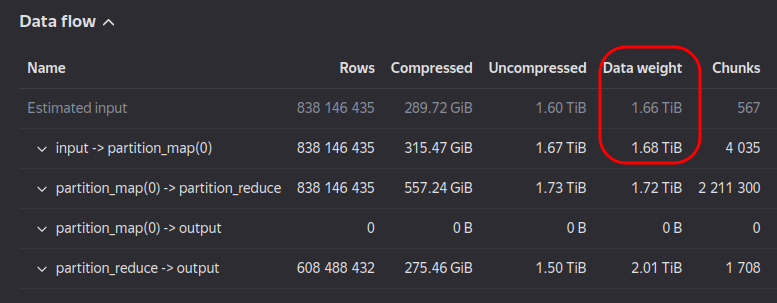
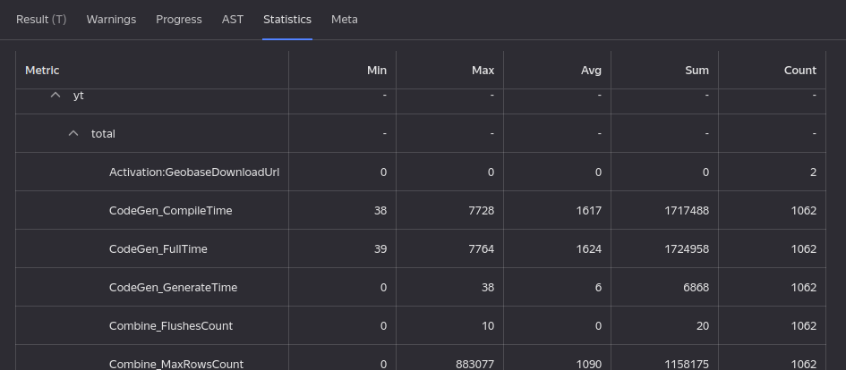
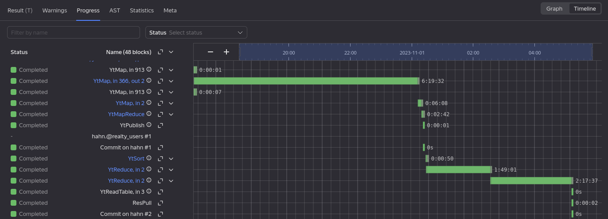

# Performance

## Why do queries with a JOIN clause take so long?{#perf_join}

All the basic [JOIN](../syntax/join.md) types (except SEMI/ONLY) build a Cartesian product of rows by the matching key values. If one or more key values are singular, it might have many rows on each side and result in a huge Cartesian product. This is the most common reason behind slow JOINs, and since such singular values don't have much practical value, you can exclude them using the `WHERE` clause.

To find such frequent anomalies, you can execute two queries against each table with a GROUP BY the same keys as in `JOIN`, using the `COUNT` aggregate function and descending sorting by its result. You can also add `LIMIT 100` to speed up the process.

Sometimes, your query won't actually need a Cartesian product in `JOIN` because in the end you'll only be interested in distinct values. In this case, eliminate duplicates in your subquery using [GROUP BY](../syntax/group_by.md) or [SELECT DISTINCT](../syntax/select/distinct.md) even before `JOIN` and mention your use case in the ticket [Convolution by payload in JOIN](https://nda.ya.ru/t/77bgy0y97FVELZ).

## My query used to take N hours, but now it takes M hours. Why is that? {#perf_slowdown}

When analyzing performance, consider the following factors:

### Has the input data volume changed?

 For example, more tables were added to the query or their volume changed significantly. To check if the input data volume changed, click the first {{product-name}} operation in the query plan and view `Data flow`/`Data weight` in the {{product-name}} interface:

### Has the query execution plan changed?

A plan can change for several reasons:
* A different `JOIN` strategy was applied. To learn more about triggering criteria for a particular strategy, see the [article](../syntax/join.md#join_strategy).
* The schema of some input tables in the folder changed. YQL aligns the schema of input tables, which creates additional operations.
* YQL optimizers changed in the new version.

### Does the query use a pool with dedicated guarantees?

The query must specify the [yt.StaticPool](../syntax/pragma/yt.md#ytstaticpool) pragma to apply the pool. If the pragma is missing, the query execution time isn't guaranteed in any way. Neighboring queries and seasonal cluster load fluctuations can affect execution. You should also make sure that the pool is set by the [yt.StaticPool](../syntax/pragma/yt.md#ytstaticpool) pragma, not [yt.Pool](../syntax/pragma/yt.md#ytpool). The latter is a dynamic pragma applied at runtime. Because of this, service operations launched at the optimization stage don't use its value and are launched in the pool by default, which may result in their significant slowdown. The [yt.StaticPool](../syntax/pragma/yt.md#ytstaticpool) pragma applies to all operations, including service ones.

### Checking summary statistics for a query

The YQL query's `Statistics` tab contains the summary query statistics:

First of all, note and compare the following metrics:
* `yt/total/Job_CalcTime` (Sum): Useful time spent across all jobs with user code of all {{product-name}} operations of the query. A change in this value, with no variation in input data volume, indicates performance changes in the YQL runtime.
* `yt/total/Job_InputDecodeTime` (Sum): Time spent by the YQL decoder to read input data across all jobs of all {{product-name}} operations of the query. A change in this value, with no variation in input data volume, indicates performance changes in the YQL decoder.
* `yt/total/Job_OutputEncodeTime` (Sum): Time spent by the YQL encoder to write input data across all jobs of all {{product-name}} operations of the query. A change in this value, with no variation in input data volume, indicates performance changes in the YQL encoder.
* `yt/total/CodeGen_FullTime` (Sum): Time spent to generate code across all jobs of all {{product-name}} operations of the query. A change in this value, with the same number of {{product-name}} jobs, indicates code generation performance changes in the YQL runtime. If this time represents a significant portion of `Job_CalcTime`, consider disabling LLVM in the query via `pragma config.flags("LLVM", "OFF")`.
* `yt/total/Join_Spill_Count` (Sum): A non-zero value of this metric indicates `JOIN` performance issues in the query. If the keys in the first side of the JOIN have a large number of writes, they can't fit into memory and are stored on disk. This causes significant degradation in the execution time of {{product-name}} jobs performing the `JOIN`. To resolve this issue, you can increase the [yt.CommonJoinCoreLimit](../syntax/pragma/yt.md#ytcommonjoincorelimit) pragma value or swap `JOIN` sides.
* `yt/total/data/input/data_weight` (Sum): Total data volume processed by all jobs of all {{product-name}} operations of the query. If there are no changes in the query plan, a change in this metric indicates a change in the input data volume of the query.

### Finding the slowest {{product-name}} operation in a query

In the YQL query's `Progress` tab, switch to `Timeline` mode:

In this mode, you can clearly see which {{product-name}} operation affected the YQL query execution time the most. You can also drill down to execution details at various stages of the operation:

Here you can see that the operation was `Pending` for a while due to insufficient limits on the number of running operations in the pool.

For further analysis, you can open a slow operation in the {{product-name}} interface by clicking its name in the timeline column on the left. In a {{product-name}} operation, first of all, pay attention to `Total job wall time` and `Total CPU time spent`. If these values remain largely unchanged for two YQL query runs, but `Duration` has changed, it indicates potential query pool issues. Click the name of the pool

and open it in the `Monitoring` tab in the {{product-name}} interface to analyze its load.
