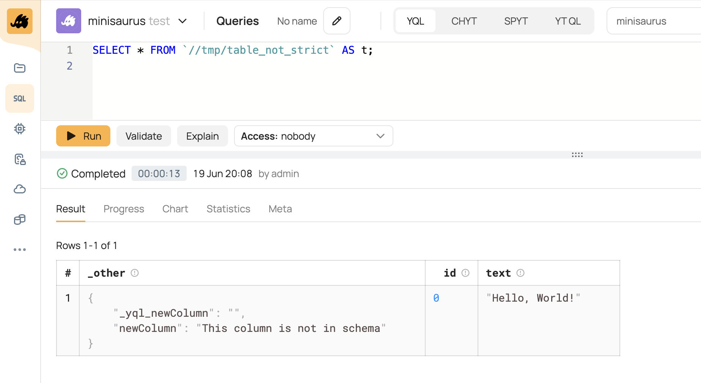

# Queries, syntax, UDF

## How to run a query across logs for the past day/week/month or some other relative time period?
If adding dates to your query text before execution isn't convenient, do as follows:

1. Write a user-defined function (UDF) in [Python](../udf/python.md) or [C++](../udf/cpp.md) with the signature `(String)->Bool`. By the table name, this function should return TRUE only for the dates from the relevant range, using the current time or date obtained by the tools of the selected programming language.
2. Pass this UDF to the [FILTER](../syntax/select/index.md#func_table) function, including the prefix to the log directory.
3. Use the FILTER result anywhere where you expect a path to the input data ([FROM](../syntax/select/from.md), [PROCESS](../syntax/process.md), [REDUCE](../syntax/reduce.md))


Table names can use arbitrary date and time formats, and the logic of selecting suitable tables may be indefinitely complex. That's why no ad-hoc solution is provided for this task.

## How do I filter by a large list of values?
Of course, you can generate a giant `WHERE` clause, but better do like this:

* Generate a text file with a list of values (one per row), and then add it to the query and use [IN](../syntax/expressions.md#in) together with [ParseFile](../builtins/basic#parsefile).
* Generate a table of values you want to filter by and do `LEFT SEMI JOIN` with this table.
* You can generate a regular expression to check rows with the logical OR and then use the [REGEXP](../syntax/expressions.md#regexp) keyword or a built-in regular expression function ([Hyperscan](../udf/list/hyperscan.md), [Pire](../udf/list/pire.md), or [Re2](../udf/list/re2.md)).

## What is the difference between MIN, MIN\_BY, and MIN\_OF? (or MAX, MAX\_BY, and MAX\_OF)

* `MIN(column)` is an SQL standard aggregate function that returns the minimal value found in the selected column.
* `MIN_BY(result, by)` is a non-standard aggregate function that, in contrast to the previous function, doesn't return the minimal value itself, but some other value from the row where it found the minimum.
* `MIN_OF(a, b, c, d)` is an inbuilt function that returns the minimum value among N values of its arguments.

## How do I access a column whose name includes a minus or another special character?
Wrap the column name into backticks similarly to table names:

```yql
SELECT `field-with-minus` FROM `table`;
```

## What is the \_other column?
This is a virtual column. It is created only by the YQL engine (the {{product-name}} system is unaware of it) and only for tables with a [non-strict schema](*schema-not-strict). This column provides access to table columns that weren't initially defined in the schema. The column has the `Dict<String,String>` type.

There are multiple popular methods for retrieving a table containing this column:
- For example, you can create a table without a schema and then sort it. The {{product-name}} system will assign the sorted table a schema where only the names of columns used for sorting will be explicitly specified. If you read the sorted table in YQL, other columns will be available in the `_other` field.
- Another method is to create a table with a non-strict schema and add columns that weren't initially specified in the schema to it. Below is an example of this scenario.

Example:

```bash
# Create a table with a non-strict schema. Two columns are explicitly specified in the schema: 'id' and 'text'.
$ yt create table //tmp/table_not_strict --attributes '{schema = <strict=%false>[{name = id; type = int64}; {name = text; type = string}]}'

# Now add data to the table, specifying an additional 'newColumn' not provided in the schema.
$ echo '{ "id": 0, "text": "Hello, World!", "newColumn": "This column is not in schema" } ' | yt write-table //tmp/table_not_strict --format json
```



Tables with a non-strict schema can be created only via the {{product-name}} SDK. You can't do this in the web interface.



If you read this table in YQL, the `newColumn` field will be available in the `_other` column:

```yql
SELECT * FROM `//tmp/table_not_strict` AS t;
```



There are multiple methods for retrieving the value of new `newColumn`:

```yql
SELECT
    WeakField(t.newColumn, "String")
FROM `//tmp/table_not_strict` AS t;
```
or

```yql
SELECT
    t._other["newColumn"]
FROM `//tmp/table_not_strict` AS t;
```

The first method enables you to work with your table consistently if the `newColumn` ends up in a strict schema. With [WeakField](../builtins/basic#weakfield), you can immediately get a value of the correct type, but with `_other`, you'd have to process the resulting values as Yson. In case of a strict schema, the system checks that the type passed to WeakField is the same as in the schema.



If the `SELECT * FROM <table with a virtual _other column>` query result is written to another table, the `_other` column will become a real column in the new table, but the schema of the table will be strict.

Attempting to read a non-strict table in YQL that already has a real `_other` column will result in an error: "Non-strict schema contains '_other' column, which conflicts with YQL virtual column".



<!--[Подробнее](../misc/schema.md)-->

## How do I create an empty table with a schema from another table?

```yql
-- Determine the record type for the source data
$s = select * from `path/to/source_table`;
$s = process $s;

-- Create an empty table with the desired schema
INSERT INTO `path/to/my_destination_table` WITH TRUNCATE
SELECT * FROM as_table(ListCreate(ListItemType(TypeOf($s))))
```

## How to work with a string without unpacking protobuf?
YQL can unpack protobuf messages. We recommend setting up <!--[automatic unpacking](../misc/schema.md#_yql_proto_field)--> automatic unpacking by using table metadata. In some cases, in case of an unpacked message, you need to work with a source row. For this purpose, it makes sense to use a special [raw](../syntax/select/index.md#view) view:

```yql
SELECT *
FROM `path/to/my_table` VIEW raw;
```



Keep in mind that the meta attribute that enables automatic unpacking of tables created by such a query won't be copied, and you'll need to re-enable it.



## How do I convert the string "a=b,c=d" to a dictionary?
For this, you only need to apply the pre-installed function from the UDF [Dsv](../udf/list/dsv.md) module:

```yql
$str = "a=b,c=d";
SELECT Dsv::Parse($str, ",");

/*
Result:
{
    "a": "b",
    "c": "d"
}
*/
```

## How do I delete duplicate rows from my table without listing all the columns?

```yql
SELECT * WITHOUT g FROM (
    SELECT Some(TableRow()) AS s
    FROM `path/to/table` AS t
    GROUP BY Digest::Sha256(StablePickle(TableRow())) AS g
)
FLATTEN COLUMNS;
```

## How do I copy user attributes to the output table?

```yql
$input = "some/input/path";
$output = "destination/path";

-- Filter user attributes that start with an underscore and exclude some YQL system attributes
$user_attr = ($attr) -> {
    RETURN ListFilter(
        Yson::ConvertToStringList($attr.user_attribute_keys),
        ($name) -> {
            RETURN StartsWith($name, "_") AND $name NOT IN ["_yql_op_id", "_yql_row_spec", "_yql_runner"];
        }
    );
};

-- Add the // prefix to the path
$yt_path = ($path) -> {
    RETURN IF(StartsWith($path, "//"), $path, "//" || $path);
};

-- Create a list of attributes for copying
$attribute_keys = (
    SELECT String::JoinFromList($user_attr(Attributes), ";")
    FROM Folder(Substring($input, NULL, RFind($input, "/")), "user_attribute_keys")
    WHERE $yt_path(Path) == $yt_path($input)
);

-- Read the user attributes
$attributes = (
    SELECT CAST(Yson::SerializePretty(Attributes) AS String) as attrs
    FROM Folder(Substring($input, NULL, RFind($input, "/")), $attribute_keys)
    WHERE $yt_path(Path) == $yt_path($input)
);

-- Force the scalar context
$attributes = EvaluateExpr($attributes);

INSERT INTO $output WITH (TRUNCATE, USER_ATTRS=$attributes)
SELECT *
FROM (
    SELECT *
    FROM $input
    LIMIT 5
)
```

## JSON and YSON

### How to convert a table row to JSON?
For this, you will need pre-installed serialization [functions](../udf/list/yson.md) and the standard [TableRow()](../builtins/basic.md#tablerow) function to access the entire row:

```yql
USE {{production-cluster}};
SELECT Yson::SerializeJson(Yson::From(TableRow()))
FROM `home/yql/tutorial/users`;
```

### How do I get a value by a key from JSON/YSON? {#yson-json}
When working with JSON/YSON, keep in mind:

* You can't output a non-serialized JSON/YSON field in a browser or save it to a table because of the following error`
  Expected persistable data, but got: List<Struct<'column0':Resource<'Yson.Node'>>>`;
* It doesn't make sense to convert these formats to a dictionary if you need to retrieve a value by a single key.

```yql
-- my_column type — Yson

SELECT Yson::Serialize(my_json_column.myKey) AS my_column
FROM my_table;
```

If you need a specific data type, you can use the function [Yson::ConvertTo...](../udf/list/yson.md#ysonconvertto):

```yql
-- my_column type — String

SELECT Yson::ConvertToString(my_json_column.myKey) AS my_column
FROM my_table;
```

If the original column type is string, use the function [Yson::Parse...](../udf/list/yson.md#ysonparse):


```yql
SELECT Yson::Serialize(Yson::Parse(my_yson_column)) AS my_yson;

-- As a result, you have Yson, when working with which Yson::Parse is added automatically

SELECT Yson::Serialize(my_yson.myKey) AS my_key_value;
```

If you need to retrieve a list of full values by a key, use the [ListMap](../builtins/list#listmap) function:


```yql
SELECT
    ListMap(
        Yson::ConvertToList(my_yson_column),
        ($x) -> { RETURN Yson::Serialize($x.foo) }
    );

-- The execution result is a list of rows
```

Example of retrieving a list item:

```yql
SELECT Yson::ConvertToString(Yson::ConvertToList(my_yson_column)[0].foo);

-- The execution result is the field of a given list item
```

### How do I flatten a dictionary/list from a table? {#flatten}
If the container that you need to flatten is a list, use `FLATTEN LIST BY`:

```yql
SELECT
    parents,
    name,
    geo_parents_list
FROM {{production-cluster}}.`home/yql/tutorial/users` VIEW complex
FLATTEN LIST BY geo_parents_list AS parents;
```

If the list is in a Yson column, convert it to List first. For example, like this:

```yql
SELECT *
FROM (
    SELECT
        ListMap(
            Yson::ConvertToList(my_yson_column),
            ($x) -> { RETURN Yson::Serialize($x.foo) }
        ) AS my_list
    FROM my_table)
FLATTEN LIST BY my_list;
```

Use `FLATTEN DICT BY` if you need to flatten a dictionary:

```yql
SELECT
    dsv.dict.0 AS key,
    dsv.dict.1 AS value
FROM {{production-cluster}}.`home/yql/tutorial/users_dsv` AS dsv
FLATTEN DICT BY dict;
```

For more information about the `FLATTEN BY` statement, see this [section](../syntax/flatten.md).

## How do I pass data from one table (reference) as a list for processing another table? {#list-table-attach}

If the reference table size doesn't exceed the limit on the size of a single table row, you can use scalar context and the `AGGREGATE_LIST` function.

```yql
$data = SELECT AGGREGATE_LIST(TableRow()) FROM small_table; -- scalar context when using $data in the expression, the Optional<List> type

SELECT MyModule::MyUdf($data ?? [])(x) FROM big_table;
```

If the reference table is larger but can still be loaded entirely into each job, you can use table context.

```yql
$data = SELECT * FROM medium_table;
$data = PROCESS $data; -- enable table context, $data will then have the List<Struct> type

SELECT MyModule::MyUdf($data)(x) FROM big_table;
```

[*schema-not-strict]: A schema with a set attribute `<strict=%false>`. <!--[Learn more about table schemas](../../user-guide/storage/static-schema.md)-->
