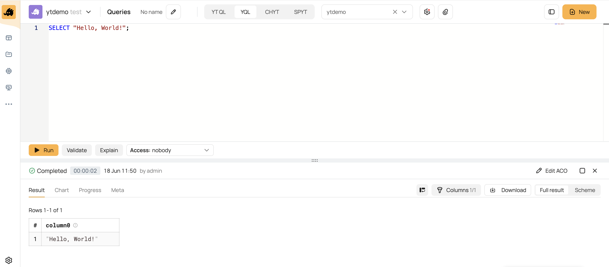

# Introduction

YQL (Yandex Query Language) is a language of universal declarative queries against data storage and processing systems as well as an infrastructure to run such queries. YQL benefits include:

- A powerful graph execution engine that can build MapReduce pipelines with hundreds of nodes and adapt during computation.
- Ability to build complex data processing pipelines using SQL by storing subqueries in variables as chains of dependent queries and transactions.
- Predictable parallel execution of queries of any complexity.
- Efficient implementation of joins, subqueries, and window functions with no restrictions on their topology or nesting.
- Extensive function library.
- Support for user-defined functions in [C++](udf/cpp.md), [Python](udf/python.md), and [JavaScript](udf/javascript.md).
- Automatic execution of small parts of queries on prepared compute instances, bypassing MapReduce operations to reduce latency.


YQL provides a functional web interface where, among other things, you can:
- Write query code.
- Start and stop query execution.
- View query execution results.
- View query history.


## How to try

To run your first YQL query:
1. Open the web interface of the {{product-name}} cluster (for example, [{{testing-cluster-name}}]({{cluster-ui}})) and go to the **Queries** tab — you can get there from the menu on the left.

2. Enter the query and run it:

   ```yql
   SELECT "Hello, World!";
   ```

   { .center }
