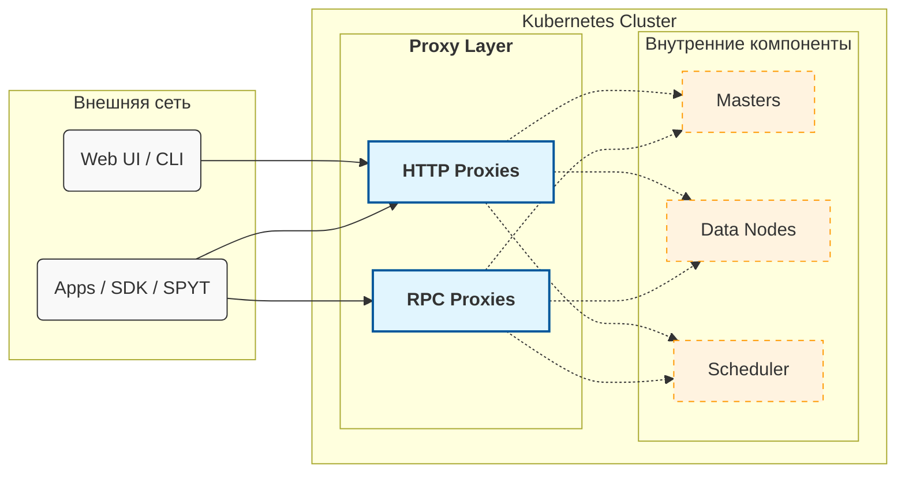
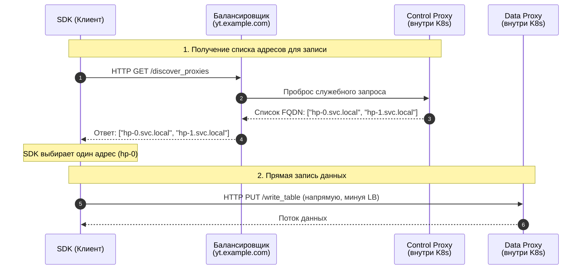

# Настройка внешнего доступа к {{product-name}} в Kubernetes

По умолчанию кластер {{product-name}}, развёрнутый в Kubernetes, изолирован от внешней сети. Для публикации сервисов, как правило, используются механизмы LoadBalancer или Ingress. Они хорошо подходят для отдельных веб-сервисов, предоставляя единую точку входа для клиентов, но [не обеспечивают](*scale-traffic) масштабирование большого сетевого потока.

Из данной статьи вы узнаете, как:

- [Решить проблему сетевой изоляции](#how-to-resolve) &mdash; настроить кластер так, чтобы внешние клиенты могли напрямую обращаться к узлам кластера для эффективной записи и чтения больших объёмов данных.

- [Разделить нагрузку между клиентами](#manage-traffic) &mdash; изолировать ресурсы разных проектов, а также разделить трафик на «лёгкий» (метаданные, UI) и «тяжёлый» (чтение и запись таблиц).

- [Настроить доступ для SPYT](#spyt-access) &mdash; настроить TCP-проксирование для прямого соединения внешнего драйвера Spark с воркерами внутри кластера.

<!--Статья разбита на две части: сначала приведён обзор архитектуры, а далее описаны сценарии настройки кластера.-->

## Обзор прокси {#overview}

Пользователи взаимодействуют с сервером {{product-name}} не напрямую, а через специальные прокси. Это компоненты {{product-name}}, которые выступают единой точкой входа и скрывают взаимодействие между компонентами и внутреннюю топологию кластера — например, адреса мастеров и data-нод.

С точки зрения Kubernetes, прокси обычно разворачиваются как StatefulSet, состоящий из нескольких подов. Их количество и выделяемые ресурсы (CPU, RAM) задаются в [спецификации](https://github.com/ytsaurus/ytsaurus-k8s-operator/blob/main/config/samples/cluster_v1_local.yaml#L56-L74) оператора {{product-name}}, а при запуске кластера каждый под прокси автоматически регистрируется в Кипарисе (в системных директориях `//sys/http_proxies` и `//sys/rpc_proxies`).

Прокси в {{product-name}} бывают двух типов:

- HTTP-прокси &mdash; реализуют HTTP API {{product-name}}. Активно используются в SDK, для работы веб-интерфейса и CLI.
- RPC-прокси &mdash; реализуют более быстрый бинарный протокол (YT RPC). В первую очередь необходимы там, где требуется низкая латентность запросов (например, при интенсивной потоковой работе с динамическими таблицами). Для всех остальных сценариев рекомендуется использовать HTTP-прокси.



### Понятие роли {#proxy-role}

Прокси можно [разбивать](#manage-traffic) на функциональные группы с помощью ролей. Как правило, выделяют две основные группы:

- Контрольные (control-прокси) &mdash; обрабатывают «лёгкие» запросы (навигация в UI, работа с метаданными Кипариса). Для них обычно назначается роль `control`.
- Тяжёлые (data-прокси) &mdash; обрабатывают «тяжёлые» запросы (потоковое чтение и запись больших таблиц). В Kubernetes-инсталляциях они чаще всего работают под ролью `default`.

Такое разделение позволяет гибко управлять ресурсами кластера: активное чтение огромной таблицы через data-прокси не затормозит работу веб-интерфейса и не помешает другим пользователям просматривать дерево Кипариса.

Технически роль &mdash; это строковая метка (атрибут `@role` в Кипарисе), которая присваивается инстансу прокси при запуске. По умолчанию все прокси в кластере запускаются с ролью `default`. Назначить роль можно в [спецификации Ytsaurus](https://github.com/ytsaurus/ytsaurus-k8s-operator/blob/main/config/samples/cluster_v1_local.yaml#L56C3-L74C18).

### Механизм Discovery {#discovery}

При инициализации клиента (SDK) разработчик указывает общий адрес кластера (например, `yt.example.com`). Обычно за этим адресом стоит балансировщик (Ingress или LoadBalancer), распределяющий запросы между доступными прокси-серверами.

Однако прогонять гигабайты трафика чтения/записи через один центральный балансировщик неэффективно. Чтобы масштабировать сетевой поток, SDK автоматически отправляют тяжёлые запросы на data-прокси напрямую, минуя центральную точку входа. Разработчику не нужно указывать в коде десятки адресов &mdash; SDK узнает про них самостоятельно через встроенный механизм Discovery. Он работает следующим образом:

1. Перед выполнением тяжёлого запроса SDK отправляет служебный HTTP-запрос `GET /api/v4/discover_proxies` на общий балансировщик.
1. В ответ сервер возвращает список адресов (FQDN) активных data-прокси.
1. SDK выбирает один адрес из списка и отправляет тяжёлый запрос напрямую к этому поду.

Ниже приведена схема работы механизма Discovery при вызове `write_table` в HTTP-прокси:





1. Клиентская библиотека (SDK) выполняет служебный HTTP-запрос `discover_proxies` на основной публичный адрес кластера (балансировщик `yt.example.com`).
2. Балансировщик принимает запрос и перенаправляет его внутрь кластера на один из доступных контрольных прокси-серверов (Control Proxy).
3. Контрольный прокси формирует список FQDN активных data-прокси (например, `hp-0.svc.local`, `hp-1.svc.local`) и возвращает его балансировщику.
4. Балансировщик возвращает этот список клиенту.
5. SDK выбирает из списка один конкретный адрес (в нашем примере — `hp-0`) и отправляет запрос на запись данных (`write_table`) напрямую к этому поду, минуя центральный балансировщик.
6. Между клиентом и data-прокси устанавливается прямое соединение, по которому передается поток данных.



#### Роли прокси в Discovery {#discovery-roles}

При запросе `discover_proxies` клиент может дополнительно передать требуемую роль. При этом действует логика:
- Если роль указана явно (например, `role=heavy`), балансировщик вернёт адреса только выделенных под неё прокси.
- Если роль не указать, будут запрашиваться прокси с ролью `default`.

#### Discovery в разных протоколах {#discovery-in-different-protocols}

- В HTTP используется «ленивый» подход. Запрос к `discover_proxies` выполняется перед началом чтения или записи файла.
- В RPC используется «жадный» подход. Клиент вызывает `discover_proxies` сразу при старте, получает список адресов RPC-прокси и устанавливает с ними постоянные TCP-соединения.



В более старых версиях API (< v4) точки входа в сервис Discovery различались.



В версиях API ниже v4:

- Для получения списка всех HTTP-прокси клиенты обращались к эндпоинту `/v3/entry`.
- Для получения RPC-прокси — к `/v3/discover_proxies`.

Начиная с версии v4, оба типа клиентов используют единый универсальный эндпоинт `/api/v4/discover_proxies` (с параметром `type=rpc` для RPC-клиентов).





<!--


Механизм Discovery можно отключить на стороне клиента (опция конфига `enable_proxy_discovery=%false`). Это удобно для быстрой отладки и тестирования: трафик перестаёт разделяться и направляется в единую точку входа. В продакшене использовать такой подход не рекомендуется — он направит весь объём передачи больших данных через балансировщик контрольных прокси, что может быстро привести к перегрузке узлов.


-->

### Почему возникает проблема доступов {#about-access-problem}

В стандартной конфигурации Kubernetes адреса подов являются внутренними (например, `hp-0.http-proxies.default.svc.cluster.local`).

Когда внешний SDK вызывает `discover_proxies`, кластер возвращает ему список внутренних FQDN. SDK, находясь за периметром кластера, не может разрешить эти DNS-имена в IP-адреса. В результате лёгкие команды через балансировщик работают успешно, а попытка записать данные завершается различными сетевыми ошибками — от ошибок разрешения DNS-имён до невозможности подключиться (`Temporary failure in name resolution`, `Connection refused`, `Connection timed out`).



Рассмотрим сценарий: кластер {{product-name}} развёрнут в Kubernetes, и требуется проверить доступ с локальной машины.

Для быстрого доступа к API контрольных прокси порт открыт через `kubectl port-forward`:

```bash
$ kubectl port-forward service/http-proxies-control-lb 8080:80
Forwarding from 127.0.0.1:8080 -> 80
```

Выполним лёгкую операцию — создать таблицу.

```bash
$ export YT_PROXY=127.0.0.1:8080
$ yt create table //home/my-table
30-56c4-10191-712a11b3
```

Команда сработала: таблица создана. Механизм Discovery не задействовался, запрос ушёл напрямую на адрес, указанный в переменной `YT_PROXY`.

Теперь попробуем записать данные в эту таблицу (`write-table`):

```bash
$ echo '{ "id": 0, "text": "Hello" }' | yt write-table //home/my-table --format json

WARNING HTTP PUT request http://hp-0.http-proxies.default.svc.cluster.local/api/v4/write_table failed with error NewConnectionError...
Failed to establish a new connection: [Errno -3] Temporary failure in name resolution
```

**Что произошло:**
При выполнении `write-table` SDK запросил список data-прокси. Кластер вернул внутренний адрес пода: `hp-0.http-proxies.default.svc.cluster.local`. SDK попытался соединиться с этим FQDN напрямую, но с локальной машины это имя не резолвится.

В качестве временного решения для отладки можно отключить Discovery на клиенте. Сделать это можно через переменные окружения, тогда весь трафик пойдёт через `port-forward`:

```bash
# Через патч конфига:
export YT_CONFIG_PATCHES='{proxy={enable_proxy_discovery=%false}}'
# Или через более короткий и популярный алиас для CLI:
export YT_USE_HOSTS=0

echo '{ "id": 0, "text": "Hello" }' | yt write-table //home/my-table --format json
```

Если после этого запись прошла успешно — значит, проблема именно в маршрутизации Discovery.



## Как решить проблему сетевой изоляции {#how-to-resolve}

Если вы настроили Ingress, но при попытке записать данные получаете ошибки, несмотря на работающие команды `list` или `create`, — вы столкнулись с проблемой изоляции.

Решить проблему можно несколькими способами:

- [Использовать прямую маршрутизацию](#use-flat-network)
- [Использовать Host Network](#use-host-network)
- [Настроить Kubernetes Services и подмену адресов](#k8s-services)

### Использовать прямую маршрутизацию {#use-flat-network}

Если ваша сетевая инфраструктура позволяет обращаться к подам напрямую (например, используется CNI Calico с маршрутизацией BGP или AWS VPC CNI), дополнительная настройка {{product-name}} не требуется. Механизм [Discovery](#discovery) вернёт внутренние FQDN подов (например, `hp-0.http-proxies.default.svc.cluster.local`).

Однако внешний клиент должен иметь возможность:
- Разрешить DNS-имена подов. Внутренние FQDN вида `*.svc.cluster.local` по умолчанию известны только DNS-серверу внутри кластера Kubernetes &mdash; внешний клиент не сможет их разрешить через обычные публичные DNS-серверы.
- Установить сетевое соединение. Даже если имя разрешилось в IP-адрес, клиент должен иметь сетевую связность с этим IP (маршрутизацию).

#### Настройка для AWS

В AWS самый простой способ получить доступ к подам, которые уже имеют сетевую связность в dual stack режиме, — это настроить CoreDNS для разрешения имён подов. Для этого необходимо:

1. Открыть доступ к CoreDNS в кластере для внешних клиентов.
2. Настроить CoreDNS отвечать на запросы вида `*.cluster.domain.name`, где `cluster.domain.name` — это доменное имя вашего кластера.



```yaml
apiVersion: v1
kind: ConfigMap
metadata:
  name: coredns
  namespace: kube-system
data:
  Corefile: |
    .:53 {
        errors
        health {
           lameduck 5s
        }
        ready
        kubernetes cluster.local in-addr.arpa ip6.arpa {
           pods insecure
           fallthrough in-addr.arpa ip6.arpa
           ttl 30
        }
        # ВНИМАНИЕ: Замените 'cluster.domain.name' на реальный домен вашего кластера.
        # Этот шаблон позволяет внешним клиентам находить IP-адреса подов по их именам.
        template IN A cluster.domain.name {
            match "^([^.]+)\.http-proxies\.default\.svc\.cluster\.domain\.name\.$"
            answer "{{ .Name }} 60 IN A {{ .Group 1 | replace \"-\" \".\" }}"
        }
        prometheus :9153
        forward . /etc/resolv.conf {
           max_concurrent 1000
        }
        cache 30
        loop
        reload
        loadbalance
    }
```

После этого внешние клиенты смогут разрешать FQDN подов в их реальные IP-адреса и устанавливать прямые соединения.




### Использовать Host Network {#use-host-network}

В этом режиме поды прокси не получают выделенного IP-адреса на под из внутренней сети кластера K8s, а используют сетевой интерфейс физического сервера (ноды), на котором они запущены.

Чтобы включить режим, добавьте поле `hostNetwork: true` в корневой уровень спецификации [оператора](install-ytsaurus#operator):

```yaml
apiVersion: cluster.ytsaurus.tech/v1
kind: Ytsaurus
metadata:
  name: my-cluster
spec:
  # Включаем использование сети хоста для всех компонентов.
  hostNetwork: true

  httpProxies:
    - serviceType: ClusterIP # При hostNetwork внешний сервис K8s не обязателен.
      instanceCount: 1
  # ... остальные настройки ...
```

В этом случае прокси будут регистрироваться в Кипарисе под именами нод кластера Kubernetes. Они будут отдавать именно эти имена K8s-нод клиентам при Discovery. Дальше внешним клиентам необходимо самостоятельно разрешать DNS-имена этих нод.



В режиме `hostNetwork` прокси будут занимать порты (по умолчанию 80 и 443) непосредственно на нодах кластера. Убедитесь, что на этих узлах не запущены другие конфликтующие веб-сервисы, либо измените порты в конфигурации.



### Настроить K8S Services и подмену адресов {#k8s-services}

Этот способ наиболее универсален для облачных сред. Прокси публикуются через сервисы (NodePort или LoadBalancer), а {{product-name}} конфигурируется так, чтобы механизм [Discovery](#discovery) возвращал клиентам именно эти внешние адреса, а не внутренние имена (FQDN) подов.

Этот подход требует двух шагов:

1. [Открыть порты](#external-access-step) через K8s-сервисы (NodePort или LoadBalancer).
1. [Настроить подмену адресов](#set-discovery-step) (Advertised Addresses).

#### Шаг 1: Открыть порты {#external-access-step}

В спецификации оператора укажите тип сервиса для нужных групп прокси. Например:

```yaml
spec:
  # HTTP прокси
  httpProxies:
    - role: control
      serviceType: LoadBalancer   # Входная точка для лёгких запросов
      instanceCount: 1
    - role: default
      serviceType: NodePort       # Точки входа для тяжёлых запросов (Data)
      instanceCount: 3

  # RPC прокси
  rpcProxies:
    - role: project-a
      serviceType: LoadBalancer
      instanceCount: 2
```

[Пример полной спецификации](https://github.com/ytsaurus/ytsaurus-k8s-operator/blob/main/config/samples/cluster_v1_local.yaml)

#### Шаг 2: Настроить подмены адресов (Discovery) {#set-discovery-step}

Даже если сервисы созданы, команда `discover_proxies` всё ещё будет возвращать внутренние FQDN подов. Необходимо настроить {{product-name}} так, чтобы он возвращал внешние адреса, которые ведут на созданные сервисы.

Для этого задайте конфигурацию атрибутам `//sys/http_proxies/@balancers` и `//sys/rpc_proxies/@balancers`:

```yson
{
    "<proxy_role>" = {
        "<address_type>" = {
            "<network_name>" = ["<external_addr_1>"; "<external_addr_2>"]
        }
    }
}
```

- `proxy_role` &mdash; роль прокси (например, `default` или `project-a`).
- `address_type` &mdash; тип протокола. Используйте `http` для HTTP-прокси и `internal_rpc` для RPC-прокси.
- `network_name` &mdash; имя сети. В серверных компонентах {{product-name}} есть поддержка нескольких интерфейсов (исторически для разделения real-time и bulk трафика). В Kubernetes у пода обычно один сетевой интерфейс, поэтому стандартное значение &mdash; `default`.



Значение `internal_rpc` у параметра `address_type` — историческое. Оно относится к внутренней реализации кода и не означает, что адреса должны быть внутренними. В этот блок нужно вписывать **внешние** адреса (или FQDN), доступные клиентам.

Обратите внимание, что формат конфигурации — YSON, поэтому элементы списков разделяются не запятой, а точкой с запятой (`;`).





Настройку адресов необходимо задавать для каждой роли отдельно.



#### Пример настройки

Предположим, в кластере сконфигурированы две роли прокси:

- Контрольные прокси: доступны через общий LoadBalancer (или Ingress) по адресу `yt.example.com`.
- Data-прокси: вы запустили три инстанса и открыли к ним прямой доступ через NodePort. При использовании NodePort порт одинаков для всех узлов K8s, поэтому адреса будут вида: `node1.example.com:30001`, `node2.example.com:30001` и `node3.example.com:30001`.

Чтобы Discovery корректно возвращал эти адреса для каждой роли, выполните команды:

```bash
# 1. Настройка адресов для Data-прокси (роль default)
# Эти адреса будут использоваться для тяжёлых операций (чтение/запись).
$ yt set //sys/http_proxies/@balancers/default \
  '{"http"={"default"=[
      "node1.example.com:30001";
      "node2.example.com:30001";
      "node3.example.com:30001"
  ]}}'

# 2. Настройка адреса для контрольных прокси (роль control)
# Этот адрес будет возвращаться, если клиент явно запросит дискавери для контрольной группы.
$ yt set //sys/http_proxies/@balancers/control \
  '{"http"={"default"=[
      "yt.example.com"
  ]}}'
```



В примере команда `set` применяется к конкретным путям (`@balancers/default` и `@balancers/control`), а не к корневому атрибуту `@balancers`. Такой подход безопаснее: каждая роль конфигурируется независимо, без риска случайно перезаписать конфигурацию других ролей.



## Как настроить доступ к SPYT {#spyt-access}

Для работы SPYT в режиме [Standalone](../../user-guide/data-processing/spyt/cluster/cluster-desc.md#spark-standalone) внешний драйвер Spark должен соединяться напрямую со Spark-воркерами. Эти воркеры запускаются не как отдельные поды Kubernetes, а как процессы внутри [Vanilla-джобов](../../user-guide/data-processing/operations/vanilla.md) {{product-name}}. Стандартные сетевые абстракции Kubernetes (Services) не умеют адресовать трафик внутрь таких процессов.

Для проксирования таких соединений используется `tcp_proxy`. Это компонент {{product-name}}, который знает, на какой ноде и на каком порту запустился конкретный процесс воркера, и умеет пробросить туда трафик снаружи &mdash; на основе таблиц в Кипарисе `//sys/tcp_proxies/routes`.

Чтобы настроить `tcp_proxy`:

1. Убедитесь, что порты, на которых работает `tcp_proxy` (по умолчанию 32000–32019), открыты через Kubernetes-сервисы (NodePort или LoadBalancer).
2. Пропишите внешние адреса этих портов в атрибут `//sys/tcp_proxies/routes/<proxy_role>/@external_addresses` в Кипарисе.

Это позволит драйверу Spark использовать `tcp_proxy` как посредника для связи с внутренними воркерами.

Пример:

```bash
yt set //sys/tcp_proxies/routes/default/@external_addresses '["node1.example.com:32000"; "node2.example.com:32000"]'
```

## Как разделить трафик {#manage-traffic}

По умолчанию все прокси в кластере имеют роль `default`. Это создаёт проблему «шумных соседей»: один пользователь, запустивший тяжёлую операцию чтения, может перегрузить прокси и замедлить работу всех остальных, включая запросы веб-интерфейса.

Решение — разбить прокси на группы с помощью ролей. Это позволит [разделить](#split-traffic) нагрузку между лёгкими и тяжёлыми запросами, а также [изолировать](#projects) ресурсы разных проектов и команд.

### Разделение лёгкого и тяжёлого трафика (для HTTP) {#split-traffic}

На практике HTTP-прокси обычно делят на две функциональных группы:

- Control-прокси (обычно с ролью `control`) — обслуживают «лёгкие» запросы: просмотр веб-интерфейса, листинг директорий, создание/удаление таблиц, работа с метаинформацией.
- Data-прокси (обычно с ролью `default`) — обслуживают «тяжёлые» запросы: чтение и запись таблиц или файлов.

Для отказоустойчивости рекомендуется, чтобы каждой роли соответствовало несколько реплик прокси.

Задать роли можно в спецификации Ytsaurus:

```yaml
spec:
  httpProxies:
    # Тяжёлая группа (по умолчанию принимает Data-трафик)
    - role: default
      instanceCount: 5
      serviceType: NodePort
    # Контрольная группа (UI и метаданные)
    - role: control
      instanceCount: 2
      serviceType: LoadBalancer # Удобно для Ingress
```



Имя роли становится частью имени K8s-пода (например, `hp-control-0`). Поэтому используйте только DNS-совместимые имена (строчные буквы, цифры и дефисы). Символ подчеркивания (`_`) использовать нельзя.



Как это работает:

- Оператор создаёт две независимые группы подов (StatefulSets) с лейблами `control` и `default`.
- Оператор автоматически создаёт Kubernetes-сервис (Service) для каждой группы. В селекторе сервиса `http-proxies-control` прописан фильтр: «обслуживать только поды с меткой control».
- Вы настраиваете Ingress/DNS на сервис группы `control`. Клиенты будут автоматически получать адреса Data-прокси через механизм [Discovery](#discovery) и отправлять тяжёлые запросы напрямую на них.



При создании Service или Ingress вручную (без участия оператора) убедитесь, что в Label Selector сервиса прописан правильный фильтр по метке роли. Проверить лейблы на запущенных подах можно командой `kubectl get pods --show-labels`. Без этого фильтра балансировщик будет отправлять лёгкие запросы на все прокси подряд, включая Data-прокси.



### Особенности HTTP доступа и Ingress

Для HTTP-прокси часто используют Ingress-контроллеры для терминации SSL и маршрутизации. Если Ingress используется только для Control-прокси, а Data-прокси выставлены через NodePort (как описано выше), схема работает эффективно.

Если же **весь** трафик требуется направить через Ingress (включая Data), придётся решить несколько проблем:
- Двойная балансировка и потеря эффективности.
- Сложные правила Ingress для каждого пода data-прокси отдельно (для прямой адресуемости).
- Настройка [липких сессий](#sticky-sessions) для корректной работы с транзакциями.

#### Проблема липких сессий {#sticky-sessions}

При использовании Ingress для data-прокси важно учитывать особенности работы с транзакциями. Транзакции в {{product-name}} создаются на конкретном прокси, и все последующие запросы в рамках одной транзакции должны попадать на тот же самый прокси. Вызов через Ingress-контроллер случайным образом может привести к ошибкам вида "Transaction not found" или "Invalid transaction state". Чтобы избежать этого, настройте [липкие сессии](*sticky-session) в вашем Ingress-контроллере.

Настройка липких сессий зависит от используемого Ingress-контроллера:

- NGINX Ingress: используйте аннотацию `nginx.ingress.kubernetes.io/affinity: "cookie"`
- Traefik: настройте `stickiness` в конфигурации сервиса
- HAProxy Ingress: используйте `haproxy.org/cookie-persistence`



Этот Ingress настраивает NGINX, чтобы он помечал клиента специальной cookie и всегда отправлял его на один и тот же под прокси.

```yaml
apiVersion: networking.k8s.io/v1
kind: Ingress
metadata:
  name: yt-data-proxies
  annotations:
    # Включаем липкие сессии: NGINX запомнит, на какой под отправить клиента
    nginx.ingress.kubernetes.io/affinity: "cookie"
    nginx.ingress.kubernetes.io/session-cookie-name: "yt-proxy-id"
    nginx.ingress.kubernetes.io/session-cookie-max-age: "14400"
spec:
  rules:
  - host: yt-data.example.com
    http:
      paths:
      - path: /
        pathType: Prefix
        backend:
          service:
            name: http-proxies-default
            port:
              number: 80
```



#### Про TLS



При выставлении Data-прокси напрямую (через NodePort) трафик не проходит через Ingress, а значит, передается **без TLS-шифрования**.



Для высоконагруженных инсталляций, если нет жёстких требований к шифрованию, оптимальной остаётся раздельная схема:
- используйте Ingress только для Control-трафика (для удобного доступа к UI, лёгким API-запросам и HTTPS);
- Data-прокси публикуйте напрямую через NodePort или LoadBalancer с настроенным механизмом Discovery (трафик пойдёт открыто, но максимально производительно).

Если требования безопасности диктуют обязательное использование шифрования для внешних клиентов, есть два пути:
- направлять весь трафик через Ingress (с настроенными липкими сессиями), принимая во внимание возможное снижение производительности,
- либо настраивать балансировщики (Network Load Balancer) или внутренний TLS в самом кластере.

### Изоляция проектов (для RPC) {#projects}

Для RPC-прокси чаще применяется деление по проектам. Например, можно создать выделенную группу прокси с ролью `project-a` и выдать доступ к ней только конкретному пользователю.

```yaml
spec:
  rpcProxies:
    # Поды для общих нужд
    - role: default
      instanceCount: 2
      serviceType: NodePort
    # Выделенные поды под проект Project A
    - role: project-a
      instanceCount: 2
      serviceType: NodePort
```

Чтобы клиент начал работать с выделенной группой прокси, в коде приложения (или в настройках CLI) нужно явно указать `proxy_role`. Если этого не сделать, клиент по умолчанию пойдёт в роль `default`.



```python
# Пример клиента Python, жестко привязанного к группе
client = yt.YtClient(proxy="yt.cluster", config={"proxy_role": "project-a"})
```




```bash
# Можно передать через переменную окружения перед запуском скриптов
export YT_CONFIG_PATCHES='{proxy_role="project-a"}'
yt list //home
```


## FAQ {#faq}



Да, но это требует дополнительной настройки.

По умолчанию клиентские библиотеки (SDK) отправляют все тяжёлые запросы (чтение/запись) в группу прокси с ролью `default`. Если в операторе создать группу с ролью `heavy`, но не перенастроить кластер, SDK не узнает о её существовании и продолжит искать несуществующую роль `default`.

Чтобы перенаправить стандартный трафик клиентов в новую группу, измените атрибут `@default_role_filter` в Кипарисе:

```bash
# Теперь клиенты, не указавшие роль явно, будут направляться на прокси с ролью 'heavy'
yt set //sys/http_proxies/@default_role_filter heavy
```





Технически — можно, но для высоконагруженных инсталляций это не рекомендуется. Если настроить клиенты на работу без [Discovery](#discovery) (только через Ingress), возникнут три проблемы:

- Двойная балансировка. Весь трафик проходит через промежуточный Ingress-контроллер, что увеличивает задержки.
- Сложность настройки. Для работы Discovery через Ingress придётся создавать отдельный Ingress-ресурс и DNS-имя для каждого пода Data-прокси.
- Проблемы с транзакциями. Необходима настройка [липких сессий](#sticky-sessions).

Для высоконагруженных инсталляций рекомендуется комбинированный подход:
- L7 (Ingress): Используйте только для Control-трафика (роль `control`). Это даст понятное доменное имя, SSL и удобство для пользователей.
- L4 (NodePort/LoadBalancer): Используйте для Data-трафика (роль `default`). Это позволит клиентам соединяться с подами напрямую (через Discovery и Advertised Addresses), обеспечивая максимальную пропускную способность без узкого места (bottleneck) в виде Ingress-контроллера.





Это признак неверно настроенного (или ненастроенного) Discovery.

Лёгкие команды идут через контрольные прокси. Тяжёлые команды (`read-table`, `write-table`) пытаются соединиться с Data-прокси напрямую. Ошибка «Name resolution failure» или «Connection refused» на записи означает, что Discovery возвращает клиенту внутренние адреса подов.

Настройте подмену адресов через атрибут `//sys/http_proxies/@balancers` (см. раздел [Настройка подмены адресов](#set-discovery-step)).





<!--Если нужно принудительно направить весь трафик через единую точку входа (например, через `port-forward` или Ingress), отключите Discovery на стороне клиента.-->

Да, механизм Discovery можно отключить на стороне клиента (опция конфига `enable_proxy_discovery=%false`). Это удобно для быстрой отладки и тестирования: трафик перестаёт разделяться и направляется в единую точку входа.

Примеры, как отключить Discovery:



- Python SDK

  ```python
  client = yt.YtClient(proxy="localhost:8080", config={"proxy": {"enable_proxy_discovery": False}})
  ```
- CLI

  ```bash
  export YT_USE_HOSTS=0
  # Или:
  # export YT_CONFIG_PATCHES='{proxy={enable_proxy_discovery=%false}}'
  ```





Не используйте этот режим в продакшене для передачи больших данных — это создаст узкое место на входном балансировщике.







Да, роль конкретного инстанса можно сменить «на лету», изменив атрибут `@role` в Кипарисе. Это полезно для оперативного вывода прокси из-под нагрузки.

Пример смены роли через CLI:

```bash
# Назначаем конкретному прокси роль control
yt set //sys/http_proxies/hp-0.http-proxies.default.svc.cluster.local:80/@role control
```



При перезапуске пода роль вернётся к значению, указанному в спецификации оператора.






[*scale-traffic]: LoadBalancer и Ingress пропускают весь трафик через одну точку входа, но при больших объёмах данных это становится узким местом.<br>Чтобы масштабировать нагрузку, клиенты должны подключаться к узлам кластера напрямую. В Kubernetes IP-адреса подов по умолчанию внутренние — внешние клиенты не смогут к ним обратиться напрямую без дополнительной настройки.

[*sticky-session]: Липкие сессии (sticky sessions) — механизм балансировки, при котором Ingress-контроллер привязывает клиента к конкретному серверу (поду) на время всей сессии. При первом обращении балансировщик выдаёт клиенту специальную cookie-метку, благодаря которой все последующие запросы гарантированно попадают на тот же самый под.
