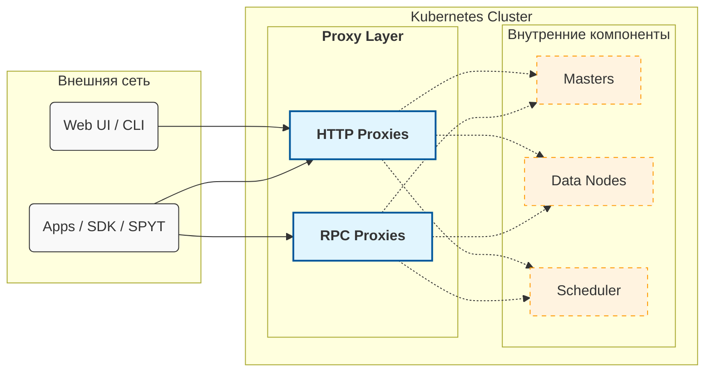
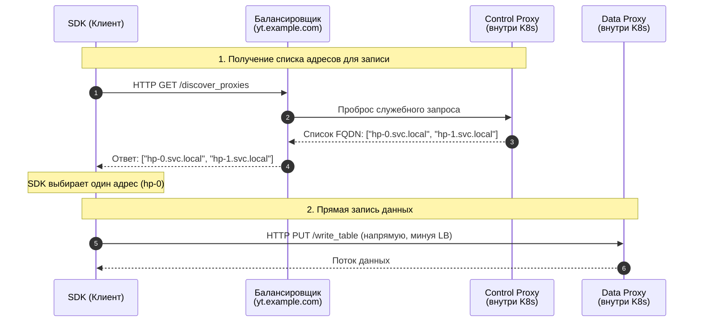

# Настройка внешнего доступа к {{product-name}} в Kubernetes

По умолчанию кластер {{product-name}}, развёрнутый в Kubernetes, изолирован от внешней сети. Для публикации сервисов, как правило, используются механизмы LoadBalancer или Ingress. Они хорошо подходят для отдельных веб-сервисов, предоставляя единую точку входа для клиентов, но [не обеспечивают](*scale-traffic) масштабирование большого сетевого потока.

Из данного руководства вы узнаете, как:

- [Решить проблему сетевой изоляции](../../../admin-guide/cluster-access-proxy/network-isolation.md) &mdash; настроить кластер так, чтобы внешние клиенты могли напрямую обращаться к узлам кластера для эффективной записи и чтения больших объёмов данных.

- [Разделить нагрузку между клиентами](../../../admin-guide/cluster-access-proxy/manage-traffic.md) &mdash; изолировать ресурсы разных проектов, а также разделить трафик на «лёгкий» (метаданные, UI) и «тяжёлый» (чтение и запись таблиц).

- [Настроить доступ для SPYT](../../../admin-guide/cluster-access-proxy/spyt.md) &mdash; настроить TCP-проксирование для прямого соединения внешнего драйвера Spark с воркерами внутри кластера.

## Обзор прокси {#overview}

Пользователи взаимодействуют с сервером {{product-name}} не напрямую, а через специальные прокси. Это компоненты {{product-name}}, которые выступают единой точкой входа и скрывают взаимодействие между компонентами и внутреннюю топологию кластера — например, адреса мастеров и data-нод.

С точки зрения Kubernetes, прокси обычно разворачиваются как StatefulSet, состоящий из нескольких подов. Их количество и выделяемые ресурсы (CPU, RAM) задаются в [спецификации](https://github.com/ytsaurus/ytsaurus-k8s-operator/blob/main/config/samples/cluster_v1_local.yaml#L56-L74) оператора {{product-name}}, а при запуске кластера каждый под прокси автоматически регистрируется в Кипарисе (в системных директориях `//sys/http_proxies` и `//sys/rpc_proxies`).

Прокси в {{product-name}} бывают двух типов:

- HTTP-прокси &mdash; реализуют HTTP API {{product-name}}. Активно используются в SDK, для работы веб-интерфейса и CLI.
- RPC-прокси &mdash; реализуют более быстрый бинарный протокол (YT RPC). В первую очередь необходимы там, где требуется низкая латентность запросов (например, при интенсивной потоковой работе с динамическими таблицами). Для всех остальных сценариев рекомендуется использовать HTTP-прокси.



## Понятие роли {#proxy-role}

Прокси можно [разбивать](../../../admin-guide/cluster-access-proxy/manage-traffic.md) на функциональные группы с помощью ролей. Как правило, выделяют две основные группы:

- Контрольные (control-прокси) &mdash; обрабатывают «лёгкие» запросы (навигация в UI, работа с метаданными Кипариса). Для них обычно назначается роль `control`.
- Тяжёлые (data-прокси) &mdash; обрабатывают «тяжёлые» запросы (потоковое чтение и запись больших таблиц). В Kubernetes-инсталляциях они чаще всего работают под ролью `default`.

Такое разделение позволяет гибко управлять ресурсами кластера: активное чтение огромной таблицы через data-прокси не затормозит работу веб-интерфейса и не помешает другим пользователям просматривать дерево Кипариса.

Технически роль &mdash; это строковая метка (атрибут `@role` в Кипарисе), которая присваивается инстансу прокси при запуске. По умолчанию все прокси в кластере запускаются с ролью `default`. Назначить роль можно в [спецификации Ytsaurus](https://github.com/ytsaurus/ytsaurus-k8s-operator/blob/main/config/samples/cluster_v1_local.yaml#L56C3-L74C18).

## Механизм Discovery {#discovery}

При инициализации клиента (SDK) разработчик указывает общий адрес кластера (например, `yt.example.com`). Обычно за этим адресом стоит балансировщик (Ingress или LoadBalancer), распределяющий запросы между доступными прокси-серверами.

Однако прогонять гигабайты трафика чтения/записи через один центральный балансировщик неэффективно. Чтобы масштабировать сетевой поток, SDK автоматически отправляют тяжёлые запросы на data-прокси напрямую, минуя центральную точку входа. Разработчику не нужно указывать в коде десятки адресов &mdash; SDK узнает про них самостоятельно через встроенный механизм Discovery. Он работает следующим образом:

1. Перед выполнением тяжёлого запроса SDK отправляет служебный HTTP-запрос `GET /api/v4/discover_proxies` на общий балансировщик.
1. В ответ сервер возвращает список адресов (FQDN) активных data-прокси.
1. SDK выбирает один адрес из списка и отправляет тяжёлый запрос напрямую к этому поду.

Ниже приведена схема работы механизма Discovery при вызове `write_table` в HTTP-прокси:





1. Клиентская библиотека (SDK) выполняет служебный HTTP-запрос `discover_proxies` на основной публичный адрес кластера (балансировщик `yt.example.com`).
2. Балансировщик принимает запрос и перенаправляет его внутрь кластера на один из доступных контрольных прокси-серверов (Control Proxy).
3. Контрольный прокси формирует список FQDN активных data-прокси (например, `hp-0.svc.local`, `hp-1.svc.local`) и возвращает его балансировщику.
4. Балансировщик возвращает этот список клиенту.
5. SDK выбирает из списка один конкретный адрес (в нашем примере — `hp-0`) и отправляет запрос на запись данных (`write_table`) напрямую к этому поду, минуя центральный балансировщик.
6. Между клиентом и data-прокси устанавливается прямое соединение, по которому передаётся поток данных.



### Роли прокси в Discovery {#discovery-roles}

При запросе `discover_proxies` клиент может дополнительно передать требуемую роль. При этом действует логика:
- Если роль указана явно (например, `role=heavy`), балансировщик вернёт адреса только выделенных под неё прокси.
- Если роль не указать, будут запрашиваться прокси с ролью `default`.

### Discovery в разных протоколах {#discovery-in-different-protocols}

- В HTTP используется «ленивый» подход. Запрос к `discover_proxies` выполняется перед началом чтения или записи файла.
- В RPC используется «жадный» подход. Клиент вызывает `discover_proxies` сразу при старте, получает список адресов RPC-прокси и устанавливает с ними постоянные TCP-соединения.



В более старых версиях API (< v4) точки входа в сервис Discovery различались.



В версиях API ниже v4:

- Для получения списка всех HTTP-прокси клиенты обращались к эндпоинту `/v3/entry`.
- Для получения RPC-прокси — к `/v3/discover_proxies`.

Начиная с версии v4, оба типа клиентов используют единый универсальный эндпоинт `/api/v4/discover_proxies` (с параметром `type=rpc` для RPC-клиентов).





<!--


Механизм Discovery можно отключить на стороне клиента (опция конфига `enable_proxy_discovery=%false`). Это удобно для быстрой отладки и тестирования: трафик перестаёт разделяться и направляется в единую точку входа. В продакшене использовать такой подход не рекомендуется — он направит весь объём передачи больших данных через балансировщик контрольных прокси, что может быстро привести к перегрузке узлов.


-->

## Почему возникает проблема доступов {#about-access-problem}

В стандартной конфигурации Kubernetes адреса подов являются внутренними (например, `hp-0.http-proxies.default.svc.cluster.local`).

Когда внешний SDK вызывает `discover_proxies`, кластер возвращает ему список внутренних FQDN. SDK, находясь за периметром кластера, не может разрешить эти DNS-имена в IP-адреса. В результате лёгкие команды через балансировщик работают успешно, а попытка записать данные завершается различными сетевыми ошибками — от ошибок разрешения DNS-имён до невозможности подключиться (`Temporary failure in name resolution`, `Connection refused`, `Connection timed out`).



Рассмотрим сценарий: кластер {{product-name}} развёрнут в Kubernetes, и требуется проверить доступ с локальной машины.

Для быстрого доступа к API контрольных прокси порт открыт через `kubectl port-forward`:

```bash
$ kubectl port-forward service/http-proxies-control-lb 8080:80
Forwarding from 127.0.0.1:8080 -> 80
```

Выполним лёгкую операцию — создать таблицу.

```bash
$ export YT_PROXY=127.0.0.1:8080
$ yt create table //home/my-table
30-56c4-10191-712a11b3
```

Команда сработала: таблица создана. Механизм Discovery не задействовался, запрос ушёл напрямую на адрес, указанный в переменной `YT_PROXY`.

Теперь попробуем записать данные в эту таблицу (`write-table`):

```bash
$ echo '{ "id": 0, "text": "Hello" }' | yt write-table //home/my-table --format json

WARNING HTTP PUT request http://hp-0.http-proxies.default.svc.cluster.local/api/v4/write_table failed with error NewConnectionError...
Failed to establish a new connection: [Errno -3] Temporary failure in name resolution
```

**Что произошло:**
При выполнении `write-table` SDK запросил список data-прокси. Кластер вернул внутренний адрес пода: `hp-0.http-proxies.default.svc.cluster.local`. SDK попытался соединиться с этим FQDN напрямую, но с локальной машины это имя не резолвится.

В качестве временного решения для отладки можно отключить Discovery на клиенте. Сделать это можно через переменные окружения, тогда весь трафик пойдёт через `port-forward`:

```bash
# Через патч конфига:
export YT_CONFIG_PATCHES='{proxy={enable_proxy_discovery=%false}}'
# Или через более короткий и популярный алиас для CLI:
export YT_USE_HOSTS=0

echo '{ "id": 0, "text": "Hello" }' | yt write-table //home/my-table --format json
```

Если после этого запись прошла успешно — значит, проблема именно в маршрутизации Discovery.



## См. также {#see-also}

- [Как решить проблему сетевой изоляции](../../../admin-guide/cluster-access-proxy/network-isolation.md)
- [Как разделить нагрузку между клиентами](../../../admin-guide/cluster-access-proxy/manage-traffic.md)
- [Как настроить доступ для SPYT](../../../admin-guide/cluster-access-proxy/spyt.md)
- [FAQ](../../../admin-guide/cluster-access-proxy/faq.md)

[*scale-traffic]: LoadBalancer и Ingress пропускают весь трафик через одну точку входа, но при больших объёмах данных это становится узким местом.<br>Чтобы масштабировать нагрузку, клиенты должны подключаться к узлам кластера напрямую. В Kubernetes IP-адреса подов по умолчанию внутренние — внешние клиенты не смогут к ним обратиться напрямую без дополнительной настройки.