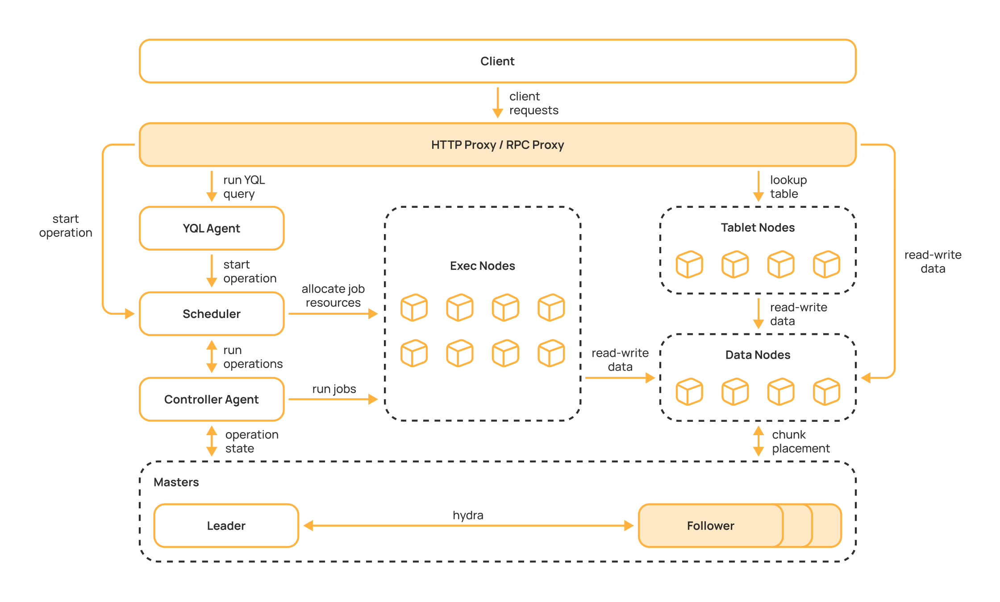

# Компоненты кластера {{product-name}}

В данном разделе приведено описание основных компонент, из которых состоит кластер {{product-name}}.

## Мастер

Одним из основных компонентов кластера являются мастеры. Мастеры {{product-name}} отвечают за отказоустойчивое хранение метаданных кластера. На мастерах хранится информация о пользователях системы, хранимых объектах и о местоположении самих данных. Файловая система, реализуемая мастерами, называется Кипарис. 

Для отказоустойчивости в кластере {{product-name}} должно быть несколько мастеров. Состояние мастеров идентично за счёт алгоритма консенсуса Hydra, похожего на протокол [Raft](https://raft.github.io/). Благодаря Hydra кластер остаётся доступен, пока доступно строго больше половины мастеров. Например, если в кластере три мастера, он будет работать, если доступны любые два. Количество мастеров должно быть нечётным, в production-инсталляциях рекомендуется использовать три или пять мастеров.

Мастеры {{product-name}} являются stateful компонентой кластера, поскольку хранят снапшоты состояния кластера и журналы изменений на диске. Для лучшей производительности мастеров рекомендуется использовать носитель, хорошо справляющийся с большим потоком небольших записей, например — NVMe SSD.

## Data Nodes

В то время как мастеры {{product-name}} ответственны за хранение метаданных кластера, данные кластера хранятся на `Data Nodes`. Файлы и таблицы, сохранённые в {{product-name}}, разбиваются на части, называемые [чанками](../../user-guide/storage/chunks.md). `Data Nodes` хранят чанки в файловой системе на диске, а мастеры хранят информацию о том, из каких чанков состоят таблицы и файлы и на каких `Data Nodes` данные чанки расположены. 

Как и мастеры {{product-name}}, `Data Nodes` являются stateful компонентами, поскольку хранят чанки на дисках. В отличие от мастеров, чтение и запись чанков в типичном случае происходит крупногранулярно, поэтому для хранения чанков можно использовать как HDD, так и SSD, в зависимости от характера нагрузки на систему. {{product-name}} поддерживает работу с различными типами дисков, позволяя объединять диски в группы, так называемые [медиумы](../../user-guide/storage/media.md). Использование такой группировки даёт возможность хранить данные на различных типах носителя.

## Планировщик

Для запуска вычислений на кластерах используется подсистема планирования, состоящая из планировщика и контроллер агентов. Сами вычисления исполняются на `Exec Nodes`.

В {{product-name}} планировщик шардирован. Он состоит из двух компонент: сам планировщик и контроллер агенты.

Планировщик отвечает за честное разделение ресурсов между пользователями кластера при помощи алгоритма HDRF, являющегося обобщением алгоритма [fair-share](https://en.wikipedia.org/wiki/Fair-share_scheduling). Планировщик взаимодействует с `Exec Nodes`, заказывая запуск новых джобов и получая информацию об их завершении.

В каждый момент времени в кластере активен только один планировщик, отвечающий за распределение ресурсов и запуск джобов. В целях отказоустойчивости рекомендуется запускать несколько планировщиков в пределах одного кластера. В таком случае один планировщик будет активен, а остальные планировщики будут готовы начать работу в случае выхода из строя активного. Планировщик является stateless компонентом: часть состояния планировщика, например список всех активных джобов, является транзиентной. Персистентная часть состояния, например описания запущенных операций, хранится в Кипарисе на мастерах.

Контроллер агенты являются второй частью подсистемы планирования и отвечают за логику исполнения операций. Например, для операции Map контроллер агенты решают, какие чанки будут обработаны, как входные данные будут разбиты на джобы, какие ресурсы требуются джобам для запуска и как результаты джобов будут объединены в выходные таблицы. Планировщик решает, сколько джобов может быть запущено одновременно и на каких `Exec Nodes` они могут быть выполнены в зависимости от вычислительных квот пользователя. Как и планировщики, контроллер агенты являются stateless компонентами, но хранят часть своего состояния в Кипарисе.

## Exec Nodes

`Exec Nodes` занимаются непосредственно исполнением джобов на вычислительных ресурсах кластера. `Exec Nodes` сообщают планировщику о запущенных и завершившихся джобах и доступных ресурсах. В ответ `Exec Nodes` получают от планировщика заявки на запуск новых джобов. `Exec Nodes` отвечают за подготовку окружения для джоба, запуск контейнеров для изоляции процессов, управление жизнью пользовательских процессов и многое другое. 

Для работы `Exec Nodes` требуется доступ к диску. Во-первых, на диске создаются директории, в которых запускаются пользовательские процессы и в которые загружаются файлы, заказанные пользователем в спецификации операции. Во-вторых, на диске содержится `Chunk Cache` или кеш артефактов: в кеше сохраняются файлы, загруженные в джоб для того, чтобы переиспользовать их между разными джобами одной или нескольких операций. Диски для подобных целей не обязаны быть надёжными: в отличие от мастеров или `Data Nodes`, потеря состояния `Exec Node` приводит только к потере прогресса исполняемых на ней джобов.

## Tablet Nodes

`Tablet Nodes` отвечают за работу динамических таблиц. Каждая динамическая таблица разбита на набор таблетов, которые обслуживаются таблет-селлами, запущенными в `Tablet Node`. Несмотря на то что динамические таблицы имеют достаточно сложное персистентное состояние, `Tablet Node` является stateless компонентой. Все необходимые данные сохраняются на `Data Nodes`.

## YQL Agent

Инстансы YQL Agent оркестрируют исполнение YQL-запросов, преобразуя их в цепочку Map/Reduce-операций.

## Proxy

Точкой входа в кластер являются прокси. Все пользовательские запросы к кластеру попадают именно в прокси, а затем попадают в нужные подсистемы. В {{product-name}} существует два вида прокси: HTTP и RPC. Прокси являются stateless компонентом.

HTTP-прокси принимают команды в виде HTTP-запросов, что позволяет легко задавать запросы к {{product-name}} из любого языка программирования. 

RPC-прокси используют внутренний протокол {{product-name}}, что усложняет работу с прокси, но повышает скорость обработки запросов. Использование RPC-прокси рекомендуется для latency-critical команд, выполняемых с высокой частотой, например запросов к динамическим таблицам.

