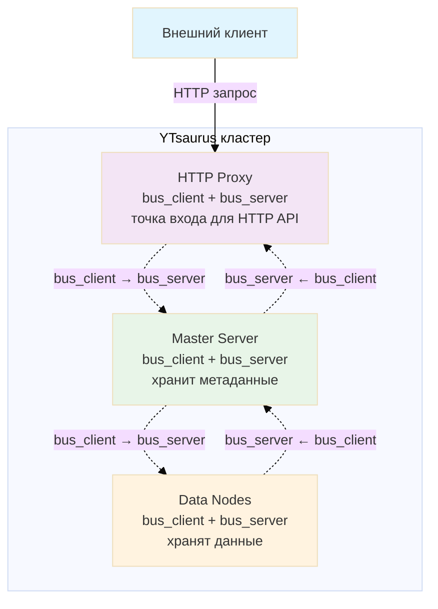
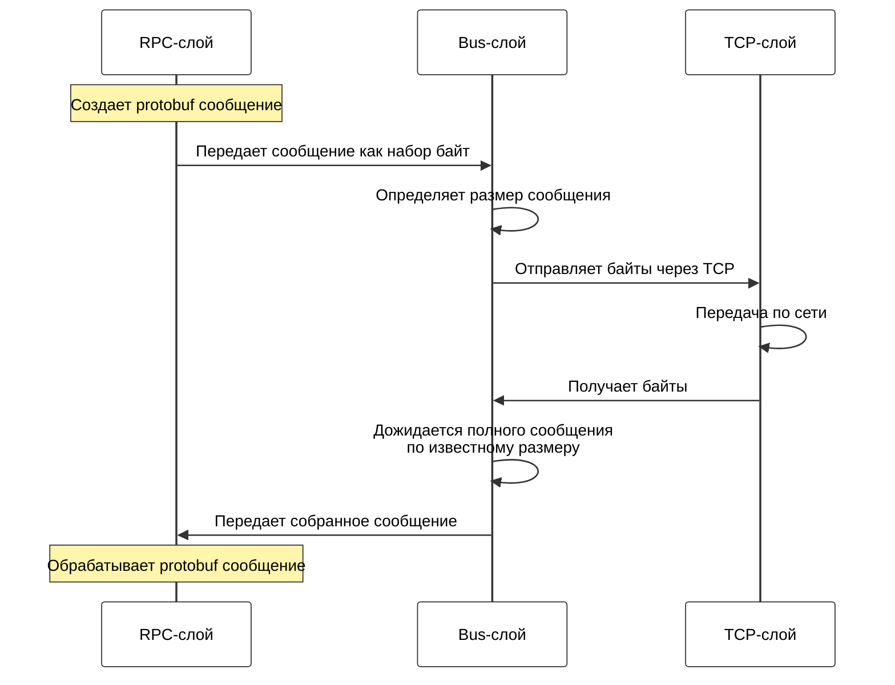
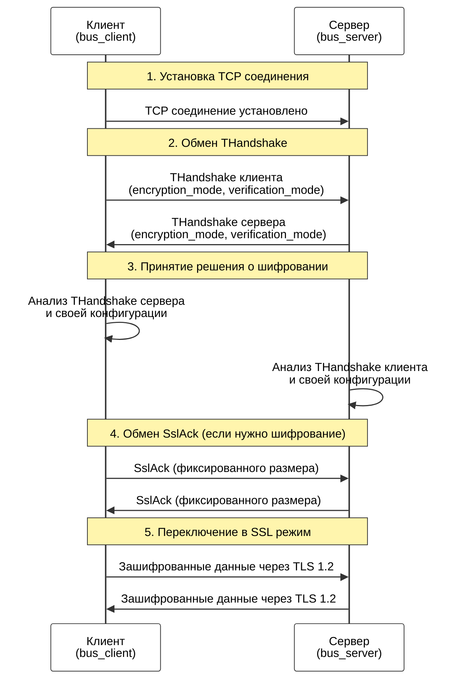

# Шифрование в нативном протоколе {{product-name}}

В этой статье вы узнаете, как работает механизм шифрования в {{product-name}} и как настроить его для защиты данных в вашем кластере.



По умолчанию {{product-name}} передаёт данные между компонентами по сети в незашифрованном виде. Возможность шифрования в нативном протоколе доступна начиная с версии {{product-name}} 25.2. Компоненты кластера используют специальный уровень `bus`, в котором данные передаются в зашифрованном виде используя протокол TLS 1.2.



## Когда использовать шифрование {#when-to-use}

Используйте шифрование в следующих случаях:

- вы работаете с конфиденциальными данными;
- необходимо защитить данные от перехвата в сети.

**Важно:** Шифрование увеличивает нагрузку на компоненты кластера и может незначительно снизить производительность. По умолчанию шифрование отключено для оптимальной производительности.

## Архитектура шифрования {#architecture}

{{product-name}} представляет собой распределённый кластер из множества взаимодействующих компонентов. Давайте рассмотрим, как работает шифрование на примере ключевых компонентов:



### Как устроен транспортный уровень bus {#bus-transport-layer}

Все компоненты общаются по внутреннему RPC-протоколу через транспортный уровень `bus`. Каждый компонент одновременно выступает в двух ролях:

- `bus_client` — инициирует соединение с другим компонентом;
- `bus_server` — принимает входящие соединения.

Пример: Когда HTTP Proxy подключается к Master:

- HTTP Proxy выступает как `bus_client` (инициирует соединение).
- Master выступает как `bus_server` (принимает соединение).

При этом каждый компонент может одновременно обрабатывать множество соединений в обеих ролях.

### Что такое уровень bus {#what-is-bus-layer}

`bus` — это транспортный уровень {{product-name}}, который обеспечивает передачу сообщений между компонентами. `bus` работает с сообщениями, что позволяет чётко определять их границы, в отличие от обычного TCP, который работает с потоком байт.



Над уровнем bus работает RPC-слой, который собирает из переданных байт protobuf-сообщения, а под уровнем bus находится TCP для сетевой передачи данных. Bus-слой точно знает размер каждого сообщения и дожидается получения всех байт перед передачей наверх.

## Как работает шифрование {#how-it-works}

При установке соединения компоненты проходят несколько этапов:

1. Установка TCP соединения — клиент и сервер устанавливают обычное TCP соединение;
1. Обмен рукопожатиями (THandshake) — клиент отправляет свой THandshake серверу, затем сервер отправляет свой THandshake клиенту;
1. Решение о шифровании — каждая сторона узнает из THandshake противоположной стороны, нужно ли устанавливать SSL соединение;
1. Обмен SslAck — если шифрование требуется, клиент и сервер обмениваются пакетами SslAck фиксированного размера;
1. Переключение в SSL режим — после обмена SslAck стороны переключаются на использование SSL библиотеки.

### Что такое THandshake

**THandshake** — это специальное protobuf-сообщение, которое обменивается между компонентами сразу после установки TCP соединения. В THandshake содержится информация о желаемом режиме шифрования и проверки сертификатов.

Ключевые особенности THandshake:

- Размер может меняться — поскольку это protobuf, размер сообщения может изменяться при добавлении новых полей.
- Строгая последовательность — сначала клиент отправляет свой THandshake, сервер его получает и только потом отправляет свой.
- Принятие решения — каждая сторона анализирует THandshake противоположной стороны и свою конфигурацию для решения о шифровании.

Процесс обмена THandshake:

1. Клиент → Сервер: THandshake клиента (содержит `encryption_mode`, `verification_mode`).
1. Сервер → Клиент: THandshake сервера (содержит `encryption_mode`, `verification_mode`).
1. Обе стороны принимают решение о необходимости шифрования на основе полученных данных.



### Принятие решения о шифровании {#encryption-decision}

Каждая компонента принимает решение о шифровании на основе:
- своей конфигурации (`encryption_mode`, `verification_mode`);
- конфигурации противоположной стороны (из THandshake).

Если хотя бы одна сторона настроена на `required`, а другая на `disabled`, соединение не будет установлено.

## Как настроить шифрование {#scenarios}

В этом разделе описаны основные способы настройки шифрования для различных сценариев развёртывания {{product-name}}.

### Компоненты для настройки {#components-to-configure}



- controller_agent
- data_node
- discovery
- exec_node
- master
- master_cache
- proxy
- rpc_proxy
- scheduler
- tablet_node
- timestamp_provider
- clock_provider



### Способы настройки {#configuration-methods}

Рассмотрим два основных способа настройки шифрования в кластере {{product-name}}: через Kubernetes с использованием оператора и ручное развёртывание.



- Kubernetes

  ### Развёртывание нового кластера с шифрованием

  Для развёртывания кластера YTsaurus с шифрованием используйте готовый пример конфигурации из официального репозитория.

  1. **Установите cert-manager:**
     ```bash
     kubectl apply -f https://github.com/cert-manager/cert-manager/releases/download/v1.13.0/cert-manager.yaml
     ```

  1. **Скачайте и примените готовую конфигурацию с TLS:**
     ```bash
     kubectl apply -f https://raw.githubusercontent.com/ytsaurus/ytsaurus-k8s-operator/main/config/samples/cluster_v1_tls.yaml
     ```

  Эта конфигурация автоматически создаёт:
   - самоподписанный CA (Certificate Authority);
   - issuer на основе CA для выпуска сертификатов;
   - сертификаты для внутреннего взаимодействия компонентов;
   - кластер YTsaurus с включённым TLS.

  1. **Проверьте статус развёртывания:**
     ```bash
     kubectl get ytsaurus ytsaurus
     kubectl get certificates
     kubectl get secrets | grep ytsaurus
     ```

  ### Включение шифрования на существующем кластере

   1. **Добавьте настройки TLS в спецификацию существующего кластера:**
      ```yaml
      spec:
        # Установка CA bundle
        caBundle:
          kind: Secret
          name: ytsaurus-ca-secret
          key: tls.crt
        
        # Настройка TLS для внутреннего транспорта
        nativeTransport:
          tlsSecret:
            name: ytsaurus-native-cert
          tlsClientSecret:
            name: ytsaurus-native-cert
          tlsRequired: true
          tlsInsecure: true
          tlsPeerAlternativeHostName: "interconnect.ytsaurus-dev.svc.cluster.local"
      ```

   1. **Примените изменения:**
      ```bash
      kubectl apply -f your-ytsaurus-config.yaml
      ```

   1. **Проверьте статус:**
      ```bash
      kubectl get ytsaurus
      kubectl logs -l app=ytsaurus-master | grep -i "tls\|ssl"
      ```

- Ручное развёртывание

  ### Включение шифрования для нового кластера

  1. Подготовьте SSL сертификаты для всех компонентов кластера.
  1. Настройте `bus_server` со следующими параметрами:

    ```yaml
    "bus_server" = {
        "encryption_mode" = "required";
        "verification_mode" = "none";
        "ca" = {
            "file_name" = "/etc/yt/certs/ca.pem";
        };
        "cert_chain" = {
            "file_name" = "/etc/yt/certs/server.pem";
        };
        "private_key" = {
            "file_name" = "/etc/yt/certs/server.key";
        };
    };
    ```

  1. Настройте `bus_client` с аналогичными параметрами:

    ```yaml
    "bus_client" = {
        "encryption_mode" = "required";
        "verification_mode" = "ca";
        "ca" = {
            "file_name" = "/etc/yt/certs/ca.pem";
        };
    };
    ```

  1. Перезапустите компоненты кластера.



## Конфигурация шифрования {#configuration}

### Параметры конфигурации шифрования {#configuration-parameters}

Для настройки шифрования используются следующие параметры:

#|
|| **Параметр** | **Описание** ||
|| `encryption_mode` | Режим шифрования:
- `disabled` — шифрование отключено. Если другая сторона требует шифрование (`required`), соединение не будет установлено;
- `optional` — шифрование по запросу. Соединение будет с шифрованием, если у другой стороны режим `required`;
- `required` — обязательное шифрование. Если у другой стороны режим `disabled`, соединение завершится ошибкой. ||
|| `verification_mode` | Режим проверки сертификатов:
- `none` — аутентификация другой стороны не выполняется;
- `ca` — другая сторона аутентифицируется по CA файлу (проверяется, что сертификат подписан доверенным CA);
- `full` — другая сторона аутентифицируется по CA и по соответствию сертификата имени хоста (самый строгий режим). ||
|| `cipher_list` | Набор шифров через двоеточие. Пример: `"AES128-GCM-SHA256:PSK-AES128-GCM-SHA256"` ||
|| `ca` | CA сертификат или путь к файлу. Пример: `{ "file_name" = "/etc/yt/certs/ca.pem" }` ||
|| `cert_chain` | Сертификат или путь к файлу. Пример: `{ "file_name" = "/etc/yt/certs/cert.pem" }` ||
|| `private_key` | Приватный ключ или путь к файлу. Пример: `{ "file_name" = "/etc/yt/certs/key.pem" }` ||
|| `load_certs_from_bus_certs_directory` | Загружать сертификаты из директории с bus сертификатами. При значении `true` параметры `ca`, `cert_chain`, `private_key` интерпретируются как имена файлов, а не пути. Удобно для внешних кластеров. ||
|#

### Таблица совместимости режимов {#compatibility-table}

#|
|| **Режим клиента** | **Режим сервера** | **Результат** ||
|| `disabled` | `disabled` | Соединение без шифрования ||
|| `disabled` | `optional` | Соединение без шифрования ||
|| `disabled` | `required` | чОшибка: соединение не установлено ||
|| `optional` | `disabled` | Соединение без шифрования ||
|| `optional` | `optional` | Соединение без шифрования ||
|| `optional` | `required` | Соединение с шифрованием ||
|| `required` | `disabled` | Ошибка: соединение не установлено ||
|| `required` | `optional` | Соединение с шифрованием ||
|| `required` | `required` | Соединение с шифрованием ||
|#

### Примеры конфигураций {#configuration-examples}

#### Взаимная проверка сертификатов (Mutual TLS) {#mutual-tls}

В этом режиме обе стороны проверяют сертификаты друг друга, обеспечивая максимальный уровень безопасности.



```yaml
# Клиент
"bus_client" = {
    "encryption_mode" = "required";
    "verification_mode" = "full";
    "ca" = {
        "file_name" = "/etc/yt/certs/ca.pem";
    };
    "cert_chain" = {
        "file_name" = "/etc/yt/certs/client.pem";
    };
    "private_key" = {
        "file_name" = "/etc/yt/certs/client.key";
    };
};

# Сервер
"bus_server" = {
    "encryption_mode" = "required";
    "verification_mode" = "full";
    "ca" = {
        "file_name" = "/etc/yt/certs/ca.pem";
    };
    "cert_chain" = {
        "file_name" = "/etc/yt/certs/server.pem";
    };
    "private_key" = {
        "file_name" = "/etc/yt/certs/server.key";
    };
};
```



#### Одностороннее шифрование (клиент проверяет сервер) {#one-way-encryption}

В этом режиме только клиент проверяет сертификат сервера, сервер не требует сертификат от клиента.



```yaml
# Клиент
"bus_client" = {
    "encryption_mode" = "required";
    "verification_mode" = "ca";
    "ca" = {
        "file_name" = "/etc/yt/certs/ca.pem";
    };
};

# Сервер
"bus_server" = {
    "encryption_mode" = "required";
    "verification_mode" = "none";
    "cert_chain" = {
        "file_name" = "/etc/yt/certs/server.pem";
    };
    "private_key" = {
        "file_name" = "/etc/yt/certs/server.key";
    };
};
```



## Настройка внешних кластеров {#external-clusters}

Для подключения к внешним кластерам с шифрованием добавьте конфигурацию в `//sys/external_clusters`:

```yaml
{
    "external_cluster" = {
        "bus_client" = {
            "encryption_mode" = "required";
            "verification_mode" = "ca";
            "ca" = {
                "file_name" = "ca.pem";
            };
            "load_certs_from_bus_certs_directory" = %true;
        };
        # ... другие параметры подключения
    };
}
```

Важно: `//sys/external_clusters` должен иметь тип `document`.

## Производительность {#performance}

Шифрование увеличивает нагрузку на CPU и может незначительно снизить производительность. По результатам тестирования:

- Нагрузка на CPU увеличивается на 5-15% в зависимости от типа операций.
- Пропускная способность снижается на 3-10%.
- Задержка увеличивается на 1-5 мс.

Для мониторинга шифрованных соединений используйте метрики `yt.bus.*` с тегом `encrypted=1`.
