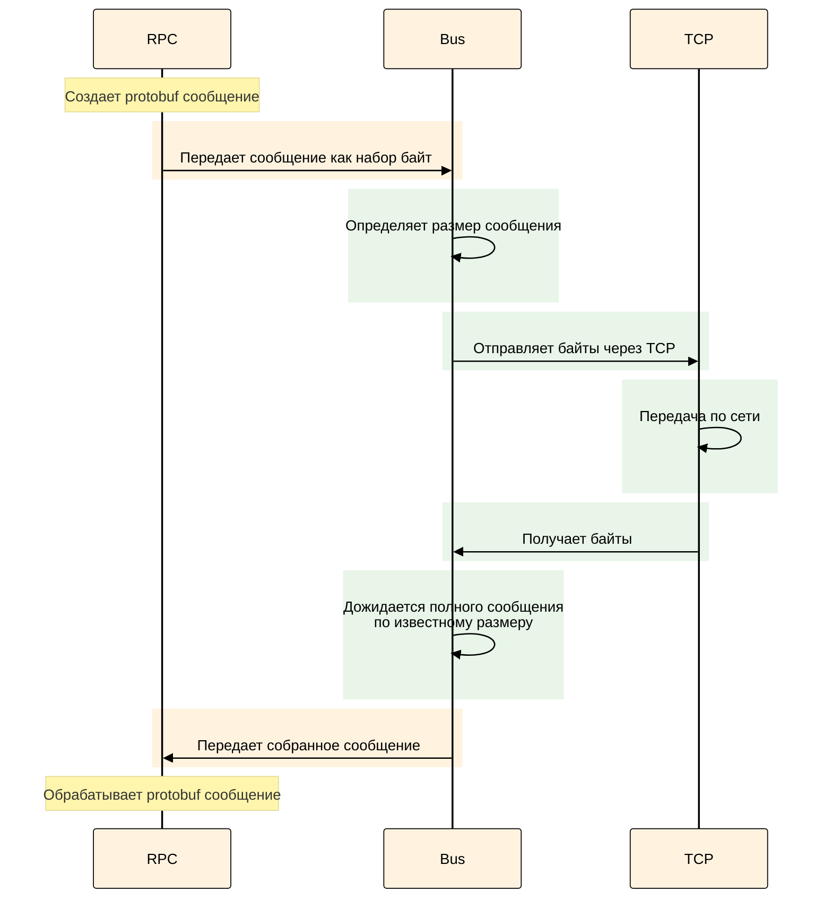
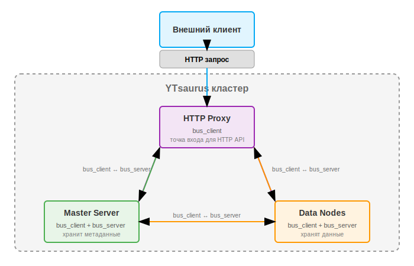
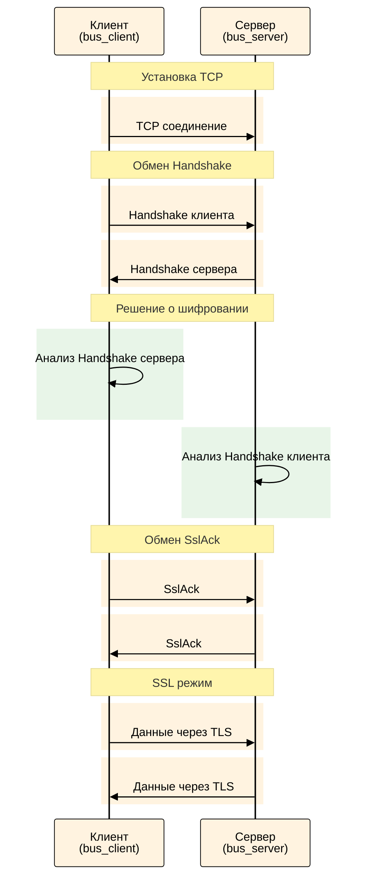

# Шифрование в нативном протоколе {{product-name}}

{{product-name}} поддерживает шифрование внутреннего трафика между компонентами кластера с использованием TLS. В документе описана архитектура шифрования и инструкции по настройке для различных сценариев развёртывания.

## Обзор {#overview}

Все компоненты кластера {{product-name}} — мастера, узлы данных, прокси и планировщики — общаются между собой по внутреннему нативному RPC-протоколу. По умолчанию данные передаются в открытом виде, что подходит для доверённых сетей. Если вы работаете в публичной сети или требуется защита конфиденциальных данных, используйте шифрование трафика.

{{product-name}} поддерживает [два режима](#configuration-examples) защиты соединений:

- [Взаимная аутентификация (mTLS)](#example-mtls) — обе стороны проверяют сертификаты друг друга
- [Одностороннее шифрование](#example-one-way) — клиент проверяет подлинность сервера

Механизм ротации сертификатов позволяет обновлять их без остановки сервисов. При развёртывании в Kubernetes можно использовать cert-manager для автоматического управления сертификатами.



Возможность шифрования в нативном протоколе доступна начиная с версии {{product-name}} 25.2.



## Архитектура шифрования {#architecture}

Чтобы правильно настроить шифрование, важно понимать, как устроено взаимодействие компонентов в кластере {{product-name}}. Ниже рассмотрена архитектура транспортного уровня и процесс установки защищённого соединения.

### Что такое уровень bus {#what-is-bus-layer}

`bus` — это транспортный уровень {{product-name}}, который обеспечивает передачу сообщений между компонентами: планировщиком, прокси, дата-нодами и т.д. `bus` работает с сообщениями, что позволяет чётко определять их размер, в отличие от обычного TCP, который работает с потоком байт.

<div class="mermaid-diagram-compact">



</div>

Над уровнем `bus` работает RPC-слой, который собирает из переданных байт protobuf-сообщения, а под уровнем `bus` находится TCP для сетевой передачи данных. Bus-слой точно знает размер каждого сообщения и дожидается получения всех байт перед передачей наверх.


На схеме ниже показано взаимодействие компонентов кластера {{product-name}} между собой и с внешними клиентами. Шифрование трафика настраивается и происходит исключительно внутри кластера — между его компонентами (например, HTTP Proxy, Master Server, Data Nodes). Тип внешнего клиента не влияет на шифрование: это может быть обычный HTTP-клиент, CHYT, SPYT или любой другой сервис. Полный список компонентов, поддерживающих шифрование, см. в разделе [Компоненты для настройки](#components-list).




Каждый компонент (мастер, планировщик, дата-нода и др.) выступает одновременно в двух ролях:

- `bus_client` — инициирует исходящие соединения к другим компонентам.
- `bus_server` — принимает входящие соединения от других компонентов.

Например, когда HTTP Proxy запрашивает данные у Master Server:

- HTTP Proxy выступает как `bus_client` (инициатор соединения)
- Master Server выступает как `bus_server` (принимающая сторона)

При этом тот же Master Server может одновременно выступать как `bus_client` при обращении к другим компонентам кластера.

### Процесс установки защищённого соединения {#secure-connection-process}

Установка шифрованного соединения между компонентами происходит в несколько этапов:

1. Установка TCP соединения — клиент и сервер устанавливают обычное TCP соединение;
1. Обмен рукопожатиями (Handshake) — клиент отправляет свой Handshake серверу, затем сервер отправляет свой Handshake клиенту;
1. Решение о шифровании — каждая сторона узнает из Handshake противоположной стороны, нужно ли устанавливать SSL соединение;
1. Обмен SslAck — если шифрование требуется, клиент и сервер обмениваются пакетами SslAck фиксированного размера;
1. Переключение в SSL режим — после обмена SslAck стороны переключаются на использование SSL библиотеки.

<div class="mermaid-diagram-compact">



</div>


**Handshake** — это protobuf-сообщение, которым обмениваются компоненты сразу после установки TCP-соединения. Оно содержит:

- `encryption_mode` — требования к шифрованию (`disabled`/`optional`/`required`)
- `verification_mode` — требования к проверке сертификатов (`none`/`ca`/`full`)

Ключевые особенности Handshake:

- Размер может меняться — поскольку это protobuf, размер сообщения может изменяться при добавлении новых полей.
- Строгая последовательность — сначала клиент отправляет свой Handshake, сервер его получает и только потом отправляет свой.
- Принятие решения — каждая сторона анализирует Handshake противоположной стороны и свою конфигурацию для решения о включении шифрования.

### Принятие решения о шифровании {#encryption-decision}

Каждая компонента принимает решение о шифровании на основе:

- своей конфигурации (`encryption_mode`, `verification_mode`);
- конфигурации противоположной стороны (из Handshake).

Если хотя бы одна сторона настроена на `required`, а другая на `disabled`, соединение не будет установлено.

## Как включить шифрование {#configuration}

Для включения шифрования необходимо настроить соответствующие параметры в конфигурации компонентов кластера. Ниже приведены доступные параметры и сценарии их применения.

### Параметры конфигурации {#configuration-parameters}

Шифрование настраивается через параметры `bus_client` и `bus_server` в конфигурации каждого компонента:

#|
|| **Параметр** {.cell-align-center}| **Описание** {.cell-align-center}||
|| `encryption_mode` {#encryption_mod}| Режим шифрования:
- `disabled` — шифрование отключено. Если другая сторона требует шифрование (`required`), соединение не будет установлено;
- `optional` — шифрование по запросу. Соединение будет с шифрованием, если у другой стороны режим `required`;
- `required` — обязательное шифрование. Если у другой стороны режим `disabled`, соединение завершится ошибкой. ||
|| `verification_mode` | Режим проверки сертификатов:
- `none` — аутентификация другой стороны не выполняется;
- `ca` — другая сторона аутентифицируется по CA файлу (проверяется, что сертификат подписан доверённым CA);
- `full` — другая сторона аутентифицируется по CA и по соответствию сертификата имени хоста (самый строгий режим). ||
|| `cipher_list` | Набор шифров через двоеточие. Пример: `"AES128-GCM-SHA256:PSK-AES128-GCM-SHA256"` ||
|| `ca` | CA сертификат или путь к файлу. Пример: `{ "file_name" = "/etc/yt/certs/ca.pem" }` ||
|| `cert_chain` | Сертификат или путь к файлу. Пример: `{ "file_name" = "/etc/yt/certs/cert.pem" }` ||
|| `private_key` | Приватный ключ или путь к файлу. Пример: `{ "file_name" = "/etc/yt/certs/key.pem" }` ||
|| `load_certs_from_bus_certs_directory` | Загружать сертификаты из директории с bus сертификатами. При значении `true` параметры `ca`, `cert_chain`, `private_key` интерпретируются как имена файлов, а не пути. Удобно для внешних кластеров. ||
|#

### Совместимость режимов шифрования {#encryption-modes-compatibility}

При установке соединения результат зависит от комбинации режимов в настройках параметра [encryption_mode](#configuration-parameters) для `bus_client` и `bus_server`:

#|
|| **Клиент** {.cell-align-center}| **Сервер** {.cell-align-center}| **Результат** {.cell-align-center}||
|| `disabled` | `disabled` | Соединение без шифрования ||
|| `disabled` | `optional` | Соединение без шифрования ||
|| `disabled` | `required` | Ошибка соединения ||
|| `optional` | `disabled` | Соединение без шифрования ||
|| `optional` | `optional` | Соединение без шифрования ||
|| `optional` | `required` | Соединение с шифрованием ||
|| `required` | `disabled` | Ошибка соединения ||
|| `required` | `optional` | Соединение с шифрованием ||
|| `required` | `required` | Соединение с шифрованием ||
|#

### Компоненты для настройки {#components-list}

Шифрование можно настроить для следующих компонентов кластера:

- controller_agent
- data_node
- discovery
- exec_node
- master
- master_cache
- proxy
- rpc_proxy
- scheduler
- tablet_node
- timestamp_provider
- clock_provider
- qt
- yql_agent

Так же шифрование можно настроить и с внешними компонентами кластера, такими как SPYT и CHYT.



Для работы с TLS в CHYT требуется:

- CHYT версии не ниже 2.17

- Strawberry версии не ниже 0.0.14 




### Интеграция с CHYT

В отличие от других компонентов, CHYT запускается внутри [vanilla-операции](../../user-guide/data-processing/operations/vanilla) {{product-name}}, поэтому сертификаты передаются особым образом:

- Strawberry читает сертификаты из файлов, указанных в её конфигурации.
- Конфигурация `cluster-connection` с параметрами `bus_client`/`bus_server` берётся из Кипариса для определения режима шифрования и параметров подключения к компонентам кластера.
- Все настройки безопасности, включая сертификаты и параметры шифрования, передаются в операцию через механизм [secure_vault](*secure_vault).
- При изменении сертификатов Strawberry вычисляет хеш новых данных и, обнаружив изменения, автоматически перезапускает операцию для применения обновлённых настроек.

Механизм `secure_vault` позволяет безопасно передать в операции сертификаты и ключи, но при этом он не отображает их в открытом виде. Конфигурация `cluster-connection` содержит все необходимые настройки для установки защищённых соединений между CHYT и другими компонентами кластера, включая режимы шифрования (`encryption_mode`) и проверки сертификатов (`verification_mode`).


## Примеры конфигураций {#configuration-examples}

Ниже показаны примеры — как настроить TLS с разным уровнем безопасности. Эти конфигурации используются в файлах настроек компонентов {{product-name}} — подробнее о том, как их применять, читайте в разделе [параметры конфигурации](#configuration).

### Взаимная проверка сертификатов (mTLS) {#example-mtls}

Конфигурация для максимального уровня безопасности с проверкой сертификатов обеих сторон:



```yaml
# Клиентская часть
bus_client:
  encryption_mode: required
  verification_mode: full
  ca:
    file_name: /etc/yt/certs/ca.pem
  cert_chain:
    file_name: /etc/yt/certs/client.pem
  private_key:
    file_name: /etc/yt/certs/client.key

# Серверная часть
bus_server:
  encryption_mode: required
  verification_mode: full
  ca:
    file_name: /etc/yt/certs/ca.pem
  cert_chain:
    file_name: /etc/yt/certs/server.pem
  private_key:
    file_name: /etc/yt/certs/server.key
```



### Одностороннее шифрование {#example-one-way}

Конфигурация, где только клиент проверяет сертификат сервера:



```yaml
# Клиентская часть
bus_client:
  encryption_mode: required
  verification_mode: ca
  ca:
    file_name: /etc/yt/certs/ca.pem

# Серверная часть
bus_server:
  encryption_mode: required
  verification_mode: none
  cert_chain:
    file_name: /etc/yt/certs/server.pem
  private_key:
    file_name: /etc/yt/certs/server.key
```




## Сценарии настройки {#deployment-scenarios}

Способ настройки шифрования зависит от того, как развёрнут ваш кластер {{product-name}}. Ниже приведены инструкции для основных сценариев развёртывания.



- K8s с оператором {selected}

  - [Развёртывание нового кластера с шифрованием](#k8s-new-cluster)
  - [Включение шифрования на существующем кластере](#k8s-existing-cluster)
  - [Параметры TLS в спецификации оператора](#k8s-tls-parameters)
  - [Автоматическая ротация сертификатов](#k8s-cert-rotation)
  - [Режимы работы TLS](#k8s-tls-modes)


  #### Развёртывание нового кластера с шифрованием {#k8s-new-cluster}

  Самый простой способ — использовать готовый демо-пример конфигурации с включенным TLS:

  1. Установите cert-manager (если еще не установлен):
  
     ```bash
     kubectl apply -f https://github.com/cert-manager/cert-manager/releases/download/v1.13.0/cert-manager.yaml
     ```

  2. Примените конфигурацию кластера с TLS:

     ```bash
     kubectl apply -f https://raw.githubusercontent.com/ytsaurus/ytsaurus-k8s-operator/main/config/samples/cluster_v1_tls.yaml
     ```

  3. Проверьте статус развёртывания:

     ```bash
     kubectl get ytsaurus -n <namespace>
     ```

     ```
     NAME       CLUSTERSTATE   UPDATESTATE   UPDATINGCOMPONENTS   BLOCKEDCOMPONENTS
     ytsaurus   Running        None
     ```

     Команда показывает статус кластера YTsaurus. Статус `Running` означает, что кластер успешно запущен и работает. Пустые поля `UPDATINGCOMPONENTS` и `BLOCKEDCOMPONENTS` указывают на нормальную работу всех компонентов.

     ```bash
     kubectl get certificates -n <namespace>
     ```

     ```
     NAME                   READY   SECRET                 AGE
     ytsaurus-ca            True    ytsaurus-ca-secret     42d
     ytsaurus-https-cert    True    ytsaurus-https-cert    42d
     ytsaurus-native-cert   True    ytsaurus-native-cert   42d
     ytsaurus-rpc-cert      True    ytsaurus-rpc-cert      42d
     ```

     Команда выводит список сертификатов, управляемых cert-manager. Статус `READY: True` подтверждает, что сертификаты успешно выпущены и готовы к использованию. Сертификат `ytsaurus-native-cert` используется для шифрования внутреннего bus-трафика между компонентами.

     ```bash
     kubectl get secrets -n <namespace> | grep -E "ytsaurus|tls|cert"
     ```

     ```
     ytsaurus-ca-secret      kubernetes.io/tls   3      41d
     ytsaurus-https-cert     kubernetes.io/tls   3      41d
     ytsaurus-native-cert    kubernetes.io/tls   3      41d
     ytsaurus-rpc-cert       kubernetes.io/tls   3      41d
     ```

     Команда показывает секреты Kubernetes с TLS-сертификатами и ключами. 

     - Тип `kubernetes.io/tls` указывает на TLS-секрет;
     - Число `3` в колонке DATA означает три компонента: 

        - `tls.crt` (сертификат); 
        - `tls.key` (приватный ключ);
        - `ca.crt` (CA сертификат для проверки).

     ```bash
     kubectl describe ytsaurus <cluster-name> -n <namespace> | grep -A 5 "Native Transport"
     ```

     ```
     Native Transport:
       Tls Client Secret:
         Name:                          ytsaurus-native-cert
       Tls Insecure:                    true
       Tls Peer Alternative Host Name:  interconnect.ytsaurus-dev.svc.cluster.local
       Tls Required:                    true
       Tls Secret:
         Name:  ytsaurus-native-cert
     ```

     Команда показывает настройки шифрования в конфигурации кластера. Параметр `Tls Required: true` подтверждает обязательное использование шифрования для внутренних соединений.

     ```bash
     kubectl describe certificate <certificate-name> -n <namespace>
     ```

     ```
     Name:         ytsaurus-native-cert
     Namespace:    default
     Status:
       Conditions:
         Last Transition Time:  2026-01-30T07:45:50Z
         Message:               Certificate is up to date and has not expired
         Reason:                Ready
         Status:                True
         Type:                  Ready
       Not After:               2026-04-30T07:45:50Z
       Not Before:              2026-01-30T07:45:50Z
       Renewal Time:            2026-03-31T07:45:50Z
     ```

     Команда показывает детали сертификата. Поля `Not After` (истечение) и `Renewal Time` (время обновления) подтверждают автоматическую ротацию сертификатов через cert-manager.

     ```bash
     kubectl get secret <secret-name> -n <namespace> -o jsonpath='{.data.ca\.crt}' | base64 -d > /tmp/ca.crt
     kubectl exec -n ytsaurus hp-0 -- curl --cacert /tmp/ca.crt -k -v https://hp-0.http-proxies.ytsaurus.svc.cluster.local:443/api/v4/
     ```

     Команда проверяет TLS-handshake при подключении к API кластера **изнутри кластера**. Опция `-v` включает verbose-режим для просмотра процесса установки защищённого соединения.

     
     ```
     * Connected to hp-0.http-proxies.ytsaurus.svc.cluster.local (10.1.1.93) port 443
     * ALPN, offering h2
     * ALPN, offering http/1.1
     * TLSv1.3 (OUT), TLS handshake, Client hello (1):
     } [512 bytes data]
     * TLSv1.3 (IN), TLS handshake, Server hello (2):
     { [93 bytes data]
     * TLSv1.2 (IN), TLS handshake, Certificate (11):
     { [926 bytes data]
     * TLSv1.2 (IN), TLS handshake, Server key exchange (12):
     { [300 bytes data]
     * TLSv1.2 (IN), TLS handshake, Server finished (14):
     { [4 bytes data]
     * TLSv1.2 (OUT), TLS handshake, Client key exchange (16):
     } [37 bytes data]
     * TLSv1.2 (OUT), TLS change cipher, Change cipher spec (1):
     } [1 bytes data]
     * TLSv1.2 (OUT), TLS handshake, Finished (20):
     } [16 bytes data]
     * TLSv1.2 (IN), TLS handshake, Finished (20):
     { [16 bytes data]
     * SSL connection using TLSv1.2 / ECDHE-RSA-AES256-GCM-SHA384
     * ALPN, server did not agree on a protocol
     * Server certificate:
     *  subject: [NONE]
     *  start date: Jan 30 07:45:50 2026 GMT
     *  expire date: Apr 30 07:45:50 2026 GMT
     *  issuer: O=ytsaurus CA; CN=ytsaurus-ca
     *  SSL certificate verify result: unable to get local issuer certificate (20), continuing anyway.
     > GET /api/v4/ HTTP/1.1
     > Host: hp-0.http-proxies.ytsaurus.svc.cluster.local
     > User-Agent: curl/7.68.0
     > Accept: */*
     < HTTP/1.1 200 OK
     < Content-Length: 18118
     < X-YT-Trace-Id: b430ab8e-c4e8ab91-fcb54bb1-3c53ef11
     < Cache-Control: no-store
     < X-YT-Request-Id: 40981ad3-5ad47b6c-74c2640f-20856da1
     < X-YT-Proxy: hp-0.http-proxies.ytsaurus.svc.cluster.local
     < Content-Type: application/json
     ```
     
     

     Вывод показывает успешное выполнение всех этапов TLS-handshake: Client hello → Server hello → Certificate → Key exchange → Finished. Соединение установлено по протоколу `TLSv1.2` с использованием шифра `ECDHE-RSA-AES256-GCM-SHA384`. Сертификат выдан `ytsaurus CA` и действителен до указанной даты. Статус ответа `HTTP/1.1 200 OK` подтверждает успешное выполнение запроса через защищённое соединение.

     Ключевые моменты в выводе:

     - Успешное выполнение всех этапов TLS-handshake (Client hello → Server hello → Certificate → Key exchange → Finished)
     - Установлено соединение по протоколу `TLSv1.2`
     - Используется современный шифр `ECDHE-RSA-AES256-GCM-SHA384`
     - Сертификат выдан `ytsaurus CA` и действителен до `Apr 30 07:45:50 2026 GMT`
     - HTTP-прокси YTsaurus (`X-YT-Proxy: hp-0.http-proxies.ytsaurus.svc.cluster.local`) успешно обрабатывает запрос через защищённое соединение
     - Статус ответа `HTTP/1.1 200 OK` подтверждает успешное выполнение запроса через TLS

  Эта конфигурация автоматически создает самоподписанный CA, выпускает сертификаты и настраивает компоненты для работы шифрования с взаимной аутентификаций (mTLS).

  #### Включение шифрования на существующем кластере {#k8s-existing-cluster}

  Для включения шифрования на работающем кластере добавьте в спецификацию YTsaurus следующие параметры:

  ```yaml
  spec:
    # CA сертификат для проверки
    caBundle:
      kind: Secret
      name: ytsaurus-ca-secret
      key: tls.crt

    # Настройки TLS для внутреннего транспорта
    nativeTransport:
      tlsSecret:
        name: ytsaurus-native-cert
      tlsRequired: true
      tlsInsecure: true
      tlsPeerAlternativeHostName: "interconnect.ytsaurus-dev.svc.cluster.local"
  ```

  

  Параметр `tlsInsecure: true` отключает проверку клиентских сертификатов. Для полноценной взаимной аутентификации (mTLS) установите `tlsInsecure: false` и укажите `tlsClientSecret`.

  

  #### Параметры TLS в спецификации оператора {#k8s-tls-parameters}

  #|
  || **Параметр** {.cell-align-center}| **Описание** {.cell-align-center}||
  || `caBundle` | Ссылка на секрет с CA сертификатом для проверки ||
  || `tlsSecret` | Секрет с серверным сертификатом (тип kubernetes.io/tls) ||
  || `tlsClientSecret` | Секрет с клиентским сертификатом для mTLS ||
  || `tlsRequired` | Требовать обязательное шифрование (`true`/`false`) ||
  || `tlsInsecure` | Отключить проверку клиентских сертификатов (`true`/`false`) ||
  || `tlsPeerAlternativeHostName` | Имя хоста для проверки в сертификате ||
  |#

  #### Автоматическая ротация сертификатов {#k8s-cert-rotation}

  При использовании cert-manager ротация происходит автоматически:

  - Cert-manager отслеживает срок действия сертификатов.
  - При приближении истечения срока выпускается новый сертификат.
  - Секрет обновляется без перезапуска подов.
  - Компоненты используют новый сертификат для новых соединений.

  **Как работает автоматическая ротация:**

  - Когда срок действия текущего сертификата истекает, cert-manager автоматически выпускает новый сертификат.
  - Новый сертификат и ключ обновляются в Kubernetes Secret, который смонтирован в контейнер.
  - Файл сертификата, смонтированный в контейнер сервера, автоматически обновляется без перезапуска пода.
  - Каждый сервер периодически перечитывает сертификат:

    - на уровне BUS — при каждом новом соединении;
    - существующие соединения продолжают работать со старым сертификатом;
    - новые соединения используют обновлённый сертификат.

  #### Режимы работы TLS {#k8s-tls-modes}

  В зависимости от значений `tlsRequired` и `tlsInsecure` формируются разные режимы работы TLS:

  #|
  || **tlsRequired** | **tlsInsecure** | **Описание** | **server** | **client** ||
  || `false` | `true` | Шифрование отключено, компоненты общаются в открытом виде | `EO-VN` | `EO-VN` ||
  || `false` | `false` | TLS включён, но не обязателен. Клиент проверяет сертификат сервера, но сервер не требует TLS | `EO-VN` | `ER-VF` ||
  || `true` | `true` | Шифрование включено, но сервер не проверяет сертификат клиента (одностороннее шифрование) | `ER-VN` | `ER-VF` ||
  || `true` | `false` | Шифрование включено, обе стороны проверяют сертификаты друг друга (взаимная проверка) | `ER-VF` | `ER-VF` ||
  |#

  **Расшифровка:**
  - `EO` – Encryption Optional (шифрование опционально)
  - `ER` – Encryption Required (шифрование обязательно)
  - `VN` – Verification None (проверка сертификатов отключена)
  - `VF` – Verification Full (полная проверка сертификатов)

- Ручное развёртывание

  - [Подготовка сертификатов](#manual-prepare-certs)
  - [Настройка компонентов](#manual-configure-components)
  - [Применение конфигурации](#manual-apply-config)


  #### Подготовка сертификатов {#manual-prepare-certs}

  Перед настройкой шифрования подготовьте SSL-сертификаты:

  1. CA сертификат для проверки
  2. Сертификаты и ключи для каждого компонента
  3. Разместите файлы в доступном для компонентов месте (например, `/etc/yt/certs/`)

  #### Настройка компонентов {#manual-configure-components}

  В конфигурационном файле каждого компонента добавьте параметры шифрования:

  ```yaml
  # Настройки для серверной части
  bus_server:
    encryption_mode: required
    verification_mode: none
    ca:
      file_name: /etc/yt/certs/ca.pem
    cert_chain:
      file_name: /etc/yt/certs/server.pem
    private_key:
      file_name: /etc/yt/certs/server.key

  # Настройки для клиентской части
  bus_client:
    encryption_mode: required
    verification_mode: ca
    ca:
      file_name: /etc/yt/certs/ca.pem
  ```

  #### Применение конфигурации {#manual-apply-config}

  1. Обновите конфигурационные файлы всех компонентов
  1. Перезапустите компоненты кластера
  1. Проверьте установку шифрованных соединений в логах

- Внешние кластеры

  - [Настройка защищённого соединения между кластерами](#external-clusters-mtls)
  - [Подготовка](#external-prepare)
  - [Настройка кластера A](#external-cluster-a)
  - [Настройка кластера B](#external-cluster-b)

  #### Настройка защищённого соединения между кластерами {#external-clusters-mtls}

  Для организации защищённого канала между двумя кластерами {{product-name}} необходимо настроить взаимную аутентификацию (mTLS). Это обеспечивает максимальный уровень безопасности при межкластерном взаимодействии.

  #### Подготовка {#external-prepare}

  На каждом кластере подготовьте:
  
  - CA сертификат противоположного кластера
  - Клиентский сертификат и ключ для своего кластера
  - Разместите файлы в директории bus-сертификатов

  #### Настройка кластера A {#external-cluster-a}

  1. **Скачайте текущую конфигурацию кластеров**:
     ```bash
     yt get //sys/clusters > clusters.yaml
     ```

  1. **Добавьте конфигурацию для подключения к кластеру B**:
     ```yaml
     cluster-b:
       discovery_servers:
         - "cluster-b.example.com:2136"
       primary_master: "cluster-b.example.com:9013"
       bus_client:
         encryption_mode: required
         verification_mode: full
         ca:
           file_name: ca-cluster-b.pem
         cert_chain:
           file_name: client-cluster-a.pem
         private_key:
           file_name: client-cluster-a.key
         load_certs_from_bus_certs_directory: true
     ```

  1. **Загрузите обновлённую конфигурацию**:
     ```bash
     yt set //sys/clusters < clusters.yaml
     ```

  #### Настройка кластера B {#external-cluster-b}

  Повторите аналогичные шаги на кластере B, указав параметры для подключения к кластеру A.

  

  Для работы взаимной аутентификации конфигурация должна быть настроена на обоих кластерах. Односторонняя настройка приведет к ошибкам соединения.

  




## Производительность {#performance}

Шифрование увеличивает нагрузку на CPU и может незначительно снизить производительность. По результатам тестирования:

- нагрузка на CPU увеличивается на 5-15% в зависимости от типа операций;
- пропускная способность снижается на 3-10%;
- задержка увеличивается на 1-5 мс.

<style>
.mermaid-diagram {
  max-width: 800px !important;
  margin: 20px auto !important;
  text-align: center !important;
  display: block !important;
}

.mermaid-diagram svg {
  max-width: 120% !important;
  height: auto !important;
  display: block !important;
  margin: 0 auto !important;
  font-family: Arial, sans-serif !important;
}

.mermaid-diagram-compact {
  max-width: 800px !important;
  margin: 20px auto !important;
  text-align: center !important;
  display: block !important;
}

.mermaid-diagram-compact svg {
  max-width: 140% !important;
  max-height: 700px !important;
  height: auto !important;
  display: block !important;
  margin: 0 auto !important;
  font-family: Arial, sans-serif !important;
  transform: scaleX(1) scaleY(1);
  transform-origin: center;
}

.mermaid-diagram-small {
  max-width: 700px !important;
  margin: 20px auto !important;
  text-align: center !important;
  display: block !important;
}

.mermaid-diagram-small svg {
  max-width: 100% !important;
  height: auto !important;
  display: block !important;
  margin: 0 auto !important;
  font-family: Arial, sans-serif !important;
  transform: scale(1);
  transform-origin: center;
}
</style>

[*secure_vault]: Защищённое хранилище секретов операции.

[*cluster-name]: Замените на имя вашего кластера YTsaurus. 

[*namespace]: Замените на namespace, где развернут кластер.


