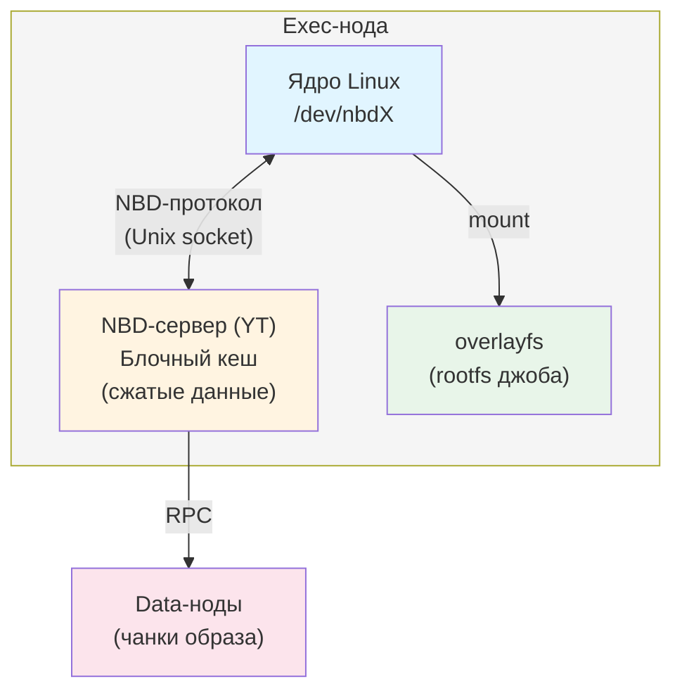

# NBD на кластере {{product-name}}

В этом документе описана настройка и использование NBD (Network Block Device) на кластере {{product-name}}. NBD позволяет подключать образы файловых систем из Кипариса в качестве слоёв корневой файловой системы джобов, что ускоряет подготовку окружения, снижает нагрузку на диск и при некоторых условиях нагрузку на сеть.

## Как работает NBD { #how-it-works }

NBD — Network Block Device, механизм ядра Linux, который позволяет монтировать блочные устройства, данные которых хранятся удалённо. В {{product-name}} NBD используют для подключения образов файловых систем SquashFS из Кипариса в качестве слоёв корневой файловой системы джобов.

### Архитектура { #architecture }

На каждой exec-ноде работает NBD-сервер — компонент {{product-name}}, который реализует протокол NBD поверх Unix Domain Socket или TCP. Схема работы:



Последовательность событий при подготовке NBD слоя:

1. Exec-нода получает задание с `layer_paths`, содержащим NBD слой.
1. YT скачивает метаданные чанков образа, не сами данные.
1. NBD-сервер регистрирует экспорт для образа.
1. Ядро Linux подключает `/dev/nbdX` к экспорту через Unix Domain Socket.
1. Porto монтирует `/dev/nbdX` как слой в overlayfs.
1. Когда джоб обращается к файлу, ядро читает нужные блоки через `/dev/nbdX` → NBD-сервер → data-ноды.

### Блочный кеш { #block-cache }

NBD-сервер поддерживает блочный кеш in-memory LRU для хранения сжатых данных чанков. Кеш позволяет избежать повторных обращений к data-нодам при чтении одних и тех же блоков разными джобами. Размер кеша настраивается параметром `block_cache_compressed_data_capacity`.

### Кеш томов { #volume-cache }

Exec-нода кеширует RO NBD тома, смонтированные образы. Если несколько джобов используют один и тот же NBD слой на одной exec-ноде, система создаёт том один раз и переиспользует его. Метрики кеша: `exec_node/ronbd_volume_cache/missed_count`, `exec_node/ronbd_volume_cache/hit_count`.

### Установка пакетов { #packages }

Для работы с NBD и SquashFS установите пакеты:

```bash
sudo apt install nbd-client squashfs-tools
```

- `nbd-client` — утилита для ручного подключения NBD-устройств. Используется при диагностике: NBD-сервер {{product-name}} встроен в exec-ноду, и в штатном режиме ядро подключается к нему напрямую.
- `squashfs-tools` — утилиты `mksquashfs` и `unsquashfs` для сборки и проверки SquashFS-образов.

Для конвертации существующих tar-слоёв в SquashFS дополнительно установите `squashfs-tools-ng` с утилитой `tar2sqfs`:

```bash
sudo apt install squashfs-tools-ng
```

Проверьте установку:

```bash
nbd-client --version
# This is nbd-client, from nbd 3.26.1

mksquashfs -version
# mksquashfs version 4.6.1 (2023/03/25)
```

### Модуль ядра nbd { #kernel-module }

Для работы NBD требуется загрузка модуля ядра `nbd`. Параметр `nbds_max` определяет число NBD-устройств, которые ядро создаёт при загрузке модуля. NBD-устройства могут создаваться и удаляться динамически.

Загрузка модуля вручную:

```bash
modprobe nbd nbds_max=1024
```

Автоматическая загрузка после перезагрузки, рекомендуется:

Создайте файл `/etc/modules-load.d/nbd.conf`:

```ini
nbd
```

Создайте файл `/etc/modprobe.d/nbd.conf`:

```ini
options nbd nbds_max=1024
```



Модуль `nbd` должен загружаться автоматически после перезагрузки хоста. Без этого exec-нода не сможет создавать NBD-устройства после перезагрузки.



Проверка загрузки модуля:

```bash
lsmod | grep nbd
# nbd                    49152  0
cat /sys/module/nbd/parameters/nbds_max
# 128
```

Рекомендуемое значение `nbds_max`: не менее числа джобовых слотов на ноде, умноженного на максимальное число NBD слоёв в одном джобе. Например, для 32 слотов и 2 NBD слоёв на джоб: `nbds_max=128`. Устройства могут создаваться динамически, поэтому значение не ограничивает работу, но заранее созданный запас снижает накладные расходы на создание устройств под нагрузкой.

## Конфигурация NBD { #configuration }

Настройка NBD выполняется через динамический конфиг exec-ноды. Все параметры находятся в секции `exec_node/nbd`.

### Включение NBD { #enable }

```yaml
exec_node:
  nbd:
    enabled: true
```



После включения NBD exec-нода запускает NBD-сервер при старте. Изменение `enabled` требует перезапуска ноды.



### Полный пример конфигурации { #full-config }

```yaml
exec_node:
  nbd:
    enabled: true
    block_cache_compressed_data_capacity: 536870912  # 512 МБ
    client:
      io_timeout: 30000          # 30 секунд, в миллисекундах
      reconnect_timeout: 5000    # 5 секунд, в миллисекундах
      connection_count: 1
    server:
      thread_count: 2
      unix_domain_socket:
        path: /tmp/nbd.sock
```

### Параметры конфигурации { #config-params }

#|
|| **Параметр** | **Тип** | **По умолчанию** | **Описание** ||
|| `exec_node/nbd/enabled` | `bool` | `false` | Включает или отключает NBD на exec-ноде. При `enabled: true` система запускает NBD-сервер при старте ноды ||
|| `exec_node/nbd/block_cache_compressed_data_capacity` | `int64`, байты | `0` — кеш отключён | Размер блочного кеша сжатых данных в байтах. Кеш хранится в памяти exec-ноды и система использует его для кеширования блоков чанков, прочитанных с data-нод. Рекомендуемое значение: от 512 МБ до 4 ГБ в зависимости от доступной памяти и нагрузки ||
|| `exec_node/nbd/client/io_timeout` | `duration`, мс | `30000` — 30 секунд | Таймаут ожидания ответа на NBD-запрос чтения. При превышении таймаута система абортирует джоб с `abort_reason=NbdError` ||
|| `exec_node/nbd/client/reconnect_timeout` | `duration`, мс | `5000` — 5 секунд | Таймаут переподключения NBD-клиента к NBD-серверу при разрыве соединения ||
|| `exec_node/nbd/client/connection_count` | `int` | `1` | Число соединений NBD-клиента с NBD-сервером на одно устройство ||
|| `exec_node/nbd/server/thread_count` | `int` | `2` | Число потоков NBD-сервера. Рекомендуется значение 2–4 ||
|| `exec_node/nbd/server/unix_domain_socket/path` | `string` | — | Путь к Unix Domain Socket, через который ядро Linux подключается к NBD-серверу. Должен быть уникальным для каждой exec-ноды ||
|| `exec_node/nbd/server/internet_domain_socket/port` | `int` | — | Порт TCP-сокета для NBD-сервера. Система использует его вместо Unix Domain Socket, если требуется доступ к NBD-серверу по сети ||
|#



### Конфигурация через ytdyncfgen { #ytdyncfgen }

На внутренних кластерах динамический конфиг exec-нод управляется через `ytdyncfgen`. Для включения NBD добавьте в конфиг кластера:

```yaml
exec_node:
  nbd:
    enabled: true
    block_cache_compressed_data_capacity: 536870912
    client:
      io_timeout: 30000
    server:
      thread_count: 2
      unix_domain_socket:
        path: /tmp/nbd.sock
```



## Проверка работоспособности { #health-check }

### Проверка состояния ноды { #node-state }

После включения NBD убедитесь, что exec-нода перешла в состояние `online` и не имеет алертов:

```bash
yt get //sys/exec_nodes/<node-address>/@state
# "online"

yt get //sys/exec_nodes/<node-address>/@alerts
# []
```

### Проверка через тестовую операцию { #test-operation }

Запустите тестовую операцию с NBD слоем:

```python
import yt.wrapper as yt

# Создайте тестовый squashfs образ и загрузите его в Кипарис
# yt set //path/to/layer.squashfs/@filesystem squashfs
# yt set //path/to/layer.squashfs/@access_method nbd

yt.run_map(
    lambda row: row,
    source_table="//tmp/test_input",
    destination_table="//tmp/test_output",
    spec={
        "mapper": {
            "layer_paths": ["//path/to/layer.squashfs"],
        }
    }
)
```

### Проверка через логи { #logs }

В логах exec-ноды `exec-node.info.log` при успешном запуске NBD-сервера появляются записи:

```text
NBD server started (UnixDomainSocket: /tmp/nbd.sock, ThreadCount: 2)
```

При создании NBD-устройства:

```text
Creating NBD device (FilePath: //path/to/layer.squashfs, DeviceName: /dev/nbd0)
NBD device created (FilePath: //path/to/layer.squashfs, DeviceName: /dev/nbd0)
```

## Мониторинг { #monitoring }



### Дашборды { #dashboards }

- [Общий дашборд NBD](https://monitoring.yandex-team.ru/projects/yt/dashboards/all-nbd) — метрики NBD по всем кластерам.
- [Дашборд для тасклетов](https://monitoring.yandex-team.ru/projects/yt/dashboards/tasklets-nbd) — метрики NBD для тасклетов.
- [Дашборд для беспилотников](https://monitoring.yandex-team.ru/projects/yt/dashboards/selfdriving-nbd) — метрики NBD для беспилотников.



### Solomon-сенсоры { #sensors }

Система экспортирует все метрики NBD в Solomon. Основные сенсоры:

Серверные метрики:

#|
|| **Сенсор** | **Описание** ||
|| `nbd/server/count` | Показывает текущее число NBD-серверов ||
|| `nbd/server/created` | Показывает число созданных NBD-серверов ||
|#

Метрики устройств. Тег `file_path` — путь к файлу слоя в Кипарисе:

#|
|| **Сенсор** | **Описание** ||
|| `nbd/device/count` | Показывает текущее число активных NBD-устройств ||
|| `nbd/device/created` | Показывает число созданных устройств ||
|| `nbd/device/removed` | Показывает число удалённых устройств ||
|| `nbd/device/registered` | Показывает число зарегистрированных устройств в NBD-сервере ||
|| `nbd/device/unregistered` | Показывает число снятых с регистрации устройств ||
|| `nbd/device/read_count` | Показывает число read-запросов ||
|| `nbd/device/read_bytes` | Показывает число прочитанных байт ||
|| `nbd/device/read_time` | Показывает время чтения, гистограмма ||
|| `nbd/device/read_block_bytes_from_cache` | Показывает число байт, прочитанных из блочного кеша ||
|| `nbd/device/read_block_bytes_from_disk` | Показывает число байт, прочитанных с data-нод ||
|#

Метрики томов. Теги `type=nbd`, `file_path`:

#|
|| **Сенсор** | **Описание** ||
|| `volumes/count` | Показывает текущее число томов ||
|| `volumes/created` | Показывает число созданных томов ||
|| `volumes/create_errors` | Показывает число ошибок создания томов ||
|| `volumes/create_time` | Показывает время создания тома, гистограмма ||
|| `volumes/removed` | Показывает число удалённых томов ||
|| `volumes/remove_time` | Показывает время удаления тома, гистограмма ||
|#

Метрики кеша томов:

#|
|| **Сенсор** | **Описание** ||
|| `exec_node/ronbd_volume_cache/missed_count` | Показывает число промахов кеша RO NBD томов ||
|| `exec_node/ronbd_volume_cache/hit_count` | Показывает число попаданий в кеш. Тег `hit_type=sync\|async` ||
|| `exec_node/squashfs_volume_cache/missed_count` | Показывает число промахов кеша SquashFS томов ||
|| `exec_node/squashfs_volume_cache/hit_count` | Показывает число попаданий в кеш SquashFS томов ||
|#

### Ключевые метрики для мониторинга { #key-metrics }

#|
|| **Метрика** | **Описание** ||
|| `nbd/device/read_block_bytes_from_cache` vs `nbd/device/read_block_bytes_from_disk` | Показывает эффективность блочного кеша. Если большинство данных читается с диска, стоит увеличить `block_cache_compressed_data_capacity` ||
|| `volumes/create_errors` | Показывает наличие проблем с монтированием NBD слоёв. Ненулевое значение указывает на ошибки ||
|| `exec_node/ronbd_volume_cache/missed_count` | Показывает эффективность кеша томов. Высокое значение при повторных запусках одних и тех же слоёв может указывать на проблемы с кешем томов ||
|#

## Обработка ошибок { #error-handling }



Причина: ошибка чтения из NBD-устройства во время выполнения джоба. Джоб абортируется с `abort_reason=NbdError`. Типичные причины:

- Разрыв соединения между NBD-сервером и data-нодой.
- Превышение `io_timeout`.
- Недоступность data-ноды, хранящей чанки образа.

Поведение: джоб автоматически абортируется и перезапускается. Если ошибки повторяются на нескольких попытках, операция завершается с ошибкой.

Диагностика: в логах exec-ноды ищите записи с `NbdError` или `NBD read failed`. Проверьте доступность data-нод и состояние сети.





Причина: ошибка монтирования слоя во время подготовки корневой файловой системы джоба. Типичные причины:

- Повреждённый образ слоя.
- Неверный тип файловой системы — `@filesystem`.
- NBD-сервер не запущен или не настроен.
- Модуль ядра `nbd` не загружен.
- Ядро не смогло подготовить NBD-устройство. Подробнее — в разделе [Ошибки доступа к NBD-устройствам](#troubleshooting).

Диагностика: проверьте логи exec-ноды и состояние модуля ядра:

```bash
lsmod | grep nbd
dmesg | grep nbd
```





Причина: попытка использовать NBD слой на exec-ноде, где NBD не включён или NBD-сервер не запустился.

Решение: включите NBD в динамическом конфиге — `exec_node/nbd/enabled: true` — и убедитесь, что NBD-сервер успешно запустился.



### Диагностика через orchid { #orchid }

Состояние NBD-сервера доступно через orchid exec-ноды:

```bash
yt get //sys/exec_nodes/<node-address>/orchid/exec_node
```

## Типичные проблемы и решения { #troubleshooting }



Симптом: после перезагрузки хоста джобы с NBD слоями завершаются с ошибкой `RootVolumePreparationFailed`.

Причина: модуль ядра `nbd` не загружается автоматически.

Решение: настройте автозагрузку модуля. Подробнее — в разделе [Модуль ядра nbd](#kernel-module).





Симптом: первые обращения к файлам в NBD слое медленные.

Причина: данные читаются с data-нод, блочный кеш пуст.

Решение:

- Увеличьте `block_cache_compressed_data_capacity`.
- Храните слои на SSD — атрибут `primary_medium=ssd_blobs`.
- Увеличьте `replication_factor` слоя.





Симптом: джобы регулярно абортируются с `abort_reason=NbdError`.

Причина: нестабильная сеть или перегруженные data-ноды.

Решение:

- Увеличьте `io_timeout`.
- Проверьте состояние data-нод и сети.
- Убедитесь, что слои хранятся на SSD с достаточным `replication_factor`.





Симптом: ошибки вида `No such device` или `Failed to open /dev/nbdX` в логах.

Причина: ядру не удалось создать NBD-устройство. Обычно причина в устаревшем ядре без поддержки динамического создания устройств или в нехватке системных ресурсов.

Решение: увеличьте число устройств, создаваемых при загрузке модуля:

```bash
modprobe nbd nbds_max=256
```

Если проблема сохраняется, проверьте версию ядра и вывод `dmesg | grep nbd`.




<style>
.dc-mini-toc__section_child {
    display: none;
}

@media screen and (max-width: 768px) {
    .dc-doc-page__content-mini-toc ul li ul {
        display: none;
    }
}
</style>
