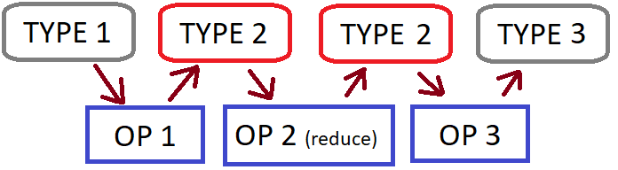

# Лямбда-выражения

В некоторых YT-операциях вычисления настолько просты, что заводить для каждой из них класс с использованием [C++ API](../../api/c/description.md) кажется излишним. В этом случае можно воспользоваться для описания операций [лямбда-выражениями](https://ru.wikipedia.org/wiki/Лямбда-выражение).

ниже в примечаниях всё актуально?



В данный момент такие лямбда-выражения не могут захватывать переменные, т.е. должны иметь пустой capture-блок, что делает их эквивалентными C-функциям. Это связано с тем, что в современном C++ лямбду общего вида правильно сериализовать проблематично. Чтобы передать в лямбду какие-нибудь параметры, иногда можно использовать `static const` и глобальные переменные [TSaveable](#saveable).





Это работает только из программ, статически собранных из Arcadia под Linux.  Т.е. для платформы, идентичной внутреннему устройству YT, настройками вроде `JobBinaryLocalPath` пользоваться нельзя.





## Использование библиотеки yt-lambda

Подключите `PEERDIR(mapreduce/yt/library/lambda)` в ya.make, включите в программу заголовок `#include `.
[Инициализируйте YT](../../api/c/description.md#init) и получите `client`. Передавайте `client` или [транзакцию](../../api/c/description.md#transactions) первым параметром в описанные в данном документе функции.

Функции этой библиотеки хорошо сочетаются с использованием записей в формате [protobuf](../../api/c/protobuf.md).



## Общий взгляд на операции

В этой библиотеке все операции принимают на вход выраженные лямбдами операторы над одной записью, которые затем многократно применяются. В целом операцию можно также представить себе в виде цепочки преобразований типов:

{ .center}

### Аддитивные (additive) операции

Вариант обычных операций, где [Reduce](../../../user-guide/data-processing/operations/reduce.md) имеет на входе и выходе один и тот же тип, а также ассоциативен. В этом случае можно дополнительно упростить реализацию Reduce-преобразования, а также бесплатно использовать её в качестве комбайнера (combiner? сумматор?).

{ .center}

## CopyIf

Данная функция фильтрует записи в таблице без их изменения.

```c++
template <class T>
void CopyIf(const IClientBasePtr& client, const TRichYPath& from, const TRichYPath& to, bool (*p)(const T&));
```

| **Параметр** | **Описание**                                                     |
| -------- | ------------------------------------------------------------ |
| `T`      | Тип записи (TNode или конкретный тип [protobuf-сообщения](../../api/c/protobuf.md)). |
| `from`   | Имя входной таблицы.                                         |
| `to`     | Имя выходной таблицы.                                        |
| `p`      | Фильтрующий предикат.                                        |

Замечания:

- Порядок записей в таблице не меняется, специально выставляется флаг `Ordered`, который может немного замедлить операцию.
- Известная недоработка: если входная таблица одна, имеет схему и отсортирована, до схемы выходной таблицы информация о сортировке не доходит.

### Пример использования

```c++
NYT::CopyIf<TMyProtoMsg>(client, "//home/project/inTable", "//home/project/outTable",
    [](auto& rec) { return rec.GetSomeField() > 10000; });
```

## TransformCopyIf, или Map

Данная функция делает классический [Map](../../../user-guide/data-processing/operations/map.md), т.е. читает каждую запись из таблицы одного формата и пишет её в таблицу другого формата. Некоторые записи не попадают в конечную таблицу.

```c++
template <class R, class W>
void TransformCopyIf(const IClientBasePtr& client, const TRichYPath& from, const TRichYPath& to, bool (*mapper)(const R&, W&));
```

| **Параметр** | **Описание**                                                     |
| -------- | ------------------------------------------------------------ |
| `R`      | Тип входной записи (TNode или конкретный тип protobuf - сообщения). |
| `W`      | Тип выходной записи (TNode или конкретный тип protobuf - сообщения). |
| `from`   | Имя входной таблицы.                                         |
| `to`     | Тмя выходной таблицы.                                        |
| `mapper` | Функция преобразования, принимающая на вход запись `src` типа `R` и заполняющая запись `dst` типа `W`. Чтобы `dst` записалось, надо вернуть `true`. По соображениям производительности обёртка (?) передаёт в качестве `dst` одну и ту же переменную - буфер, которая между вызовами `mapper` даже не очищается. Как правило, это не проблема, т.к. `mapper` обычно заполняет одни и те же поля `dst`. |

Замечание:

- Порядок записей в таблице не меняется, специально выставляется флаг `Ordered`, который может немного замедлить операцию.

### Пример использования

```c++
NYT::TransformCopyIf<TDataMsg, TStatsMsg>(
    client, "//home/project/inTable", "//home/project/outTable",
    [](auto& src, auto& dst) {
        dst.SetField(src.GetField());
        return true;
    });
```

## AdditiveReduce

```c++
template <class T, class TFin>
void AdditiveReduce(
    const IClientBasePtr& client,
    const TKeyBase<TRichYPath>& from,
    const TRichYPath& to,
    const TKeyColumns& reduceFields,
    void (*reducer)(const T&, T&),
    bool (*finalizer)(const T&, TFin&));
```

| **Параметр**       | **Описание**                                                     |
| -------------- | ------------------------------------------------------------ |
| `T`            | Тип входной и выходной записи для reducer (TNode или конкретный тип protobuf - сообщения). |
| `TFin`Opt      | <span style="color: green;">**не обязательно;** </span> тип выходной записи в случае использования finalizer (TNode или конкретный тип protobuf —  сообщения). |
| `from`         | Имя входной таблицы (таблиц).                                |
| `to`           | Имя выходной таблицы.                                        |
| `reduceFields` | По одинаковым значениям каких ключей сортируем и делаем свёртку (Reduce). |
| `reducer`      | Функция преобразования, принимающая на вход новую запись `src` типа `T` и модифицирующая запись `dst` того же типа `T`. В `dst` изначально закладывается первая запись текущего диапазона записей с одинаковыми `reduceFields`-ключами. Если в текущем диапазоне одна запись, `reducer` вызываться не будет. В поля `dst`, соответствующие ключам, ничего писать не нужно - там уже всё готово. |
| `finalizer`Opt |  Опциональный параметр: функция преобразования, принимающая на вход новую запись `src` типа `T` и заполняющая запись `dst` типа `TFin`. Вызывается один раз после обработки Reduce диапазона входных записей для формирования конечного варианта выходной записи. `dst` изначально инициализируется по умолчанию. В поля `dst`, соответствующие ключам, ничего писать не нужно - там уже всё готово. |

## Reduce

```c++
template <class R, class W, class TFin>
void Reduce(
    const IClientBasePtr& client,
    const TKeyBase<TRichYPath>& from,
    const TRichYPath& to,
    const TKeyColumns& reduceFields,
    void (*reducer)(const R&, W&),
    bool (*finalizer)(const W&, TFin&));
```

| **Параметр**       | **Описание**                                                     |
| -------------- | ------------------------------------------------------------ |
| `R`            | Тип входной записи (TNode или конкретный тип protobuf —  сообщения). |
| `W`            | Тип выходной записи reducer'а (TNode или protobuf).          |
| `TFin`Opt      | Опциональный параметр: тип выходной записи в случае использования finalizer (TNode или конкретный тип protobuf - сообщения). |
| `from`         | Имя входной таблицы (таблиц).                                |
| `to`           | Имя выходной таблицы.                                        |
| `reduceFields` | По одинаковым значениям каких ключей сортируем и делаем свёртку (Reduce). |
| `reducer`      | Функция преобразования, принимающая на вход новую запись `src` типа `R` и модифицирующая запись `dst` типа `W`. `dst` изначально инициализируется по умолчанию (в случае TNode будет пустая TNode, т.е. `Undefined`. Protobuf обычно инициализируется нулями и пустыми строчками, что делает его более пригодным. В поля `dst`, соответствующие ключам, ничего писать не нужно - там уже всё готово. |
| `finalizer`Opt | Опциональный параметр: функция преобразования, принимающая на вход новую запись `src` типа `W` и заполняющая запись `dst` типа `TFin`. Вызывается один раз после обработки reduce'ом диапазона входных записей для формирования финального варианта выходной записи. `dst` изначально инициализируется по умолчанию. В поля `dst`, соответствующие ключам, ничего писать не нужно - там уже всё готово. |

## AdditiveMapReduce[Sorted] { #additive_mapreduce }

Функция `AdditiveMapReduce` делает слитную [MapReduce-операцию](../../../user-guide/data-processing/operations/mapreduce.md), т.е. преобразует записи входной таблицы (или таблиц), полученное сортирует и делает Reduce. При этом reducer должен быть [ассоциативной бинарной операцией](https://ru.wikipedia.org/wiki/Ассоциативная_операция) над записями одинакового типа, обычно это сложение чисел. В качестве бонуса YT может использовать такой reducer в качестве комбайнера(?), если нужно.

К сожалению, слитные операции MapReduce в YT всегда производят неотсортированную таблицу. Для этого предназначена функция `AdditiveMapReduceSorted`, которая вызывает `AdditiveMapReduce`, а потом сортирует выходную таблицу.

```c++
template <class R, class W, class TFin>
void AdditiveMapReduce(
    const IClientBasePtr& client,
    const TKeyBase<TRichYPath>& from,
    const TRichYPath& to,
    const TKeyColumns& reduceFields,
    bool (*mapper)(const R&, W&),
    void (*reducer)(const W&, W&),
    bool (*finalizer)(const W&, TFin&));
```

| **Параметр**       | **Описание**                                                     |
| -------------- | ------------------------------------------------------------ |
| `R`            | Тип входной записи (TNode или конкретный тип protobuf-сообщения). |
| `W`            | Тип выходной записи reducer (TNode или конкретный тип protobuf-сообщения). |
| `TFin`Opt      | <span style="color: green;">**не обязательно;** </span> (указывается только в варианте с finalizer) — тип выходной записи (TNode или конкретный тип protobuf - сообщения). |
| `from`         | Имя входной таблицы (таблиц).                                |
| `to`           | Имя выходной таблицы.                                        |
| `reduceFields` | По одинаковым значениям каких ключей сортируем и делаем свёртку (Reduce). |
| `mapper`       | Функция преобразования, принимающая на вход запись `src` типа `R` и заполняющая запись `dst` типа `W`. Чтобы `dst` записалось, надо вернуть `true`. `mapper` может быть `nullptr`. По соображениям производительности обёртка передаёт в качестве `dst` одну и туже переменную - буфер, которая между вызовами `mapper` даже не очищается. Как правило, это не проблема, т.к. `mapper` обычно заполняет одни и те же поля `dst`. |
| `reducer`      | Функция преобразования, принимающая на вход новую запись `src` типа `W` и модифицирующая запись `dst` того же типа `W`. В `dst` изначально кладётся первая запись текущего диапазона записей с одинаковыми `reduceFields`-ключами. Если в текущем диапазоне одна запись, `reducer`  не будет вызываться. В поля `dst`, соответствующие ключам, ничего писать не нужно - там уже всё готово. |
| `finalizer`Opt | Опциональный параметр: функция преобразования, принимающая на вход новую запись `src` типа `W` и заполняющая запись `dst` типа `TFin`. Вызывается один раз после обработки reduce'ом диапазона входных записей для формирования финального варианта выходной записи. `dst` изначально инициализируется по умолчанию. В поля `dst`, соответствующие ключам, ничего писать не нужно - там уже всё готово. |

### Пример использования

```c++
NYT::AdditiveMapReduceSorted<TDataMsg, TStatsMsg>(
    client,
    inTable, // or inTables
    outTable,
    "name", // sort key, matches TStatsMsg::Name
    [](auto& src, auto& dst) {
        // dst is a buffer that may contain garbage.
        // We don't need to clear it because we set all fields.
        dst.SetName(src.GetSomeField());
        dst.SetCount(src.GetSomeCountField());
        return true;
    },
    [](auto& src, auto& dst) {
        // dst is initialized by the first record of equal key range.
        // This lambda function is called starting from the 2nd record.
        // dst.Name is filled with correct value and must not be modified.
        dst.SetCount(src.GetCount() + dst.GetCount());
    });
```

### Замечание о производительности

актуально?

Ходят слухи, что если в reducer'е используется protobuf-формат записей, то в случае пустого (nullptr) mapper'а YT самостоятельно (без модификатора Columns) выберет нужные поля из входной таблицы перед сортировкой. Если входная таблица большая, а выходная маленькая (как обычно бывает после reduce), и во входной таблице нужные поля уже **правильных типов**, так можно сильно сэкономить на map-операции. Т.е. пусть `TDataSmallMsg` \- protobuf-структура, в которой из полей `TDataMsg` оставлены только `SomeField` и `SomeCountField`. Тогда предыдущий пример можно переделать так:

```c++
AdditiveMapReduceSorted<TDataSmallMsg, TDataSmallMsg>(
    client,
    inTable,
    tempTable,
    "some_field", // sort key, matches TDataSmallMsg::SomeField
    nullptr,
    [](auto& src, auto& dst) {
        dst.SetSomeCountField(src.GetSomeCountField() + dst.GetSomeCountField());
    });

TransformCopyIf<TDataSmallMsg, TStatsMsg>(
    client, tempTable, outTable,
    [](auto& src, auto& dst) {
        dst.SetName(src.GetSomeField());
        dst.SetCount(src.GetSomeCountField());
        return true;
    });
```

С другой стороны, в YT есть механизм подмены имён полей. Возможно, подойдёт и такой вариант: ?

```c++
AdditiveMapReduceSorted<TStatsMsg, TStatsMsg>(
    client,
    inTable.RenameColumns({{"some_field", "name"}, {"some_count_field", "count"}}),
    outTable,
    "name",
    nullptr,
    [](auto& src, auto& dst) {
        dst.SetCount(src.GetCount() + dst.GetCount());
    });
```

Но тут немного смущает использование текстовых названий полей, когда можно бы использовать protobuf-поля, правильность которых хотя бы проверяется в compile time. Видимо, через некоторое время удастся сделать хорошую обёртку для данной ситуации.

## MapReduce[Sorted] { #mapreduce }

Функция MapReduce производит слитную MapReduce-операцию, т.е. преобразует записи входной таблицы (или таблиц), полученное сортирует и делает Reduce. При этом в отличие от [AdditiveMapReduce](#additive_mapreduce), функция reducer не обязана быть ассоциативной, поэтому у неё могут быть разные типы записей на входе и на выходе (что не даёт её использовать в качестве комбайнера(?)). Для большей чистоты выхода можно использовать дополнительную лямбду - finalizer, которая вызовется на результате работы reducer для формирования окончательного варианта записи.

К сожалению, слитные операции MapReduce в YT всегда производят неотсортированную таблицу. Для этого приспособлена функция `MapReduceSorted`, которая вызывает MapReduce, а потом сортирует выходную таблицу.

```c++
template <class R, class TMapped, class TReducerData, class W>
void MapReduce(
    const IClientBasePtr& client,
    const TKeyBase<TRichYPath>& from,
    const TRichYPath& to,
    const TKeyColumns& reduceFields,
    bool (*mapper)(const R& src, TMapped& dst),
    void (*reducer)(const TMapped& src, TReducerData& dst),
    bool (*finalizer)(const TReducerData& src, W& dst));
```

| **Параметр**          | **Описание**                                                     |
| ----------------- | ------------------------------------------------------------ |
| `R`               | Тип входной записи (TNode или конкретный тип protobuf-сообщения). |
| `TMapped`         | Тип выходной записи mapper и входной - reducer (TNode или protobuf). |
| `TReducerData`Opt | Опциональный параметр: указывается только в варианте MapReduce с finalizer: выходной тип reducer, входной finalizer (любой тип, в т.ч. C++ структура). |
| `W`               | Тип выходной записи (TNode или конкретный тип protobuf - сообщения). |
| `from`            | Имя входной таблицы (таблиц).                                |
| `to`              | Имя выходной таблицы.                                        |
| `reduceFields`    | По одинаковым значениям каких ключей сортируем и делаем свёртку (Reduce) |
| `mapper`          | Функция преобразования, принимающая на вход запись `src` типа `R` и заполняющая запись `dst` типа `TMapped`. Чтобы `dst` записалось, надо вернуть `true`. `mapper` может быть `nullptr`. По соображениям производительности обёртка передаёт в качестве `dst` одну и туже переменную - буфер, которая между вызовами `mapper` даже не очищается. Как правило, это не проблема, т.к. `mapper` обычно заполняет одни и те же поля `dst`. |
| `reducer`         | Функция преобразования, принимающая на вход новую запись `src` типа `TMapped` и модифицирующая запись `dst` типа `W` (или `TReducerData` при использовании finalizer). `dst` изначально инициализируется по умолчанию (в случае TNode будет пустая TNode, т.е. `Undefined`, protobuf обычно инициализируется нулями и пустыми строчками, что делает его более пригодным). В поля `dst`, соответствующие ключам, ничего писать не нужно - там уже всё готово. |
| `finalizer`Opt    | Опциальный параметр: функция преобразования, принимающая на вход новую запись `src` типа `TReducerData` и заполняющая запись `dst` типа `W`. Вызывается один раз после обработки reducer диапазона входных записей для формирования конечного варианта выходной записи. `dst` изначально инициализируется по умолчанию. В поля `dst`, соответствующие ключам, ничего писать не нужно - там уже всё готово. |

### Пример использования { #mapreduce_example }

```c++
message TSimpleKeyValue {
    required string Key = 1          [(NYT.column_name) = "key"];
    required uint64 Value = 2        [(NYT.column_name) = "value"];
}

message TKeyStat {
    required string Key = 1          [(NYT.column_name) = "key"];
    required double Mean = 2         [(NYT.column_name) = "mean"];
    required double Sigma = 3        [(NYT.column_name) = "sigma"];
}message TSimpleKeyValue {
    required string Key = 1          [(NYT.column_name) = "key"];
    required uint64 Value = 2        [(NYT.column_name) = "value"];
}

message TKeyStat {
    required string Key = 1          [(NYT.column_name) = "key"];
    required double Mean = 2         [(NYT.column_name) = "mean"];
    required double Sigma = 3        [(NYT.column_name) = "sigma"];
}
```

```c++
struct TDispersionData {
    ui64 Count = 0;
    long double Sum = 0.;
    long double SumSquared = 0.;
};

void CalculateDispersion(IClientPtr& client, TString input, TString output) {
    NYT::MapReduceSorted<TDataMsg, TSimpleKeyValue, TDispersionData, TKeyStat>(
        client,
        input,
        output,
        "key",
        [](auto& src, auto& dst) { // mapper
            dst.SetName(src.GetSomeField());
            dst.SetCount(src.GetSomeCountField());
            return true;
        },
        [](auto& src, auto& dst) { // reducer
            double value = src.GetValue();
            dst.Count++;
            dst.Sum += value;
            dst.SumSquared += value * value;
        },
        [](auto& src, auto& dst) { // finalizer
            double mean = (double)src.Sum / src.Count;
            double dispersion = (double)src.SumSquared / src.Count - mean * mean;
            dst.SetMean(mean);
            dst.SetSigma(std::sqrt(dispersion));
        });
}
```

## MapReduceCombined[Sorted] { #mapreduce_combined }

Функция MapReduceCombined делает слитную MapReduce-операцию , т.е. преобразует записи входной таблицы (или таблиц), полученное сортирует и делает Reduce аналогично [MapReduce](#mapreduce), но теперь уже с обязательно включенным комбайнером(?)). Для большей чистоты выхода можно использовать дополнительную лямбду - finalizer, которая вызовется на результате работы reducer для формирования окончательного варианта записи.

К сожалению, слитные операции MapReduce в YT всегда производят неотсортированную таблицу. Для этого приспособлена функция `MapReduceCombinedSorted`, которая вызывает `MapReduceCombined`, а потом сортирует выходную таблицу.

```c++
template <class R, class TMapped, class W, class TFin>
void MapReduceCombined(
    const IClientBasePtr& client,
    const TKeyBase<TRichYPath>& from,
    const TRichYPath& to,
    const TKeyColumns& reduceFields,
    bool (*mapper)(const R&, TMapped&),
    void (*combiner)(const TMapped&, W&),
    void (*reducer)(const W&, W&),
    bool (*finalizer)(const W&, TFin&));
```

| **Параметр**       | **Описание**                                                     |
| -------------- | ------------------------------------------------------------ |
| `R`            | Тип входной записи (TNode или конкретный тип protobuf-сообщения). |
| `TMapped`      | Тип выходной записи mapper и входной - reducer (TNode или protobuf). |
| `W`            | Выходной тип combiner (?), входной reducer и finalizer (TNode или конкретный тип protobuf). |
| `TFin`Opt      | Опциональный параметр: указывается только в варианте с finalizer: тип выходной записи finalizer (TNode или конкретный тип protobuf-сообщения). |
| `from`         | Имя входной таблицы (таблиц).                                |
| `to`           | Имя выходной таблицы.                                        |
| `reduceFields` | По одинаковым значениям каких ключей сортируем и делаем свёртку (Reduce). |
| `mapper`       | Функция преобразования, принимающая на вход запись `src` типа `R` и заполняющая запись `dst` типа `TMapped`. Чтобы `dst` записалось, надо вернуть `true`. `mapper` может быть `nullptr`. По соображениям производительности, обёртка передаёт в качестве `dst` одну и туже переменную - буфер, которая между вызовами `mapper` даже не очищается. Как правило, это не проблема, т.к. `mapper` обычно заполняет одни и те же поля `dst`. |
| `combiner`     | Функция преобразования, принимающая на вход новую запись `src` типа `TMapped` и модифицирующая запись `dst` типа `W`. Фактически делает то, что в [MapReduce](#mapreduce) делает reducer. `dst` изначально инициализируется по умолчанию (в случае TNode будет пустая TNode, т.е. `Undefined`, protobuf обычно инициализируется нулями и пустыми строчками, что делает его более пригодным). В поля `dst`, соответствующие ключам, ничего писать не нужно - там уже всё готово. |
| `reducer`      | Ассоциативная функция преобразования, принимающая на вход новую запись `src` и модифицирующая запись `dst` одинакового типа `W`. В `dst` изначально кладётся первая запись текущего диапазона записей с одинаковыми `reduceFields` - ключами. Если в текущем диапазоне одна запись, `reducer` вообще зваться не будет. В поля `dst`, соответствующие ключам, ничего писать не нужно - там уже всё готово. |
| `finalizer`Opt | Опциональный параметр: функция преобразования, принимающая на вход новую запись `src` типа `W` и заполняющая запись `dst` типа `TFin`. Вызывается один раз после обработки Reduce диапазона входных записей для формирования конечного варианта выходной записи. `dst` изначально инициализируется по умолчанию. В поля `dst`, соответствующие ключам, ничего писать не нужно - там уже всё готово. |

### Пример использования

В дополнение к protobuf-сообщениям, определённым [примере для MapReduce](#mapreduce_example):

```c++
message TDispersionDataMsg {
    required string Key = 1          [(NYT.column_name) = "key"];
    required uint64 Count = 2        [(NYT.column_name) = "count"];
    required double Sum = 3          [(NYT.column_name) = "sum"];
    required double SumSquared = 4   [(NYT.column_name) = "sum_squared"];
};
```

Сама функция:

```c++
void CalculateDispersionWithCombiner(IClientPtr& client, TString input, TString output) {
    NYT::MapReduceCombinedSorted<TDataMsg, TSimpleKeyValue, TDispersionDataMsg, TKeyStat>(
        client,
        input,
        output,
        "key",
        [](auto& src, auto& dst) { // mapper
            dst.SetName(src.GetSomeField());
            dst.SetCount(src.GetSomeCountField());
            return true;
        },
        [](auto& src, auto& dst) { // combiner
            double value = src.GetValue();
            dst.SetCount(dst.GetCount() + 1);
            dst.SetSum(dst.GetSum() + value);
            dst.SetSumSquared(dst.GetSumSquared() + value * value);
        },
        [](auto& src, auto& dst) { // reducer
            dst.SetCount(src.GetCount() + dst.GetCount());
            dst.SetSum(src.GetSum() + dst.GetSum());
            dst.SetSumSquared(src.GetSumSquared() + dst.GetSumSquared());
        },
        [](auto& src, auto& dst) { // finalizer
            double mean = src.GetSum() / src.GetCount();
            double dispersion = src.GetSumSquared() / src.GetCount() - mean * mean;
            dst.SetMean(mean);
            dst.SetSigma(std::sqrt(dispersion));
        });
}
```

### О выборе между MapReduce и MapReduceCombined

Функция `AdditiveMapReduce`, которая тоже предоставляет комбайнер(?), оставляет за YT выбор того, использовать комбайнер, или нет. Функция `MapReduceCombined` всегда заставляет систему использовать комбайнер, даже когда без него было бы эффективнее, т.к. иначе лямбды в этой функции было бы затруднительно писать из-за того, что на вход в reducer могли бы приходить разные типы записей (от map и от combine).

В целом наблюдаемый эффект такой: операции `MapReduceCombined` потребляют на кластере на несколько процентов CPU больше, чем полностью идентичные MapReduce, но завершаются заметно быстрее. Поскольку использовать [MapReduceCombined](#mapreduce_combined) так же просто, как [MapReduce](#mapreduce), есть смысл на стадии разработки пробовать оба варианта и оставлять лучший.

## Смешиваем лямбды с обычным API

Может возникнуть ситуация, когда хочется использовать лямбду при стандартном вызове операций через методы `IClientBase`. Например, написали маппер в виде развесистого класса, а reducer остался простым. Тогда есть смысл напрямую использовать классы-обёртки с названиями (`TCopyIfMapper`, `TTransformMapper`, `TAdditiveReducer` и т. п. ).

### Пример { #lambdas_mixed_example }

```c++
auto createReducer = []() {
    return new TAdditiveReducer<TOutStatsProto>([](auto& src, auto& dst) {
        dst.SetCount(src.GetCount() + dst.GetCount());
    });
};

client->MapReduce(
    TMapReduceOperationSpec()
        .AddInput<TInputProto>(inTable)
        .AddOutput<TOutStatsProto>(outTable)
        .ReduceBy(fields),
    new TMyComplicatedMapper(),
    createReducer(), // combiner
    createReducer(), // reducer
    TOperationOptions().Spec(TNode()("map_selectivity_factor", 0.005)));
```

## TSaveable - глобальные переменные, доступные из ламбда-операций { #saveable }

Если завести глобальную переменную типа `NYT::TSaveable<TYourStruct>`, где для `TYourStruct` доступна сериализация варианта `ysaveload`, то все функции выше, описанные в библиотеке `yt_lambda`, в начале своей работы сохранят переменную в состоянии джоба и восстановят её на кластере перед выполнением джоба.

Пример:

```c++
struct TGlobalSettings {
    TString MailSuffix;
    Y_SAVELOAD_DEFINE(MailSuffix);
};
NYT::TSaveable<TGlobalSettings> GlobalSettings;
int main() {
    GlobalSettings.MailSuffix = "@domain-name";
    ...
    /// use GlobalSettings.MailSuffix in lambda
}
```


- В обычных (не лямбда) операциях содержимое `TSaveable`, конечно, не сохраняется. Т.е. в [примере выше](#lambdas_mixed_example) из класса `TMyComplicatedMapper` нельзя использовать `TSaveable`-переменную, а из лямбды, заведённой внутри `createReducer()` \- можно. При необходимости можно вручную разместить вызовы `TSaveablesRegistry::Get()->SaveAll(stream)` и `LoadAll(stream) `в функциях `Save` и `Load`вашего маппера или reducer.

- Не используйте `TSaveable`, если модификация этих глобальных переменных и запуск операций могут случиться из разных потоков (иначе будет data race и crash?).

- Можно завести только по одной переменной `TSaveable` от каждого пользовательского типа. Это сделано специально и пока исправляться не будет. Почему?


