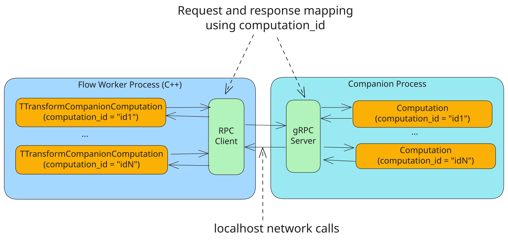

# Companion в {{product-name}} Flow

Во Flow имеется возможность запуска пользовательского кода в отдельном процессе. Такой процесс называется процессом-компаньоном.

## Области применения компаньонов
### Используется сейчас

- Поддержка вычислений на языках, отличных от [C++](../../../flow/cpp/getting-started.md), таких как [Python](../../../flow/python/getting-started.md) и [Java и Kotlin](../../../flow/java/getting-started.md), а также [Go](../../../flow/go/getting-started.md).

### Планы

- Изоляция пользовательского C++ кода от ядра Flow для лучшей обработки ошибок, возможности компилировать с разными флагами (например, для CUDA), и т.п.
- Горячее обновление пользовательского кода без остановки [пайплайна](../../../flow/concepts/glossary.md#pipeline).

## Схема работы {#schema}

При использовании компаньона [Computation](../../../flow/concepts/glossary.md#stream-and-computation) состоит из двух частей: специализированного Computation-a на стороне [Worker](../../../flow/concepts/glossary.md#worker)-a и облегчённого Computation-a на стороне компаньона.



Вся бизнес-логика разрабатывается на выбранном языке программирования на стороне компаньона, а форма пайплайна по-прежнему конфигурируется через [спеку](../../../flow/concepts/spec.md). В этой схеме работы воркер становится инфраструктурным бинарником, который не зависит от логики пайплайна, то есть при использовании Python, Go, Java или Kotlin пользовательский код на C++ писать **не нужно**.



Computation на стороне Worker-a собирает батч сообщений, обогащает его всей необходимой для обработки информацией (стейты, параметры, значения watermarks и т.п.) и отправляет его компаньону по gRPC локально в рамках одного хоста.

Батч формируется без учёта [ключей](../../../flow/concepts/glossary.md#key): один запрос может содержать сообщения с разными ключами. Так воркер собирает батчи для любых компьютейшенов — это не особенность компаньона. Batch-функции SDK (`onMessages` в Java, `on_messages` в Python, `OnMessages` в Go) получают такой батч целиком — как `IBatchProcessFunction` в C++ — и по умолчанию все его сообщения становятся родителями каждого выходного сообщения. Отличие от C++ API в том, что там группировку по ключам можно поручить хосту (`IKeyedBatchProcessFunction`), а в SDK компаньонов такой опции нет: если бизнес-логике нужна обработка по ключам, группировка выполняется в пользовательском коде — см. пример для [Python](../../../flow/python/computation.md#batch-function). Когда родителей вывода необходимо задавать явно (в Swift-компьютейшене — обязательно) и что именно указывать — см. [Когда задавать lineage явно](../../../flow/concepts/lineage.md#explicit-lineage).

В дальнейшем планируется использовать и unix sockets.



Управление процессом-компаньоном осуществляется через [ресурс](../../../flow/concepts/glossary.md#resource) `CompanionManager`.

### Конфигурация

Пример объявления ресурса в статической спеке для Java:

```yson
"CompanionManager" = {
    "resource_class_name" = "NYT::NFlow::NCompanion::TJavaCompanionManager";
    "parameters" = {
        "main_class" = "tech.ytsaurus.flow.examples.wordcount.WordCountApplication";
        "timeout" = "10s";
        "jdk_bin_path" = "/app/ytflow/jdk/bin/java";
        "classpath" = "/app/ytflow/lib/*";
    };
    "dependencies" = {};
};
```

Подробное описание всех параметров `TCompanionManagerParameters` см. в разделе [Конфигурация ресурса CompanionManager](../../../flow/java/computation.md#companion-manager).

Конфигурация Python-компаньона описана в разделе [Конфигурация ресурса CompanionManager (Python)](../../../flow/python/computation.md#companion-manager).

Пример объявления Computation в статической спеке:
```yson
"computations" = {
    "mapper" = {
        "computation_class_name" = "NYT::NFlow::NCompanion::TTransformCompanionComputation";
        "group_by_schema" = [
            {"name" = "hash"; "expression" = "farm_hash(word)"; "type" = "uint64"; required = %true;};
            {"name" = "word"; "type" = "string";};
        ];
        "input_stream_ids" = ["words"];
        "output_stream_ids" = [];
        "required_resource_ids" = {
            "CompanionManager" = {
                "controller" = false;
                "worker" = true;
            };
        };
        "parameters" = {
            "internal_states" = ["word-state"];
        };
    };
};
```

Ключевое в данном примере – использование ресурса `CompanionManager` для запуска процесса-компаньона и специализированный класс Computation-a `NYT::NFlow::NCompanion::TTransformCompanionComputation`.

### C++ компаньон {#cpp-companion}

Пользовательский C++ код тоже можно вынести из воркера в отдельный процесс. SDK находится в `yt/yt/flow/library/cpp/companion/server`: пользователь объявляет обслуживаемые Computation-ы в `TPipeline`, указывая тип process function (типизированное объявление заменяет `YT_FLOW_DEFINE_PROCESS_FUNCTION`), и собирает отдельный бинарник с точкой входа `RunCompanionMain`:

```cpp
int main(int argc, const char** argv)
{
    NYT::NFlow::NCompanionServer::TPipeline pipeline;
    pipeline.AddSource<TMyReadFunction, TMyReadParameters>("reader");
    pipeline.AddTransform<TMyMapFunction>("mapper");
    return NYT::NFlow::NCompanionServer::RunCompanionMain(argc, argv, std::move(pipeline));
}
```

Функция выбирается по имени из поля `processing_function` спеки Computation-а — так же, как во внутрипроцессных адаптерах `TProcessFunctionComputation`. Воркер запускает бинарник через универсальный ресурс `TCompanionManager`:

```yson
"CompanionManager" = {
    "resource_class_name" = "NYT::NFlow::NCompanion::TCompanionManager";
    "parameters" = {
        "entrypoint" = {
            "executable" = "/path/to/my_companion";
        };
    };
};
```

Ограничения первой версии C++ компаньона:

- не поддерживаются sync process function-ы (у протокола компаньона нет фазы Sync);
- недоступны статические [ресурсы](../../../flow/concepts/glossary.md#resource), распределённые троттлеры и timestamp эпохи (`GetCurrentTimestamp`);
- `GetStreamSpecs()->ComputeKey()` не вычисляет ключ, если в `group_by_schema` есть вычисляемые колонки: компаньон не вычисляет выражения. Ключ приходит вместе с сообщением — используйте `message->Key`;
- внешние стейты поддерживаются только в виде `TSimpleExternalState`;
- таймеры на выходе могут указывать только ключ одной из родительских сущностей батча;
- компаньон работает одним многопоточным процессом (`companion_process_count` — 0 или 1).

Пример: `yt/yt/flow/examples/cpp/companion_word_count`.

### Виды Computation-ов для работы с компаньонами

- `NYT::NFlow::NCompanion::TSwiftMapCompanionComputation`: Реализация [TSwiftMapComputation](../../../flow/concepts/computation.md#tswiftmapcomputation) делегирующая обработку данных процессу-компаньону.
- `NYT::NFlow::NCompanion::TSwiftOrderedSourceCompanionComputation`: Реализация [TSwiftOrderedSourceComputation](../../../flow/concepts/computation.md#tswiftorderedsourcecomputation) делегирующая обработку данных процессу-компаньону.
- `NYT::NFlow::NCompanion::TTransformCompanionComputation`: Реализация [TTransformComputation](../../../flow/concepts/computation.md#ttransformcomputation) делегирующая обработку данных процессу-компаньону.
- `NYT::NFlow::NCompanion::TTransformOrderedSourceCompanionComputation`: Реализация [TTransformOrderedSourceComputation](../../../flow/concepts/computation.md#ttransformorderedsourcecomputation) делегирующая обработку данных процессу-компаньону.

Для Source-компьютейшена доступны два режима. `TSwiftOrderedSourceCompanionComputation` не материализует выход и требует детерминированной обработки без пользовательского стейта. `TTransformOrderedSourceCompanionComputation` материализует выход и фиксирует его вместе с внутренним стейтом и смещением источника в транзакции эпохи. Его следует выбирать для недетерминированной обработки или работы с внутренним стейтом; ключом такого стейта служит ключ партиции источника. Ограничения спеки совпадают с [TTransformOrderedSourceComputation](../../../flow/concepts/computation.md#ttransformorderedsourcecomputation).

Подробнее о реализации пайплайнов с использованием компаньонов: [Java и Kotlin](../../../flow/java/getting-started.md), [Python](../../../flow/python/getting-started.md), [Go](../../../flow/go/getting-started.md).

## См. также

- [Computation](../../../flow/concepts/computation.md)
- [Быстрый старт (Java)](../../../flow/java/getting-started.md)
- [Быстрый старт (Python)](../../../flow/python/getting-started.md)
- [Быстрый старт (Go)](../../../flow/go/getting-started.md)
