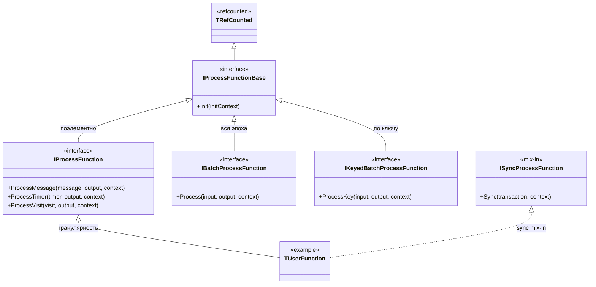

# Process function в {{product-name}} Flow (C++)

## Зачем это нужно

Классический способ написать [Computation](../../../flow/concepts/computation.md) на C++ — отнаследоваться от `TTransformComputation` (или `TSwiftMapComputation` / `TSwiftOrderedSourceComputation`) и переопределить методы `DoProcessMessage` / `DoProcessTimer` / `DoProcessVisit` / `DoInit`. При этом пользовательская логика оказывается «вплетена» в объект `Computation`: она наследует десятки protected-методов и конструируется только из полностью собранного `TComputationContext` (клиенты {{product-name}}, сторы, менеджер стейтов и т. д.). Как следствие, такую логику практически невозможно покрыть юнит-тестами в изоляции.

Process function выносит пользовательскую логику в отдельный лёгкий объект, который получает свои зависимости (`IOutputCollector`, `IRuntimeContext`) как узкие интерфейсы и не имеет зависимости на сам объект `Computation`. Благодаря этому такую функцию можно протестировать изолированно при помощи юнит-тестов.

## Как это работает {#how-it-works}

Сама process function напрямую не запускается — её исполняет встроенный `Computation`-адаптер, который указывается в спеке в поле `computation_class_name` (см. [Регистрация](#registration)). Адаптер даёт функции ровно ту же среду, что и обычный `Computation`: ту же спеку, те же сторы и стейты, ту же логику обработки эпохи. Поэтому пайплайн с process function даёт [те же гарантии обработки](../../../flow/concepts/guarantees.md) (в том числе exactly-once), что и написанный вручную `Computation`.

Адаптер же задаёт режим исполнения функции. Встроенных адаптеров три:

| `computation_class_name` | Режим |
| --- | --- |
| `NYT::NFlow::TProcessFunctionComputation` | transform |
| `NYT::NFlow::TProcessFunctionSwiftMapComputation` | swift-map |
| `NYT::NFlow::TProcessFunctionSourceComputation` | source |

Одну и ту же функцию можно запускать под разными адаптерами, не пересобирая бинарь.

## Интерфейсы

Библиотека `library/cpp/common` (`common/process_function.h`). Методы функции повторяют `Do*`-методы воркера. Функция выбирает **одну** гранулярность обработки, наследуясь от соответствующего интерфейса; на какой `Computation` (source, swift map или transform) её повесить, задаёт спека (см. [Регистрация](#registration)). Базовый `IProcessFunctionBase` несёт только `Init(initContext)` — инициализацию в начале [эпохи](../../../flow/concepts/glossary.md#epoch) (аналог `TTransformComputation::DoInit`), по умолчанию no-op; сами методы обработки добавляют интерфейсы гранулярности. Выбирайте интерфейс по тому, как удобно обрабатывать вход эпохи — по одной сущности, всем батчем сразу или по ключу — и переопределяйте только нужные методы; воркер сам вызовет их с теми же стейтами и семантикой exactly-once, что и у обычного `Computation`.

Функция наследует один интерфейс гранулярности и, при необходимости, mix-in `ISyncProcessFunction`:



- `IProcessFunction` — поэлементная обработка (самый частый случай). Воркер вызывает метод на каждую сущность эпохи (аналог `TTransformComputation::DoProcessMessage` и т. д.); переопределяйте нужные, все по умолчанию no-op:
    - `ProcessMessage(message, output, context)` — одно сообщение;
    - `ProcessTimer(timer, output, context)` — один [таймер](../../../flow/concepts/glossary.md#timer);
    - `ProcessVisit(visit, output, context)` — один визит.

    В source-режиме приходят только сообщения, поэтому `ProcessTimer` / `ProcessVisit` не вызываются.
- `IBatchProcessFunction` — весь вход эпохи одним вызовом (аналог `TTransformComputation::DoProcess`). Переопределяйте `Process(input, output, context)`, когда логика работает со всем батчем сразу (например, один батчевый внешний запрос). Вход не группируется по ключу.
- `IKeyedBatchProcessFunction` — обработка по ключу group-by, для keyed-режимов (swift map и transform). Воркер группирует вход эпохи по ключу и вызывает `ProcessKey` для каждого ключа:
    - `ProcessKey(input, output, context)` — весь вход одного ключа (сообщения, таймеры и визиты вместе; аналог `TTransformComputation::DoProcessKey`), по умолчанию no-op. Переопределяйте, когда логика опирается на весь батч ключа сразу (например, согласует сообщения и таймеры через общий стейт ключа).
- `ISyncProcessFunction` — необязательный mix-in для функций, которые в конце эпохи фиксируют побочные эффекты в отдельной sync-фазе; от него наследуются дополнительно к интерфейсу гранулярности:
    - `Sync(transaction, context)` — фиксация побочных эффектов в транзакции `transaction` (аналог `TTransformComputation::DoSync`); `context` даёт доступ к рантайм-аксессорам. Метод обязателен к реализации. Вызывается только `Computation`-адаптером, у которого есть sync-фаза — из встроенных адаптеров это `TProcessFunctionComputation` (transform). Соответствие проверяется при валидации спеки: функцию с `Sync` нельзя повесить на `Computation` без sync-фазы.

В `Process` (`IBatchProcessFunction`) и `ProcessKey` у `output` не проставлены родительские сообщения — проставляйте их сами через `output->SetParents(...)`; в поэлементных методах `IProcessFunction` (`ProcessMessage` / `ProcessTimer` / `ProcessVisit`) они уже проставлены на соответствующую сущность.

Флаг `distribute` в `output->AddMessage(message, distribute)` повторяет семантику `OutputCollector` у `Computation`: для source сообщение с `distribute = false` не публикуется, но всё равно учитывается при оценке [вотермарка](../../../flow/concepts/glossary.md#timestamps-and-watermarks); для остальных `Computation` сообщение с `distribute = false` просто отбрасывается.



Process function — `TRefCounted`, поэтому создавать её всегда нужно через `New<...>()`.



## IRuntimeContext

`context` (типа `IRuntimeContext`, `common/runtime_context.h`) — это интерфейс, который собирает всё, что `Computation` обычно читает из `this`:

| Метод | Описание |
| --- | --- |
| `GetWatermark(streamId)` / `GetInputEventWatermark()` | Event-time [вотермарки](../../../flow/concepts/glossary.md#timestamps-and-watermarks) |
| `GetSpec()` / `GetStreamSpecs()` / `GetKeySchema()` | Спека и схемы потоков |
| `MakeOutputMessageBuilder(streamId)` | Построитель выходного сообщения |
| `ConvertToOutputMessage(message, streamId)` | Привести сообщение к схеме выходного потока |
| `ConvertToMessage(ysonMessage)` | `TYsonMessage` → `TMessage` |
| `ConvertToYsonMessage<T>(message)` | `TMessage` → типизированный `TYsonMessage` |
| `MakeTimer(key, streamId, trigger, event)` | Создать [таймер](../../../flow/concepts/glossary.md#timer) |
| `GetThrottler(throttlerId)` | Получить distributed throttler |

## Стейты

Стейты работают так же, как и в `Computation`: типизированные клиенты (`TMutableStateKeyClient<T>` и др.) хранятся как поля функции и инициализируются в `Init` через `IRuntimeInitContext` (`common/runtime_init_context.h`), который повторяет API `IJobInitContext`:

```cpp
void Init(const IRuntimeInitContextPtr& initContext) override
{
    initContext->InitExternalStateClient(StateClient_, "/state");
    // или: initContext->InitClient<TMyState>(Client_, "my-state");
}
```

Подробнее о видах стейтов — в разделе [Работа со стейтами](../../../flow/cpp/state.md).

## Параметры {#parameters}

Функция может объявить собственную структуру параметров — обычный `TYsonStruct` — и прочитать её типизированно. Параметры передаются в поле `processing_function_parameters` верхнего уровня спеки `Computation` (рядом с `processing_function`):

- статические — `processing_function_parameters` в `spec`, читаются один раз в `Init` через `initContext->GetParameters<T>()`;
- динамические — `processing_function_parameters` в `dynamic_spec`, читаются через `context->GetDynamicParameters<T>()` и отражают последнюю реконфигурацию.

Если поле `processing_function_parameters` отсутствует, структура заполняется значениями по умолчанию. `GetDynamicParameters<T>()` кэширует результат и разбирает узел заново только при его изменении (то есть при реконфигурации).

Типы параметров указываются при регистрации функции аргументами макроса: `YT_FLOW_DEFINE_PROCESS_FUNCTION(function, TStaticParams)` — для статического блока, `YT_FLOW_DEFINE_PROCESS_FUNCTION(function, TStaticParams, TDynamicParams)` — ещё и для динамического. Тогда соответствующий блок `processing_function_parameters` (в `spec` и `dynamic_spec`) валидируется по схеме при загрузке спеки, как и `parameters` у `Computation`: неизвестное поле или неверный тип — ошибка ещё до запуска. Блок, для которого тип не объявлен (в т. ч. у беспараметрической `YT_FLOW_DEFINE_PROCESS_FUNCTION(function)`), считается пустым — любое переданное поле будет отвергнуто.

```cpp
struct TMyParameters
    : public NYTree::TYsonStruct
{
    i64 Threshold;

    REGISTER_YSON_STRUCT(TMyParameters);

    static void Register(TRegistrar registrar)
    {
        registrar.Parameter("threshold", &TThis::Threshold).Default(0);
    }
};

void Init(const IRuntimeInitContextPtr& initContext) override
{
    Threshold_ = initContext->GetParameters<TMyParameters>()->Threshold;
}

void ProcessMessage(const TInputMessageConstPtr& message, const IOutputCollectorPtr& output, const IRuntimeContextPtr& context) override
{
    auto currentThreshold = context->GetDynamicParameters<TMyParameters>()->Threshold;
    // ...
}

// Регистрация с типом параметров — включает их валидацию в спеке.
YT_FLOW_DEFINE_PROCESS_FUNCTION(TMyFunction, TMyParameters);
```

В спеке:

```yson
"counter" = {
    "computation_class_name" = "NYT::NFlow::TProcessFunctionComputation";
    "processing_function" = "NYT::NFlow::NExample::TWordCountFunction";
    "processing_function_parameters" = {
        "threshold" = 5;
    };
};
```

В юнит-тестах статические параметры задаются через `TTestStateEnvironment::SetStaticParameters(...)`, динамические — через `TTestRuntimeContextBuilder().SetDynamicParameters(...)`.

## Регистрация {#registration}

Функция и `Computation` связываются через спеку. Функция регистрируется одним макросом из `common/registry.h` (в том же реестре `TRegistry`, что и computation / source / sink) под своим `TypeName`; необязательный второй аргумент — тип её параметров (см. [Параметры](#parameters)):

```cpp
YT_FLOW_DEFINE_PROCESS_FUNCTION(TWordCountFunction);                   // без параметров
YT_FLOW_DEFINE_PROCESS_FUNCTION(TTextReadFunction, TTextReaderParameters);  // с параметрами
```

В спеке `Computation` поле `computation_class_name` указывает на встроенный `Computation`-адаптер (он же задаёт режим — см. [список адаптеров](#how-it-works)), а соседнее поле `processing_function` называет функцию:

```yson
"counter" = {
    "computation_class_name" = "NYT::NFlow::TProcessFunctionComputation";
    "processing_function" = "NYT::NFlow::NExample::TWordCountFunction";
};
```

## Тестирование

Библиотека `library/cpp/process_function/testing` поставляет готовый набор для юнит-тестов с разумными значениями по умолчанию (все её утилиты живут в отдельном неймспейсе `NYT::NFlow::NTesting` — чтобы тестовый код не смешивался с продакшеном):

- `TRecordingOutputCollector` — `IOutputCollector`, записывающий сообщения и таймеры в векторы (`GetMessages()` / `GetTimers()`).
- `TTestRuntimeContextBuilder` — собирает `IRuntimeContext`; по умолчанию нулевые вотермарки, один выходной поток на каждый зарегистрированный `RegisterStream<T>(id)` и ключевая схема `DefaultTestKeySchema()`.
- `TTestStateEnvironment` — поднимает `TJobStateManager` поверх in-memory mock-таблиц и выдаёт `IRuntimeInitContext`; `PreloadKeyStates(inputContext)` загружает ключи перед обработкой, `ReadKeyState<T>(name, key)` читает стейт после.
- `entity_builders.h` — `MakeTestMessage` / `MakeTestRawMessage` / `MakeTestTimer` / `MakeTestVisit`.
- `TProcessFunctionTestHarness` — прогоняет функцию по эпохам так же, как воркер: оборачивает функцию как batch (через `WrapAsBatch`, поэтому одинаково работают per-element, whole-batch и per-key формы, а таймеры и визиты диспатчатся рядом с сообщениями), один раз вызывает `Init`, а на каждый `RunEpoch(...)` прелоадит стейт, обрабатывает вход, выполняет end-of-epoch `Sync` для `ISyncProcessFunction` и коммитит стейт. Сообщения и таймеры последней эпохи доступны через `GetMessages()` / `GetTimers()`.

Зонтичный заголовок `process_function/testing/unittest.h` подключает весь перечисленный набор утилит; в тесте достаточно включить его вместо отдельных заголовков харнесса.

`TTestStateEnvironment` покрывает все виды стейтов, которые использует функция:

- внутренние (`InitClient`) — работают сразу через `TJobStateManager` поверх in-memory таблиц; пишутся функцией и читаются обратно через `ReadKeyState<T>(name, key)`.
- внешние менеджеры (`InitExternalStateClient` с `TMutableStateKeyClient<T>`) — регистрируются через `RegisterExternalState(name, ...)`; есть готовый in-memory `TInMemorySimpleExternalStateManager` для `TSimpleExternalState`, а прочитать результат можно через `ReadExternalKeyState<T>(name, key)`.
- внешние джойнеры (`InitExternalStateClient` с `TJoinedStateKeyClient<T>`) — регистрируются через `RegisterExternalStateJoiner(name, ...)`; in-memory `TInMemorySimpleExternalStateJoiner` сидируется через `GetMutableState(key)` перед запуском функции.
- внутренние джойнеры стейта другого computation (`InitClient` с `TJoinedStateKeyClient<T>`) — регистрируются через `RegisterStateJoiner(name, stateName)`; в одном окружении можно прогнать функцию-производитель (она запишет стейт), сделать `Sync()`, а затем функцию-джойнер, которая прочитает его.

`RegisterExternalState` / `RegisterExternalStateJoiner` принимают и произвольный `IExternalStateManagerPtr` / `IExternalStateJoinerPtr` — так в тест подключается реальный менеджер, собранный поверх mock-клиента {{product-name}}. Для профилей BigRT есть готовые обёртки, см. [Serializable Profile](#profile-testing).

Пример теста row-функции со стейтом:

```cpp
TTestStateEnvironment stateEnv;
auto context = TTestRuntimeContextBuilder().Build();
auto output = New<TRecordingOutputCollector>();

auto function = New<TCountingRowFunction>();
function->Init(stateEnv.GetInitContext());

auto key = MakeKey<ui64>(7);
auto message = MakeTestMessage("input", key, New<NTableClient::TTableSchema>());
stateEnv.PreloadKeyStates(New<TInputContext>(
    std::vector<TInputMessageConstPtr>{message},
    std::vector<TInputTimerConstPtr>{}));

function->ProcessMessage(message, output, context);

EXPECT_EQ(stateEnv.ReadKeyState<i64>("counter", key), 1);
```

Тот же тест через `TProcessFunctionTestHarness`, который прячет `Init`, прелоад, сборку контекста/аутпута и коммит эпохи (полный пример — [queue_reduce/unittest]({{source-root}}/yt/yt/flow/yandex/extensions/bigrt/examples/queue_reduce/unittest/queue_reduce_functions_ut.cpp)):

```cpp
TTestStateEnvironment stateEnv;
TProcessFunctionTestHarness harness(stateEnv, New<TCountingRowFunction>());

auto key = MakeKey<ui64>(7);
harness.RunEpoch({MakeTestMessage("input", key, New<NTableClient::TTableSchema>())});

EXPECT_EQ(stateEnv.ReadKeyState<i64>("counter", key), 1);
```



### Serializable Profile {#profile-testing}

Если external state функции хранится в формате [Serializable Profile](../../../flow/cpp/state.md#profile-manager) (`TProfileManager<TProfile>` / `TProfileJoiner<TProfile>`), библиотека `yandex/extensions/bigrt/cpp/serializable_profile/testing` (неймспейс `NYT::NFlow::NBigRTExtensions::NTesting`) поднимает настоящий менеджер или джойнер поверх in-memory mock-клиента {{product-name}}. Схема mock-таблицы выводится автоматически из `TProfile::RemoteTableSchema()`, писать её руками не нужно.

- `TTestProfileManager<TProfile>` — обёртка над `TProfileManager<TProfile>`. `Create(env, {.KeySchema = ...})` регистрирует менеджер в `TTestStateEnvironment` (вызывается до `Init` функции). Далее — жизненный цикл по эпохам: `PreloadKeyStates({key})` загружает ключи (чтение непрелоаженного ключа кидает исключение), `GetState(key)` отдаёт мутабельный аксессор для сидирования или проверки, `Commit()` сбрасывает изменения в mock-таблицу, `ReadKeyState(key)` перечитывает стейт через свежий менеджер.
- `TTestProfileJoiner<TProfile>` — read-only аналог поверх `TProfileJoiner<TProfile>`: `Seed(key, fill)` заполняет референсный профиль, `PreloadKeyStates({key})` вызывается перед чтением функцией.

Тип профиля должен быть зарегистрирован в бинаре теста — менеджер и джойнер резолвят свои параметры через реестр:

```cpp
YT_FLOW_DEFINE_EXTERNAL_STATE_MANAGER(NYT::NFlow::NBigRTExtensions::TProfileManager<TMyProfile>);
```

Для `TTestProfileJoiner::Seed`, который пишет через внутренний менеджер, нужны обе регистрации — и джойнера, и менеджера.

Пример теста функции со стейтом Serializable Profile — полный компилируемый тест `TProfileCountingFunction` (инкремент `SimpleColumn` профиля `TTestProfile` на каждое сообщение). Прелоад и коммит эпохи делает `TProcessFunctionTestHarness`, тесту остаётся `Create` менеджера и `ReadKeyState` для проверки:



Ещё один полный пример теста — [queue_reduce/unittest]({{source-root}}/yt/yt/flow/yandex/extensions/bigrt/examples/queue_reduce/unittest/queue_reduce_functions_ut.cpp).



Подробнее об общем подходе к тестированию C++-вычислений — в разделе [Тестирование](../../../flow/cpp/testing.md).

## Пример

Полный пример — [examples/cpp/word_count]({{source-root}}/yt/yt/flow/examples/cpp/word_count) (оба класса — `IProcessFunction` в namespace `NYT::NFlow::NExample`, зарегистрированы через `YT_FLOW_DEFINE_PROCESS_FUNCTION`). В `pipeline.yson` `TTextReadFunction` подключён к `TProcessFunctionSourceComputation`, а `TWordCountFunction` — к `TProcessFunctionComputation` через `processing_function`; `TTextReadFunction` читает свой статический параметр `min_word_length` из `processing_function_parameters`. Более сложный пример с таймерами и джойном по окну — [examples/cpp/wait_click_join]({{source-root}}/yt/yt/flow/examples/cpp/wait_click_join).

## См. также

- [Computation (C++)](../../../flow/cpp/computation.md)
- [Работа со стейтами (C++)](../../../flow/cpp/state.md)
- [Тестирование (C++)](../../../flow/cpp/testing.md)
- [Быстрый старт (C++)](../../../flow/cpp/getting-started.md)
