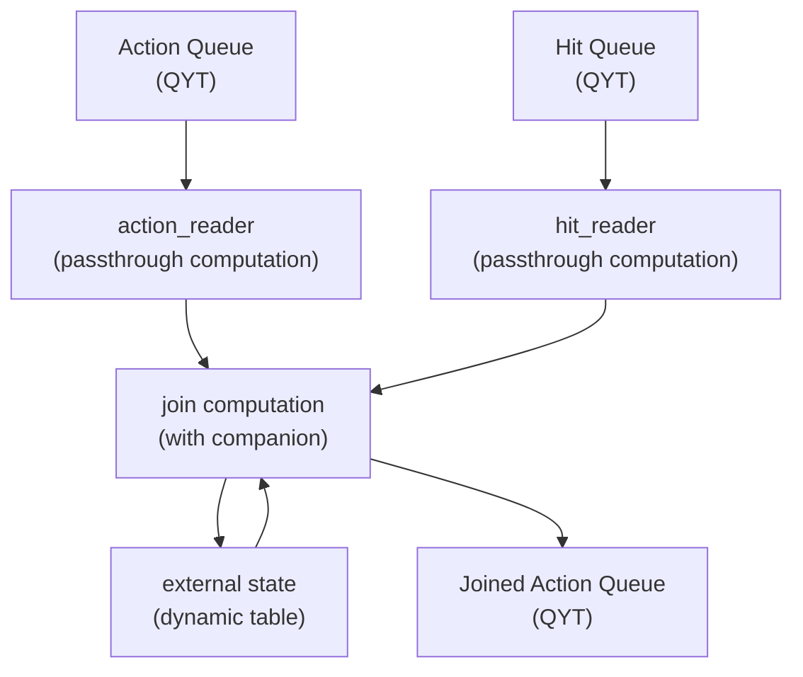

# Wait Click Join в {{product-name}} Flow (Java)

[Пайплайн](../../../../flow/concepts/glossary.md#pipeline) выполняет джойн [потоков](../../../../flow/concepts/glossary.md#stream-and-computation) хитов (hit) и действий (action) на временном окне. Для каждого хита система ожидает связанные действия (show, click) в течение заданного временного интервала, после чего генерирует объединенное событие.

[Исходный код (Java)]({{source-root}}/yt/yt/flow/examples/java/wait_click_join)

[Исходный код (Kotlin)]({{source-root}}/yt/yt/flow/examples/kotlin/wait_click_join)
Подробное описание задачи и логики джойна — в [описании C++ версии](../../../../flow/cpp/examples/wait_click_join.md).

## Постановка задачи {#problem-statement}

Есть система с тремя видами событий:
- **hit** — факт запроса пользователя. Содержит `hit_id`, `hit_time` и `hit_payload`.
- **action show** — факт, что пользователь увидел ответ. Содержит `hit_id`, `hit_time`, `action_time` и `is_click = false`.
- **action click** — факт, что пользователь кликнул на ответ. Содержит `hit_id`, `hit_time`, `action_time` и `is_click = true`.

Данные поступают в двух потоках: `hit` и `action`.

На выходе строится джойн: к каждому show присоединяется информация о наличии клика и `hit_payload` с хита. Хиты без показов игнорируются. Система ждёт события action в течение `wait_for_actions` секунд после `hit_time`.

## Схема потоков данных {#data-flow}



## JoinProcessFunction

Основная логика пайплайна реализована в `JoinProcessFunction`, которая обрабатывает два потока — `hit` и `action`:



- Java

  

- Kotlin

  



## Ключевые паттерны

### Фильтрация late data {#late-data-check}



- Java

  

- Kotlin

  



Сообщения, пришедшие с event-временем меньше текущего [вотермарка](../../../../flow/concepts/glossary.md#timestamps-and-watermarks), считаются опоздавшими и игнорируются. Подробнее про вотермарки — в разделе [Watermarks & Timers](../../../../flow/concepts/watermarks.md).

### [Таймеры](../../../../flow/concepts/glossary.md#timer) для закрытия окна



- Java

  

- Kotlin

  



При получении хита устанавливается таймер на `hit_time + wait_for_actions`. Таймер сработает, когда вотермарк достигнет `maxTime`, то есть когда система будет уверена, что все события с `event_time < maxTime` уже обработаны.

### ExternalStateAccessor с PayloadBuilder

[Стейт](../../../../flow/concepts/glossary.md#state) хранится во внешней динамической таблице. `PayloadBuilder` позволяет обновлять отдельные поля стейта без полной пересериализации:



- Java

  

- Kotlin

  



### Очистка стейта

После срабатывания таймера и генерации выходного события стейт удаляется через `stateAccessor.clear()`, чтобы не накапливать устаревшие профили.

## Модели данных {#models}

Для типизированной работы с сообщениями определены POJO-классы с JPA-аннотациями.



### Hit



- Java

  

- Kotlin

  



### Action



- Java

  

- Kotlin

  



### JoinedAction



- Java

  

- Kotlin

  



## Конфигурация пайплайна (Spring) {#pipeline-configuration}

[Исходный код (Java)]({{source-root}}/yt/yt/flow/examples/java/wait_click_join/wait_click_join/src/main/java/tech/ytsaurus/flow/examples/waitclickjoin/PipelineConfiguration.java)

[Исходный код (Kotlin)]({{source-root}}/yt/yt/flow/examples/kotlin/wait_click_join/wait_click_join/src/main/kotlin/tech/ytsaurus/flow/examples/waitclickjoin/PipelineConfiguration.kt)
Пример использует [Spring Boot интеграцию](../../../../flow/java/spring.md) для конфигурации. Компьютейшен `join` регистрируется аннотацией `@FlowComputation` на классе `JoinProcessFunction`:



- Java

  

- Kotlin

  



Типизированные стримы объявляются через `ComputationProvider` (метод `getStreams()`):



- Java

  

- Kotlin

  



Ключевые моменты:
- Компьютейшен `join` (`JoinProcessFunction`) регистрируется аннотацией `@FlowComputation(id = "join")`.
- Регистрируются три типизированных стрима: `hit`, `action` и `joined_action`.
- Типизированные стримы позволяют использовать `message.getPayload()` для получения POJO-объектов.

## Точки входа {#entry-points}

### NodeCompanionMain



- Java

  

- Kotlin

  



### RunnerMain



- Java

  

- Kotlin

  



## Статическая спека {#static-spec}

### Computation join

```yson
"join" = {
    "computation_class_name" = "TJoin";
    "group_by_schema" = [
        {"name" = "hash"; "expression" = "farm_hash(hit_id)"; "type" = "uint64"};
        {"name" = "hit_id"; "type" = "string"};
        {"name" = "hit_time"; "type" = "uint64"};
    ];
    "input_stream_ids" = ["action"; "hit"];
    "output_stream_ids" = ["joined_action"];
    "external_state_managers" = {
        "/join-state" = {
            "external_state_manager_class_name" = "NYT::NFlow::TSimpleExternalStateManager";
            "parameters" = {
                "path" = "//path/to/state";
            };
        };
    };
    "parameters" = {
        "wait_for_actions" = "10s";
    };
    "timers" = {
        "timer" = {};
    };
};
```

- `group_by_schema` — ключ партиционирования: `(hash, hit_id, hit_time)`.
- `input_stream_ids` — два входных стрима: `action` и `hit`.
- `output_stream_ids` — один выходной стрим: `joined_action`.
- `external_state_managers` — top-level секция с описанием [External State](../../../../flow/java/external-state.md) (на одном уровне с `parameters`). Ключ (`"/join-state"`) — имя стейта, начинающееся с `/`; то же имя передаётся в дескриптор `StateDescriptors.external("/join-state")`. `external_state_manager_class_name` — зарегистрированный класс менеджера (`NYT::NFlow::TSimpleExternalStateManager` для стандартного варианта). `parameters/path` — путь к динамической таблице {{product-name}}; схема ключевых колонок таблицы должна совпадать с `group_by_schema`.
- `parameters.wait_for_actions` — время ожидания событий action после хита. Доступен в Java через `RuntimeContext.getComputationParameters()`.
- `timers.timer` — объявление timer stream для закрытия хитов.

## Тестирование {#testing}

[Исходный код тестов (Java)]({{source-root}}/yt/yt/flow/examples/java/wait_click_join/wait_click_join/src/test/java/tech/ytsaurus/flow/examples/waitclickjoin/JoinProcessFunctionTest.java)

[Исходный код тестов (Kotlin)]({{source-root}}/yt/yt/flow/examples/kotlin/wait_click_join/wait_click_join/src/test/kotlin/tech/ytsaurus/flow/examples/waitclickjoin/JoinProcessFunctionTest.kt)
Для тестирования используется `TestComputationHarness` — тестовая обвязка, позволяющая вызывать `doProcess` без запуска полного пайплайна.

### Настройка тестового окружения



- Java

  

- Kotlin

  



### Тест обработки hit-сообщения



- Java

  

- Kotlin

  



### Тест полного цикла джойна



- Java

  

- Kotlin

  



Полный набор тестов (9 сценариев) — в [исходном коде]({{source-root}}/yt/yt/flow/examples/java/wait_click_join/wait_click_join/src/test/java/tech/ytsaurus/flow/examples/waitclickjoin/JoinProcessFunctionTest.java).

## Интеграционное тестирование {#integration-testing}

Интеграционное тестирование Java-пайплайнов выполняется так же, как и для C++ пайплайнов — с запуском полного пайплайна, включая C++ воркеры, очереди и стримы. Подробнее см. [Интеграционные тесты](../../../../flow/java/testing.md).

## Ключевые идеи {#key-ideas}

1. **Временное окно**: Система ждёт события action в течение `wait_for_actions` секунд после `hit_time`. Все события вне этого окна отбрасываются.

2. **Watermark для late data**: События с `event_timestamp < watermark` считаются опоздавшими и отбрасываются. Это неизбежно приводит к потере некоторых данных, но обеспечивает корректность watermark.

3. **External State для накопления данных**: Промежуточные данные (hit_payload, show_time, click_time) хранятся в External State, привязанном к ключу `(hit_id, hit_time)`. В данном случае нет ограничений на использование только External State, реализация с Internal State также возможна.

4. **Таймер для закрытия окна**: Таймер с `triggerTimestamp = hit_time + wait_for_actions` обеспечивает генерацию результата после закрытия окна ожидания.

5. **Идемпотентность таймеров**: Таймер устанавливается при каждом сообщении, но с одним и тем же `triggerTimestamp`. Flow дедуплицирует таймеры с одинаковым ключом и `triggerTimestamp`.

6. **Очистка стейта**: После генерации результата стейт очищается через `stateAccessor.clear()`, что удаляет строку из таблицы.

## См. также

- [Быстрый старт (Java)](../../../../flow/java/getting-started.md)
- [Таймеры](../../../../flow/concepts/timers.md)
- [Stateful processing](../../../../flow/concepts/stateful.md)
