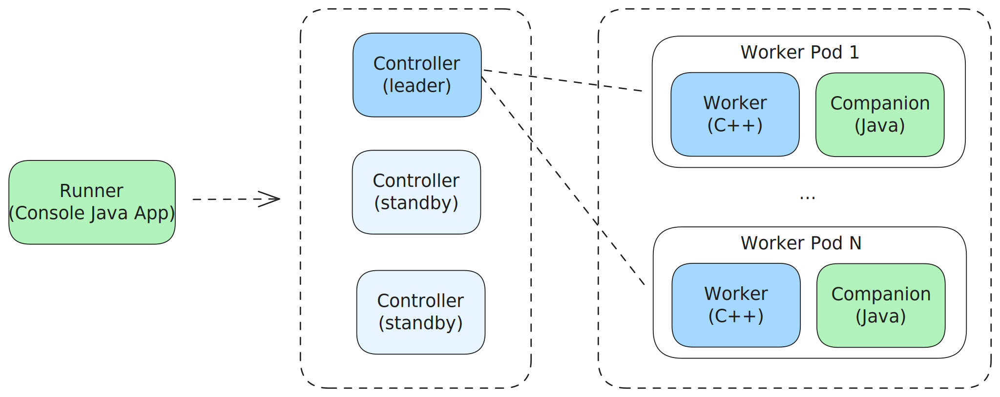

# Быстрый старт в {{product-name}} Flow (Java)

Поддержка вычислений на Java и Kotlin во Flow реализуется через механизм [компаньонов](../../../flow/concepts/glossary.md#companion). Код на Java или Kotlin выполняется в отдельном gRPC-процессе, который взаимодействует с C++ [воркером](../../../flow/concepts/glossary.md#worker).

[Исходный код Java SDK для Flow]({{source-root}}/yt/java/flow)

[Примеры]({{source-root}}/yt/yt/flow/examples/java)

## Архитектура приложения {#architecture}

Любой пайплайн Flow состоит из трёх составных частей:
- `Runner` — запускает пайплайн и устанавливает новую версию спеки.
- `Controller` — управляет работой пайплайна.
- `Worker` — выполняет непосредственно обработку данных.

Java и Kotlin используются в `Runner` и `Worker`.



## Два подхода к конфигурации

Java SDK Flow (с поддержкой Kotlin) предоставляет два подхода для настройки компаньона:

1. **Ручной** (SimpleRunnerProgram + PipelineContext + GrpcServerExecution) — подходит для простых случаев, когда не нужна инъекция зависимостей.
2. **Spring Boot** (auto-config с аннотациями `@FlowComputation`) — рекомендуемый подход для production-сервисов с развитой конфигурацией и зависимостями.

## Computation и SourceComputation

Для создания [компьютейшена](../../../flow/concepts/glossary.md#stream-and-computation) на Java необходимо выбрать подходящий билдер, соответствующий [типу Computation-a в C++](../../../flow/concepts/companion.md#vidy-computation-ov-dlya-raboty-s-kompanonami):

- `Computation.builder()` — для `TTransformCompanionComputation` и `TSwiftMapCompanionComputation`.
- `SourceComputation.builder()` — для `TSwiftOrderedSourceCompanionComputation`.



- Java

  ```java
  // SourceComputation для чтения данных из источника
  var reader = SourceComputation.builder()
         .setComputationId("reader")
         .build();

  // Computation для обработки данных
  var mapper = Computation.builder()
         .setComputationId("mapper")
         .setProcessFunction(new WordCountMapper())
         .build();
  ```

- Kotlin

  ```kotlin
  // SourceComputation для чтения данных из источника
  val reader = SourceComputation.builder()
         .setComputationId("reader")
         .build()

  // Computation для обработки данных
  val mapper = Computation.builder()
         .setComputationId("mapper")
         .setProcessFunction(WordCountMapper())
         .build()
  ```



У `Computation.builder()` два обязательных параметра:
- **Computation id** — по нему происходит маппинг запросов между [worker](../../../flow/concepts/glossary.md#worker)-ом и компаньоном.
- **Process function** — функция с логикой обработки сообщений.


## Process Function

Есть два вида ProcessFunction:

- `RowFunction` — получает [сообщения](../../../flow/concepts/glossary.md#message) и [таймеры](../../../flow/concepts/glossary.md#timer) по одному, предоставляет методы `onMessage` и `onTimer`.
- `BatchFunction` — получает весь батч сообщений и таймеров, предоставляет методы `onMessages` и `onTimers`.

Подробнее — в разделе [Computation (Java)](../../../flow/java/computation.md).

## Runner

Класс с `main`-методом для запуска [пайплайна](../../../flow/concepts/glossary.md#pipeline). `SimpleRunnerProgram` является Java-аналогом [NYT::NFlow::TSimpleRunnerProgram](../../../flow/release/basic-rules.md#launch-flow) и принимает те же файлы конфигурации и переменные среды.



- Java

  ```java
  import tech.ytsaurus.flow.pipeline.SimpleRunnerProgram;

  public class RunnerMain {
      public static void main(String[] args) throws Exception {
          SimpleRunnerProgram.runPipeline(args);
      }
  }
  ```

- Kotlin

  ```kotlin
  import tech.ytsaurus.flow.pipeline.SimpleRunnerProgram

  object RunnerMain {
      @JvmStatic
      fun main(args: Array<String>) {
          SimpleRunnerProgram.runPipeline(args)
      }
  }
  ```



## Node companion

### Ручной подход

В `main`-методе компаньона необходимо сконфигурировать компьютейшены, добавить их в `PipelineContext` и запустить gRPC-сервер через `GrpcServerExecution`:



- Java

  ```java
  import tech.ytsaurus.flow.computation.Computation;
  import tech.ytsaurus.flow.context.PipelineContext;
  import tech.ytsaurus.flow.execution.GrpcServerExecution;

  public class NodeCompanionMain {
      public static void main(String[] args) throws Exception {
          var mapper = Computation.builder()
              .setComputationId("mapper")
              .setProcessFunction(new WordCountMapper())
              .build();

          var context = new PipelineContext();
          context.registerComputation(mapper);

          GrpcServerExecution execution = new GrpcServerExecution(context);
          execution.start();
      }
  }
  ```

- Kotlin

  ```kotlin
  import tech.ytsaurus.flow.computation.Computation
  import tech.ytsaurus.flow.context.PipelineContext
  import tech.ytsaurus.flow.execution.GrpcServerExecution

  object NodeCompanionMain {
      @JvmStatic
      fun main(args: Array<String>) {
          val mapper = Computation.builder()
              .setComputationId("mapper")
              .setProcessFunction(WordCountMapper())
              .build()

          val context = PipelineContext()
          context.registerComputation(mapper)

          val execution = GrpcServerExecution(context)
          execution.start()
      }
  }
  ```



Если пользовательским функциям нужны дополнительные ресурсы (словарь, кэш и т.п.), `main`-метод компаньона — подходящее место для их создания. Такие ресурсы должны быть потокобезопасными.

### Spring Boot подход

При использовании Spring Boot компьютейшен `mapper` регистрируется аннотацией `@FlowComputation` прямо на классе process-функции (источник `reader` — passthrough: он объявляется в спеке пайплайна и в Java-компаньоне не регистрируется):



- Java

  ```java
  @FlowComputation(id = "mapper")
  public class WordCountMapper implements RowFunction {
      @Override
      public void onMessage(ExtendedMessage message, OutputCollector output, RuntimeContext ctx) {
          // обработка сообщения
      }
  }
  ```

- Kotlin

  ```kotlin
  @FlowComputation(id = "mapper")
  class WordCountMapper : RowFunction {
      override fun onMessage(message: ExtendedMessage, output: OutputCollector, ctx: RuntimeContext) {
          // обработка сообщения
      }
  }
  ```



Типизированные стримы объявляются декларативно: POJO-класс сообщения помечается аннотацией `@FlowMessage` со списком идентификаторов стримов (`streamIds`), которые он обслуживает. Класс уже помечен JPA-аннотацией `@Entity`, из которой выводится схема. Spring Boot находит такие классы сканированием пакетов приложения и регистрирует стримы автоматически:



- Java

  ```java
  @Entity
  @FlowMessage(streamIds = {"words"})
  public class Word {
      // поля, конструкторы, геттеры, сеттеры...
  }
  ```

- Kotlin

  ```kotlin
  @Entity
  @FlowMessage(streamIds = ["words"])
  class Word {
      // поля, конструкторы...
  }
  ```



Точка входа Spring Boot-приложения:



- Java

  ```java
  @SpringBootApplication
  public class WordCountApplication {
      public static void main(String[] args) {
          new SpringApplicationBuilder(WordCountApplication.class)
                  .run(args);
      }
  }
  ```

- Kotlin

  ```kotlin
  @SpringBootApplication
  open class WordCountApplication {
      companion object {
          @JvmStatic
          fun main(args: Array<String>) {
              SpringApplicationBuilder(WordCountApplication::class.java).run(*args)
          }
      }
  }
  ```



Метод `getStreams()` позволяет зарегистрировать типизированные [стримы](../../../flow/concepts/glossary.md#stream-and-computation) через `FlowStreams.typed(...)`, чтобы SDK автоматически сериализовал и десериализовал сообщения в Java-объекты.

Для запуска нужны две точки входа:
1. **Runner** — запускает C++ пайплайн.
2. **Node companion** — запускает компаньон (Java или Kotlin) с логикой обработки.

Flow не накладывает ограничений на то, собирать ли два отдельных jar-файла или один с двумя классами с `main`-методами. Во всех [примерах]({{source-root}}/yt/yt/flow/examples/java) используется подход с одним jar-файлом.

## См. также

- [Computation (Java)](../../../flow/java/computation.md)
- [Работа со стейтами (Java)](../../../flow/java/state.md)
- [Примеры](../../../flow/java/examples/wordcount.md)
- [Companion](../../../flow/concepts/companion.md)
