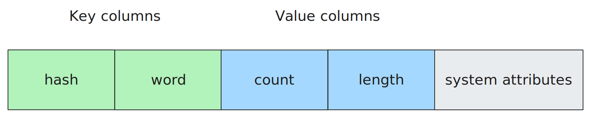

# StateAccessor в {{product-name}} Flow (Java)

StateAccessor — интерфейс для чтения, модификации и удаления значений [стейта](../../../flow/concepts/glossary.md#state).
Общие сведения о stateful-обработке описаны в разделе [Stateful processing](../../../flow/concepts/stateful.md).

## Принцип работы {#how-it-works}

[Стейт](../../../flow/concepts/glossary.md#state) во Flow хранится в [сортированных динамических таблицах](../../../user-guide/dynamic-tables/sorted-dynamic-tables.md).
В случае [внешнего стейта](../../../flow/java/external-state.md) эта таблица создаётся пользователем, в случае [внутреннего стейта](../../../flow/java/internal-state.md) эти таблицы создаются и управляются Flow автоматически.

Далее для простоты описания будем рассматривать пример внешнего стейта.

Каждую строку в таблице стейта можно условно разделить на ключевые колонки и колонки значений:



Ключевые колонки в таблице стейта должны совпадать с `group_by_schema` того [компьютейшена](../../../flow/concepts/glossary.md#stream-and-computation), который использует этот стейт.

Колонки значений будут доступны для чтения и модификации через `StateAccessor`. Формат, в котором эти значения будут доступны для чтения и модификации в Java-коде, зависит от реализации `StateAccessor`.

## Чтение и запись данных {#reading-and-writing-data}

Непосредственную работу с таблицей (чтение, запись, удаление данных) осуществляет [воркер](../../../flow/concepts/glossary.md#worker). При получении очередного батча [сообщений](../../../flow/concepts/glossary.md#message) воркер загружает значения стейтов для всех [ключей](../../../flow/concepts/glossary.md#key) в батче и отправляет их в [компаньон](../../../flow/concepts/companion.md) вместе с сообщениями и [таймерами](../../../flow/concepts/glossary.md#timer). Подробнее про [схему взаимодействия](../../../flow/concepts/companion.md#schema).

Запись новых значений в таблицу стейта осуществляется транзакционно в рамках [эпохи](../../../flow/concepts/glossary.md#epoch).

## Интерфейс StateAccessor {#state-accessor-interface}



- Java

  ```java
  public interface StateAccessor<T> {
      /** Получить значение стейта. */
      Optional<T> get();

      /** Получить значение стейта или дефолтное значение. */
      default T getOrDefault(T defaultValue);

      /** Установить значение стейта. */
      void set(T value);

      /** Очистить/удалить стейт для ключа. */
      void clear();

      /** Получить класс стейта. */
      Class<T> getStateClass();
  }
  ```

- Kotlin

  ```kotlin
  interface StateAccessor<T> {
      /** Получить значение стейта. */
      fun get(): Optional<T>

      /** Получить значение стейта или дефолтное значение. */
      fun getOrDefault(defaultValue: T): T

      /** Установить значение стейта. */
      fun set(value: T)

      /** Очистить/удалить стейт для ключа. */
      fun clear()

      /** Получить класс стейта. */
      fun getStateClass(): Class<T>
  }
  ```


