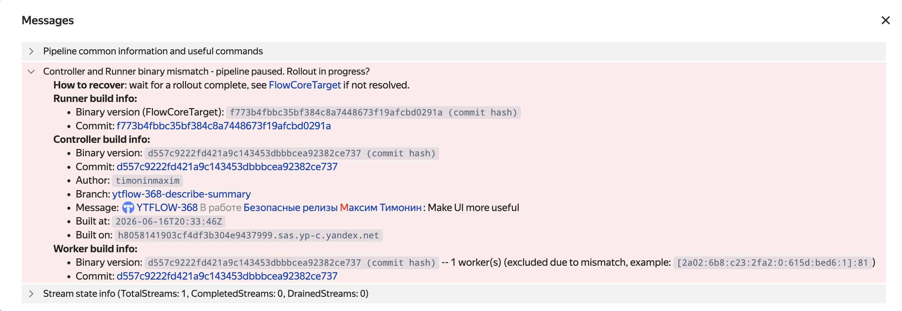

# Защита от зомби-процессов: FlowCoreTarget {#flow-core-target}

Компоненты Flow — контроллер, воркер и раннер — должны быть собраны из одного и того же коммита. Если хотя бы один компонент отличается по версии, пайплайн перестаёт работать корректно. На практике это чаще всего происходит, когда при выкатке релиза забывают обновить раннер. Реже причиной становятся зомби-процессы — компоненты, которые не обновились из-за недоступности кластера YT или ошибок в инфраструктуре.

Механизм `FlowCoreTarget` защищает от таких ситуаций: пайплайн хранит ожидаемую версию бинаря и не допускает к работе процессы, которые ей не соответствуют.

## Как это работает {#flow-core-target-how-it-works}

В обычной выкатке релиза `FlowCoreTarget` работает в фоне — пайплайн сам проверяет версии, вам ничего настраивать не нужно.

Следить за состоянием можно в UI пайплайна в блоке **Messages**: там отображается текущий `FlowCoreTarget` и версии активных процессов. Пока версии совпадают — пайплайн работает в штатном режиме. Если версии расходятся, в блоке Messages появляется сообщение `binary mismatch` и пайплайн переходит в состояние `Paused`:

- контроллер перестаёт планировать джобы;
- воркеры с несовпадающей версией исключаются из активных;
- попытка обновить спеку завершается ошибкой `FlowCoreTargetMismatch`.







Восстановление автоматическое: как только все процессы обновятся до нужной версии, пайплайн вернётся в `Working`. Если этого не происходит — см. раздел [Что делать при несовпадении версий](#flow-core-target-troubleshooting).

## Управление FlowCoreTarget {#flow-core-target-how-to-set}

В обычном сценарии устанавливать `FlowCoreTarget` вручную не нужно — раннер делает это сам при каждом пуше спеки. Вручную вмешиваться в `FlowCoreTarget` может понадобиться в случаях, когда необходимо:

- временно [отключить автоматическую установку](#flow-core-target-disable-auto) — например, для хотфикса или отладки;
- экстренно [снять проверку версий](#flow-core-target-workarounds) и допустить процессы любых версий.

### Отключение автоматической установки {#flow-core-target-disable-auto}

По умолчанию раннер выставляет `FlowCoreTarget` при каждом пуше спеки. Отключить это можно двумя способами:

- **Постоянно** — в раннер-конфиге (`pipeline.yson`):

    ```yson
    {
        ...
        "set_flow_core_target" = %false;
    }
    ```

- **На один запуск** — флагом `--skip-set-flow-core-target` в командной строке раннера. Удобно для разовых хотфиксов или экспериментов.

### Ручные команды {#flow-core-target-manual}

Посмотреть, установить или сбросить `FlowCoreTarget` можно через `yt flow execute`:

```bash
# Посмотреть текущий FlowCoreTarget.
{{yt-cli}} flow execute <pipeline_path> get-flow-core-target --input-format json '{}'

# Установить FlowCoreTarget.
{{yt-cli}} flow execute <pipeline_path> set-flow-core-target --input-format json '{"flow_core_target":"<target>"}'

# Сбросить FlowCoreTarget (отключить проверку).
{{yt-cli}} flow execute <pipeline_path> set-flow-core-target --input-format json '{"flow_core_target":""}'
```



Менять `FlowCoreTarget` можно, только когда пайплайн в состоянии `stopped`. В состоянии `paused` — только с дополнительным параметром `"allow_update_on_pause": true` в теле запроса.



### Кастомный раннер {#flow-core-target-custom-runner}

Если вы пишете раннер на основе `TSimpleRunnerProgram`, установка `FlowCoreTarget` происходит автоматически. Если реализуете раннер с нуля — при пуше спеки нужно явно выставлять `FlowCoreTarget` равным `FlowCoreVersion` своего бинаря.

### Принудительный сброс {#flow-core-target-workarounds}



После сброса пайплайн теряет защиту от зомби-процессов. Если вы перезапустите раннер без флага `--skip-set-flow-core-target`, он немедленно запишет новый `FlowCoreTarget` поверх сброшенного.



Если нужно временно снять проверку версий и допустить в пайплайн процессы любых версий:

```bash
# Поставить пайплайн на паузу.
{{yt-cli}} flow pause-pipeline <pipeline_path>

# Сбросить FlowCoreTarget.
{{yt-cli}} flow execute <pipeline_path> set-flow-core-target \
    --input-format json '{"flow_core_target":"", "allow_update_on_pause":true}'

# Запустить пайплайн обратно.
{{yt-cli}} flow start-pipeline <pipeline_path>
```

## Использование в CI/CD {#flow-core-target-cicd}

В типичном CI/CD-пайплайне раннер запускается из того же артефакта, что и контроллер/воркеры, поэтому `FlowCoreTarget` обновляется с пушем спеки и дополнительных действий не требуется.

На что обратить внимание:

- **Один артефакт, один пуш.** Не запускайте раннер из ветки разработчика поверх продового пайплайна — раннер запишет свой `FlowCoreTarget`, и продовые процессы превратятся в зомби.
- **Откаты.** При откате на старую версию из CI обычно используется раннер старой версии, что корректно перепишет `FlowCoreTarget`. Если откатывают только бинарь воркеров/контроллеров без раннера, нужно либо запустить раннер старой версии, либо вручную сбросить `FlowCoreTarget` (см. [Принудительный сброс](#flow-core-target-workarounds)).

## Что делать при несовпадении версий {#flow-core-target-troubleshooting}

Дождитесь завершения выкатки — раннер запишет новый `FlowCoreTarget`, и пайплайн автоматически вернётся из `Paused` в `Working`.

Если ошибка не пропадает заметно дольше длительности выкатки:

1. Проверьте, что все компоненты Flow собраны из одного коммита (чаще всего проблема в Runner). Как читать версии в UI — см. [Как вычисляется FlowCoreVersion](#flow-core-version-source).
2. Проверьте, нет ли зомби-процессов от предыдущих выкаток — сравните IP-адреса в UI (блок Workers и Leader controller address) с реальными IP-адресами вашей инсталляции.



Во время выкатки несовпадение версий — норма: компоненты обновляются не одновременно, и сообщение `binary mismatch` в блоке **Messages** висит до тех пор, пока раннер не запушит спеку с новым `FlowCoreTarget`.



#### Как вычисляется FlowCoreVersion {#flow-core-version-source}

- `(commit hash)` — версия вычислена по коммиту (`arc`/`git`). Два бинаря из одного коммита, собранные с разными флагами (например, с санитайзером), дадут одинаковый `FlowCoreVersion`.
- `(binary checksum)` — VCS-информации нет (сборка из тарбола, `ya make --no-vcs-info` или локальная сборка); используется хеш файла бинаря (`CityHash128`). Любая пересборка с другими флагами даст другой `FlowCoreVersion`.
