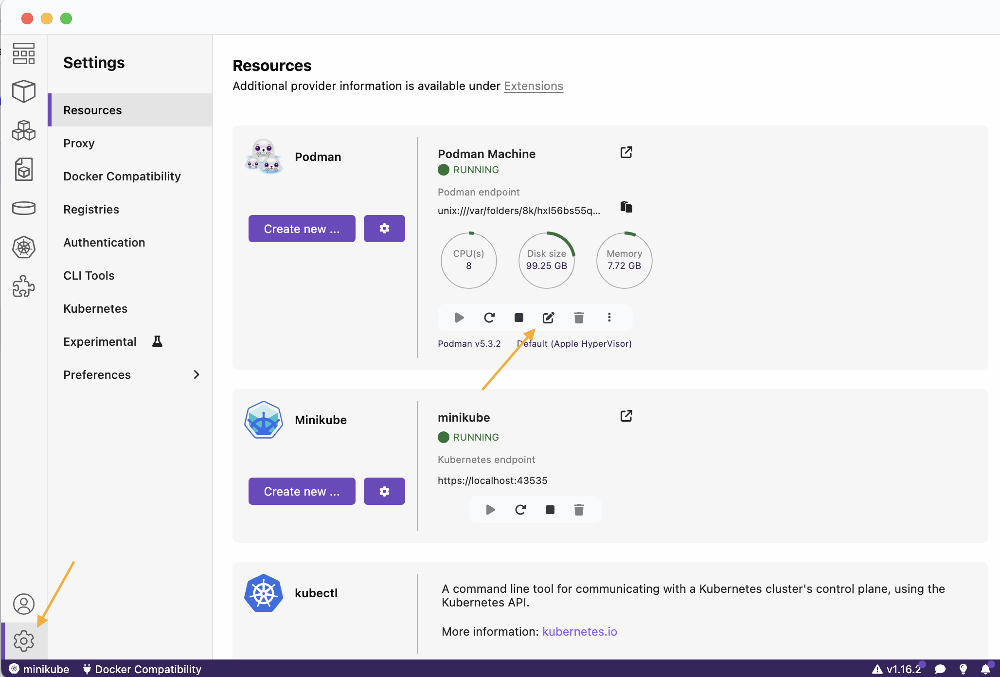
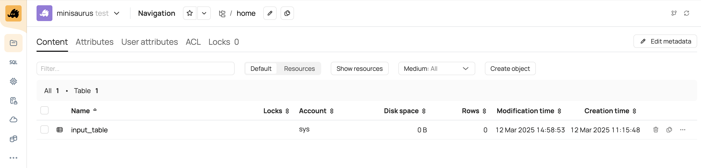
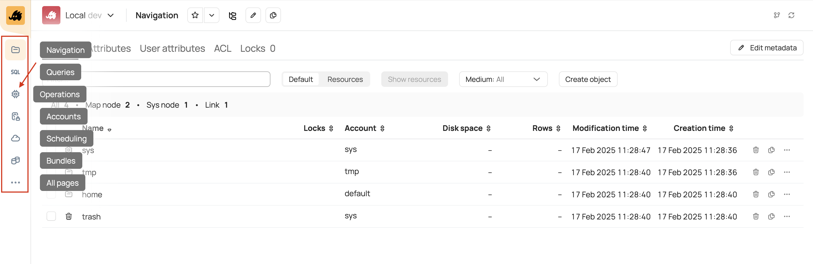
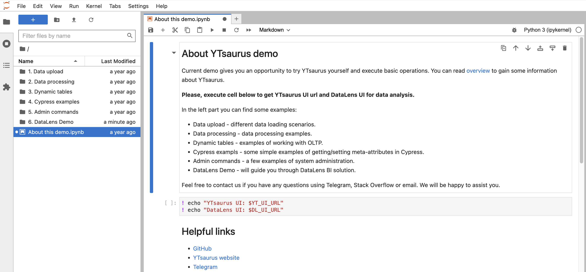
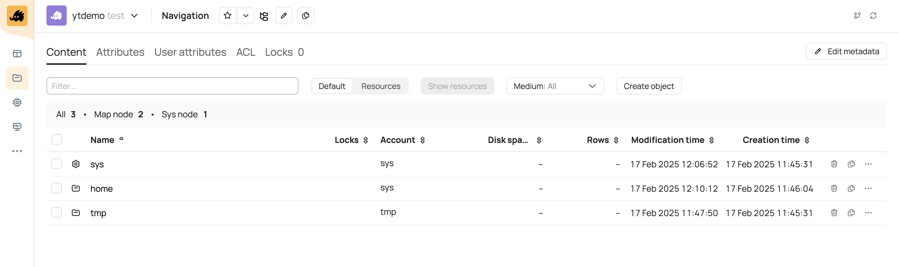

# Как попробовать {{product-name}}

В данном руководстве можно посмотреть на {{product-name}} в действии — через установку и запуск кластера. Вы локально развернёте кластер {{product-name}}, создадите таблицу и выполните простой SELECT запрос. Затем вы попробуете чуть более сложный пример — решите классическую задачу Word Count, запустив операцию MapReduce.



Наиболее быстрый способ ознакомиться с возможностями продукта — на [демо-стенде](#demo). Вы получите временный доступ к демо-кластеру, на котором развёрнуты все необходимые компоненты {{product-name}}. Всё, что вам понадобится — это браузер.



## Перед началом работы {#prerequisites}

- Рекомендуемая среда для работы {{product-name}} — это x86_64 Linux. Если у вас MacOS с процессором Apple Silicon, для локальной установки {{product-name}} вам потребуется использовать режим эмуляции под архитектуру x86. Для этого подойдёт платформа виртуализации [Docker Desktop](https://docs.docker.com/desktop/setup/install/mac-install/) с включённой [Rosetta 2](https://support.apple.com/ru-ru/102527). Однако следует учитывать, что работа {{product-name}} в режиме эмуляции **не гарантируется**. <!--По возможности используйте Linux с процессором архитектуры x86_64.-->

- В данном руководстве вы будете запускать {{product-name}} кластер в минимальной конфигурации — без гарантий отказоустойчивости. Не используйте предлагаемую конфигурацию в промышленном окружении и для проведения тестов производительности. Примеры того, как настраивать конфигурацию кластера, приведены в [Руководстве администратора](../../admin-guide/prepare-spec.md).

- Для корректной работы примеров в вашей системе должен быть установлен Python 3.8+.

## Установка и запуск {{product-name}} кластера { #launch-cluster}

В инструкции будет предложено два способа установить {{product-name}} кластер: через [Docker](https://www.docker.com/) и [Minikube](https://minikube.sigs.k8s.io/docs/).

Независимо от способа установки, в результате будут подняты необходимые компоненты системы: [мастер-сервер](*about-master), [планировщик](*about-scheduler), [YQL](*about-yql), [Query Tracker](*about-qt) и другие. Все последующие примеры из этого руководства — создание таблиц, загрузка данных и запуск MapReduce — не зависят от способа установки кластера и будут одинаковыми как для Docker, так и в случае Minikube.



- Docker {selected}

  1. Установите Docker:
      - Если у вас Linux x86_64 — установите [Docker Engine](https://docs.docker.com/engine/install/ubuntu/).
      - Если у вас Mac — установите [Docker Desktop](https://docs.docker.com/desktop/setup/install/mac-install/) либо [Podman](https://podman.io/docs/installation) в качестве альтернативы. Убедитесь, что у вас установлена и включена [Rosetta 2](https://support.apple.com/ru-ru/102527).

  2. Скачайте скрипт [run_local_cluster.sh](https://github.com/ytsaurus/ytsaurus/tree/main/yt/docker/local) для развёртывания кластера и выставьте права на исполнение:
     ```bash
     mkdir ~/yt-local && cd ~/yt-local
     curl -s https://raw.githubusercontent.com/ytsaurus/ytsaurus/main/yt/docker/local/run_local_cluster.sh > run_local_cluster.sh
     chmod +x run_local_cluster.sh
     ```

  3. Чтобы поднять кластер, запустите скрипт:
     ```bash
     ./run_local_cluster.sh
     ```

     Этот скрипт создаст и запустит [docker-контейнеры](*about-docker-containers), в которых будет развёрнут {{product-name}}. Если всё прошло успешно, появится сообщение:
     ```
     Congratulations! Local cluster is up and running. To use the cluster web interface, point your browser to http://localhost:8001. Or, if you prefer command-line tool 'yt', use it like this: 'yt --proxy localhost:8000 <command>'.
     ```

     Обратите внимание на адреса, которые указаны в этом сообщении. Они понадобятся в дальнейших примерах.
     - `localhost:8001` — адрес веб-интерфейса. Можно открыть его в браузере.
     - `localhost:8000` — адрес серверной части кластера. Этот адрес нужно будет [указать](#set-vars) в качестве адреса прокси для доступа к кластеру через CLI.

  4. Чтобы убедиться, что всё работает, запустите команду:
     ```bash
     $ docker ps | grep yt
     CONTAINER ID   IMAGE                           COMMAND                  CREATED         STATUS         PORTS              NAMES
     2c254e35037c   ghcr.io/ytsaurus/local:stable   "--fqdn localhost --…"   2 minutes ago   Up 2 minutes   80/tcp, 8002/tcp   yt.backend
     5235b5077b5b   ghcr.io/ytsaurus/ui:stable      ""                       2 minutes ago   Up 2 minutes   80/tcp             yt.frontend
     ```
     У вас должны быть запущены два контейнера:
     - `yt.frontend` — процессы, связанные с веб-интерфейсом.
     - `yt.backend` — в этом контейнере подняты компоненты {{product-name}} кластера.

       

       Чтобы узнать, какие компоненты {{product-name}} подняты в системе, можно посмотреть на список запущенных процессов внутри контейнера:

       ```bash
       $ docker exec -it yt.backend /bin/bash
       $ ps -axo command | grep ytserver
       /mnt/rosetta /usr/bin/python3.8 /usr/local/bin/yt_local start --proxy-port 80 --local-cypress-dir /var/lib/yt/local-cypress --fqdn localhost --ytserver-all-path /usr/bin/ytserver-all --sync --fqdn localhost --proxy-config {coordinator={public_fqdn="localhost:8000"}} --rpc-proxy-count 0 --rpc-proxy-port 8002 --node-count 1 --queue-agent-count 1 --address-resolver-config {enable_ipv4=%true;enable_ipv6=%false;} --native-client-supported --id primary -c {name=query-tracker} -c {name=yql-agent;config={path="/usr/bin";count=1;artifacts_path="/usr/bin"}}
       /mnt/rosetta /primary/bin/ytserver-http-proxy --pdeathsig 9 --config /primary/configs/http-proxy-0.yson --pdeathsig 15 --setsid
       /mnt/rosetta /primary/bin/ytserver-master --pdeathsig 9 --config /primary/configs/master-0-0.yson --pdeathsig 15 --setsid
       /mnt/rosetta /primary/bin/ytserver-queue-agent --pdeathsig 9 --config /primary/configs/queue_agent-0.yson --pdeathsig 15 --setsid
       /mnt/rosetta /primary/bin/ytserver-node --pdeathsig 9 --config /primary/configs/node-0.yson --pdeathsig 15 --setsid
       /mnt/rosetta /primary/bin/ytserver-scheduler --pdeathsig 9 --config /primary/configs/scheduler-0.yson --pdeathsig 15 --setsid
       /mnt/rosetta /primary/bin/ytserver-controller-agent --pdeathsig 9 --config /primary/configs/controller_agent-0.yson --pdeathsig 15 --setsid
       /mnt/rosetta /primary/bin/ytserver-query-tracker --pdeathsig 9 --config /primary/configs/query_tracker-0.yson --pdeathsig 15 --setsid
       /mnt/rosetta /usr/bin/ytserver-yql-agent --pdeathsig 9 --config /primary/configs/yql_agent-0.yson --pdeathsig 15 --setsid
       /mnt/rosetta /usr/bin/grep --color=auto ytserver
       ```

       Как видно, запустились компоненты:
       - [Мастер-сервер](../../admin-guide/components#master) — отвечает за отказоустойчивое хранение метаданных кластера. К этим данным относится информация о пользователях системы, о хранимых объектах и о местоположении самих данных.
       - Нода — объединяет в себе функциональность [Data-ноды](../../admin-guide/components.md#data-nodes) и [Exec-ноды](../../admin-guide/components.md#exec-nodes). Отвечает за хранение данных, за работу динамических таблиц и занимается исполнением джобов.
       - [Планировщик](../../admin-guide/components.md#planirovshik) (шедулер) — отвечает за планирование процесса обработки данных (Map, Reduce и так далее).
       - [Контроллер-агент](../../admin-guide/components.md#planirovshik) — отвечает за планирование джобов конкретных операций.
       - [HTTP-прокси](../../admin-guide/components.md#proxy) — сервер, через который осуществляется общение с внешним миром.
       - [YQL-агент](../../admin-guide/components.md#yql-agent) — движок исполнения SQL подобных запросов.
       - [Очередь {{product-name}}](../../user-guide/dynamic-tables/queues.md) — упорядоченные динамические таблицы.
       - [Query Tracker](../../user-guide/query-tracker/about.md) — компонент для запуска запросов на разных SQL диалектах (YQL, QT, CHYT, SPYT).

       

  5. Готово! Теперь {{product-name}} поднят и готов к использованию. Можно переходить к следующему шагу. После того как вы закончите работу с примерами, не забудьте [удалить](#stop-cluster) кластер.

- Minikube

  В этом примере вы локально развернёте кластер Kubernetes, состоящий из одного узла, и в нём запустите {{product-name}} кластер. В качестве движка исполнения контейнеров будет использоваться Docker.

  

  Чтобы успешно развернуть {{product-name}} в кластере Kubernetes, на хостовой машине должно быть:
  - от 4-х ядер CPU;
  - от 8 ГБ оперативной памяти;
  - от 30 ГБ дискового пространства.

  

  Для установки {{product-name}} в Minikube выполните шаги:

  1. [Подготовьте окружение](#setup)
  1. [Поднимите кластер Kubernetes](#k8s-start)
  1. [Установите cert-manager](#cert-manager-apply)
  1. [Установите {{product-name}} оператор](#operator-install)
  1. [Запустите кластер {{product-name}}](#yt-start)
  1. [Проверьте сетевые доступы](#set-url)

  

  Более детально процесс установки рассмотрен в [вебинаре](https://www.youtube.com/watch?v=LTKtY5okG4c).

  

  #### 1. Подготовьте окружение {#setup}

  - Установите Docker:
      - Если у вас Linux — установите [Docker Engine](https://docs.docker.com/engine/install/ubuntu/);
      - Если у вас Mac — установите [Docker Desktop](https://docs.docker.com/desktop/setup/install/mac-install/) либо [Podman](https://podman.io/docs/installation) в качестве альтернативы. Убедитесь, что у вас установлена и включена Rosetta 2.
  - Установите [kubectl](https://kubernetes.io/ru/docs/tasks/tools/install-kubectl/#установка-kubectl-в-linux) — утилита для управления кластером Kubernetes.
  - Установите [Minikube](https://kubernetes.io/ru/docs/tasks/tools/install-minikube/) — утилита, позволяющая запустить простой кластер Kubernetes на локальном компьютере.
  - Установите [Helm](https://helm.sh/docs/intro/install/) — пакетный менеджер для установки компонент {{product-name}} в Kubernetes.

  #### 2. Поднимите кластер Kubernetes {#k8s-start}

  ```bash
  $ minikube start  --cpus=6 --memory=8192 --driver=docker

  # Если вы используете Podman
  # minikube start --cpus=6 --memory=8192 --driver=podman
  ```

  Когда кластер Kubernetes будет поднят, должна успешно выполняться команда:

  ```bash
  $ kubectl cluster-info
  Kubernetes control plane is running at https://127.0.0.1:36399
  CoreDNS is running at https://127.0.0.1:36399/api/v1/namespaces/kube-system/services/kube-dns:dns/proxy
  ```

  #### 3. Установите cert-manager { #cert-manager-apply }

  ```bash
  kubectl apply -f https://github.com/cert-manager/cert-manager/releases/download/{{cert-manager-version}}/cert-manager.yaml
  ```

  Дождитесь, когда под `cert-manager-webhook` будет находиться в состоянии `Running`:

  ```
  $ kubectl get pods -A
  NAMESPACE        NAME                                        READY   STATUS      RESTARTS   AGE
  cert-manager     cert-manager-7b5cdf866f-5lfth               1/1     Running     0          2m12s
  cert-manager     cert-manager-cainjector-7c9788477c-xdp8l    1/1     Running     0          2m12s
  cert-manager     cert-manager-webhook-764949f558-dldzp       1/1     Running     0          2m12s
  kube-system      coredns-668d6bf9bc-774xg                    1/1     Running     0          2m57s
  ...
  ```

  #### 4. Установите {{product-name}} оператор {#operator-install}

  [{{product-name}} оператор](https://github.com/ytsaurus/ytsaurus-k8s-operator) — это программа, которая управляет исполнением {{product-name}} в Kubernetes кластере. Оператор следит за тем, чтобы все компоненты {{product-name}} были запущены и работали корректно.

  Установите чарт:
  ```bash
  helm install ytsaurus oci://ghcr.io/ytsaurus/ytop-chart --version {{k8s-operator-version}}
  ```

  

  Проверьте, какой статус у пода `cert-manager-webhook`:

  ```
  $ kubectl get pods -A
  NAMESPACE       NAME                                      READY   STATUS               RESTARTS   AGE
  cert-manager    cert-manager-7b5cdf866f-5lfth             1/1     ContainerCreating    0          2m12s
  cert-manager    cert-manager-cainjector-7c9788477c-xdp8l  1/1     ContainerCreating    0          2m12s
  cert-manager    cert-manager-webhook-764949f558-dldzp     1/1     ContainerCreating    0          2m12s
  ...
  ```
  Если под находится в состоянии `ContainerCreating`, дождитесь завершения его установки и попробуйте перезапустить команду `helm install ytsaurus oci://ghcr.io/ytsaurus/ytop-chart --version {{k8s-operator-version}}`.

  Если у пода состояние `ImagePullBackOff`, это означает, что система не может скачать необходимые образы. Скорее всего, это связано с сетевыми настройками внутри Minikube. Возможные решения проблемы описаны [тут](https://cert-manager.io/docs/troubleshooting/webhook/#error-connect-connection-refused).

  

  Дождитесь, когда оператор будет находиться в статусе `Running`:

  ```bash
  $ kubectl get pod
  NAME                                                      READY   STATUS     RESTARTS   AGE
  ytsaurus-ytop-chart-controller-manager-5765c5f995-dntph   2/2     Running    0          7m57s
  ```

  #### 5. Запустите {{product-name}} кластер {#yt-start}

  ```bash
  curl -s https://raw.githubusercontent.com/ytsaurus/ytsaurus/refs/heads/main/yt/docs/code-examples/cluster-config/cluster_v1_local.yaml > cluster_v1_local.yaml
  kubectl apply -f cluster_v1_local.yaml
  ```

  Обычно запуск {{product-name}} кластера занимает несколько минут. Если всё прошло успешно, список запущенных подов будет выглядеть следующим образом:

  ```bash
  $ kubectl get pod
  NAME                                                      READY   STATUS              RESTARTS   AGE
  ca-0                                                      1/1     Running     0          8m43s
  dnd-0                                                     1/1     Running     0          8m44s
  dnd-1                                                     1/1     Running     0          8m44s
  dnd-2                                                     1/1     Running     0          8m44s
  ds-0                                                      1/1     Running     0          11m
  end-0                                                     1/1     Running     0          8m43s
  hp-0                                                      1/1     Running     0          8m44s
  hp-control-0                                              1/1     Running     0          8m44s
  ms-0                                                      1/1     Running     0          11m
  rp-0                                                      1/1     Running     0          8m43s
  rp-heavy-0                                                1/1     Running     0          8m43s
  sch-0                                                     1/1     Running     0          8m39s
  strawberry-controller-679786577b-4p5kz                    1/1     Running     0          7m17s
  yt-client-init-job-user-ljfqf                             1/1     Running     0          8m39s
  yt-master-init-job-default-hdnfm                          1/1     Running     0          9m23s
  yt-master-init-job-enablerealchunks-575hk                 1/1     Running     0          8m50s
  yt-strawberry-controller-init-job-cluster-l5gns           1/1     Running     0          8m17s
  yt-strawberry-controller-init-job-user-nn9lk              1/1     Running     0          8m34s
  yt-ui-init-job-default-6w5zv                              1/1     Running     0          8m43s
  ytsaurus-ui-deployment-7b469d5cc8-596sf                   1/1     Running     0          8m35s
  ytsaurus-ytop-chart-controller-manager-859b7bbddf-jc5sv   2/2     Running     0          14m
  ```

  

  Скорее всего, это связано с нехваткой ресурсов. Удалите Minikube кластер и попробуйте создать его заново, увеличив число ресурсов при запуске.

  ```bash
  $ kubectl delete -f cluster_v1_local.yaml
  $ minikube delete
  $ minikube start --cpus=8 --memory=10000 --driver=docker
  ```

  Если указанные ресурсы превышают лимит, который установлен в конфигурациях Podman, увеличьте этот лимит в разделе настроек.

  

  

  #### 6. Проверьте сетевые доступы {#set-url}

  Чтобы посмотреть, по какому адресу будет доступен кластер {{product-name}}, запустите команды:

  ```bash
  # Сетевой доступ до веб-интерфейса
  $ minikube service ytsaurus-ui --url
  http://192.168.49.2:30539

  # Сетевой доступ до прокси
  $ minikube service http-proxies-lb --url
  http://192.168.49.2:30228
  ```

  По первой ссылке доступен веб-интерфейс. Для входа используйте:
  ```
  Login: admin
  Password: password
  ```

  

  1. На удалённом хосте запустите команду:
     ```bash
     $ minikube service http-proxies-lb --url
     <HOST>:<PORT>
     ```
     Значения `<HOST>` и `<PORT>` вам понадобятся на следующем шаге.

  2. На локальном хосте запустите новую сессию терминала и выполните:
     ```
     ssh -fnNT -L 127.0.0.1:8080:<HOST>:<PORT> <VM>
     ```
     Веб-интерфейс будет доступен по адресу [127.0.0.1:8080](http://127.0.0.1:8080).

  

  По второй ссылке вы будете подключаться к кластеру из командной строки. Подробнее будет рассказано ниже, в разделе с примерами.

  #### Готово!

  Теперь {{product-name}} поднят и готов к использованию — можно переходить к следующему шагу. После того как вы закончите работу с примерами, не забудьте [удалить](#stop-cluster) кластер.



## Установка {{product-name}} CLI {#install-cli}

Самый удобный способ взаимодействия с системой {{product-name}} — из консоли. Утилита [{{product-name}} СLI](../../api/cli/cli.md) не устанавливается при развёртывании кластера, её нужно установить в системе отдельно.

Для начала установите менеджер пакетов pip3, если он у вас ещё не установлен:

```bash
sudo apt update
sudo apt install python3-pip
```

Проверьте, что всё получилось:
```bash
$ pip3 --version
pip 22.0.2 from ...
```

Установите утилиту `ytsaurus-client`:

```bash
pip3 install --user ytsaurus-client
```

Добавьте путь до `$HOME/.local/bin` в переменную `PATH`:

```bash
export PATH="$PATH:$HOME/.local/bin"
```



```bash
echo 'export PATH="$PATH:$HOME/.local/bin"' >> ~/.bashrc # Команда добавит строку в конец файла ~/.bashrc
source ~/.bashrc  # Применить изменения сейчас
```



Проверьте, что установка {{product-name}} СLI прошла успешно:

```bash
$ yt --version
Version: YT wrapper 0.13.20
```

Подробнее про работу с CLI можно посмотреть в [ознакомительном вебинаре](https://youtu.be/LTKtY5okG4c?t=1456) (начиная с 24:30).


## Выполнение примеров { #launch-example }

В данной инструкции вы создадите таблицу, запишете в неё данные и выполните простой SELECT запрос. В конце раздела приведён более сложный [пример](#mr) — запуск MapReduce операции.

### Установите переменные окружения { #set-vars }

Это понадобится в следующих примерах, для доступа к кластеру через CLI.



- Docker {selected}

  ```bash
  export YT_PROXY=localhost:8000
  ```

- Minikube

  ```bash
  export YT_PROXY=`minikube service http-proxies-lb --url`
  # Отключить автоматическое обнаружение прокси-сервера {{product-name}}
  export YT_CONFIG_PATCHES='{proxy={enable_proxy_discovery=%false}}'
  export YT_TOKEN=password
  ```

  

  Здесь токен задаётся в переменной окружения — это сделано намеренно, для простоты и наглядности примера. В реальных задачах так делать не стоит, для работы с токенами в {{product-name}} есть специальные команды. Подробнее читайте в разделе [Аутентификация](../../user-guide/storage/auth.md#upravlenie-tokenami).

  



### Создайте таблицу { #create-table }

В {{product-name}} все данные хранятся в [таблицах](../../user-guide/storage/static-tables.md). Поэтому для начала создайте таблицу:

```bash
$ yt create table //home/input_table --attributes '{schema = [{name = id; type = int64}; {name = text; type = string}]}'
> 16-64ca-10191-47007b7d
```

Значение `16-64ca-10191-47007b7d` — это идентификатор созданного узла [Кипариса](*about-cypress). Идентификаторы узлов полезны при работе с [транзакциями](../../user-guide/storage/transactions.md) в {{product-name}}. В рамках текущего примера данные идентификаторы вам не понадобятся.

Посмотреть на созданную таблицу можно в веб-интерфейсе. Откройте в браузере адрес, который вы получили при запуске кластера, перейдите на вкладку **Navigation** и кликните на созданную таблицу:



### Запишите данные { #insert-data }

Теперь запишите данные в таблицу, вызвав команду [write-table](../../api/cli/commands.md#write-table):

```bash
echo '{ "id": 0, "text": "Hello" } { "id": 1, "text": "World!" }' | yt write-table //home/input_table --format json
```

### Прочитайте результат { #get-result }

Чтобы убедиться, что данные записались в таблицу, выполните команду:
```bash
$ yt read-table //home/input_table --format json
{"id":0,"text":"Hello"}
{"id":1,"text":"World!"}
```

Другой способ прочитать таблицу — выполнить [SELECT](../../yql/syntax/select/index.md) запрос в веб-интерфейсе. Для этого перейдите во вкладку **Queries** и введите запрос:

```sql
SELECT * FROM `//home/input_table`;
```




Если вы поднимали {{product-name}} кластер через Docker, проделайте шаги:

1. В веб-интерфейсе перейдите на вкладку **Queries**.
2. Нажмите иконку настроек — она находится справа в верхней части страницы. Удалите текущий **Settings**.
3. Нажмите кнопку **Add setting** и в полях укажите значения: "cluster" и "primary" соответственно. Нажмите галочку.

   

Если вы поднимали {{product-name}} кластер через Minikube — пожалуйста, сообщите нам об этой ошибке в [community-чате](https://t.me/ytsaurus_ru)[коммьюнити чате](https://t.me/ytsaurus).



### Продвинутый пример: запуск MapReduce { #mr }

В этом разделе показано, как запустить MapReduce операцию — на примере задачи [Word Count](https://en.wikipedia.org/wiki/Word_count).


1. [Подготовьте данные](#mr-prepare-data)
2. [Создайте таблицу и запишите в неё данные](#mr-create-table)
3. [Запустите MapReduce](#mr-run)
4. [Прочитайте результат](#mr-get-result)




В случае с задачей Word Count, схема выполнения MapReduce будет выглядеть так:
1. Исходный текст разбивается на строки, и каждая строка записывается в таблицу в виде отдельной записи.
1. Для каждой записи выполняется Map операция — она будет выдавать для каждого слова пару колонок `(<слово>, 1)`.
2. Результат из предыдущего шага сортируется по первой колонке.
3. По первой колонке выполняется Reduce операция, суммирующая вторую колонку. На выходе получается набор пар `(<слово>, <количество упоминаний слова>)`.



#### 1. Подготовьте данные { #mr-prepare-data }

Скачайте [исходный текст](https://github.com/ytsaurus/ytsaurus/blob/main/yt/docs/code-examples/source/moem.txt) и преобразуйте его в tab-separated формат:

```bash
curl -s https://raw.githubusercontent.com/ytsaurus/ytsaurus/refs/heads/main/yt/docs/code-examples/source/moem.txt > source.txt
awk '{gsub(/\t/, "\\t"); print "lineno="NR"\ttext="$0}' source.txt > source.tsv
```



- Строки таблицы отделяются друг от друга переводом строки `\n`
- Колонки отделяются друг от друга табуляцией `\t`
- Имя колонки и содержимое колонки отделяются друг от друга знаком `=`

К примеру, строка: `lineno=1\tsize=6\tvalue=foobar` описывает строку с колонками `lineno`, `size` и `value` со значениями `1`, `6` и `foobar` соответственно. Символы табуляции экранируются.



Подготовьте исходник программы, которая будет выполнять MapReduce операцию. Скачайте [скрипт]({{pages.try-yt.mr-source}}) — он написан на Python&nbsp;3 — и сохраните его локально:

```bash
curl -s https://raw.githubusercontent.com/ytsaurus/ytsaurus/refs/heads/main/yt/docs/code-examples/python/word-count.py > word-count.py
```

#### 2. Создайте таблицу { #mr-create-table }

Создайте две таблицы — одну для исходных данных, а вторую для результатов выполнения MapReduce:

```bash
yt create table //home/mapreduce_input --attributes '{schema = [{name = lineno; type = string}; {name = text; type = string}]}'
yt create table //home/mapreduce_result --attributes '{schema = [{name = count; type = string}; {name = word; type = string}]}'
```

Если вы получаете ошибку 'Cannot determine backend type: either driver config or proxy url should be specified.' — необходимо [выставить](#set-vars) переменную окружения `YT_PROXY`.

Теперь запишите данные в исходную таблицу, вызвав команду [write-table](../../api/cli/commands.md#write-table):

```bash
cat source.tsv | yt write-table //home/mapreduce_input --format dsv
```
Чтобы проверить, что в таблицу записались данные, можно прочитать таблицу с помощью команды [read-table](../../api/cli/commands.md#read-table). В квадратных скобках указан полуинтервал — получить первые шесть строк таблицы:

```bash
yt read-table '//home/mapreduce_input[:#6]' --format dsv
```

#### 3. Запустите MapReduce { #mr-run }

Запустите MapReduce операцию с помощью команды [map-reduce](../../api/cli/commands.md#map-reduce):

```bash
yt map-reduce --mapper "python3 word-count.py map" --reducer "python3 word-count.py reduce" --map-local-file word-count.py --reduce-local-file word-count.py --src //home/mapreduce_input --dst //home/mapreduce_result --reduce-by word --format dsv
```

Статус запущенной операции можно отследить в веб-интерфейсе, в разделе **Operations**.








#### 4. Прочитайте результат { #mr-get-result }

Теперь можно прочитать итоговую таблицу, выполнив простой SELECT запрос. В веб-интерфейсе перейдите во вкладку **Queries** и введите запрос:

```sql
SELECT * FROM `//home/mapreduce_result`
ORDER BY count
LIMIT 30;
```

## Остановка кластера { #stop-cluster }



- Docker {selected}

  Чтобы остановить {{product-name}} кластер, необходимо завершить работу контейнеров `yt.frontend` и `yt.backend`. Для этого выполните команду:
    ```bash
  ./run_local_cluster.sh --stop
  ```

  Команда остановит контейнеры (выполнит `docker stop`) и затем удалит их (`docker rm`).

- Minikube

  1. Удалите {{product-name}} кластер:
     ```bash
     kubectl delete -f cluster_v1_local.yaml
     ```

  2. Удалите оператор:
     ```bash
     helm uninstall ytsaurus
     ```

  3. Остановите кластер Kubernetes:
     ```bash
     minikube stop
     ```

  4. Удалите кластер Kubernetes:
     ```bash
     minikube delete
     ```

  5. Очистите кеш Minikube:
     ```bash
     rm -rf ~/.minikube/
     ```

  6. Если вы использовали Podman:
     ```bash
     podman rm -f minikube
     podman volume rm minikube
     ```



<!--
### FAQ



При обращении к {{product-name}} через CLI вы не [указали имя прокси](#set-vars).





Это означает, что мастер-сервер не поднялся. В таком случае, вам нужно [остановить](#stop-cluster) кластер и перезапустить его заново.







-->

## Демо-стенд { #demo }

Это онлайн-демонстрация возможностей {{product-name}}. Чтобы получить доступ к демо-кластеру, [заполните форму](https://ytsaurus.tech/#demo). После этого на указанную почту придёт письмо — в нём будет информация касательно доступов к кластеру.

Для взаимодействия с {{product-name}} на демо-стенде настроено несколько сред:



В ноутбуке подготовлено множество примеров для работы c {{product-name}} — создание таблиц, загрузка данных, использование CHYT, SPYT, YQL и примеры SDK. Обзор всех примеров приведён на стартовой странице ноутбука **About YTsaurus demo**.

Ссылка на поднятый Jupyter Notebook будет в письме.







Тут вы сможете ознакомиться с возможностями веб-интерфейса {{product-name}}: изучить файловую систему, посмотреть на список пулов, позапускать запросы в [Query Tracker](../../user-guide/query-tracker/about.md).

Ссылка на веб-интерфейс поднятого кластера будет в письме.



Про работу в веб-интерфейсе можно послушать в [ознакомительном вебинаре](https://youtu.be/LTKtY5okG4c?t=929) (начиная с минуты 15:30).



<!--
- **В DataLens**
  Здесь собраны примеры чартов, собранных из {{product-name}} таблиц.

  


## Что дальше

- Чтобы лучше разобраться, как правильно настраивать {{product-name}} кластер, ознакомьтесь с [Руководством администратора](../../admin-guide/components.md).

- Ознакомьтесь с системой доступов в {{product-name}} в разделе [Аутентификация](../../user-guide/storage/auth.md).

- Ознакомьтесь с организацией [Кипариса](https://ytsaurus.tech/docs/ru/user-guide/storage/cypress) — файловой системы {{product-name}}.

- SELECT запросы, которые вы запускали в рамках примеров, работают на движке [YQL](../../yql/index.md). Подробнее изучите этот инструмент — он поможет в решении многих аналитических задач.

- Прочитайте про [ресурсы](../../user-guide/data-processing/scheduler/scheduler-and-pools.md) кластера — какие ресурсы бывают, как планировщик ими оперирует, как управлять вычислительными пулами.

- Для упрощения разработки в {{product-name}} есть ряд встроенных библиотек — они позволяют из коробки выполнять любые операции, в том числе и MapReduce. Доступны SDK для [Java](../../api/java/examples.md), [Python](../../api/python/start.md), [Go](../../api/go/reference.md) и [C++](../../api/cpp/description.md) языков.

- Подробнее изучите работу в {{product-name}} CLI:
  - [Примеры работы с CLI](../../api/cli/examples.md).
  - [Ознакомительный вебинар](https://youtu.be/LTKtY5okG4c?t=1456) (начиная с 24:30).
-->

## Решение проблем

Если у вас что-то не получилось — не стесняйтесь задавать вопросы в [community-чате](https://t.me/ytsaurus_ru)[коммьюнити чате](https://t.me/ytsaurus) в телеграме. Мы обязательно вам ответим.

Чтобы оставить пожелания или замечания по документации, пожалуйста, [заведите issue](https://github.com/ytsaurus/ytsaurus/issues) в GitHub-репозитории проекта. Ваш фидбек всегда приветствуется — он поможет сделать документацию лучше.

[*about-cypress]: Кипарис — это распределённая файловая система и хранилище метаинформации. В Кипарисе хранятся таблицы и файлы. Подробнее читайте в [документации](../../user-guide/storage/cypress.md).

[*about-docker-containers]: Образы контейнеров собираются из Dockerfile, который можно посмотреть [тут](https://github.com/ytsaurus/ytsaurus/blob/main/yt/docker/ytsaurus/Dockerfile).

[*about-qt]: Инструмент для запуска SQL-подобных запросов. Query Tracker доступен в веб-интерфейсе — в разделе **Queries**. Подробнее читайте в [документации](../../user-guide/query-tracker/about.md).

[*about-yql]: Это декларативный язык запросов к системам хранения и обработки данных. Основан на SQL синтаксисе. <!--Подробнее читайте в [документации](../../yql/index.md).-->

[*about-master]: Отвечает за отказоустойчивое хранение метаданных кластера. К ним относится информация о пользователях системы, о хранимых объектах и о местоположении самих данных. Подробнее читайте в [документации](../../admin-guide/components.md#master).

[*about-scheduler]: Отвечает за распределение ресурсов между операциями и за процесс их исполнения на кластере. Подробнее в [документации](../../user-guide/data-processing/scheduler/scheduler-and-pools.md).
