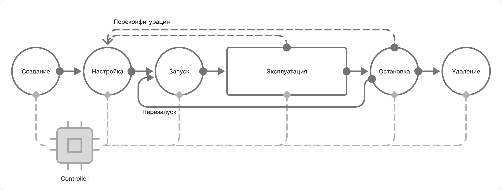

# Обзор

Прежде чем выполнять SQL-запросы через CHYT, нужно подготовить [клику (Clique)](../../../../../user-guide/data-processing/chyt/general.md#what-is): создать её, выделить вычислительный пул и запустить. В этом разделе собраны справочные материалы для работы с кликами: описание веб-интерфейса, настройки клик и управление правами доступа. Если вам нужны пошаговые инструкции по конкретной задаче — смотрите раздел [Сценарии управления кликами](../../../../../user-guide/data-processing/chyt/how-to-guides/overview.md).

## Жизненный цикл клики { #lifecycle }

Прежде чем пользоваться интерфейсом и настройками, полезно понять, на каком этапе жизненного цикла находится клика. Это поможет разобраться, какие действия доступны сейчас и к чему они приведут.

Жизненный цикл делится на две фазы. В фазе подготовки клику нужно создать, настроить и запустить. После этого начинается эксплуатация: вы выполняете запросы и управляете ею по мере необходимости.

На схеме ниже — этапы жизненного цикла клики и переходы между ними:

{ .center }

**Подготовка к работе**

1. Вы создаёте клику: задаёте ей уникальное имя — `alias` и базовые права доступа, которые определяют, кто может выполнять запросы, а кто управлять конфигурацией. Подробнее в разделах: [Создание, запуск и остановка клики](../../../../../user-guide/data-processing/chyt/how-to-guides/create-start.md) и [Управление правами доступа](../../../../../user-guide/data-processing/chyt/how-to-guides/acl.md).

2. Вы настраиваете клику: назначаете ей вычислительный пул, количество инстансов и ресурсов. Пул — обязательный параметр, без него контроллер не запустит клику. Остальные опции можно оставить по умолчанию. Подробнее в разделах: [Настройки клики](../../../../../user-guide/data-processing/chyt/cliques/configs.md) и [Добавление вычислительных ресурсов](../../../../../user-guide/data-processing/chyt/how-to-guides/manage-resources.md).

3. Вы запускаете клику — [Strawberry Controller](../../../../../user-guide/data-processing/chyt/controller.md) читает конфигурацию и поднимает [Vanilla-операцию](../../../../../user-guide/data-processing/operations/vanilla.md). Клика переходит в активное состояние и, через некоторое время, готова принимать запросы. Подробнее в разделе [Создание, запуск и остановка клики](../../../../../user-guide/data-processing/chyt/how-to-guides/create-start.md).

**Эксплуатация и обслуживание**

4. Вы выполняете запросы, при необходимости масштабируете ресурсы, обновляете настройки и права доступа. Контроллер следит за состоянием и применяет изменения конфигурации автоматически. Подробнее: [Как попробовать CHYT](../../../../../user-guide/data-processing/chyt/try-chyt.md).

5. Когда клика временно не нужна, вы останавливаете её: текущие запросы завершаются, ресурсы пула освобождаются. Подробнее: [Создание, запуск и остановка клики](../../../../../user-guide/data-processing/chyt/how-to-guides/create-start.md).

6. Если клика больше не нужна, вы удаляете её. Система удалит клику вместе с метаданными.

## Настройки клики { #options }

Конфигурация клики хранится в [спеклете](../../../../../user-guide/data-processing/chyt/cliques/configs.md#speclet) — YSON-документе в Кипарисе. Через редактирование спеклета управляют вычислительными ресурсами, поведением запросов и другими параметрами. Полный список опций — в разделе [Настройки клики](../../../../../user-guide/data-processing/chyt/cliques/configs.md#options).

## Инструменты управления { #tools }

Чтобы подготовить клику к работе и управлять ею, вы можете использовать два инструмента:

- [Веб-интерфейс](../../../../../user-guide/data-processing/chyt/cliques/ui.md) — удобен для разовых операций и визуального контроля состояния клики;
- [CLI и Python API](../../../../../user-guide/data-processing/chyt/cli-and-api.md) — подходит для автоматизации, массовых операций над кликами и интеграции с внешними приложениями.

## Полезные ссылки

[Концепции](../../../../../user-guide/data-processing/chyt/general.md)

[CLI или Python API](../../../../../user-guide/data-processing/chyt/cli-and-api.md)

[Как попробовать CHYT](../../../../../user-guide/data-processing/chyt/try-chyt.md)
