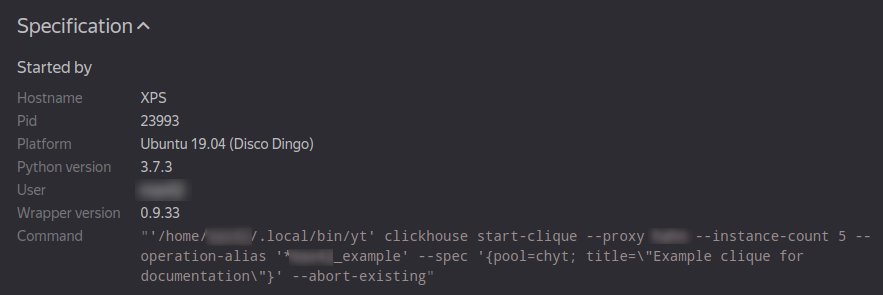

# Клика в веб-интерфейсе {{product-name}}

У клики нет отдельного веб-интерфейса, но все связанные с кликой объекты можно просмотреть через веб интерфейс {{product-name}}.

## Strawberry Node

Конфигурация и персистентное состояние клики хранится в кипарисе по пути `//sys/clickhouse/strawberry/<alias>`
В описании узла можно увидеть служебную информацию: запущена ли клика, в каком пуле, какой статус соответствующей операции {{product-name}} и так далее.
В данном узле так же находится yson документ speclet, внутри которого хранятся все настройки клики, выставленные через команду `yt clickhouse ctl set-option`.
Информацию из strawberry node можно так же получить с помощью команд `yt clickhouse ctl get-speclet` и `yt clickhouse ctl status` в нашем cli.

<!--  -->

## Access Control Object Node

ACL клики хранится в специализированном узле access control object, находящемся по пути `//sys/access_control_object_namespaces/chyt/<alias>`.
В данном узле можно просмотреть все выданные доступы к клике.

<!--  -->

## YT Operation

В веб интерфейс служебной {{product-name}} операции, в которой запускаются инстансы клики, можно попасть по ссылке из описания strawberry node, либо по ссылке из результата команды `yt clickhouse ctl status`.

На странице операции есть много полезной информации, помогающей в эксплуатации CHYT.

### Description { #description }

В секции **Description** содержится разная системная информации про клику и ряд ссылок.

- `ytserver-log-tailer`, `ytserver-clickhouse`, `clickhouse-trampoline` &mdash; в этих секциях описан версии различных компонентов серверного кода CHYT;

### Specification { #specification }

В секции **Specification** содержится информация о том, как именно клика была запущена.

{ .center }

- **Wrapper version** — содержит версию лончера, запустившего клику;
- **Command** — содержит строку запуска клики.

Последние два значения очень полезны, если нужно, например, перезапустить более свежую версию клики. Можно либо обратиться к пользователю, ее запустившему, либо самостоятельно воспроизвести команду запуска.

### Jobs { #jobs }

В секции **Jobs** есть информация о джобах операции, в которой запущена клика. Напомним, что один джоб соответствует одному инстансу в клике, то есть одному серверу ClickHouse.

{ .center }

В этой секции в терминах инстансов CHYT:

- `total` — общее количество инстансов в клике;
- `pending` — число инстансов из общего количества, которые еще не запущены. Ненулевое число в этой секции означает, что у клики не хватает ресурсов, чтобы единомоментно держать все инстансы запущенными, это плохая ситуация для клики;
- `running` — число запущенных инстансов из общего количества, т.е. `running + pending = total`;
- `completed` — число *gracefully preempted* инстансов. Сюда относятся те инстансы, которые попали под вытеснение и успели завершить все бегущие на них запросы до того момента, как их принудительно поабортило;
- `failed` — число упавших инстансов. Инстансы могут падать по разным причинам, наиболее частые: OOM (out of memory) либо баги в коде CHYT или ClickHouse;
- `aborted` — число прерванных инстансов. Часть остановок приходится на непреодолимые обстоятельства (например, нода вышла из строя) и с ними ничего не поделать, наличие среди джобов поаборченных по причине `preemption` – это плохой знак, демонстрирующий нехватку ресурсов;
- `lost` — джобы в клике возникать не должны.
