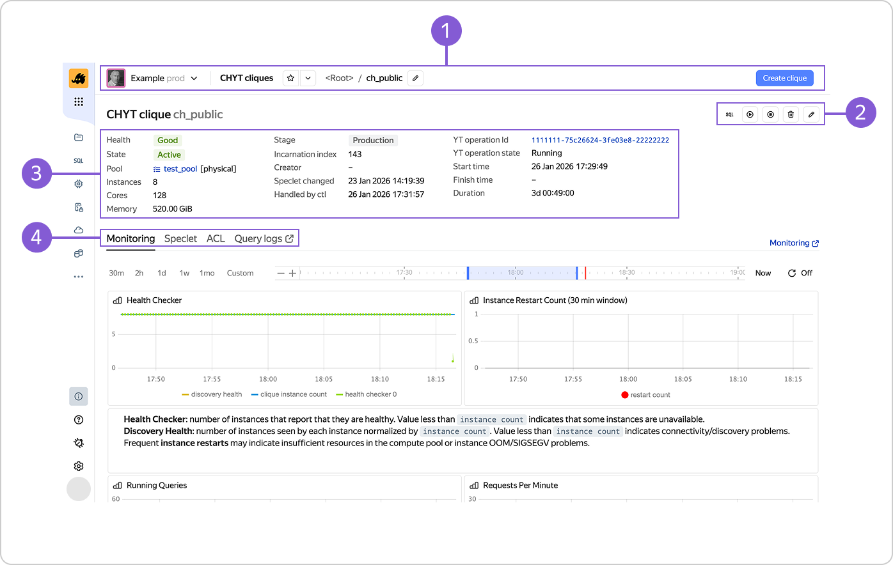
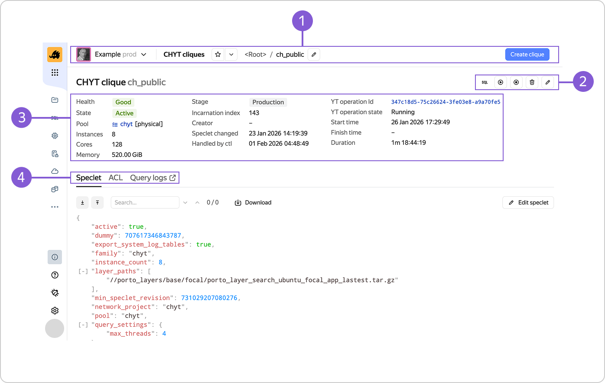

# Веб-интерфейс клики в {{product-name}}

Веб‑интерфейс — удобный способ управлять [кликами](../../../../../user-guide/data-processing/chyt/general.md). Он подходит для:

- быстрых разовых операций;
- визуального контроля состояния клики;
- настройки без написания скриптов;
- оперативного изучения параметров благодаря наглядной структуре.

## Как перейти в интерфейс клики { #where }

1. Слева в главном меню {{product-name}} выберите пункт **Cliques**.
2. В разделе **CHYT cliques** выберите нужную клику из списка или [создайте новую](../../../../../user-guide/data-processing/chyt/how-to-guides/create-start.md#create).

    

    Для знакомства с веб‑интерфейсом используйте публичную клику `ch_public`. Это общедоступная клика, которая работает на каждом кластере {{product-name}}.

    

## Основные разделы веб-интерфейса { #ui }



{ .center }



{ .center }



_1. [Заголовок раздела](#header) — здесь указано название клики._  
_2. [Кнопки действий](#action-menu) — используйте их для управления кликами._  
_3. [Блок c характеристиками клики](#params) — здесь можно посмотреть состояние клики._  
_4. [Панель вкладок](#tabs) — ссылки на вкладки настроек, ACL и логов._

### Заголовок раздела {#header}

В заголовке (1) отображается базовая информация:

- название кластера, на котором находится клика, и кнопка для его смены;
- название раздела **CHYT cliques**;
- кнопки:
  - {width=24 height=24} _Add to favourites_ — добавить клику в избранное;
  - {width=24 height=24} _View favourites_ — посмотреть избранные клики;
- название клики;
- кнопка **Create clique** для [создания новой клики](../../../../../user-guide/data-processing/chyt/how-to-guides/create-start.md#create).

### Кнопки действий {#action-menu}

Справа расположен блок с кнопками действий (2):

- {width=24 height=24} _SQL_ — переход в веб-интерфейс для выполнения запросов [Query Tracker](../../../../../user-guide/query-tracker/about.md);
- {width=24 height=24} _Start_ — запуск клики;
- {width=24 height=24} _Stop_ — остановка клики;
- {width=24 height=24} _Remove_ — удаление клики;
- {width=24 height=24} _Edit speclet_ — редактирование [спеклета](../../../../../user-guide/data-processing/chyt/cliques/configs.md#speclet) — файла настроек (конфигурации) клики.

### Характеристики клики {#params}

Под хедером находится блок с характеристиками клики (3). Важные параметры:

- `Health` — отображает жизнеспособность активной клики. Параметр может принимать значения:
  - `Good` — клика здорова и готова принимать запросы;
  - `Pending` — это состояние перед `Good`, показывает процесс ожидания запуска;
  - `Failed` — клика недоступна из-за сбоя.
  
  
  
  Когда параметр `Health` находится в значении `Failed`, [Strawberry Controller](../../../../../user-guide/data-processing/chyt/controller.md) перезапускает Vanilla-операцию. Если проблема устранена, `Health` перейдёт в состояние `Pending` и затем `Good`, или снова в состояние `Failed`, при котором контроллер снова будет пытаться перезапустить операцию.
  
  
  
- `State` — состояние клики: `Active` / `Inactive`. Показывает, запущена клика или остановлена;
- `Pool` — название вычислительного [пула](../../../../../user-guide/data-processing/scheduler/scheduler-and-pools.md#scheduler), которое является ссылкой на его веб-интерфейс;
- `Instances`, `Cores`, `Memory` — количество экземпляров и вычислительных ресурсов (процессоров CPU и оперативной памяти RAM), выделенных под клику;
- `YT operation Id` — ссылка на интерфейс [YT-операции](../../../../../user-guide/data-processing/chyt/cliques/yt-operation-ui.md), которая соответствует клике.

Остальные характеристики служат для справки и помогают детализировать главные метрики и определять причины сбоев.

### Панель вкладок {#tabs}

Важная информация о клике отображается в блоке (4) на вкладках:

- **Speclet** — отображает содержимое YSON‑документа с настройками клики ([спеклета](../../../../../user-guide/data-processing/chyt/cliques/configs.md#speclet)).
- **ACL** — показывает, какие права доступа к клике выданы и для каких групп пользователей. Подробнее в разделе [Права доступа](../../../../../user-guide/data-processing/chyt/cliques/access.md).
- **Query Logs** — ведёт к таблице с логами запросов. Подробнее — в разделе [Получение Query Logs](../../../../../user-guide/data-processing/chyt/how-to-guides/query-logs.md).

## Полезные ссылки

[Настройки клики](../../../../../user-guide/data-processing/chyt/cliques/configs.md)  
