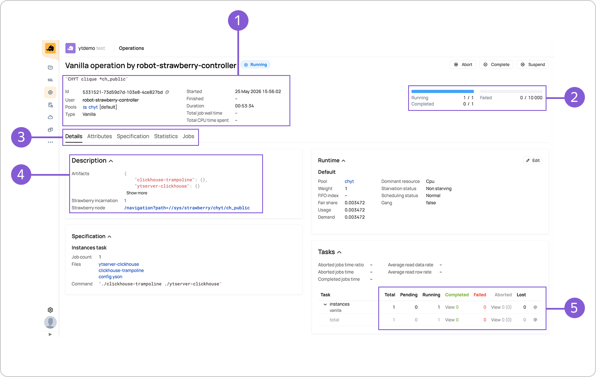

# Клика как YT‑операция

В системе {{product-name}} клика CHYT — не отдельная сущность, а стандартная распределённая [Vanilla‑операция](../../../../../user-guide/data-processing/operations/vanilla.md), которая состоит из набора задач — джобов (jobs).

Интерфейс YT-операции помогает отслеживать состояние клики, анализировать джобы и разбираться в проблемах, если что-то пошло не так.

## Как попасть в веб-интерфейс YT-операции { #get-to-section }

Открыть интерфейс YT-операции можно тремя способами:

- по ссылке в параметре `YT Operation Id` из [интерфейса клики](../../../../../user-guide/data-processing/chyt/cliques/ui.md#ui);
- по ссылке из поля *Current operation id* из описания Strawberry operation, которое хранится в Кипарисе по пути `//sys/strawberry/chyt/<alias>`;
- через CLI, по ссылке из результата выполнения команды `yt clickhouse ctl status`.

## Ключевые блоки интерфейса { #ui-main-sections }

{ .center }

_1. Базовая информация об YT-операции._  
_2. Сводка по джобам._  
_3. Панель вкладок._  
_4. Секция **Description**._  
_5. Секция **Tasks**._

Блоки, которые полезны для практических задач:

1. Секция **Description** (4). Секция расположена на вкладке **Details** на панели вкладок (3). Здесь собрана системная информация о клике и ряд полезных параметров — например, версии CHYT и {{clickhouse}}. Подробнее о том, как посмотреть версии компонентов, читайте в разделе [Получение версий CHYT и {{clickhouse}}](../../../../../user-guide/data-processing/chyt/how-to-guides/versions.md).
1. Раздел со сводкой по джобам (2). Он находится справа от базовой информации об операции (1). В нём отражена информация о статусах джобов *Running*, *Completed*, *Failed*. Статусы — это ссылки. Они ведут на вкладку **Jobs** панели вкладок (3), где можно посмотреть данные по каждому джобу и отфильтровать список джобов по разным параметрам. Подробнее про диагностику джобов читайте в разделе [Проверка упавших джобов](../../../../../user-guide/data-processing/chyt/how-to-guides/failed-jobs.md). Важно понимать, что один джоб соответствует одному инстансу в клике — то есть одному серверу {{clickhouse}}.
1. В секции **Tasks** (5) представлена статистика по джобам. В контексте инстансов CHYT используются следующие термины:

    #|
    || **Статус** | **Что означает** | **На что обратить внимание** ||
    || `total` | Общее количество инстансов | — ||
    || `running` | Инстанс запущен и работает | Если `running` = `total` — всё в порядке ||
    || `pending` | Инстанс ещё не запущен | Ненулевое значение — клике не хватает ресурсов, чтобы запустить все инстансы ||
    || `completed` | Инстанс был выключен штатно — успел завершить все запросы | — ||
    || `failed` | Инстанс упал | Частые причины: нехватка памяти (OOM) или ошибка в коде CHYT / {{clickhouse}} ||
    || `aborted` | Инстанс прерван | Если причина `preemption` — признак нехватки ресурсов ||
    ||`lost` | — | Сбой за пределами CHYT, в других компонентах||
    |#
